# 不同类型的时间序列分解

> 原文：<https://towardsdatascience.com/different-types-of-time-series-decomposition-396c09f92693?source=collection_archive---------4----------------------->

## 以及为什么你可能用错了。


照片由在 [Unsplash](https://unsplash.com/s/photos/hammer-and-nails?utm_source=unsplash&utm_medium=referral&utm_content=creditCopyText) 上拍摄

# 介绍

布拉哈姆·马斯洛写道，“我想，如果你唯一的工具是一把锤子，那么把一切都当成钉子是很诱人的”。

这是有抱负的数据科学家在分析时间序列数据时发现自己所处的情况。Python 的 Statsmodels 库中的 seasonal _ decompose 函数就是锤子，每一个时间序列数据都只是另一个钉子。

分解我们的时间序列是提高预测准确性和创造因果洞察力的重要一步。

seasonal_decompose 函数可以用于时间序列分解，但是还有其他更好的方法。而且，作为数据科学家，我们总是希望使用好的东西。

> 亚伯拉罕·马斯洛写道，“我想，如果你唯一的工具是一把锤子，那么把一切都当成钉子是很有诱惑力的”。

本文有以下目标:

1.  解释时间序列分解的重要性。
2.  解释季节性分解函数的问题。
3.  介绍时间序列分解的替代方法

# 为什么要分解我们的时间序列数据？

时间序列分解是指我们将时间序列数据分解为以下四个部分的方法:

1.  趋势[ *T*
2.  循环[ *C* ]
3.  季节性
4.  余数[ *R*

## 1)趋势

时间序列的趋势是指时间序列移动的大致方向。时间序列可以有正趋势或负趋势，但也可以没有趋势。

例如，美国(和许多发达经济体)的 GDP 增长率没有趋势，因为经济力量使增长率保持相对稳定。

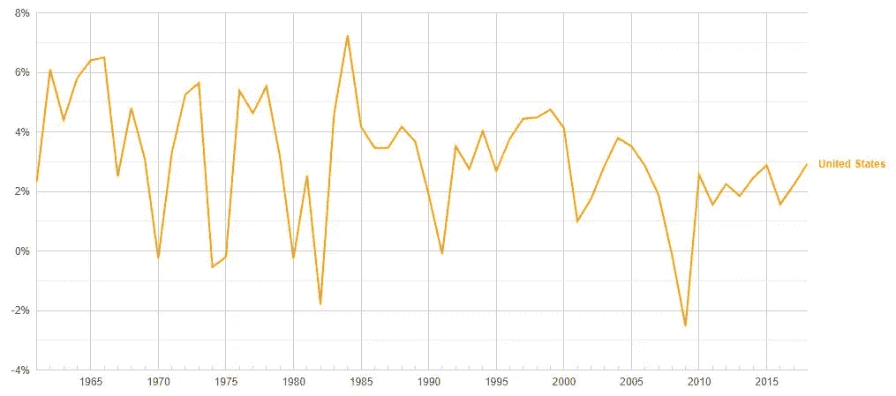

来自世界银行的数据。

## 2)循环

时间序列数据的周期是指其以不一致的频率上升和下降的趋势。我们经常使用时间序列的周期部分来讨论经济数据中的商业周期。

## 3)季节性

时间序列的季节性成分与其周期成分相似，除了一个重要的区别:季节性成分指的是以*一致的*频率上升和下降的数据。

旅游业对季节性因素非常熟悉。一个国家的旅游业在温暖的月份里收入很高，然后当第一次有下雪的迹象时，它的收入慢慢地向悬崖的边缘移动。

## 4)余数

剩余部分是去除趋势、周期和季节成分后的时间序列数据。是上述成分无法解释的时间序列数据中的随机波动。

在预测时，使用“季节性调整”时间序列是有利的，这只是一个去除了季节性因素的时间序列。这使得预测者可以专注于预测数据的总体趋势。

使用时间序列分解的第二个原因是为了识别季节成分中任何有趣的行为。然后，我们可以研究为什么我们的数据以这种方式移动。

# 时间序列分解常用方法的问题是

有趣的是，Statsmodels 知道有比通常的季节性分解函数更好的方法来分解时间序列数据。

他们警告我们(强调是我自己的):

> 这个[季节性 _ 分解]是一个*天真的*分解。应首选更复杂的方法— [Statsmodels 文档](https://www.statsmodels.org/stable/generated/statsmodels.tsa.seasonal.seasonal_decompose.html)

季节性分解使用经典的分解方法，有两种类型:加法和乘法。

## 加法分解

加法分解认为时间序列数据是其组成部分之和的函数。因此，

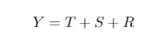

其中 Y 是时间序列数据，T 是趋势周期分量，S 是季节分量，R 是余数。

重新排列给了我们，

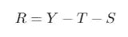

## 乘法分解

乘法分解认为时间序列数据是其组成部分的*乘积*的函数，而不是总和。因此，

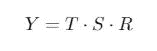

重新排列给了我们，

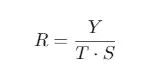

我们通常可以从其变化中识别出一个加法或乘法时间序列。如果季节分量的大小随时间变化，那么这个序列就是乘法序列。否则，该系列是可加的。


[图片来自尼古拉·考伦茨](https://kourentzes.com/forecasting/2014/11/09/additive-and-multiplicative-seasonality/)

请注意，从 2011 年开始，在加法时间序列中，季节性成分的大小(序列的最大值与红线之间的差值)相对恒定。

然而，在乘法序列中，季节性成分的大小随着时间的增加而增加。

注意:识别一个数列是加法还是乘法比上面的图片显示的要复杂。通常，时间序列的一个部分可能是相加的，而其他部分是相乘的。

*例如，你可以合理地拥有一个时间序列，其中*

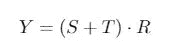

*和，因此，*

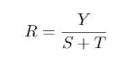

时间序列分解的经典方法有几个问题:

1.  它使用双边移动平均线来估计趋势周期。因此，前几个观察值和后几个观察值在趋势周期中是不存在的。
2.  它假设季节成分在整个系列中是恒定的。虽然这对于短期来说可能是一个准确的假设，但是对于长期来说，这种假设就站不住脚了。例如，航空旅行和其他交通方式的创新为许多经济体的旅游业带来了根本性的变化；因此，假设它的季节变化在历史上一直保持稳定是不正确的。
3.  趋势线过度平滑了数据。因此，它对剧烈波动没有反应。这导致了大的剩余分量。

幸运的是，有解决上述问题的时间序列分解方法。

# 传统方法的替代方法

## X11 分解

X11 分解为所有观察值创建了一个趋势周期。同样，X11 分解允许季节性成分缓慢变化。

我不知道任何实现 X-11 过程的 Python 库。然而，这可以通过 R 的季节性软件包中的 seas 函数相对容易地完成。您也许可以使用 rpy2 库来复制 Python 中的 R 代码。(一旦我找到解决办法，我将在本周晚些时候更新这篇文章)。

```
seas(data, x11 = "")
```

让我们比较 X11 分解和经典分解的结果。

在 R 中:

```
library(forecast)
library(ggplot2)
autoplot(AirPassengers)
```

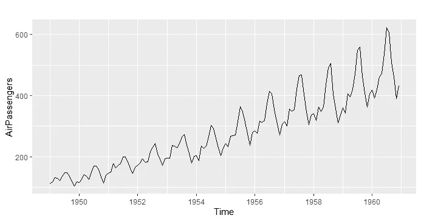

国际航空旅客人数时间序列(千人)

因为季节成分随时间增加，所以我们知道应该使用乘法分解。

```
mfit <- decompose(x = AirPassengers, type = "multiplicative")
autoplot(mfit)
```

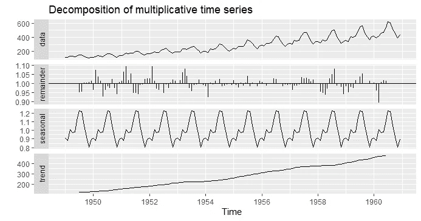

航空乘客数据的乘法分解

请注意，季节性成分是不变的，余数成分有许多大值，趋势线在数据集的开始和结束处缺少一些观察值。

现在，如果我们使用 X11 分解，

```
fit <- seas(x = AirPassengers, x11 = "")
autoplot(fit)
```

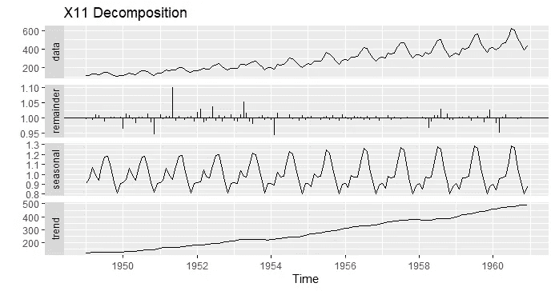

X11 分解

您应该注意到三件事:

1.  季节性因素随着时间的推移而增加，从而反映了自 1950 年以来航空业的根本变化。
2.  余数部分比我们进行经典分解时的情况要小。这是因为我们的趋势线非常适合原始数据。
3.  趋势线中没有遗漏的观察值。

## STL 分解

X11 的一个问题是它只处理月度和季度数据。

另一个原因是它对异常值不够稳健。

因此，在 1990 年，密歇根大学和贝尔实验室的研究人员发表了“STL:基于黄土的季节趋势分解过程”。

与 X11 方法相比，STL 时间序列分解方法具有以下优势:

1.  它处理任何类型的季节性。
2.  用户可以控制季节性成分的变化率。
3.  它对异常值是鲁棒的。

我们可以用 Python 中的 STL 函数实现 STL。

```
from statsmodels.tsa.seasonal import STL
```

我们可以通过向 STL 函数中的*趋势*和*季节性*参数传递一个整数来改变趋势周期和季节性成分的平滑度。默认情况下，季节参数设置为 7(也建议您使用大于或等于 7 的季节平滑器)。

如果未指定趋势值，则 Statsmodels 会使用大于的最小奇整数来计算趋势值

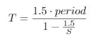

季节性平滑的选择取决于你。整数越大，季节性因素就越“平滑”。这使得数据中较少的变化归因于季节性因素。因此，您必须确定数据中有多少变化可以合理地归因于季节性因素。

STL 方法的创始人建议使用季节性诊断图，然后用不同的平滑值进行试验，以确定哪个值似乎是正确的。不幸的是，Python 中没有这种实现(但是 R 中有)。

## 用 Python 实现 STL:

```
from statsmodels.tsa.seasonal import STL
import matplotlib.pyplot as plt
import pandas as pddf = df[:len(df) - 1] # Removes the last row in the data setcolumns = ['Month', 'Passengers']
df.columns = columns
df.head()
```

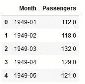

```
df = df.set_index('Month') # Set the index to datetime object.
df = df.asfreq('MS') # Set frequency# Set robust to True to handle outliersres = STL(df, robust = True).fit() 
res.plot()
plt.show()
```

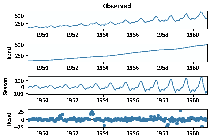

季节成分的变化比我们使用 X11 分解时变化更快。因为 STL 分解对异常值也是稳健的，所以它对季节分量的估计可能比 X11 的估计更准确。

请随意在 STL 函数中试验季节性参数。请确保您使用的是奇数整数。

如果你想对数据进行季节性调整，那么从原始数据中减去季节性因素。

也就是说，

```
df['Seasonally Adjusted'] = df['Passengers'] - res.seasonal
df.head()
```

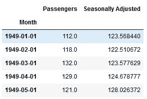

# 结论

现在你知道季节分解的其他方法了。与 Statsmodels 的 seasonal_decompose 函数相比，这些替代方法可以更好地估计时间序列的季节性和趋势周期成分。

您还可以使用这些方法获得更准确的预测，并更好地识别数据集中的有趣模式。

# 文献学

[1] Hyndman，R.J .，& Athanasopoulos，G. (2018) *预测:原则与实践*，第二版，OTexts:澳洲墨尔本。OTexts.com/fpp2.

[2][https://www . stats models . org/stable/generated/stats models . TSA . seasonal . seasonal _ decompose . html](https://www.statsmodels.org/stable/generated/statsmodels.tsa.seasonal.seasonal_decompose.html)

[3]安德鲁·萨特克利夫。(1993)“X11 时间序列分解和抽样误差”，澳大利亚统计局:澳大利亚墨尔本。

[4] Cleveland，R.B .，Cleveland W.S .，McRae J.E .，& Terpenning，I. (1990 年)“短期负荷预测:基于黄土的季节性趋势分解程序”，《官方统计期刊》。

[5] Gardner，Dillon r .(2017)[《STL 算法讲解:STL 第二部分》](http://www.gardner.fyi/blog/STL-Part-II/)。

# 笔记

1.  趋势项可以是非线性的。还有，有两种趋势:随机的和确定的。我将在以后的文章中讨论这些。
2.  seasonal_decompose 函数还可以估计单边移动平均值；然而，这导致在序列开始时比使用双边方法时有更多的缺失观测值，而在序列结束时没有缺失观测值。

# 资料组

【https://www.kaggle.com/rakannimer/air-passengers 