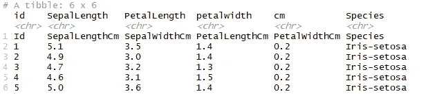

# 将数据导入 R 的不同方式

> 原文：<https://towardsdatascience.com/different-ways-of-importing-data-into-r-2d234e8e0dec?source=collection_archive---------32----------------------->

## 如何在 R 中处理不同类型的数据

卡斯帕·卡米尔·鲁宾在 [Unsplash](https://unsplash.com?utm_source=medium&utm_medium=referral) 上拍摄的照片

我在 DataCamp 完成了两门课程，这两门课程向我介绍了将数据导入 r 的概念。我想详细讨论一下我在课程中学到的一些方法。让我们开始吧。

数据可以来自许多来源。一些最常见的是

*   平面文件— CSV、txt、tsv 等
*   来自 Excel 的数据
*   数据库— Postgresql、Mysql 等
*   网
*   统计软件——SAS、SPSS、STATA

# 平面文件

什么是平面文件？

根据维基百科,**平面文件数据库**是存储在一个名为**平面文件**的文件中的数据库。记录遵循统一的格式，并且没有用于索引或识别记录之间关系的结构。文件很简单。平面文件可以是纯文本文件或二进制文件。

下面列出的一些包将帮助您在 r 中处理平面文件。

**实用工具**

默认情况下，当您加载 r。

*   `read.table()`:主功能。读取表格格式的文件并从中创建数据框。它提供了许多参数来对输入的数据进行分类。
*   `read.csv()`:read . table()的包装函数。用于读取逗号分隔(CSV)文件。
*   `read.delim()`:用于读取制表符分隔文件的包装函数。如果文件中的数字使用句点(。)作为小数。
*   `read.csv2()` : read.csv()和 read.csv2()是相同的。唯一的区别是，它们是根据您在数字中使用句点还是逗号作为小数点来设置的。
*   `read.delim2()`:当文件中的数字使用逗号(，)作为小数时，使用 read.delim2。

**read.csv()** 功能的输出

**专业包**

**readr**

这个包让我们的生活更轻松。它比 utils 包更快、更方便、更高效。我总是倾向于使用这个。

read_r 支持七种文件格式，具有七种功能:

*   `[read_csv()](https://readr.tidyverse.org/reference/read_delim.html)`:逗号分隔(CSV)文件
*   `[read_tsv()](https://readr.tidyverse.org/reference/read_delim.html)`:制表符分隔的文件
*   `[read_delim()](https://readr.tidyverse.org/reference/read_delim.html)`:通用分隔文件
*   `[read_fwf()](https://readr.tidyverse.org/reference/read_fwf.html)`:定宽文件
*   `[read_table()](https://readr.tidyverse.org/reference/read_table.html)`:表格文件，其中各列由空格分隔。
*   `[read_log()](https://readr.tidyverse.org/reference/read_log.html)`:网络日志文件

**read_csv()** 功能的输出

Tibbles 的 readr 包工作。根据文档，Tibbles *是*数据帧，但是它们调整了一些旧的行为以使生活变得更简单。打印输出还显示了 read.csv 输出中缺少的列类。

**数据表**

作者 Matt Dowle & Arun Srinivasan 的 data.table 的关键指标是速度。这个包主要是关于数据操作的，但是它还有一个非常强大的功能，可以将数据读入 R: fread()。

如果你有很大的文件要导入到 R 中，你可以使用 data.table 包。

**fread()** 功能的输出

Fread()可以自动处理名称。它还可以推断列类型和字段分隔符，而不必指定这些。它是 read.table()的改进版本，速度非常快，更加方便，并增加了更多功能。

# 擅长

数据分析中最常用的工具是 Microsoft Excel。excel 文件的典型结构包含带有表格数据的不同工作表。

我们需要浏览这些文件，然后从中导入一些数据。r 提供了两个函数来处理这个问题。

*   `**excel_sheets()**` **:** 探索不同的工作表

结果是一个简单的字符向量，它返回 excel 文件中工作表的名称。

*   `**read_excel()**`:将数据导入 R

read_excel()函数的输出

默认情况下，第一个工作表作为 tibble 导入。我们可以通过使用索引或设置工作表参数来显式指定要导入的工作表。下面的两个调用做同样的工作。

然而，手动加载每一个工作表，然后将它们合并到一个列表中会非常繁琐。幸运的是，您可以使用`[**lapply()**](http://www.rdocumentation.org/packages/base/functions/lapply)` 来自动执行这个操作。这个函数返回一个相同长度的列表。

**XL 连接**

由马丁·斯图德开发。它充当了 R 和 Excel 之间的桥梁。它允许用户执行任何活动，如编辑工作表、格式化数据等。在 R 内部的 Excel 上，它可以处理 XLS 和 XLSX 文件。XLConnect 工作在 Java 之上。确保您已经安装了所有的依赖项，如 Java 开发工具包(JDK ),并在 r

在使用软件包之前安装它，下面的命令将为您完成这项工作:

将 **XLConnect** 载入工作区

`**loadWorkbook()**`:该函数将一个 Microsoft Excel 文件加载到 R 中，可以对其进行进一步操作。将 **create** 参数设置为 **True** 将确保在文件尚不存在时创建该文件。

**loadWorkbook()** 函数的结构

这个对象实际上是 R 和 Excel 之间的桥梁。在 R 中构建工作簿后，您可以使用它来获取它所链接的 Excel 文件的信息。一些基本功能是

*   **get_Sheets()** :蒂耶函数从 excel 文件中以列表形式返回工作表。

**getSheets()** 的输出

*   **readWorksheet()** :允许用户从指定的工作表中读取数据，只需在函数的工作表参数中给出工作表的名称。

**readWorksheet()** 的输出

这个函数最好的部分是你可以指定从哪一行和哪一列开始读取信息。

**readWorksheet()** 的输出

PS:在对数据集执行任何操作之前，确保数据集被导入到工作目录中。

# 关系数据库

关系数据库是数据项之间具有预定义关系的集合。这些项目被组织成一组具有列和行的表格。表用于保存关于要在数据库中表示的对象的信息。

**开源** : MySQL，PostgreSQL，SQLite

**专有** : Oracle 数据库，微软 SQL Server

根据您想要连接的数据库类型，您必须在 r 中使用不同的包。

MySQL: RMySQL

PostgreSQL: RPostgreSQL

Oracle 数据库:ROracle

DBI 为 R 和关系数据库管理系统之间的通信定义了一个接口。这个包中的所有类都是虚拟的，需要通过各种 R/DBMS 实现来扩展。

用更专业的术语来说，DBI 是一个接口，RMySQL 是实现。

像往常一样，让我们先安装包并导入库 DBI。安装 RMySQL 将自动安装 DBI。

第一步是创建到远程 MySQL 数据库的连接。你可以这样做

现在我们已经连接到数据库，可以访问其中的内容了。以下函数帮助我们读取、列出、查询和执行数据库上的其他操作。

*   **dbListTables** :这个函数让用户列出数据库中的表格。这个函数需要连接对象作为输入，并输出一个带有表名的字符向量。

*   **dbReadTable** :读取所需的表格，并将结果显示为数据帧。

**选择性导入**

我们可以用两种方法做到这一点

*   读取整个表并使用 subsetting 函数对数据进行子集化。
*   `**dbGetQuery()**`:这个函数发送一个查询，检索结果，然后清除结果集。这里的字符串是一个常见的 SQL 查询。
*   dbFetch() :这个函数有助于从以前执行的查询中获取记录，并允许我们指定每次获取的最大记录数。

**注意:dbSendQuery()** 将查询发送到数据库，要获取它，我们应该使用 dbFetch()。它的工作与 dbGetQuery()相同。当您想要逐块加载大量记录时，这可能会很有用。

不要忘记断开它。

# 网

从互联网上下载文件意味着发送一个 GET 请求并接收你所请求的文件。

读取 CSV、TSV 或文本文件时，我们可以在函数中以如下方式将 URL 指定为字符串。

**Excel 文件**

r 不知道如何处理直接来自网络的 excel 文件，所以我们需要在导入之前下载它。文件下载后，我们可以使用`read_excel`功能读取和导入文件。

**JSON 数据**

JavaScript Object Notation (JSON)是一种非常简单、简洁且结构良好的数据形式。此外，它是人类可读的，也很容易为机器解释和生成。这就是为什么 JSON 被用于与 API(应用程序编程接口)通信。

**jsonlite 包**

它是一个健壮的、高性能的 JSON 解析器和生成器。

让我们先安装软件包。成功安装后，我们将使用`fromJSON`函数从 URL 获取数据。

包含 JSON 数据的 r 列表

软件包的另一个有趣的功能是美化和缩小。它们主要用于格式化 JSON 数据。

*   **美化/缩小**:美化给 JSON 字符串增加缩进；minify 删除所有缩进/空白。

# 统计软件包

*   **避风港**

这个包用来读取 SAS，STATA，SPSS 数据文件。它通过包装 Evan Miller 的 ReadStat C 库来实现这一点。这个软件包使用起来非常简单。

让我们先安装包并加载库。

*   `read_sas`:该函数读取 SAS 文件。

同样，对于其他类型的文件，我们可以使用`read_stata()`、`read_dta()`、`read_por()`和`read_sav()`。

*   **国外**

由 R 核心团队编写。它在命名和使用上不太一致，但它支持许多外来数据格式，如 Systat、Weka 等。我们还可以将数据导出为各种格式。

让我们安装软件包并加载库。

**SAS**

这个包的缺点是**不能导入. sas7bdat** 。它只能导入 SAS 库(。xport)

**STATA**

这个包裹可以阅读。STATA 版本 5 到 12 的 dta 文件。

**convert.factors** :将带标签的 STATA 值转换为 R 因子。

**convert.dates** :将 STATA 日期和时间转换为 Date 和 POSIXct。

**缺失类型**:

如果为 FALSE，则将所有类型的缺失值转换为 NA。

如果为真，存储属性中值是如何丢失的。

**SPSS**

**use.value.labels** :将带标签的 STATA 值转换为 R 因子。

**to.data.frame** :返回 dataframe 而不是 list。

# 结论

这是关于将基本数据导入 r 的。加载数据是任何过程的第一步，比如分析、可视化和操作。

有很多方法可以将数据导入 r。

我主要使用 read_excel 和 read_csv。

你用什么？评论下来。

感谢阅读！