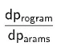
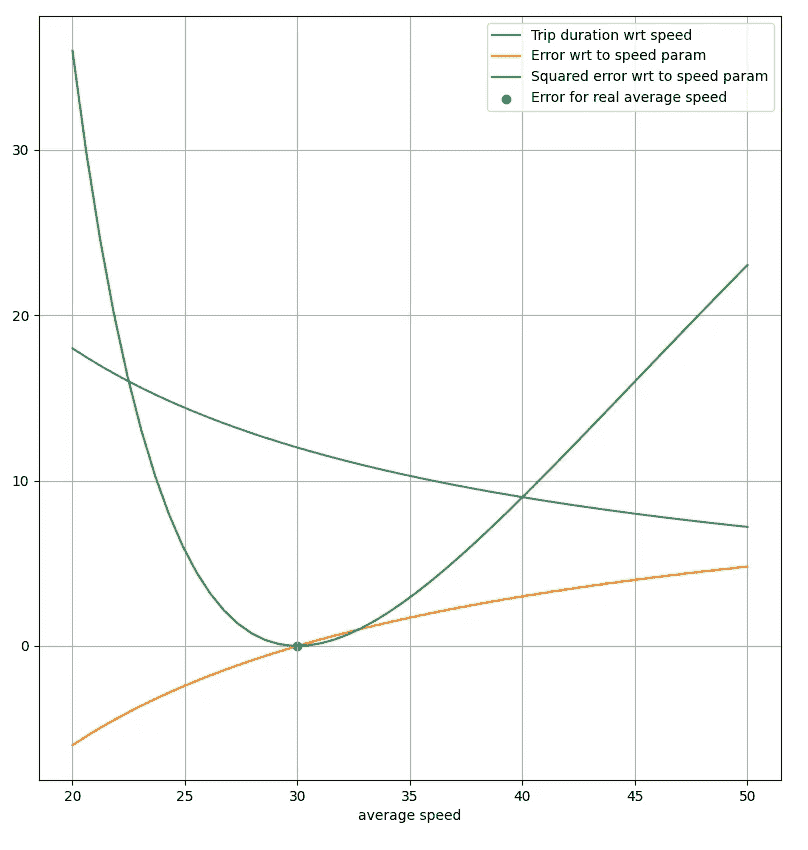
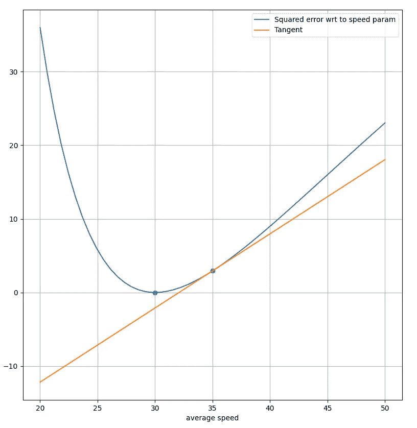
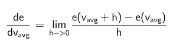
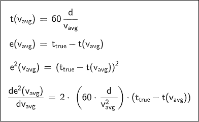
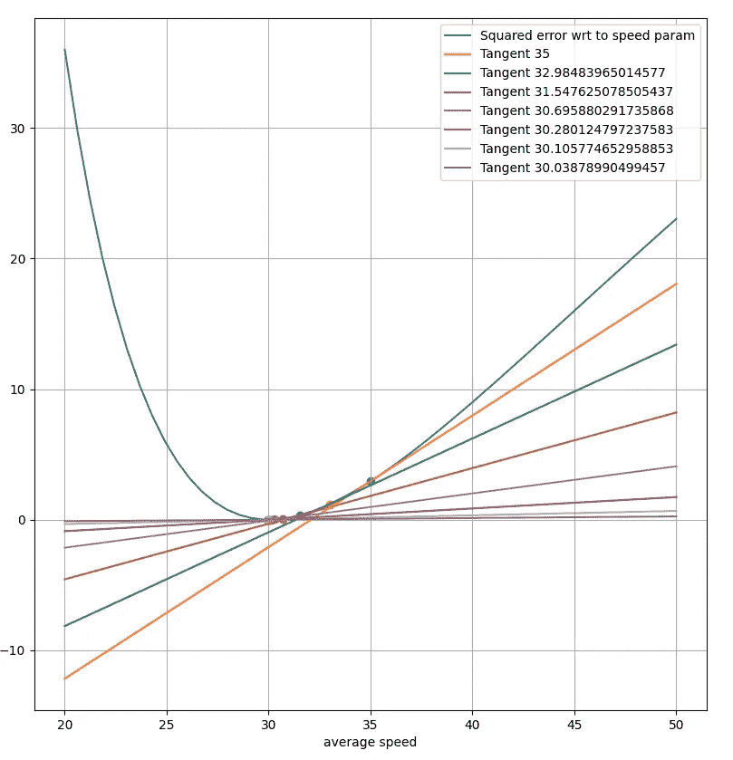
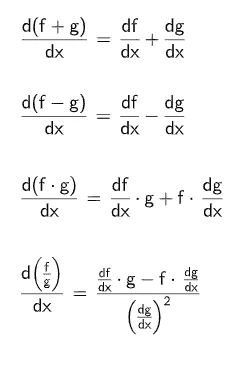
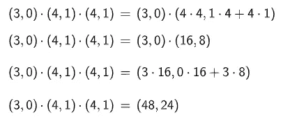

# 从头开始的可微分编程

> 原文：<https://towardsdatascience.com/differentiable-programming-from-scratch-abba0ebebc1c?source=collection_archive---------24----------------------->

去年，我有一个很好的机会，在脸书人工智能研究中心参加了与 Yann Lecun 的谈话。

作为一名数学爱好者，在他的演讲中给我留下深刻印象的是其对深度学习作为可微分编程的重新思考。Yann Lecun 在《脸书邮报》上详述了他的想法:

> 越来越多的人以数据依赖的方式(用循环和条件)程序化地定义网络，允许它们随着输入数据的变化而动态变化。它真的非常像一个常规程序，除了它是参数化的、自动微分的、可训练/可优化的。
> 
> ——[雅恩·勒村，博览会主任](https://www.facebook.com/yann.lecun/posts/10155003011462143)

*微分编程*的总体目标是计算:

为什么我们需要能够区分一个程序？

即量化程序及其输出对某些参数的敏感性。

在本文中，我们将通过从头开始开发这种令人兴奋的新型编程所需的所有工具来解释什么是*可区分编程*。

**大局**

让我们从一个简单的玩具示例开始，展示我们如何使用传统的、与数据无关的代码编写一个程序来估计乘坐出租车的持续时间:

在此代码中，我们使用预计算的纽约市平均速度(约 30km/h)来计算出租车行程持续时间。这是编制程序的传统方式，即数据不会影响其参数。

我们使用预定义的参数，这里是由专家估计的平均速度，将这个速度的倒数乘以行程距离，我们得到预期的行驶持续时间。

无论我们运行多少次，它都不会改进。它永远不会从错误中吸取教训。

可区分编程提供的恰恰相反:每次运行都可以用来微调应用程序参数。让我们看看这是如何实现的。

**利用反馈**

对计算机和人类都适用的一点是，要想进步，你需要反馈。理想情况下，你需要一种方法来量化你的错误。

在计算机世界中，通过在我们的初始代码中引入一个计算相对常见的误差度量的新函数:*平方误差*可以很容易地做到这一点。

增加了误差计算的代码

一旦你知道了误差，你需要一种方法来知道你需要在哪个方向修改你的参数来减少误差。

让我们分析一个具体的例子。考虑一次持续时间为 12 分钟、距离为 6 公里的旅行。为了用我们的模型精确地预测这个值，模型的正确参数应该是 30 km/h。任何其他值都会导致此行程的错误。

让我们看一下相对于我们的参数，平均速度的平方误差图，以获得一些见解。整个代码很简单:

得到的曲线是:

平方误差总是正的，更重要的是，在正确的平均速度下达到最小值。图片作者。

蓝色曲线显示了行程持续时间相对于速度的演变。更快的行程显然导致更短的行程持续时间。

橙色曲线将误差显示为实际持续时间(此处为 12 分钟)与给定速度的行程持续时间之间的简单差异。对于实际平均速度:30km/h，该误差为零。

绿色曲线是误差的平方。与误差类似，平均速度为 30 公里/小时时，误差为零。

**下山**

我们现在有了一种方法来量化我们的误差，关于我们程序的输入参数。我们现在需要的是如何减少错误的一些指示。

假设我们的参数，平均速度是 35 公里/小时。平方误差在 2.95 左右。问题是，我们应该降低速度还是提高速度来减少误差？由于我们知道最佳值 30 公里/小时，我们显然知道速度必须降低。但是对于一个真正的问题，我们必须发现它。

再一次，让我们从绘制平均速度为 35 km/h 的平方误差曲线和曲线切线的图表中获得洞察力。

平均速度的误差 wrt，以及平均速度为 35 公里/小时时曲线上的切线。图片由作者提供。

观察切线，很明显我们需要跟随它的斜率来减少误差。在这种情况下，这意味着我们应该降低平均速度。这种方法叫做梯度下降法。

**分化**

有效地知道如何更新我们的参数的方法是清楚的:我们需要计算我们的误差函数的正切并估计它的斜率。这意味着我们必须对误差函数求导以得到它的梯度。

计算函数的导数有多种方法。现在，我们将只考虑两个:

*   数值微分，使用基于极限的微分定义
*   形式微积分，通过推导平均速度的误差公式。

在本文的后面，我们将看到第三个非常通用和健壮的选项。

下面是用于绘制上述曲线的代码:

函数 *speed_error_num_diff* 使用导数定义来估计相对于误差的误差梯度:

使用导数定义允许简单有效的计算

如您所见，代码很简单，但是不方便的是数值不稳定，并且需要一个额外的参数: *delta* 。根据误差的绝对值，必须调整*增量*。

另一种方法需要平方误差公式的符号推导:

平均速度误差的形式微分。图片作者。

这两种方法都有效，可用于优化平均速度参数。我们可以绘制梯度下降法的迭代图，并观察到该方法如预期收敛到 30 km/h:

当我们在梯度方向上移动参数时，误差减小。图片作者。

梯度下降通过一个循环和一个指定步长的常数、任意系数来实现:

用于使用梯度下降优化平均速度参数的代码

**自动微分**

如上所示，这两种方法都有效，但是它们并不总是容易处理的。形式上的一个意味着误差公式的符号推导，一般不像我们例子中那么简单。

有时使用数值法，但由于舍入误差，数值不稳定。

这两种方法都需要人工构建坡度。

幸运的是，有一种方法可以自动构造所有需要的导数:自动微分。

这种方法利用了两个事实:

*   在任何程序中，我们最终都会进行简单的算术运算(+-*/)，并调用一些基本函数，如 *sin、cos、exp、log、…*
*   链式法则可以用来区分复杂的数学表达式

为了说明这种方法是如何工作的，我们将开发一个仅支持算术运算的基本实现。提醒一下，下面是四种算术运算的推导规则列表:

(+-*/)运算的派生规则。图片作者。

自动微分有两种主要的实现方式:正向和反向模式。由于前向模式实现起来更简单，我们选择这种模式。

原则是用一个额外的浮点数来增加数字，这个浮点数存储导数。如果数是常数，它的导数是零，而如果数是变量，它对自身的初始导数是 1.0。这一对浮点数被称为对偶数，从数学上来说，构成了一个代数，我们可以在其上执行标准运算。

我们所要做的就是为 DualFloat 创建一个类，重载算术运算符，并使用上面的派生规则:

现在，让我们以多项式 *f(x)=3x* 为例，手动使用自动微分计算其对 *x=4* 的导数。

3 是常数，用(3，0)初始化，变量 *x* 用(4，1)初始化。使用新定义的双数乘法计算，我们得到:

双数计算

而且的确， *f(x)* 的导数是 *6x* ，因此当 *x = 4* ， *f'(x)=24* 。

使用 python 和 DualFloat 类，我们得到:

我们现在有工具使用自动微分重写梯度下降:

请注意，我们不必再为微积分费心了。所有必要的计算都是使用双数秘密进行的。对误差调用 *derivative()* 自动提供梯度。

**可微编程**

在这篇文章中，我们已经开发了所有的数学和编程工具来进行差异化编程。如您所见，它基于简单的数学概念，可以很容易地引入任何程序。

注意，重写代码甚至是不必要的，因为存在可以替代 numpy 的库:例如，参见 [Jax](https://github.com/google/jax) 。唯一剩下的问题在于识别影响程序性能的参数。

一旦你确定了这些参数并定义了一个误差，你就可以计算你的参数对这个误差的导数。然后，每次使用新数据时，您都可以从梯度的免费计算中受益，以改进您的参数。

使用可微分编程，任何程序都可以受益于可微分函数的所有数学工具，允许它们通过从数据中学习来改进自己。