# 微分方程作为神经网络层

> 原文：<https://towardsdatascience.com/differential-equations-as-a-neural-network-layer-ac3092632255?source=collection_archive---------4----------------------->

## 向神经网络模型添加领域知识的第一步

人工神经网络(ANN)的主要思想是使用称为层的相对简单的函数的组合来建立复杂函数的表示。

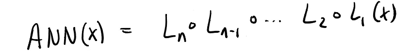

一个**深度神经网络**是一个有许多层，或者许多功能组合在一起的网络。


虽然层通常是简单的函数(例如 relu( *Wx* + *b* ))，但通常它们可以是任何可微分的函数。

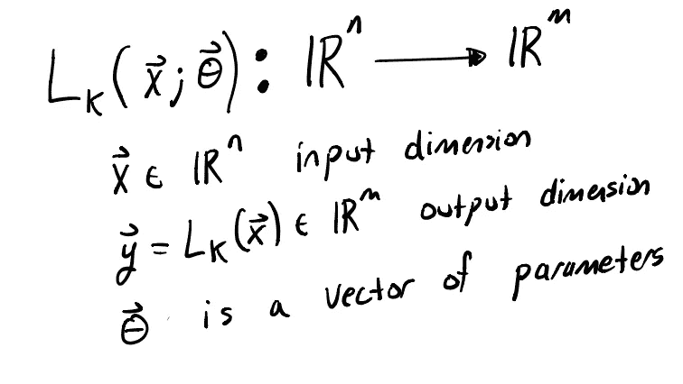

该层由参数θ ∈ ℝᵖ.的某个有限向量来指定为了实用，我们需要能够使这一层(或多层)适合数据。这包括定义一个成本或损失函数来衡量模型预测与数据的接近程度。

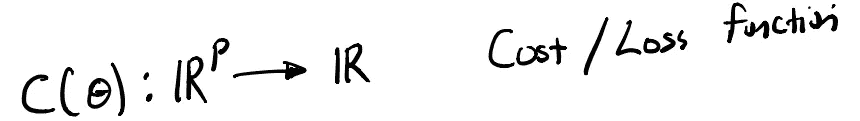

如果我们的层是可微的，那么我们可以找到这个成本函数∇ *C* ( *θ* )的梯度，并使用它以有效的方式找到成本的局部最小值。

这里我考虑微分方程模型。这些系统使用包含当前状态导数的表达式来描述系统(x)的状态随时间的演化。一般来说，它们采取以下形式:

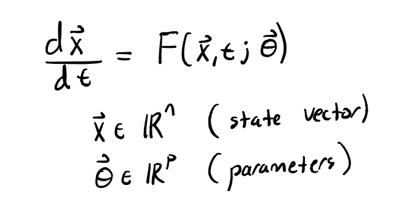

微分方程适合我们的神经网络框架，因为它接受一些参数并产生解作为输出，并且它是可微分的。

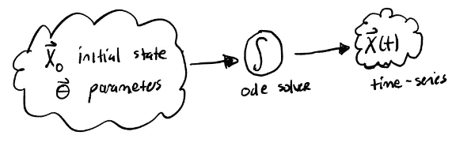

因此，我们可以使用微分方程作为神经网络中的一层。这真的很棒，有几个原因:

*   微分方程是所有物理定律的基本语言。
*   在物理学和化学之外，微分方程是描述复杂系统行为的重要工具。在我们的神经网络中使用微分方程模型允许这些模型与神经网络方法相结合。
*   建立有效的神经网络包括为网络选择一个好的底层结构。通常更容易想到的是描述一个函数如何随时间变化，然后写下这个现象的函数。相对简单的速率法则可以变成非常复杂的行为(参见下面的洛伦兹系统！).

为了简单起见，在这篇文章中，我将集中讨论基于单个微分方程层的神经网络。然而，这些层可以很容易地作为一层嵌入到深度学习项目中。深度学习与微分方程形式的领域知识的结合是许多领域的游戏规则改变者。

# 洛特卡-沃尔泰拉捕食者猎物

为了演示如何将自己的微分方程层构建到神经网络中，我将使用朱莉娅[通量](https://github.com/FluxML/Flux.jl)、[微分通量](https://github.com/SciML/DiffEqFlux.jl)和[微分方程](https://docs.sciml.ai/v5.0.0/)库。在本文中，我将把代码保持为小片段，以允许开发直觉，但是这些示例的完整代码已经在 Github repo 中发布。

首先，我们将考虑拟合数学生物学中经典模型的参数。Lotka-Volterra 捕食者-食饵模型描述了在简单生态群落中可以观察到的种群振荡。

在哈德逊湾贸易公司 19 世纪的毛皮贸易数据中可以观察到一个著名的例子。

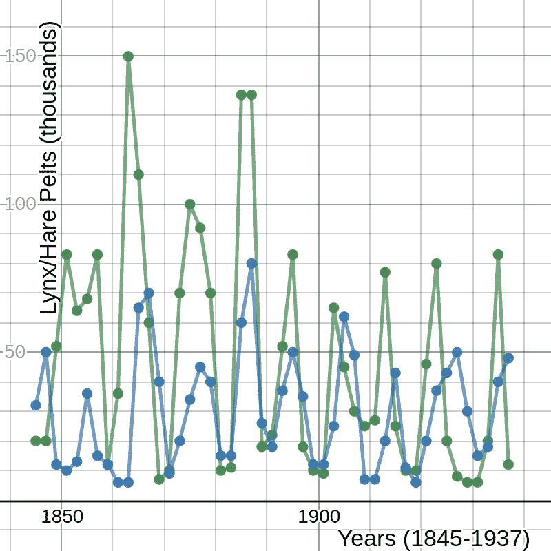

该模型的方程由下式给出

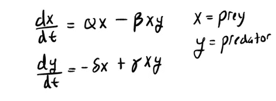

Lotka-Volterra 捕食者-食饵方程

捕食者种群的振荡将会滞后于被捕食者种群的峰值。

现在让我们使用这个模型作为神经网络中的一层，有一组六个参数。两个用于猎物 x₀和捕食者 y₀的初始种群，四个速率参数α，β，δ，γ。

在 Julia 中，我们可以定义这个系统和一组默认参数。

现在，我们将微分方程层定义为输入参数的函数。参数数组将前两个条目作为初始条件。

接下来要做的是生成一些假数据来拟合(添加一些噪声)，然后定义一个损失函数。我对我们的数据使用了一个简单的均方误差损失函数，尽管我们当然可以很容易地对损失函数添加一些正则化的参数。

最后，我们定义一个函数来实际执行模型拟合。这是 Julia 生态系统真正受益的地方，因为这个系统可以很容易地使用梯度方法来拟合参数。

正如你所看到的，我使用了 3000 次 Adams 迭代，然后调用 BFGS 来最小化成本。这是一个很好的组合，你可以直接跳到 BFGS，但收敛需要更长的时间。最好是让亚当斯迭代让你在附近，然后结束与 BFGS。

恢复的参数由下式给出:

```
The parameters are [0.9987532818277052, 0.9809616721237869, 1.5075095360807464, 1.009470157647888, 2.974936372236448, 0.993477599859459] with final loss value 2.1229151208653736The actual parameters should be: [1,1,1.5,1,3,1]
```

这是我们的数据与模拟时间序列数据的对比图。如你所见，最小化结果与数据非常吻合。

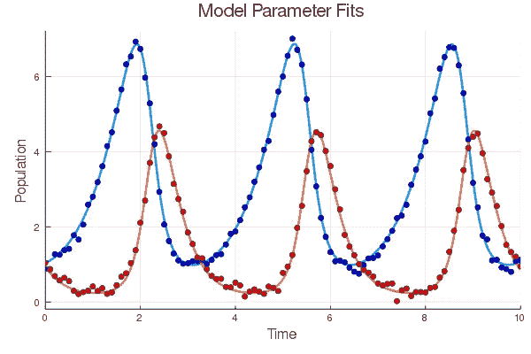

Lotka-Volterra 捕食者-食饵模型的参数使用最小二乘成本函数上的亚当和 BFGS 优化进行拟合。对于该合成数据集，参数恢复得非常接近精确。

当然，对神经网络的真正考验是它如何推广到验证数据。在这种情况下，我们可以很容易地测试系统的未观察到的初始条件，看看我们的神经网络是否捕捉到了动态。

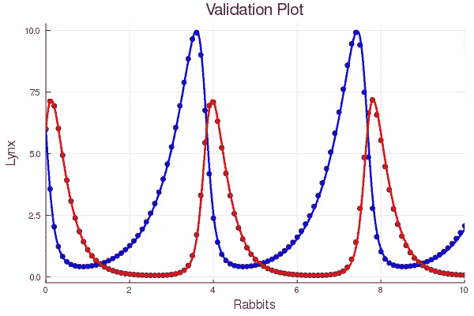

推广到一组新的初始条件。当然，模型概括得很好，因为我们找到了几乎完全正确的参数。

太好了，它起作用了！

## 斯图尔特-朗道振子模型

现在让我们考虑一下在我的研究领域中经常出现的从动力系统中恢复参数的问题。 [Stuart-Landau 方程](https://en.wikipedia.org/wiki/Stuart%E2%80%93Landau_equation)描述了接近 Hopf 分叉(非线性系统中出现普通振荡)的非线性系统的动力学。我将考虑这种变化，它出现在对耦合振子群体[的同步研究中。](http://www.lsd.df.uba.ar/materias/dnl/dnl_2011_files/guias_files/Ott_Chaos.pdf)

使用这个模型的部分动机是由于我对这个模型的熟悉。然而，我还有另一个更深层的动机。Lotka-Volterra 捕食者-食饵模型是一个很好的开始模型，但对于数学生物学来说，这是一个奇怪的模型。这是一个保守系统，很像在物理系统中观察到的(没有摩擦)。这意味着 Lotka-Volterra 系统不是有一个孤立的吸引振荡(称为极限环),而是有一整类同心环。

这有可能扭曲我们对拟合微分方程模型的理解，因为保守系统保留了对初始条件的记忆。对于极限环振荡，我们会随着时间的推移丢失关于初始条件的信息(瞬态动力学衰减，[时间箭头](https://en.wikipedia.org/wiki/Arrow_of_time))。由于许多初始条件以相同的最终状态结束，这可能使参数恢复的问题更加困难。

该系统的方程由下式给出:

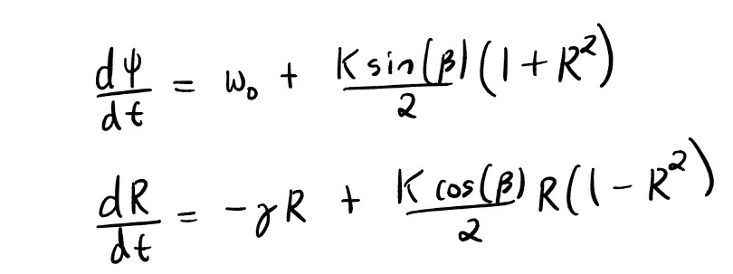

这些是用极坐标写的。因此，R 表示振幅，ψ表示弧度角度。动力学的定性形式为

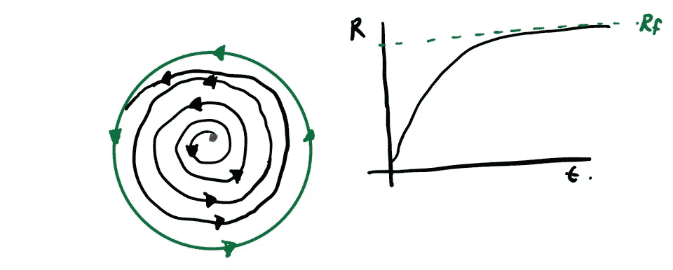

斯图尔特-朗道动力学导致稳定的极限环振荡。

在 Julia 中，更新我们的捕食者-食饵模型来考虑这种类型的系统是一件简单的事情。

现在我们定义一个 ode 层生成一些数据并创建一个损失函数。

最后，下面的函数创建运行优化来恢复参数。

恢复的参数由下式给出:

```
The parameters are [0.02293619193779294, 0.08918144968755219, 0.08304049248335474, 6.275224626122101, 0.11589347566722544, 0.9019465183126854] with final loss value 0.7300967336849258The actual parameters are:
[0.0,0.08,0.1, 6.28, 0.1, 1.0]
```

训练数据的拟合如下所示:

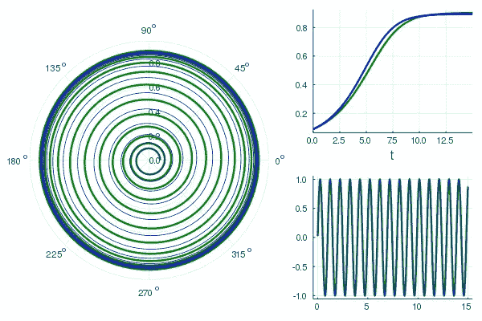

蓝色表示训练数据的 Stuart-Landau 振荡器拟合，绿色表示模型预测。左图显示了相平面中的动态特性。右图显示了作为时间函数绘制的幅度 R(右上)和相位(右下)。

我们可以进一步测试我们的模型，看看它对新的初始值的推广程度。

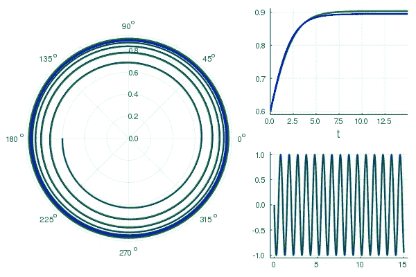

使用未观察到的初始条件数据生成的验证数据的 Stuart-Landau 振荡器拟合显示为蓝色，模型预测显示为绿色。左图显示了相平面中的动态特性。右图显示了作为时间函数绘制的幅度 R(右上)和相位(右下)。

## 洛伦兹方程和混沌

现在是有趣的应用程序的时间了。让我们考虑使用混沌系统的时间序列数据进行参数恢复。为此，我们将使用著名的[洛伦兹系统。](https://en.wikipedia.org/wiki/Lorenz_system)

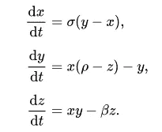

三维洛伦兹系统。最初用作大气流体动力学(对流)的简单模型。我们将选择给出混沌解的标准参数值(σ=10，ρ=28，β=8/3)。

在 Julia 中定义这个系统很简单:

作为演示，让我们看一下从稍微不同的初始条件值生成的 X 变量的一些时间序列数据。

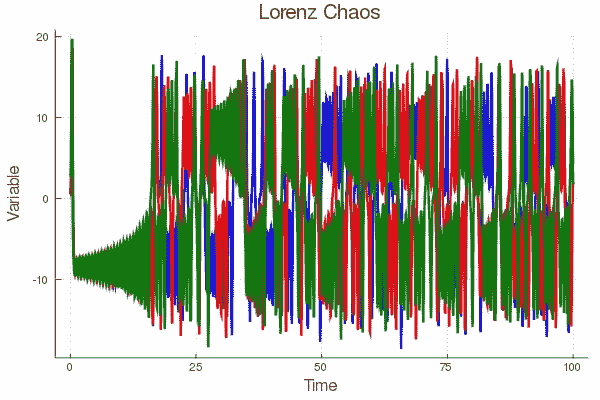

x 变量作为时间的函数，三个初始条件非常接近。

该图显示了对初始条件的敏感依赖，这是混沌的标志。

通常，我们定义一个依赖于初始条件和参数的微分方程层。

生成一些数据，给时间序列添加一些噪声，并定义我们通常的误差函数。

现在使用 DiffEqFlux 库定义训练函数。

运行优化可以很好地拟合训练数据，当我们对训练样本之外的时间进行积分时，这种拟合可以很好地概括。

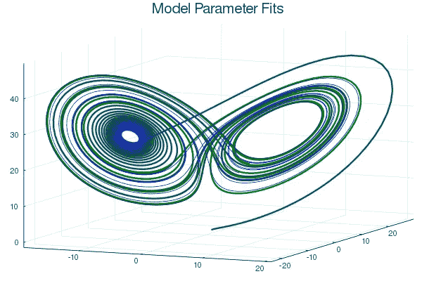

相空间绘制 t ∈ [0，30]的真实系统(蓝色)与模型预测(绿色)的关系图。

我们还可以查看适合时间序列图的训练模型。

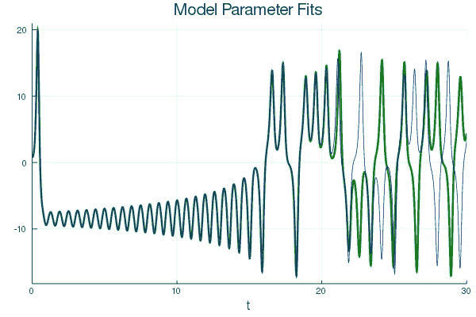

蓝色显示的(扩展)训练数据的时间序列与绿色显示的拟合模型预测。在模型预测和数据出现分歧的 t ≈ 22 之前，它们一直非常接近。该模型仅针对 t ∈ [0，10]的数据进行训练。因此，该模型能够对大约两倍长度的训练数据进行准确预测。

由于该模型仅在 t ∈ [0，10]上训练，我们可以看到该模型对 t ∈ [10，20]的概括非常好，但在此时间之后很快偏离真实值。

```
The parameters are [0.9727986684296102, 0.034212291835795355, -0.001627150535904438, 9.99887680497206, 28.00267472723392, 2.666573010932292] with final loss value 1.7015586033442565The actual parameters are:
[1.0,0.0,0.0,10.0,28.0,2.6666666666666665]
```

所以我们找到了一个非常合适的。

## 结论

使用 Julia 生态系统([科学机器学习 sciml)](https://github.com/SciML) 将微分方程模型包括到神经网络中是相对简单的。这使得我们能够通过经典的动态系统模型将整个知识分支纳入到我们的神经网络模型中，用于时序数据。下一步是将这些微分方程层结合到我们的深度学习模型中。

关于动力系统和人工神经网络的接口问题。我们从这里开始的三个可能的概括是:

*   [神经微分方程](https://arxiv.org/abs/1806.07366)是一个术语，用来描述使用人工神经网络函数作为动力系统的右端。由于这些系统利用了一般的人工神经网络功能，它们可能[在建模时间序列](/work-smarter-not-harder-when-building-neural-networks-6f4aa7c5ee61)时表现出较差的收敛性。
*   [通用微分方程](https://arxiv.org/abs/2001.04385)是一个用于混合数学模型和人工神经网络函数的术语。这里的想法是指定尽可能多的动态，然后让 ANN 填入未建模的动态、[控制函数](https://github.com/SciML/DiffEqFlux.jl#universal-differential-equations-for-neural-optimal-control)等。这些系统可以表现出更快的收敛速度，并允许我们将神经网络的能力与领域知识相结合来描述高维函数。
*   [混合动力系统](https://arxiv.org/abs/1803.04779)用于将微分方程模型(或更一般的某种领域知识)与单独的机器学习方法相结合。存在这些类型的许多变体，但我会区分这个类，它将机器学习模型与领域模型分开。然后可以将它们组合起来或作为输入输入到另一个中。

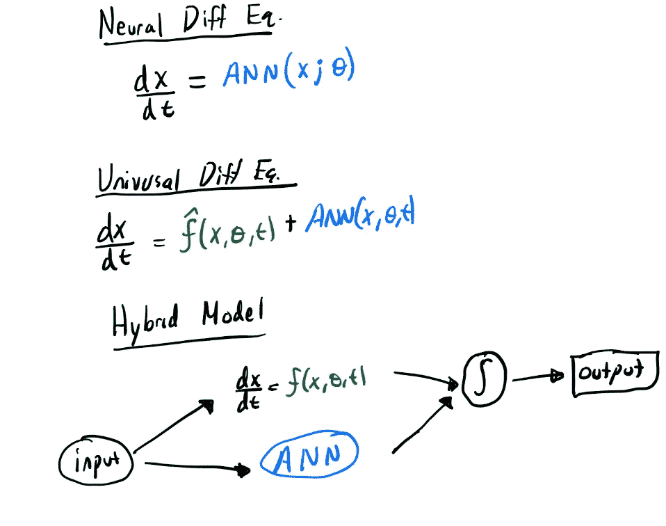

此外，我应该提到，我们在本文中讨论的所有模型都可以很容易地转移到 GPU 进行训练。只需在 GPU 上声明[初始条件。](https://julialang.org/blog/2019/01/fluxdiffeq/)

提醒:本文[的所有代码都可以在这里找到](https://github.com/khannay/FittingParamsDiffEqFlux/)。

快乐造型！