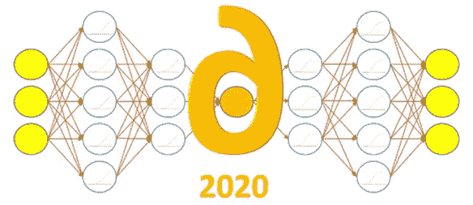
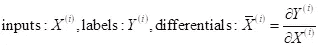
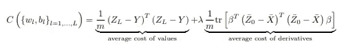
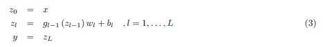
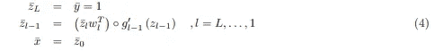
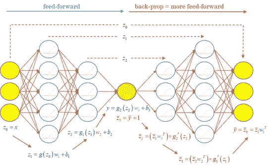
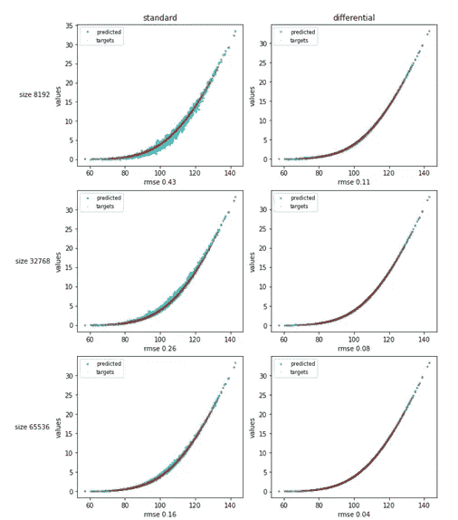

# 差分机器学习

> 原文：<https://towardsdatascience.com/differential-machine-learning-f207c158064d?source=collection_archive---------26----------------------->

## 利用导数的新用途进行不合理的有效函数逼近

 [## 差分机器学习

### 工作底稿

arxiv.org/abs/2005.02347](https://arxiv.org/abs/2005.02347)  [## 差分机器学习概述

### 同伴回购

github.com/differential-machine-leanring-](https://github.com/differential-machine-learning) 

为 2020 年 5 月 28 日彭博烧烤研讨会录制的 5 分钟视频概述

[Brian Huge](https://www.risk.net/awards/2133160/quants-year-jesper-andreasen-and-brian-huge-danske-bank) 和我刚刚发布了一篇[的工作论文](https://arxiv.org/abs/2005.02347)，这是在丹斯克银行进行了六个月的人工智能(AI)函数逼近的研究和开发之后。一个主要发现是，当训练标签相对于训练输入的梯度可用时，用于回归(即值的预测，而不是类的预测)的训练机器学习(ML)模型可以得到极大的改善。给定这些*差分标签*，我们可以编写简单但不合理有效的训练算法，能够以稳定的方式从小数据集以显著的速度和准确度学习精确的函数近似，而不需要额外的正则化或超参数优化，例如通过交叉验证。

> 在这篇文章中，我们以*差分机器学习*的名义简要总结了这些算法，强调了主要的直觉和好处，并评论了 TensorFlow 实现代码。所有细节都可以在工作文件、[在线附录](https://github.com/differential-machine-learning/appendices)和[Colab 笔记本](https://github.com/differential-machine-learning/notebooks)中找到。

在金融衍生品定价近似的背景下，训练集是用蒙特卡罗模型*模拟的*。每个训练示例都是在一个蒙特卡罗路径上模拟的，其中标签是交易的最终*收益*，输入是市场的初始状态向量。微分标签是对状态的收益 wrt 的*路径梯度*，并且用[自动伴随微分(AAD)](/automatic-differentiation-15min-video-tutorial-with-application-in-machine-learning-and-finance-333e18c0ecbb) 有效地计算。由于这个原因，差分机器学习在金融中特别有效，尽管它也适用于所有其他可以获得高质量一阶导数 wrt 训练输入的情况。

模型不仅在输入和标签的扩充数据集上训练，而且在差异数据集上训练:

通过最小化值*和导数*的预测误差的组合成本:

给出了值和导数*标签*。我们通常通过推理计算*预测的*值，通过反向传播计算*预测的*导数。虽然这种方法适用于任意复杂的架构，但为了简单起见，我们在此讨论普通前馈网络。

回想一下普通前馈方程:

前馈方程

其中符号是标准的，并在论文中规定(索引 3 是为了与论文一致)。

本文中的所有代码都摘自演示笔记本，其中还包括注释和实际的实现细节。

标准进口

下面是前馈方程的 TensorFlow (1.x)实现。我们选择显式编写矩阵运算来代替高级 Keras 层，以突出代码中的等式。我们选择了 softplus 激活。ELU 是另一个选择。出于论文中解释的原因，激活必须是连续可微的，排除了例如 RELU 和 SELU。

代码中的前馈方程

用反向传播预测输出 wrt 输入的导数。回想反向传播方程是作为前馈方程的*附件*推导出来的，或者参见[我们的教程](/automatic-differentiation-15min-video-tutorial-with-application-in-machine-learning-and-finance-333e18c0ecbb)了解一下:

反向传播方程

或者在代码中，回想一下 softplus 的导数是 sigmoid:

代码中的反向传播方程

我们再次明确地编写了反向传播方程来代替对 *tf.gradients()* 的调用。我们选择这样做，首先，再次突出代码中的方程，同时避免在训练期间嵌套反向传播层，如下所示。为了避免疑问，通过调用一次 *tf.gradients()* 来替换这段代码也是可行的。

接下来，我们在一个网络中结合了前馈和反向传播，我们称之为*双网络*，这是一个两倍深度的神经网络，能够以两倍的计算成本同时预测值*和导数*:

孪生网络

前馈和反向传播相结合的孪生网络

孪生网络在两个方面是有益的。*训练*后，在需要导数预测的应用中，它可以有效地预测给定输入的值和导数。例如，在金融领域，它们是价格对市场状态变量的敏感性，也称为*希腊*(因为交易员给它们取希腊字母)，也对应于*对冲比率*。

双生网络也是*差异训练*的基本构造。组合成本函数通过孪生网络的推理、预测值和导数来计算。成本函数的*梯度*通过 twin 网络反向传播来计算，包括由 TensorFlow 作为其优化循环的一部分静默进行的反向传播部分。回想一下神经网络的标准训练循环:

普通训练循环

差分训练循环实际上是相同的，对于成本函数的定义是安全的，现在结合了值和导数的均方误差:

差分训练循环

TensorFlow 在幕后无缝区分 twin 网络，以满足优化需求。网络的一部分本身就是反向传播，这无关紧要。这只是矩阵运算的另一个序列，TensorFlow 没有困难地进行微分。

笔记本的其余部分涉及标准数据准备、训练和测试，以及对金融教科书数据集的应用:Black & Scholes 中的欧式看涨期权和 correlated Bachelier 中的篮子期权。结果证明了差分深度学习的*不合理*有效性。

一些测试结果展示了差分深度学习的强大功能，可在笔记本电脑上重现

[在在线附录](https://github.com/differential-machine-learning/appendices)中，我们探索了差分机器学习在其他类型的 ML 模型中的应用，如基函数回归和主成分分析(PCA)，结果同样显著。

差分训练对不正确的导数施加惩罚，与常规正则化(如 ridge/Tikhonov)倾向于小权重的方式相同。与常规正则化相反，差分 ML 有效地减轻了过拟合*，而没有引入偏差*。因此，不存在偏倚-方差权衡或通过交叉验证调整超参数的必要性。它只是工作。

差分机器学习更类似于*数据扩充*，这反过来可以被视为一种更好的正则化形式。数据扩充一直被应用于例如计算机视觉中，并取得了成功。这个想法是从一个单独的图像产生多个标记的图像，例如通过裁剪、缩放、旋转或重新着色。除了以可忽略不计的成本扩展训练集之外，数据扩充教会了 ML 模型重要的不变性。同样，衍生品标签，不仅以非常小的成本增加了训练集中的信息量(只要它们是用 AAD 计算的)，而且教会了 ML 模型定价函数的*形状*。

**工作论文**:【https://arxiv.org/abs/2005.02347
Github repo:[github.com/differential-machine-learning](https://github.com/differential-machine-learning)
**Colab 笔记本**:[https://Colab . research . Google . com/Github/differential-machine-learning/notebooks/blob/master/differential ml . ipynb](https://colab.research.google.com/github/differential-machine-learning/notebooks/blob/master/DifferentialML.ipynb)

安托万·萨维恩