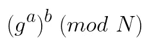
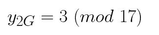

# Diffie Hellman 密钥交换

> 原文：<https://towardsdatascience.com/diffie-hellman-key-exchange-f673d617137?source=collection_archive---------24----------------------->

克林特·帕特森在 [Unsplash](https://unsplash.com?utm_source=medium&utm_medium=referral) 上拍摄的照片

## 使互联网成为可能的技术

简而言之，Diffie Hellman 是一种广泛使用的技术，用于将对称加密密钥安全地发送给另一方。在继续之前，让我们首先讨论一下为什么要使用像 Diffie Hellman 这样的东西。当在互联网上以纯文本形式传输数据时，有人很容易使用某种数据包嗅探器(如 WireShark)来捕获数据包。一个恶意的人，可能会偷听你和你女朋友的谈话，或者更糟，窃取密码和信用卡信息。幸运的是，一些非常聪明的人想出了一种为交通信息编码的方法。我们将普通的纯文本转换成难以理解的东西，反之亦然的过程被称为**密码术**。密码学最基本的例子叫做凯撒密码。

[https://commons . wikimedia . org/wiki/File:Caesar _ Shift _ Cipher _ wheel . png](https://commons.wikimedia.org/wiki/File:Caesar_Shift_Cipher_Wheel.png)

本质上，双方都有一个对称密钥，它指定了什么字符映射到加密文本的什么符号。没有钥匙的人不能阅读这条信息。例如，在前面的图像中，字符“A”将被编码为加密消息中的“T”。然后，接收端的个人可以使用相同的凯撒密码来解码消息。

在计算机网络领域，对称加密算法的问题是，密钥必须不可避免地通过网络发送给另一方，以便他们可以解密传入的消息，并依次加密它们。如果恶意行为者碰巧在那个时间点监听网络，他们可以获得密钥，并将其用于邪恶的目的。

这就是不对称加密发挥作用的地方。不对称加密通过生成公钥和私钥对来工作。公钥只能用于加密消息，而私钥只能用于解密消息。例如，当您进行网上银行业务时，您将您的公钥交给银行，然后用它来加密发送给您的数据。如果一个坏人得到了公钥，他们不会造成任何真正的伤害，因为他们只有加密数据的能力。

今天，使用最广泛的非对称加密算法是 RSA。 **RSA** 代表**Rivest–sha mir–ad leman**在**之后，这些人在 1977 年首次描述了该算法。RSA 算法通过将消息提升到公钥的幂，然后取结果的模来加密消息。为了解密给定的消息，我们将它提升到私钥的幂，然后取结果的模。RSA 依赖于一种称为单向函数的数学概念。假设我们有以下等式:**

现在，假设你得到了数字 ***8*** 并要求返回 2 。你能做到吗？

为了弄清楚 ***8*** 的所有因素，我们可以相对容易地逆向工作。

相反，模(与余数同义)运算是单向函数的一个例子。假设我们有以下等式:

如果让你从*推导出 ***11*** ，你会吗？*

**

*通过尝试所有不同的可能性(即 **3 % 4 = 3** ， **7 % 4 = 3** ， **11 % 4 = 3)** ，您可能能够获得正确的答案(**11*)*)**，但是当分子非常大时，如 RSA 的情况(即 4096 位长)，有很多排列，我指的是给出余数的很多排列鉴于这一特性，黑客将别无选择，只能使用蛮力(尝试各种可能性)来从加密消息和公钥中确定私钥。考虑到今天的密钥长度为 4096 位，传统的计算机要花上几个世纪才能遍历完所有可能的值。*

*实际上，非对称加密比对称加密慢 3 到 5 个数量级。因此，我们不使用非对称加密来加密实际的有效载荷。相反，我们使用像 Diffie-Hellman 这样的技术安全地向另一方发送对称加密密钥，然后使用所述密钥加密/解密所有进一步的消息。*

# *模运算(RSA) Diffie Hellman*

*我们已经在高层次上描述了 RSA。现在，让我们看一个具体的例子。假设，鲍勃想给爱丽丝发送一条消息。鲍勃将通过生成新的随机素数 ***N*** 和相应的生成器*开始**

**注意:g 不是随机的，但是我们如何选择它超出了本文的范围。**

**实际上，N 是一个很大的数字。然而，为了简单起见，我们将使用以下值:**

********

**两个 g & N 都以纯文本形式在网络上发送。Bob 然后生成一个密钥 **a = 2** 。接下来，鲍勃将生成器 **g** 提升到他的密钥 **a** 的幂，并取结果的模。最终产品 **A = 5** 被发送给爱丽丝。**

************************

**在另一端，Alice 执行相同的步骤—即，她生成一个密钥 **b，**将生成器 **g** 提升到她的密钥 **b** 的幂，取乘积的模，并将最终结果 **B = 3** 发送给 Bob。**

************************

**即使恶意的参与者想要窥探他们的流量。他们无法从 A 和 b 中推导出 Bob 或 Alice 的秘密密钥。**

**在从爱丽丝接收到 **B** 后，鲍勃将其提升到他的私钥 **a** 的幂，并取结果的模。**

********************

**爱丽丝也一样。**

************************

**在这种情况下，爱丽丝和鲍勃最后都得到相同的数字， **9** 。然后他们使用 **9** 作为 AES 等对称加密算法的密钥。**

# **椭圆曲线 Diffie Hellman**

**试图从椭圆曲线上的一点导出私钥比传统的 RSA(模运算)更难破解。因此，椭圆曲线 Diffie Hellman 可以用较少的比特实现相当的安全级别。**

**较小的密钥需要较少的计算步骤来加密/解密给定的有效载荷。当从本地机器建立安全连接时，您不会注意到太大的不同。然而，在类似于每秒执行成千上万次密钥交换的中型 web 服务器上，使用椭圆曲线 Diffie Hellman 可以节省大量资源。**

**我们可以将 Diffie Hellman RSA 密钥交换中所有可能数字的定义域想象成一个圆(由于模函数的性质)。 **n 的值越大，**圆圈越大，越难猜出正确的数字。**

****

**相反，顾名思义，椭圆曲线 Diffie Hellman 密钥交换的所有可能数字的定义域采用椭圆曲线的形式。**

****

**前述椭圆曲线的特征在于以下数学方程:**

****

**在野外，使用等式( **mod n** )是很常见的。**

****

**在实践中，你希望使用由专业数学家开发的曲线，并检查以确保它们是安全的。**

**椭圆曲线 Diffie Hellman 的工作方式不是像 RSA 那样进行幂运算，而是将点 ***G*** 多次添加到自身。**

**让我们看一个例子。假设 Bob 发起了与 Alice 的连接。Bob 选择一个生成器 ***G (*** 曲线上的一点)和椭圆曲线方程的参数 ***a*** 、 ***b*** 、 ***n*** ，并以明文形式通过网络发送它们。**

********

**Bob 和 Alice 各自生成一个私钥(数字)。为了简单起见，我们假设鲍勃选择了 **b = 9** 而**爱丽丝选择了 **a = 3** 。鲍勃和爱丽丝分别负责计算 **bG = 9G** 和**aG = 3G****。******

**为了计算 **xG** (其中 **x** 为任意数)**、**，我们使用了点的加法和加倍公式。例如，为了确定 2G，我们使用一个点加倍的公式。**

************

**为了取分数的模，我们可以使用模乘逆计算器。**

 **[## 模乘逆

### 这个计算器计算给定整数 a 模 m 的模乘逆。理论是下面的…

planetcalc.com](https://planetcalc.com/3311/)** 

**然后我们将答案乘以 **77 % 17 = 9，**并取结果的模。**

************

**该点的 x 坐标可以计算如下:**

****************

**然后我们用 x2G 来计算 y2G。**

********************

**为了计算 3G，我们使用增加一个点的公式。**

****

**我们从计算斜率开始。**

************

**然后我们计算新点的 x 位置。**

************

**最后，我们使用 x 坐标的值来计算 y。**

****************

**Bob 通过网络发送 **bG = 9G** **= (7，6)** 。同样，爱丽丝发送 **aG = 3G = (10，6)** 。在事件中，一个恶意的演员正在监听，从椭圆曲线上的点 **(7，6)** 和 **(10，6)** 导出 **aG** 或 **bG** 的值是不可能的。**

****

**一旦 Bob 从 Alice 接收到 **aG = (10，6)** ，他计算 **abG = 9(3G) = 27G = (13，7)** 。当 Alice 从 Bob 收到 **bG = (7，6)** 时，她计算 **abG = 3(9G) = 27G = (13，7)** 。然后，它们都使用 **abG** 的 x 坐标作为所有进一步数据传输的对称加密密钥。**