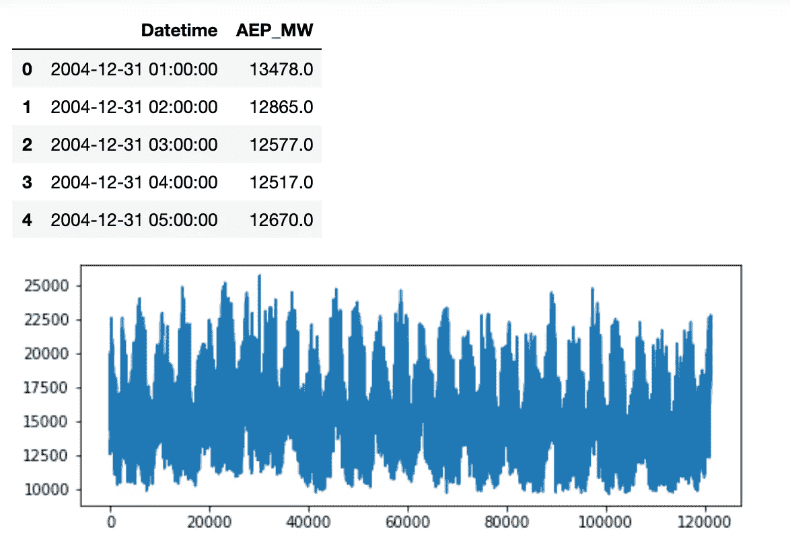
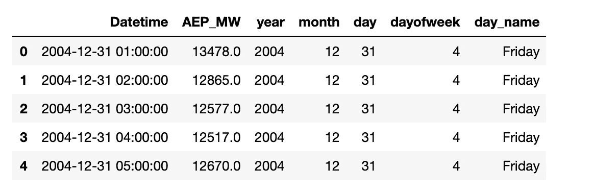
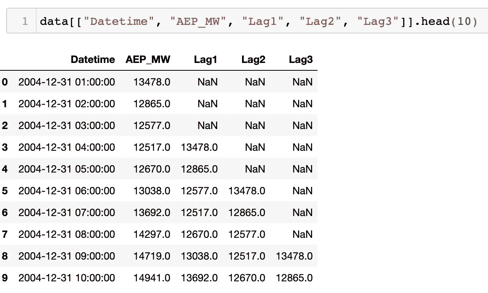
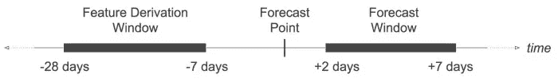
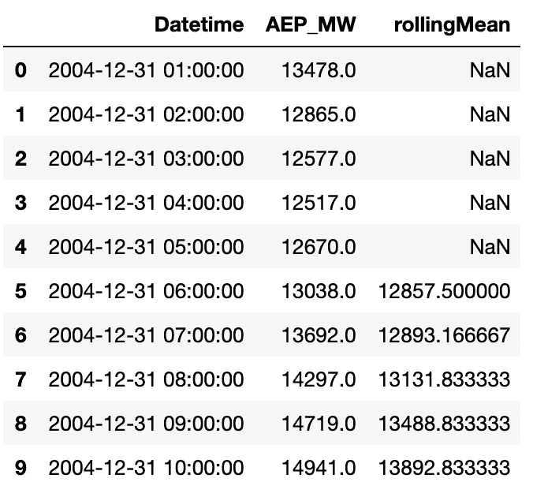
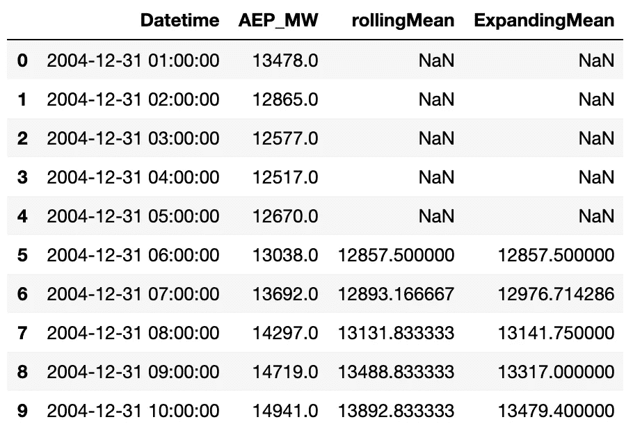

# 挖得足够深

> 原文：<https://towardsdatascience.com/dig-deep-enough-features-engineering-techniques-for-time-series-analysis-in-python-500c96aebade?source=collection_archive---------39----------------------->

## 以 Python 中时间序列分析的工程技术为特色。


照片由 [Unsplash](https://unsplash.com/s/photos/digging?utm_source=unsplash&utm_medium=referral&utm_content=creditCopyText) 上的 [Dragos Gontariu](https://unsplash.com/@dragos126?utm_source=unsplash&utm_medium=referral&utm_content=creditCopyText) 拍摄

在我们开始挖掘数据之前，对时间序列有一个概念是非常重要的。
基本上，一个时间序列是一个按连续顺序排列的数据点的**序列，在大多数情况下，时间序列是一个变量在**不同时间**取值的一组观察值。**

在这篇文章中，我将重点介绍一些特性工程的基本技术，这些技术可以随着时间的推移增强您的预测。很久没有在时间序列项目中合作了，所以我决定快速更新一下我用来提高预测的技术，并与大家分享。

# 特征工程

特征工程是使用领域知识来创建相关特征的过程，以便使您的机器学习算法更加准确。特征工程可以显著影响您的建模过程的性能，如果它做得正确，它可以帮助您的模型执行得非常好。

在进行这一步之前，您需要遵循解决数据科学问题的基本流程，即:

*   明确你的目标；
*   提取数据；
*   清洗数据；
*   探索数据和发现洞察力(探索性数据分析)；
*   **特色工程；**
*   定义你的模型；
*   训练和调整您的模型；
*   部署模型。

特征工程是区分好模型和坏模型的重要步骤。在接下来的章节中，我们将讨论这些技术在时间序列分析中的应用。

让我们假设我们需要预测某个区域的能源消耗，那么我们得到了这个数据:



数据是不言自明的，它是一个单变量时间序列，我们有一些重复的模式，我们有两列日期和值，日期列被视为一个对象，因此我们需要将其转换为一个*日期时间*类型*，*这可以使用 Pandas 轻松完成:

现在我们的数据已经准备好了，让我们看看我们可以从这些变量中挖掘的东西，正如我所说的，数据集包含两列，一个与值相关联的日期，所以让我们讨论一些用于设计这类问题的技术。

# 日期相关功能

日期相关要素是一种特殊类型的分类变量，日期仅提供时间线上的特定点。如果我们有一些领域的知识或者对问题有深刻的理解，约会是可以被恰当地安排的。
既然我们想预测能源消耗，我们来问一些问题...

*   日期/时间和消费有关系吗？
*   数据中是否至少有一个趋势？

要回答第一个问题，如果我们的数据与一些个人使用有关，例如，我们知道晚上的能源使用量比白天低；因此，我们可以得出结论，如果我们从日期中提取小时，可能会有一些隐藏的模式，这也回答了第二个问题，因为我们知道在我们的数据中有一个重复的趋势。

提取周末和工作日有助于了解一周中是否有任何变化模式，而月/年也是一种非常有用的方法来查看季节是否有变化。

使用 Python 提取这些特征非常简单:

```
data['year']=data['Datetime'].dt.year 
data['month']=data['Datetime'].dt.month 
data['day']=data['Datetime'].dt.day
data['dayofweek']=data['Datetime'].dt.dayofweek  
data['dayofweek_name']=data['Datetime'].dt.day_name()
data.head()
```



从日期变量中提取的特征

我们可以提取更多信息，例如:

*   四分之一
*   学期
*   是一个月的开始
*   是一年的开始
*   是月末
*   是年末

一些日期提取的代码

# 基于时间的特征

同样，我们可以使用日期的时间戳部分提取更多的特征，例如，我们可以提取小时、分钟甚至秒，因为日期是每小时的，所以我们在这里可以提取的唯一特征是小时。

```
data['Hour'] = data['Datetime'].dt.hour 
```

我们可以使用日期列生成很多特性，如果你想探索更多关于基于日期/时间的特性，这里有文档[链接](https://pandas.pydata.org/pandas-docs/stable/reference/api/pandas.DatetimeIndex.html#pandas.DatetimeIndex)。

# 滞后特征

滞后特征基本上是目标变量，但随着一段时间而变化，它用于了解我们的目标值在过去的行为，可能是前一天，一周或一个月。

> 使用滞后特性有时可能是一把双刃剑，因为使用目标变量**非常棘手，如果使用不当，有时会导致过度拟合**。

```
data["Lag1"] = data['AEP_MW'].shift(3) # Lag with 3 hours
data["Lag5"] = data['AEP_MW'].shift(5) # Lag with 5 hours
data["Lag8"] = data['AEP_MW'].shift(8) # Lag with 8 hours
```



滞后特征

# 滚动窗口功能



滚动窗口功能正在根据过去的值计算一些统计数据:

*   **预测点:**进行预测的时间点；
*   **特征推导窗口(FDW):** 滚动窗口，相对于预测点；
*   **预测窗口(FW):** 我们希望预测的未来值的范围，称为预测距离(FDs)。

我们可以使用这行代码来实现:

```
data['rollingMean'] = data['AEP_MW'].rolling(window=6).mean()
```



同样，我们可以生成许多不同的时间序列特征，这些特征可用于预测不同的预测距离:

*   [滚动平均值](https://en.wikipedia.org/wiki/Moving_average)，最小值，最大值，...统计数字
*   [布林线](https://en.wikipedia.org/wiki/Bollinger_Bands)和统计
*   分类特征的滚动熵或滚动多数

# 扩展窗口统计

另一种类型的窗口，包括**系列中所有先前的**数据。

这可以通过使用 *expanding()* 函数在 Python 中轻松实现:

```
data['ExpandingMean'] = data['AEP_MW'].expanding(6).mean()
```



滚动平均值与膨胀平均值

当我们对问题有了很好的理解时，所有这些特性都是有用的，这将引导我们做出有意义的见解，并避免[特性爆炸](https://en.wikipedia.org/wiki/Feature_engineering#Feature_explosion)。

对于非时间序列数据，还有一些其他有用的特征工程技术，我想和你们分享一下。

# 交互功能

还有一些其他类型的特征工程，涉及揭示特征之间的相互作用，一些特征可以组合起来提取一条特定的信息，所以基本上，我们可以对两个变量进行求和、相乘、求差或求商。

> 一个通用的技巧是查看每一对特征并问自己，“我能以任何可能更有用的方式组合这些信息吗？”

*   **T0 变量的总和:**假设我们有两个变量，`selling_food_amount`和`selling_gadgets_amount`，如果我们只关心费用的总额，我们可以对它们求和。
*   **两个特征的区别:**假设我们有两个特征`expiration_date`和`manufacturing_date`，我们可以创建一个新特征，名为`product_validity`。
*   **两个特征的乘积:**我们有一个在某个区域定义最佳房屋的问题，我们有这两个特征
    `number_of_houses`:该区域 10 公里内的房屋数量，`median_houses`:这些房屋的平均质量分数，
    重要的是，有许多房屋选择，但前提是它们足够好。为了创建这种交互，我们可以在这两个变量之间创建一个简单的乘积:`house_score` = `number_of_houses` **x** `median_houses`。
*   **两个特征的商:**以疫情冠状病毒为例，我们可以通过`mortality_rate` = `numberOfDeaths` / `numberOfCases`生成死亡率特征。

# 结论

特征工程将你的输入转化为算法可以理解的东西。

生成太多的特征会混淆你的模型并降低性能，我们应该总是选择最有贡献的特征，并删除未使用的和多余的特征，最重要的是不要使用你的目标变量作为指标(这包括非常接近的滞后特征)，这可能会给你非常误导的结果。

那都是乡亲们！顺便说一下，这是我的第一篇文章，希望你喜欢。

别忘了..相信数据，不要相信观点。

数据来源:[https://www.kaggle.com/robikscube/hourly-energy-consumption](https://www.kaggle.com/robikscube/hourly-energy-consumption)

**其他来源:**

*   Alice Zheng & Amanda Casari，机器学习的特征工程
    ，数据科学家的原理与技术*(2018)，*
*   *查普曼&霍尔/CRC，机器学习和数据分析的特征工程(2018)，[https://www.crcpress.com/Chapman-霍尔 CRC 数据挖掘和知识发现系列/图书系列](https://www.crcpress.com/Chapman--HallCRC-Data-Mining-and-Knowledge-Discovery-Series/book-series/CHDAMINODIS)*