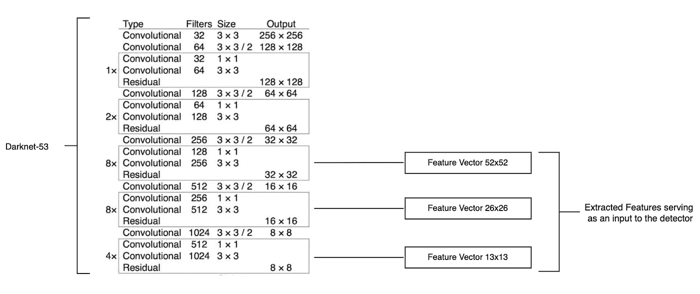

# 深入了解 YOLO V3 -动手指南第 1 部分

> 原文：<https://towardsdatascience.com/digging-deep-into-yolo-v3-a-hands-on-guide-part-1-78681f2c7e29?source=collection_archive---------4----------------------->

## 深度学习/实时对象检测

## 让我们熟悉 YOLO v3 模型的尝试

https://www . good fon . com/wallpaper/zhivotnoe-gry Zun-zveriok-belka-priroda-mokh-voda-vodopoi . html

人工智能领域在过去几年里发生了巨大的变化，产生了许多新技术。计算机视觉就是这样一个领域，它的目的是训练机器阅读和解释视觉世界。

计算机视觉处理许多具有挑战性的用例，从图像分类到人脸识别。我今天要解决的一个挑战就是*物体检测*。

# 什么是物体检测？

对象检测是一种包含两项任务的技术，即*对象分类*和*对象定位*。它是一个被训练来检测多类对象的存在和位置的模型。这可以用于静态图像，甚至实时视频。

# 物体检测是如何工作的？

对象检测定位对象并将其分类为不同的类别，并通过在其周围绘制边界框来对其进行定位。对象检测有许多使用案例。例如，自动驾驶汽车需要能够在驾驶时识别道路上的其他物体。阅读 X 射线的 AI 放射科医生需要能够定位病变(异常组织)。为了解决这些用例，许多最先进的算法被用于检测对象，例如 R-CNN、快速 R-CNN、更快 R-CNN、掩蔽 R-CNN、SSD、YOLO 等。但是我对今天的 YOLO 特别感兴趣。

YOLO(你只看一次)被认为是最强大的对象检测算法之一。由约瑟夫·雷德蒙、桑托什·迪夫瓦拉、罗斯·吉斯克和阿里·法尔哈迪(2015)发明，迄今为止它已经有 4 个不同的版本，YOLO V4 是 2020 年 4 月发布的最新版本，但在这篇文章中，我们将重点关注 YOLOv3，并试图了解围绕它的所有宣传。除了 YOLO v3，我们还将使用最新版本的 Tensorflow，即谷歌在 2019 年 9 月发布的 TF 2.0。

# 这个帖子是给谁的？

由于被隔离，这些天我有额外的时间，我决定使用 YOLO V3 探索对象检测，并在跳到最新的 YOLO 版本之前了解它的动态。我看到了很多文章，但大多数都解释了这个非常复杂的 YOLO v3 模型的高级架构和直接实现，这让我感到困惑。我在寻找更多的东西，并决定要理解每一行代码以及后台发生的事情。我偶然看到了伊桑·颜佳·李、阿尤什·卡图里亚和拉赫马德·萨德里的精彩文章，这些文章帮助我更好地理解了。还有什么比试着向别人解释更好的方法来确保我真的理解了某事，因此我写了这篇文章。

这篇文章是我对 YOLO V3 的理解，一个复杂的算法，一个用简单的语言表达的天真的尝试。

# 先决条件

这篇文章假设你是:

熟悉 Python 3

很了解 [TensorFlow](https://www.tensorflow.org/) 库

对卷积神经网络(CNN)和对象检测有基本的了解。

对 [Streamlit](https://www.streamlit.io/) 有一个基本的了解，以及它是用来做什么的。

# 本教程的关键要点

本教程分为 ***两个*** 部分。

***第 1 部分*** 解释了理解 YOLO v3 如何工作的架构和关键概念。

***第 2 部分*** 从理解配置文件到能够创建用户界面以从用户处获取输入图像并在其上执行对象检测，开始着手实施该算法。

让我们首先了解一下 YOLO 是什么。

# YOLO——你只能看一次

许多对象检测模型多次接收和处理图像，以便能够检测图像中存在的所有对象。但是 YOLO，顾名思义，只看物体一次。它对整个图像应用单次向前传递，并预测边界框及其类别概率。这使得 YOLO 成为超快速实时对象检测算法。

太多行话了，嗯？让我们一步步来理解。

# YOLO V3

Yolo V3 是对前两个 Yolo 版本的改进，前两个版本更强大，但比前两个版本稍慢。该模型具有多尺度检测、更强的特征提取网络和损失函数的一些变化。

## 网络体系结构

为了在高层次上理解网络架构，我们将整个架构分为两大部分: ***特征提取器*和*特征检测器(多尺度检测器)*** 。图像首先被提供给特征提取器，该特征提取器提取特征嵌入，然后被传递给网络的特征检测器部分，该特征检测器部分吐出处理后的图像，该图像具有围绕检测到的类别的边界框。

让我们稍微深入一下这些组件。

## 特征提取器

以前的 YOLO 版本使用 Darknet-19(用 C 和 CUDA 编写的定制神经网络架构)作为特征提取器，顾名思义，它有 19 层。YOLO v2 在 Darknet-19 的基础上又增加了 11 层，使其架构达到 30 层。尽管如此，该算法在检测小对象时仍然面临着挑战，因为对输入图像进行了下采样，丢失了细粒度的特征。

YOLO V3 提出了一个更好的架构，其中使用的特征提取器是 YOLO v2、Darknet-53(在 ImageNet 上训练的网络)和残差网络(ResNet)的混合。该网络使用 53 个卷积层(因此被命名为 Darknet-53)，其中该网络由**个连续的 3×3 和 1×1 卷积层**构建，后跟一个**跳过连接**(由 ResNet 引入，以帮助激活通过更深的层传播，而不会出现梯度递减)。

53 层暗网再叠加 53 层用于探测头，使得 YOLO v3 总共是一个 **106 层全卷积底层架构**。从而导致大的架构，尽管与 YOLO v2 相比，使其稍慢，但同时提高了精度。

这张图片是取自 [YOLOv3 的 darknet-53 架构:一个增量改进](https://arxiv.org/pdf/1804.02767.pdf)

如果目标是像在 ImageNet 中那样执行分类，那么将添加平均池层、1000 个完全连接的层和 SoftMax 激活函数，如图所示，但是在我们的示例中，我们希望检测类和位置，因此我们将在提取器上附加一个检测头。探测头是多尺度探测头，因此，我们也需要在多个尺度上提取特征。

一旦我们熟悉了高层架构，我们将在下一节更深入地了解这些层是如何工作的。

为了形象化多尺度提取器的样子，我举了一个 416x416 的图像的例子。层的跨度定义为**比率，通过该比率对输入进行下采样，**，因此在我们的情况下，三个比例将是 **52x52、26x26、**和 **13x13** ，其中 13x13 将用于较大的对象，26x26 和 52x52 将用于中等和较小的对象。

416x416 图像的多尺度特征提取器

# 多尺度检测器

YOLO v3 模型的一个重要特征是其多尺度检测器，这意味着对全卷积网络的最终输出的检测是通过在三个不同位置对三个不同大小的特征映射应用 1x1 检测核来完成的。内核的形状是***1*x*1*x*(B *(5+C))。***

# 完整的网络架构

Ayoosh Kathuria 制作了一个非常精细的图表，完美地解释了 YOLO v3 的完整架构(结合了提取器和检测器)。

图来自[https://towards data science . com/yolo-v3-object-detection-53 FB 7d 3 bfe 6 b](/yolo-v3-object-detection-53fb7d3bfe6b)

如上图所示，我们以 416x416 的图像为例，进行检测的三个比例分别为第 82 层、第 94 层和第 106 层。

对于第一次检测，前 81 层被下采样，使得第 81 层具有 32 的跨距(如前所述，层的跨距被定义为对输入进行下采样的**比率)**，产生我们的大小为 13×13 的第一特征图，并且第一次检测是用 1×1 内核进行的，产生我们的大小为 13×13×255 的检测 3D 张量。

对于第二次检测，在向上采样到 26×26 的维度之前，第 79 层向前经过卷积层。该特征图然后与来自层 61 的特征图深度连接以形成新的特征图，该新的特征图在 1x1 卷积层的帮助下进一步与第 61 层融合。第二检测层在第 94 层，具有大小为 26×26×255 的 3D 张量。

对于最终(第三)检测层，遵循与第二检测相同的过程，其中第 91 层的特征图在与来自第 36 层的特征图深度连接和融合之前经历卷积层。在第 106 层使用大小为 52×52×255 的特征图进行最终检测。

多尺度探测器用于确保小物体也能被探测到，这与 YOLO v2 不同，后者一直受到批评。与先前层连接的上采样层最终保留了有助于检测小对象的细粒度特征。

下一节将详细描述这个内核在我们的模型中的样子。

# YOLO v3 的工作

YOLO v3 网络旨在预测每个对象的**(候选对象的感兴趣区域)*以及该对象所属类别的 ***概率*** 。*

*为此，该模型将每个输入图像分成一个由单元组成的 *S* x *S* 网格，每个网格预测中心落在网格单元内的对象的 *B* 边界框和 *C* 类别概率。该论文指出，每个包围盒可以专门用于检测某一种对象。*

*边界框***【B】***与正在使用的 ***锚点*** 的数量相关联。每个包围盒都有 **5+C** 属性，其中**‘5’**是指五个包围盒属性(例如:中心坐标(bx，by)、高度(bh)、宽度(bw)和置信度得分) **C** 是类的数量。*

*我们将此图像传递到正向卷积网络的输出是一个三维张量，因为我们正在处理一个 *S* x *S* 图像。输出看起来像[ ***S，S，B*(5+C)*** ]。*

*让我们用一个例子来更好地理解这一点。*

**

*图片来自[https://machine learning space . com/yolo v3-tensor flow-2-part-1/# NMS-unique](https://machinelearningspace.com/yolov3-tensorflow-2-part-1/#nms-unique)*

*在上面的例子中，我们看到我们的输入图像被分成 13×13 个网格单元。现在，让我们来理解只取一个网格单元会发生什么。*

*由于 YOLO v3 的多尺度检测特征，在三个不同的地方应用三个不同大小的检测核，因此有 3 个盒子(即 *B=3* )。YOLO v3 在具有 80 个对象类别或类的 COCO 数据集上被训练，因此 *C=80* 。*

*因此，输出是前面提到的具有维度(13，13，3*(80+5))的 3d 张量。*

# *锚箱*

*在检测物体的早期，科学家使用滑动窗口的概念，并在每个窗口上运行图像分类算法。很快他们意识到这没有意义，而且效率很低，所以他们转而使用 ConvNets，在一个镜头中运行整个图像。由于 ConvNet 输出特征值的方阵(例如 YOLO 的 13x13 或 26x26)，因此**“网格”**的概念出现了。我们将正方形特征矩阵定义为一个*网格*，但是当要检测的对象不是正方形时，真正的问题就来了。这些物体可以是任何形状(大部分是矩形)。因此，**锚箱**开始被使用。*

*锚定框是预定义的具有纵横比设置的框。甚至在训练之前，通过在整个数据集上运行 *K-means 聚类*来预先定义这些纵横比。这些锚定框锚定到网格单元并共享同一个质心。YOLO v3 每个检测秤使用 **3 个锚箱，总共 **9 个锚箱。*****

# *非最大抑制*

*在单次向前传递后，由于质心是相同的，预测的输出可能会有多个相同对象的边界框，但我们只需要一个最适合所有对象的边界框。*

*为此，我们可以使用一种称为非最大值抑制(NMS)的方法，该方法基本上在这些检测之后清除。我们可以定义一个特定的阈值作为这个 NMS 方法的约束，其中它将忽略置信度低于所述阈值的所有其他边界框，从而消除一些。但是这并不能消除所有的置信度，因此 NMS 的下一步将被执行，即按照降序排列包围盒的所有置信度，并选择得分最高的一个作为最适合该对象的置信度。然后，我们找到所有其他与具有最大置信度的边界框具有高并集交集(IOU)的框，并消除所有这些框。*

*现在我们已经知道了 YOLO v3 中使用的所有术语和架构，在下一部分 ***(第 2 部分)*** 中，我们将深入研究实现。*

*由于这是我第一次尝试写一篇中型文章，并试图阐明我的想法，我很乐意听到反馈的改进建议。*

****第二部即将上映……****

# *参考*

1.  *约洛夫 3:增量改进[https://arxiv.org/pdf/1804.02767.pdf](https://arxiv.org/pdf/1804.02767.pdf)*
2.  *[伊桑李](https://towardsdatascience.com/@ethanyanjiali?source=post_page-----9e3d2666280e----------------------)[https://towards data science . com/dive-really-deep-into-yolo-v3-a-初学者指南-9e3d2666280e](/dive-really-deep-into-yolo-v3-a-beginners-guide-9e3d2666280e)*
3.  *[Ayoosh Kathuria](https://towardsdatascience.com/@ayoosh?source=post_page-----53fb7d3bfe6b----------------------)[https://towardsdatascience . com/yolo-v3-object-detection-53 FB 7d 3 bfe 6 b](/yolo-v3-object-detection-53fb7d3bfe6b)*
4.  *rahmad Sadli[https://MC . ai/the-初学者-实施指南-yolo-v3-in-tensor flow-2-0-part-1/](https://mc.ai/the-beginners-guide-to-implementing-yolo-v3-in-tensorflow-2-0-part-1/)*
5.  *[https://machine learning mastery . com/object-recognition-with-deep-learning/](https://machinelearningmastery.com/object-recognition-with-deep-learning/)*