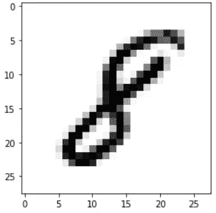
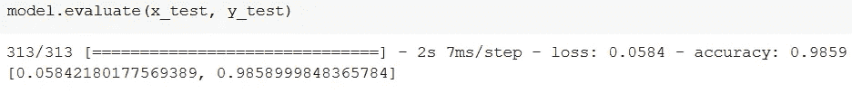
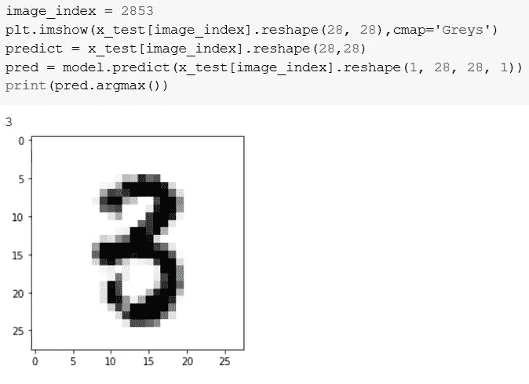

# 使用 CNN 的数字识别器

> 原文：<https://towardsdatascience.com/digit-recognizer-using-cnn-55c65ca7f9e5?source=collection_archive---------17----------------------->

## 使用 mnist 数据集建立一个简单的卷积神经网络来识别手写数字。



作者图片

**数据集:**

MNIST(“改进的国家标准和技术研究所”)是计算机视觉事实上的“Hello World”数据集。自 1999 年发布以来，这个经典的手写图像数据集已经成为基准分类算法的基础。随着新的机器学习技术的出现，MNIST 仍然是研究人员和学习者的可靠资源。

**数据处理:**

```
import tensorflow as tf
(x_train, y_train), (x_test, y_test) = tf.keras.datasets.mnist.load_data()
```

数据集包含 60，000 个训练图像和 10000 个测试图像。在这里，我将数据分别分为训练数据集和测试数据集。x_train & x_test 包含灰度代码，而 y_test & y_train 包含代表数字的从 0 到 9 的标签。

当您检查数据集的形状以查看它是否适用于 CNN 时。您可以看到我们将(60000，28，28)作为我们的结果，这意味着我们的数据集中有 60000 张图像，每张图像的大小为 28 * 28 像素。

要使用 Keras API，我们需要一个 4 维数组，但从上面可以看到，我们有一个 3 维 numpy 数组。

```
x_train = x_train.reshape(x_train.shape[0], 28, 28, 1)
x_test = x_test.reshape(x_test.shape[0], 28, 28, 1)
input_shape = (28, 28, 1)
```

因此，这里我们将三维 numpy 数组转换为四维数组，在我们将类型设置为 float 后，除法运算后会有浮点值。

```
x_train = x_train.astype('float32')
x_test = x_test.astype('float32')
```

现在到了正常化的部分，我们总是会在我们的神经网络中这样做。方法是将其除以 255(最大 RGB 码减去最小 RGB 码)。

```
x_train /= 255
x_test /= 255
```

**建立模型:**

```
from tensorflow.keras.models import Sequential
from tensorflow.keras.layers import Dense, Conv2D, Dropout, Flatten, MaxPooling2D
model = Sequential()
model.add(Conv2D(28, kernel_size=(3,3), input_shape=input_shape))
model.add(MaxPooling2D(pool_size=(2, 2)))
model.add(Flatten())
model.add(Dense(128, activation=tf.nn.relu))
model.add(Dropout(0.2))
model.add(Dense(10,activation=tf.nn.softmax))
```

我使用 Keras API 来构建模型，因此我有一个 Tensorflow 背景。我从 Keras 导入顺序模型，并添加 Conv2D、MaxPooling、Flatten、Dropout 和 Dense 层。

丢弃层通过在训练时忽略一些神经元来对抗过度拟合，而展平层在构建完全连接的层之前将 2D 阵列展平为 1D 阵列。

**编译和拟合模型:**

到目前为止，我们已经创建了一个非优化的空 CNN。然后，我设置了一个具有给定损失函数的优化器，该函数使用一个指标，并通过使用我们的训练数据来拟合模型。据说 ADAM 优化器比其他优化器更好，这就是我使用它的原因。

```
model.compile(optimizer='adam', loss='sparse_categorical_crossentropy', metrics=['accuracy'])
model.fit(x=x_train,y=y_train, epochs=10)
```

在这里，我们仅用 10 个历元就获得了相当高的精度。由于数据集不需要很强的计算能力，所以你可以随意调整时段的数量，也可以随意调整优化器、损失函数和指标。

**模型评估:**

```
model.evaluate(x_test, y_test)
```

当评估该模型时，我们看到仅 10 个时期就以非常低的损失给出了 98.59%的准确度。



现在来验证它的预测:

```
image_index = 2853
plt.imshow(x_test[image_index].reshape(28, 28),cmap='Greys')
predict = x_test[image_index].reshape(28,28)
pred = model.predict(x_test[image_index].reshape(1, 28, 28, 1))
print(pred.argmax())
```

在这里，我们选择一个图像并运行它来获得预测，然后显示图像和预测，看看它是否准确。



作者图片

这就是你如何建立和实现一个简单的卷积神经网络。您可以将这个概念实现到各种不同类型的分类和其他类似的实现中。用你在什么上实现了这个概念来回应这篇文章。