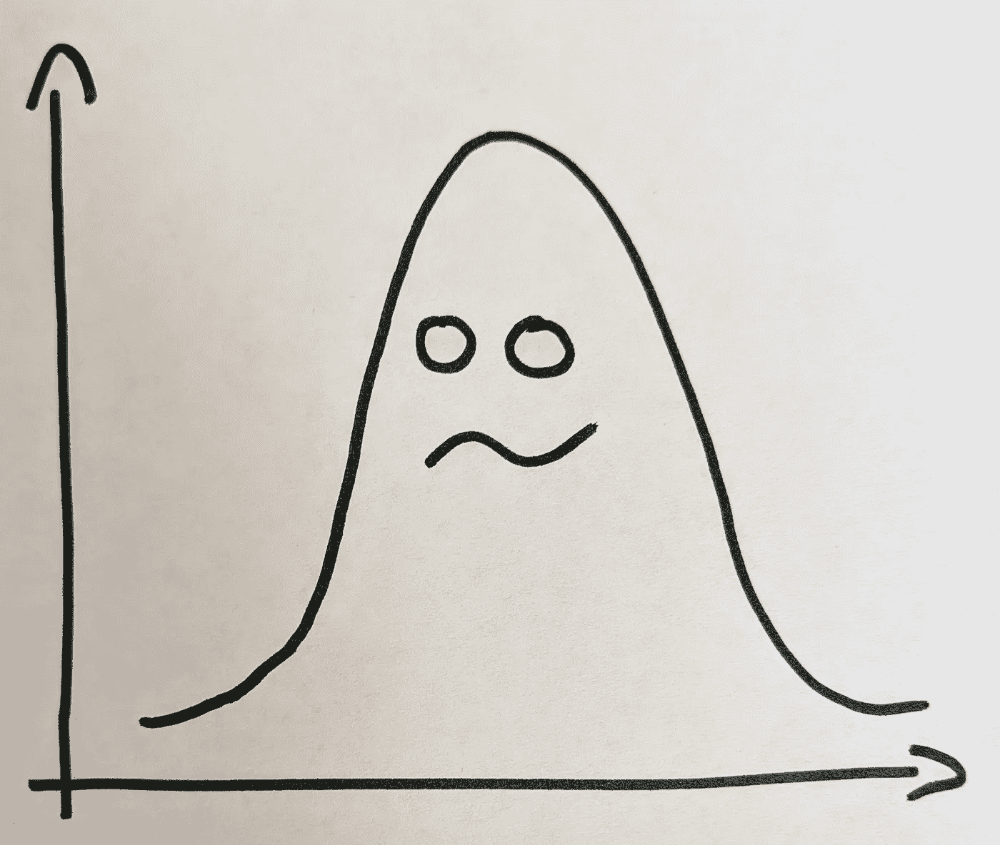
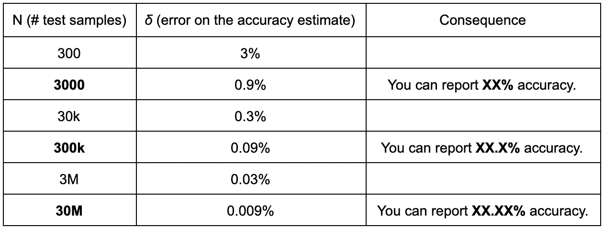

# 机器学习中的数字意义

> 原文：<https://towardsdatascience.com/digit-significance-in-machine-learning-dea05dd6b85b?source=collection_archive---------32----------------------->

## 追逐统计幽灵的终结

唉，机器学习中报告性能指标的标准很少被讨论。由于在这个主题上似乎没有一个明确的、广泛共享的协议，我认为提供我一直倡导的标准可能是有趣的，并且我试图尽可能地遵循这个标准。它来源于一个简单的前提，这个前提从中学开始就被我的科学老师灌输给我了:

> 科学报道的一般规则是，你写下的每一个数字都应该是“真实的”，不管“真实”的定义是什么。

让我们来看看这对统计量(比如测试性能)意味着什么。当你在科学出版物上写下以下陈述时:

> 测试准确率为 52.34%。

你说，就你所知，你的模型在从测试分布中提取的看不见的数据上成功的概率在 0.52335 和 0.52345 之间。

> 这是一个非常强烈的声明。

假设您的测试集由从正确的测试分布中抽取的 *N* 个样本组成。成功次数为 *s* 。成功率可以表示为一个二项式变量，它的平均概率 *p* 由样本均值估计:*p*≅*s*/*n*

其标准差为:*σ*=√*p*(1-*p*)

当 *p* = 0.5 时，其被限制在 0.5 以上。

在正态近似下，估计量的标准差为:*δ*=*σ*/√*N*

精度估计上的这个误差 *δ* 看起来是这样的，**在大约 50%精度的最坏情况下**:

换句话说，为了有把握地报告上面例子的 52.34%的准确性，您的测试集的大小应该至少在 3000 万样本的数量级！这种粗略的分析很容易转化为除准确性之外的任何可计数的量，尽管不能转化为像可能性或困惑这样的连续数字。

以下是一些常见机器学习数据集的插图:

在 ImageNet 上可以合理地报告多少位数的准确度？准确率在 80%左右，测试集为 15 万张图片:

√( 0.8 * 0.2/150000)=**0.103%**

也就是说你可以*差点*举报 XX。X%的数字，实际上每个人都这样做。

MNIST 怎么样，准确率在 99%以内

√( 0.99 * 0.01/10000)=**0.099%**

pf first，报 XX 就可以了。X%也是！

然而，最大的警告是，在大多数情况下，*性能数据不是孤立地*报告的，而是用于在**相同的**测试集上比较多种方法。在这种情况下，实验的两臂之间的采样差异相互抵消，即使样本量更小，它们之间的**差异**也可能具有统计学意义。估计图形方差的一个简单方法是进行自举重采样。一个更加严格的测试包括进行[成对差异测试](https://en.wikipedia.org/wiki/Paired_difference_test)或者更一般的[方差分析](https://en.wikipedia.org/wiki/Analysis_of_variance)。

报告超出其内在精度的数字可能很有诱惑力，因为性能数字往往在基线比较的上下文中更有意义，或者当人们认为测试集是固定的*而不是从测试分布中抽取的样本时。当在生产中部署模型时，这是一个导致惊奇的实践，突然固定的测试集假设消失了，伴随着无关紧要的改进。更一般地说，这是一种直接导致过度适应测试集的实践。*

那么，在我们的领域中，一个数字为“真”意味着什么呢？嗯，这很复杂。对于工程师来说，很容易认为尺寸不应超过公差。或者对物理学家来说，物理量不应该超过测量误差。对于机器学习实践者来说，我们不仅要应对测试集的采样不确定性，还要应对独立训练运行、不同初始化和训练数据混洗下的模型不确定性。

按照这个标准，很难确定机器学习中哪些数字是“真”的。解药当然是**尽可能报告置信区间**。置信区间是一种更精细的报告不确定性的方式，可以考虑所有的随机性来源，以及简单方差之外的显著性测试。它们的出现也向你的读者发出信号，表明你已经考虑了你所报告的内容的意义，而不仅仅是你的代码所给出的数字。正如这篇博文所解释的，一个用置信区间表示的数字可以被报告为超过其标称精度，尽管要小心，你现在不得不考虑用多少位数字来报告不确定性。一路都是乌龟。

> 更少的数字意味着更少的混乱和更好的科学。

**避免报告超出统计意义的数字，**除非你为它们提供明确的置信区间。这可以被认为是科学上的不当行为，尤其是在缺乏配对显著性检验的情况下，用来论证一个数字比另一个数字更好的时候。仅凭这一点，论文通常会被拒绝。总是**怀疑用大量数字**报告的数字的准确性是一个健康的习惯。请记住，在最坏的情况下，作为“气味测试”，统计显著性所需的样本数有 3000、300k 和 30M 的经验法则限制它将使你免于追逐统计幽灵。

*(感谢为本文早期版本提供宝贵意见的许多同事。)*