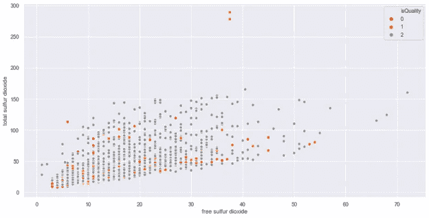
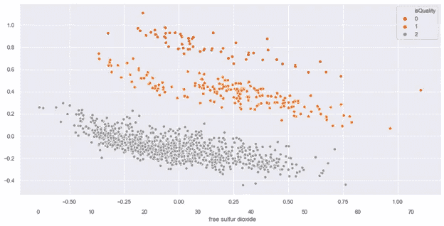
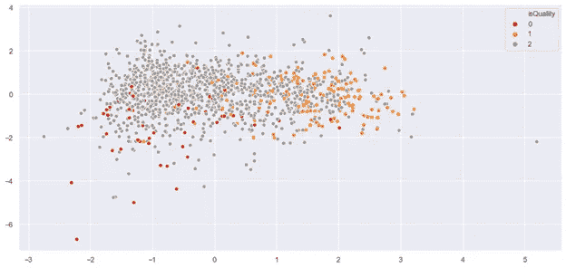
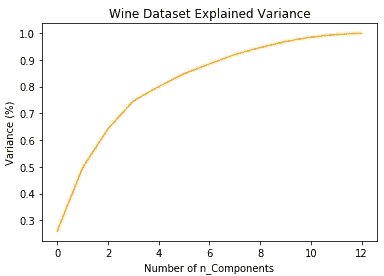

# 降维方法

> 原文：<https://towardsdatascience.com/dimensionality-reduction-approaches-8547c4c44334?source=collection_archive---------27----------------------->

## **获取主要变量的方法，以更好地表示数据，提高效率，节省时间。**


2019 年 12 月 30 日，普雷纳·辛格，金斯敦。

大数据的全面爆发让我们相信还有更多的东西。当然，虽然大量的训练数据允许机器学习模型学习更多的规则并更好地概括新数据，但不加选择地引入低质量的数据和输入特征可能会引入太多的噪声，同时大大降低训练速度，这也是事实。此外，如果数据集包含大量数据列，那么最好查看这些数据要素中有多少对模型真正有用。

在机器学习中，我们倾向于在一开始添加尽可能多的特征，以抓住有用的指标，获得更准确的结果。然而，随着元素数量的增加，模型的输出将在某个级别后减少。这种现象通常被称为“维数灾难”。

维数灾难之所以存在，是因为随着维数的增加，样本的密度呈指数下降。如果我们继续增加特征而不增加训练样本的数量，特征空间的维度将会扩大，变得越来越稀疏。由于这种稀疏性，机器学习模型找到很可能导致过拟合的正确解决方案变得简单得多。当模型过于接近一组特定的数据并且不能很好地概括时，就会发生过度拟合。

然而，我们能否克服维数灾难，避免过度拟合，特别是当我们有很多特征而训练样本相对较少的时候？一种常见的方法是降低特征空间的维数。降维是通过获得主要特征的集合来考虑降维函数空间的方法。降维可以进一步分为特征的收集和特征的提取。

特征的选择试图挑选原始特征的子集用于机器学习模型。这样，我们可以删除冗余和过时的特征，而不会导致太多的信息损失。特征的提取也称为特征的投影。虽然特征的选择返回原始特征的子集，但是特征的提取通过将数据投影到高维空间中的较小维度的空间来创建新的特征。也可以从该方法中提取信息和非冗余功能。

我们可以一起使用特征的选择和特征的提取。除了减少过度拟合和冗余，维度的减少还导致更好的人类解释和模型简化的更低计算成本。

# 降维的优势

1.  它减少了所需的时间和存储空间。
2.  多重共线性的去除改善了机器学习模型的参数的解释。
3.  当数据降低到非常低的维度时，如 2D 或 3D，将变得更容易可视化。
4.  降低空间复杂度。
5.  更容易理解，因为它消除了噪音，从而提供了一个更简单的解释。
6.  以减轻“维数灾难”。

我们讨论了降维的好处，并概述了降维要求。我们现在将详细讨论降维的两个关键技术，即

1.  主成分分析
2.  线性判别分析

例如，将使用来自 UCI 机器学习知识库的参考文献、葡萄酒数据集。该数据集相当小，具有六个目标类别和十一个维度的特征集(即十一个不同的特征，如固定酸度、pH 值、酒精含量等，以预测葡萄酒的质量)。

可以通过下面的链接下载数据集。[https://github . com/psi49/revising _ machine learning/blob/master/wine quality _ red . CSV](https://github.com/psi49/Revisiting_MachineLearning/blob/master/winequality_red.csv)

# PCA 概念是如何工作的？

主成分分析(PCA)是一种无监督的学习算法，因为它忽略了使数据集中的方差最大化的类别标签(所谓的主成分)，以找到方向。换句话说，PCA 基本上是数据的汇总。例如，为了获得葡萄酒的质量/类型，我们可以使用葡萄酒的不同特征，例如其 pH 值、酒精含量、葡萄酒的颜色、酸度含量等，然而，这些特征中的许多将是冗余的或虚拟的特征变量(可以从其他特征中导出)，因此导致在不必要的特征上训练模型。简而言之，我们可以用更少的特征变量得到葡萄酒的类型，这实际上是 PCA 在盒子里做的。

请注意，PCA 不会选择一组特征并丢弃其他特征，而是推断出一些新的特征，这些新的特征从现有的特征中最好地描述了类别的类型(在我们的例子中是葡萄酒的类型)。

以前，在推导正式定义时，我们提出了一个短语—最大化数据集中的方差。现在问题来了——“方差”这个词和 PCA 有什么关系？记住，我们的主要任务是定义一个特征集来区分不同类型的酒。想象一下，你得到了一组不能区分酒的种类的特征，因此，这些特征是没有用的。这种类型的降维会降低模型的准确性，有时会导致数据拟合不足。因此，主成分分析寻找尽可能显示数据集差异的属性。

PCA 对协方差矩阵的特征向量和特征值起作用，这相当于将那些直的主成分线拟合到数据的方差。为什么？因为 PCA 确定数据集中被称为主成分的方差线，其中第一主成分具有最大方差，第二主成分具有第二最大方差，等等。

现在让我们以葡萄酒数据集为例，使用 sklearn 来实现 PCA，并理解数据是如何从高维度转换到低维度的。

让我们对葡萄酒数据集执行 PCA，并通过可视化表示进行分析:

```
import numpy as np
import pandas as pd
df=pd.read_csv(‘winequality_red.csv’)
def isQuality(quality):
if quality > 6:
     return 1
if (quality >= 5) and (quality <= 6):
     return 2
else:
   return 0
```

给定的数据有六种不同的质量类型。为了理解降维概念。葡萄酒的质量分为三个目标等级，如果你愿意，你也可以分为六个目标等级。

让我们用上面的函数转换成三个葡萄酒质量等级。

```
df[‘isQuality’] = df[‘quality’].apply(isQuality)
print(‘New classes are defined for the quality of wines:\n’,df[‘isQuality’].value_counts())
```

新的葡萄酒质量等级定义如下:

第二类: 1319

**第一类:** 217

**第 0 类:** 63

从数据集中删除 quality 列，因为我们已经创建了一个包含三个葡萄酒质量等级的新列。

```
df=df.drop(‘quality’, axis=1)
```

将数据分为要素和目标类。

```
feature=df.iloc[:,0:11]
target=df[‘isQuality’]
print(feature.shape)
print(target.shape)
```

特征和目标列的形状。

(1599, 11)

(1599,1)

使用 sklearn 的 train_test_split 函数将数据拆分为 train 和 test。

```
from sklearn.model_selection import train_test_split
X_train, X_test, y_train, y_test = train_test_split(feature, target, test_size = 0.2, random_state = 42)
```

**缩放数据集**

缩放数据集-可以使用最小-最大归一化来缩放具有平均值零和单位标准差的数据集。

该估计器单独缩放和转换每个特征，使得它在数据集上的给定范围内，例如在 0 和 1 之间。

```
from sklearn.preprocessing import MinMaxScaler
scaler = MinMaxScaler()
X_train=scaler.fit(X_train).transform(X_train)
X_test=scaler.fit(X_test).transform(X_test)
```

在 sklearn 中应用内置 PCA 功能的 PCA:

```
from sklearn.decomposition import PCA
pca = PCA(n_components=2)
X_train = pca.fit(X_train).transform(X_train)
X_test= pca.fit(X_test).transform(X_test)
```

这里，特征是训练数据集，n_component 是我们想要从现有特征集中导出的 PCA 分量的数量。

因此，使用 sklearn，PCA 就像一个黑盒(如上所述)，您给定一个缩放的特征集作为 sklearn PCA 的输入，并获得 PCA 分量作为输出，它可以用作数据训练算法的输入。对于 PCA 算法，在我们找到主成分之前，有必要执行数据缩放。

**训练算法**

在这里，我们将使用一个简单的逻辑回归工具来训练主成分，以解决这个分类问题。为此，请执行以下代码:

```
from sklearn.linear_model import LogisticRegression
clf = LogisticRegression(random_state = 0)
clf.fit(X_train, y_train)
y_pred = clf.predict(X_test)# Predicting the test set result using. Predict function under Random Forest Classifier
y_pred = clf.predict(X_test)
```

**评估算法**

对于分类问题，用于评估算法的度量是准确度、混淆矩阵、精确度、召回率和 F1 值。执行以下脚本来查找这些值:

```
from sklearn.metrics import classification_report, confusion_matrix, accuracy_score
print(confusion_matrix(y_test,y_pred))
print(classification_report(y_test,y_pred))
print(accuracy_score(y_test, y_pred))
```

输出将如下所示:


仅使用原始数据集中 11 个特征中的两个特征集，我们就获得了 84.06%的准确度。我不认为这太糟糕。使用逻辑回归模型的超参数优化或使用 sklearn 库中的一些其他模型，可以进一步提高模型精度。尝试多于 2 个且少于 6 个主成分的训练模型。使用 PCA 将是一个有趣的练习。

这里，我们将绘制两个图表，一个仅考虑 11 列中的两列，另一个绘制主成分，以了解 PCA 如何使高维数据的可视化变得容易。

```
import seaborn as sns
import matplotlib.pyplot as plt
sns.set(rc={‘figure.figsize’:(12,7)})
sns.scatterplot(x=”free sulfur dioxide”, y=”total sulfur dioxide”, hue=”isQuality”,data=df,palette=”Set1")
plt.show()
```



```
sns.scatterplot(pca_df[:,0],pca_df[:,1], hue=”isQuality”,data=df, palette=”Set1")
plt.show()
```



上图显示了使用两个特征绘制的数据点与使用主成分(基本上是我们数据集中所有特征的总结)即 PCA_1 和 PCA_ 绘制的数据点。这有助于我们识别 PCA 的另一种用途，即我们的数据集及其“质量”类别标签的适当和可分离的可视化。如果你看这个图表，你可以用两个特征变量而不是十三个特征变量来正确地显示整个数据集。虽然它们不能很好地区分葡萄酒质量等级(如二氧化硫和总二氧化硫之间的区别),但有助于以最小的信息损失减少特征集。

到目前为止，我们已经通过一些实际例子对 PCA 有了很好的理解。我们已经看到很少的组件足以训练模型，PCA 也是一个伟大的工具来减少数据维度，并给我们权力来适当地可视化数据。

让我们继续前进，深入研究另一个降维工具“线性判别分析”。我将使用相同的葡萄酒数据集来提供实践经验。

# LDA 概念是如何工作的？

线性判别式是一种降维的统计方法，它在各种类别中提供最高可能的区分度，用于机器学习以找到特征的线性组合，这可以以最佳性能分离两个或更多类别的对象。该方法基于判别函数，这些判别函数是基于称为训练集的一组数据来估计的。这些判别函数相对于特征向量是线性的。

LDA 的目标是在假设每一类中的数据由具有相同协方差的高斯概率密度函数描述的情况下，通过线性判别函数来最大化类间方差和最小化类内方差。

理解 LDA 背后的数学是很好的，但我不想压倒任何人。我们将通过保持事情的简单来理解，这样对任何人来说都很容易遵循。

LDA 帮助你找到类簇的边界。这将您的数据点投影到一条直线上，以便尽可能地区分聚类，每个聚类与质心的距离相对较近。

因此，问题出现了——如何识别这些聚类，我们如何得到 LDA 的精简特征集？

基本上，LDA 考虑每个类的数据点的质心。例如，对于 11 个不同的要素，LDA 将使用 11 个不同的要素数据集来查找每个类的质心。基于这一点，它现在定义了一个新的维度，它只不过是一个满足两个要求的轴。

1.  最大化每个类质心之间的距离。
2.  最小化每组内的方差(LDA 称之为散点，用 s2 表示)。

因此，本质是(平均值 a —平均值 b)/(平均值 a —平均值 b)

(mean_a — mean_b) =理想的大(S_a — S_b) =理想的小

这里的意思无非是类质心。方差只不过是数据在平面上的分布。因此，如果数据差异很小，则类之间的重叠会更少，并且不同类之间的总体区别会得到保留。

因此，无论新轴的哪个坐标满足这两个条件，它们都会形成新的数据集维度。

现在让我们跳到在 wine 数据集上使用 sklearn 实现 LDA，看看数据是如何从高维度过渡到低维度的。

让我们对葡萄酒数据集执行 LDA 并进行图形分析:

所有必要的库都已经导入，让我们用 sklearn 中内置的 LDA 函数导入 LDA。

```
from sklearn.discriminant_analysis import LinearDiscriminantAnalysis as LDA
lda = LDA(n_components=2)
lda_df = lda.fit(feature, target).transform(feature)
sns.scatterplot(lda_df[:,0],lda_df[:,1], hue=”isQuality”,data=df, palette=”Set1")
plt.show()
```

注意:我想澄清的是，像(标准化)这样的特征缩放不会改变 LDA 的整体结果，因此是可选的。



在主成分分析图中，您可以可视化整个数据集，正确区分不同的类。而在 LDA 图中，由于类别的不均匀分布，类别不是明显可分的。这是 PCA 和 LDA 的主要区别。

总的来说，PCA 在每类样本较少的情况下表现更好。在这个葡萄酒数据集中，我们有高计数的类别 2 (1319)，其次是类别 1 (217)，最后是类别 0 (63)。

虽然 LDA 在处理大的多类数据集时效果更好，其中类的可分性是降维时的一个重要因素。

一般的 LDA 方法非常类似于主成分分析，但是除了找到使我们的数据的方差最大化的成分轴(PCA)之外，我们还对使多个类别之间的分离最大化的轴(LDA)感兴趣。

最后，我们来看看如何在 sklearn 内部选择降维方法中 n_components 的个数。简单的方法是使用 explained_variance_ratio_ 并绘制图表，以查看我们需要多少组件来保留新功能集的方差。让我们通过这样做来理解

```
scaler_df=scaler.fit(df).transform(df)pca = PCA().fit(scaler_df)
plt.figure()
plt.plot(np.cumsum(pca.explained_variance_ratio_))
plt.xlabel(‘Number of n_Components’)
plt.ylabel(‘Variance (%)’) #for each component present in the dataset
plt.title(‘Wine Dataset Explained Variance’)
plt.show()
plt.ylabel(‘Variance (%)’) #for each component present in the dataset
plt.title(‘Wine Dataset Explained Variance’)
plt.show()
```



这张图告诉我们，选择 8 个成分，我们可以保留葡萄酒数据总方差的 90 %以上。这是有意义的，我们不会使用 100%的方差，因为它表示所有的成分，我们只需要主要的成分。

现在，通过使用 n_components=8，我们可以执行相同的分析并训练任何模型。值得一玩。用于机器学习的高级 Python 库实际上使学习变得非常容易，不像早期我们必须从头开始硬编码。

祝你好运！