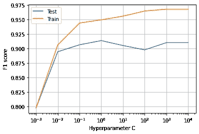
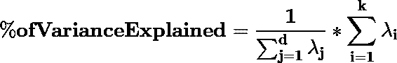
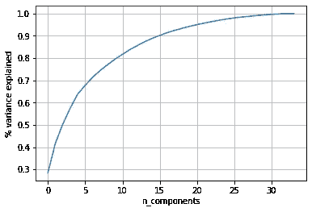
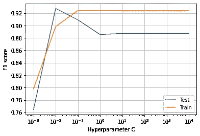
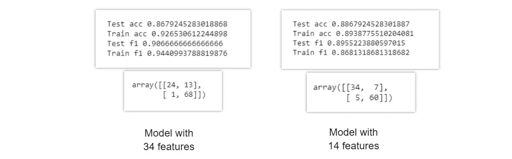
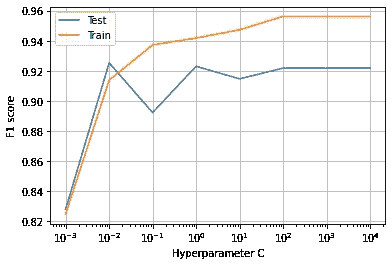
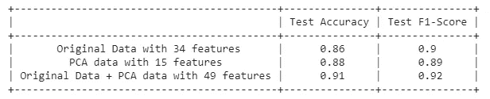
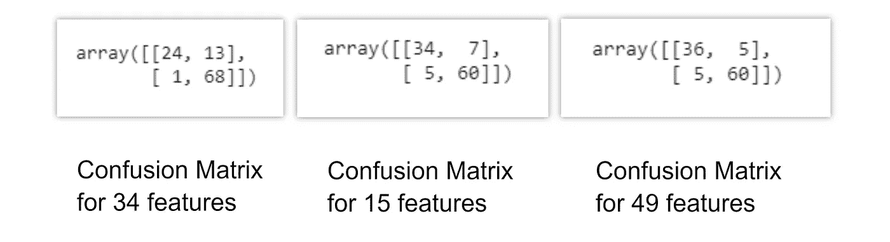

# 降维——主成分分析能提高分类模型的性能吗？

> 原文：<https://towardsdatascience.com/dimensionality-reduction-can-pca-improve-the-performance-of-a-classification-model-d4e34194c544?source=collection_archive---------44----------------------->

## 利用 PCA——降维技术提高 ML 模型的性能


奥拉夫·阿伦斯·罗特内在 [Unsplash](https://unsplash.com?utm_source=medium&utm_medium=referral) 上的照片

## 什么是 PCA？

主成分分析(PCA)是数据科学中一种常见的特征提取技术，它采用矩阵分解将数据的维度降低到较低的空间。

在现实世界的数据集中，数据中通常有太多的要素。要素数量越多，数据的可视化和处理就越困难。有时大多数特征是相关的，因此是多余的。因此，特征提取开始发挥作用。

## 关于数据:

本文使用的数据集是来自 UCI 机器学习知识库的[电离层数据集。这是一个二元分类问题。有 351 个观察值和 34 个特征。](https://archive.ics.uci.edu/ml/datasets/Ionosphere)

## 准备数据集:

*   导入必要的库并读取数据集
*   数据集预处理
*   标准化

(作者代码)

## 使用全部 34 个特征的逻辑回归 ML 模型:

训练数据有 34 个特征。

*   在对数据进行预处理后，使用逻辑回归算法对训练数据进行二值分类训练
*   微调逻辑回归模型以找到最佳参数
*   计算训练和测试准确度以及 f1 分数。



(图片由作者提供)，34 个特征数据集的逻辑回归模型的 C 与 F1 得分图

*   使用 c=10**0 的 34 个特征训练 LR 模型
*   计算训练和测试准确度以及 f1 分数


(图片由作者提供)，训练测试准确性和 F1 分数，混淆矩阵

通过训练具有 34 个特征的整个“X_train”数据获得的结果，

> 测试 f1 分数为 0.90，因为在混淆矩阵中观察到 14 个值被错误分类。

(作者代码)

## 使用主成分分析的特征提取；

为了使用 PCA 技术从数据集中提取特征，首先我们需要找到解释为维度减少的方差百分比。



```
Notations,
**λ:** eigenvalue **d:** number of dimension of original dataset
**k:** number of dimensions of new feature space
```



(图片由作者提供)，解释的方差百分比与维度数量的关系图

*   从上面的图中可以看出，对于 15 个维度，解释的方差百分比为 90%。这意味着我们通过将较高的维度(34)投影到较低的空间(15)来保留 90%的方差。

(作者代码)

## 使用 PCA 的前 15 个特征训练逻辑回归 ML 模型:

现在 PCA 降维后的训练数据有 15 个特征。

*   在对数据进行预处理后，使用逻辑回归算法对训练数据进行二值分类训练
*   微调逻辑回归模型以找到最佳参数
*   计算训练和测试准确度以及 f1 分数。



(图片由作者提供)，15 个特征数据集的逻辑回归模型的 C 与 F1 分数的关系图

*   使用 c=10**0 的 15 个特征训练 LR 模型
*   计算训练和测试准确度以及 f1 分数


(图片由作者提供)，训练测试准确性和 F1 分数，混淆矩阵

通过用 15 个特征训练 PCA 数据获得的结果，

> 测试 f1 分数为 0.896，因为混淆矩阵中观察到 12 个值被错误分类。

## 比较上述两种模型的结果:



(图片由作者提供)，训练测试准确性和 F1 分数，混淆矩阵

(作者代码)

## 使用原始数据+来自 PCA 的数据训练 LR 模型:

在连接具有 34 个特征的原始数据和具有 15 个特征的 PCA 数据之后，我们形成了具有 49 个特征的数据集。

*   在对数据进行预处理后，使用逻辑回归算法对训练数据进行二值分类训练
*   微调逻辑回归模型以找到最佳参数
*   计算训练和测试准确度以及 f1 分数。



(图片由作者提供)，49 个特征数据集的逻辑回归模型的 C 与 F1 得分图

*   使用 c=10**0 的 15 个特征训练 LR 模型
*   计算训练和测试准确度以及 f1 分数


(图片由作者提供)，训练测试准确性和 F1 分数，混淆矩阵

(作者代码)

## 从上述结果得出的结论:



(图片由作者提供)，上述三种模型的准确度和 F1 得分结果

从上表中，我们可以观察到，

*   使用具有 34 个特征的原始预处理数据集训练的 LR 模型，我们得到 90%的 F1 分数。
*   使用 PCA 仅用提取的 15 个特征训练的 LR 模型，我们得到 89%的 F1 分数。
*   用上述两个数据的组合训练的 LR 模型，我们得到 92%的 F1 分数。

让我们观察上述 3 个模型的混淆矩阵结果的变化。



(图片由作者提供)，上述三种模型的混淆矩阵

因此，我们得出结论，仅使用 PCA 提取的特征，仅使用来自原始数据的 50%数量的特征，我们得到少 1%的 F1 分数。但是，如果我们将两个数据结合起来，我们将改进 2%的指标，以获得 91%的最终 F1 分数。

**点击下方获取代码:**

[](https://colab.research.google.com/drive/1hH5vJHNgCXohWhT5GXh5jzCasDtVxGHF?usp=sharing) [## 谷歌联合实验室

### 编辑描述

colab.research.google.com](https://colab.research.google.com/drive/1hH5vJHNgCXohWhT5GXh5jzCasDtVxGHF?usp=sharing) 

> 感谢您的阅读