# 数据可视化的降维:主成分分析与 TSNE、UMAP 和线性判别分析

> 原文：<https://towardsdatascience.com/dimensionality-reduction-for-data-visualization-pca-vs-tsne-vs-umap-be4aa7b1cb29?source=collection_archive---------1----------------------->

## 使用 PCA、TSNE、UMAP 和 LDA 在 2D 和 3D 中可视化高维数据集


照片由 [Unsplash](https://unsplash.com/s/photos/wall?utm_source=unsplash&utm_medium=referral&utm_content=creditCopyText) 上的 [Hin Bong Yeung](https://unsplash.com/@hinbong?utm_source=unsplash&utm_medium=referral&utm_content=creditCopyText) 拍摄

在这个故事中，我们将介绍三种专门用于*数据可视化* : **PCA、t-SNE、LDA 和 UMAP 的降维技术。**我们将使用*手语 MNIST 数据集*来详细探索它们，而不是深入研究算法背后的数学。

# **什么是降维？**

许多机器学习问题涉及成千上万个特征，拥有如此大量的特征会带来许多问题，最重要的是:

*   *使训练极其缓慢*
*   *很难找到好的解决方案*

这就是所谓的 ***维数灾难*** 简而言之，降维就是将特征的数量减少到最相关的数量的过程。

降低维数确实会丢失一些信息，但是大多数压缩过程都会有一些缺点，即使我们训练得更快，我们也会使系统性能稍差，但这没关系！“有时降低维度可以过滤掉一些存在的噪音和一些不必要的细节”。

大多数降维应用用于:

*   **数据压缩**
*   **降噪**
*   **数据分类**
*   **数据可视化**

降维最重要的一个方面，就是 ***数据可视化。***

## 降维的主要方法

降维的两种主要方法:**投影**和**流形学习。**

*   ****流形学习:**许多降维算法通过对训练实例所在的流形进行建模来工作；这叫做*流形学习*。它依赖于流形假设或假设，*认为大多数真实世界的高维数据集都接近一个低得多的维流形，*这种假设在大多数情况下是基于观察或经验，而不是理论或纯逻辑。[4]**

**现在，在开始解决用例之前，让我们简要地解释一下这三种技术。**

# **主成分分析**

**最著名的降维“无监督”算法之一是 PCA(主成分分析)。**

> **其工作原理是识别最接近数据的超平面，然后将数据投影到该超平面上，同时保留数据集中的大部分变化。**

## **主成分**

**解释训练集中最大方差的轴称为 ***主成分*** 。**

**与该轴正交的轴称为**第二主分量**。当我们追求更高的维度时，主成分分析会找到与其他两个分量正交的第三个分量，以此类推，为了可视化的目的，我们总是坚持 2 个或最多 3 个主分量。**

**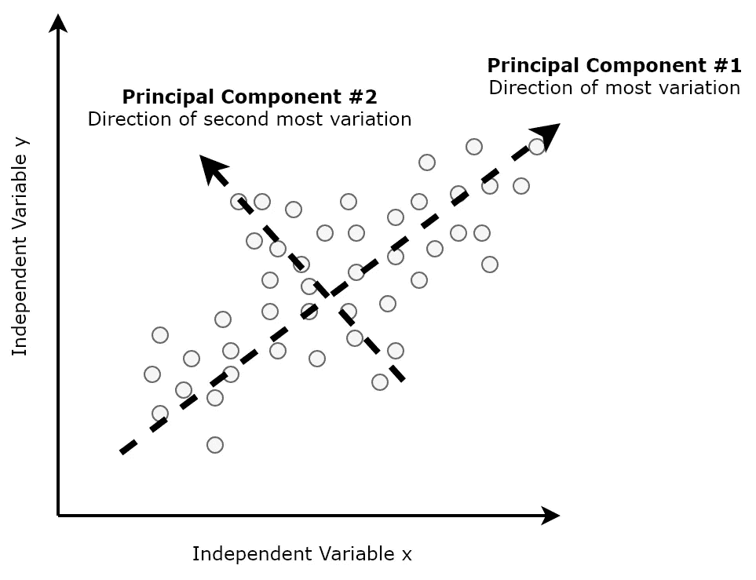**

**来源:Packt_Pub，via Hackernoon**

**选择正确的超平面非常重要，这样当数据投影到超平面上时，可以获得关于原始数据如何分布的最大信息量。**

# **T-SNE(T-分布式随机邻居嵌入)**

****(t-SNE)** 或**T-分布式随机邻居嵌入**于2008 由 **(** 劳伦斯·范·德·马腾和杰弗里·辛顿)创建，用于降维，特别适合于高维数据集的可视化。**

> ****(t-SNE)** 取一个高维数据集，把它还原成一个低维图，保留了很多原始信息。它通过在二维或三维地图中给每个数据点一个位置来做到这一点。这种技术发现数据中的聚类，从而确保嵌入保留了数据中的含义。t-SNE 减少维数，同时试图保持相似的实例接近，不相似的实例分开。[2]**

**要快速了解这种技术，请参考下面的动画(它摘自西里尔·罗桑特的精彩教程，我强烈推荐看看他的精彩教程。**

**链接:[https://www . oreilly . com/content/an-illustrated-introduction-to-the-t-SNE-algorithm/](https://www.oreilly.com/content/an-illustrated-introduction-to-the-t-sne-algorithm/)**

**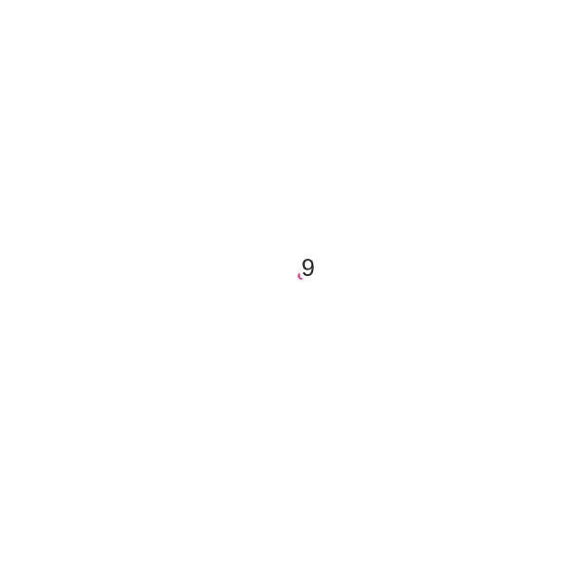**

**来源:[西里尔·罗桑特](https://www.oreilly.com/people/cyrille-rossant/)，转自奥雷利**

# ****LDA (** 线性判别分析)**

**在**模式分类的预处理步骤中，线性判别分析(LDA)是最常用的降维技术。****

> **目标是将数据集投影到具有良好类别可分性的低维空间上，以避免过拟合并降低计算成本。**

**一般的方法非常类似于 PCA，而不是找到使我们的数据方差最大化的分量轴， ***我们另外感兴趣的是使多个类之间的间隔最大化的轴***(LDA)【5】。**

**LDA 是“受监督的”并计算方向(“线性判别式”)，这些方向将代表使多个类之间的间隔最大化的轴。**

****

**来源:[https://sebastianraschka.com/Articles/2014_python_lda.html](https://sebastianraschka.com/Articles/2014_python_lda.html)**

# ****UMAP(均匀流形近似和投影)****

**由 **(** [利兰·麦金尼斯](https://arxiv.org/search/stat?searchtype=author&query=McInnes%2C+L)、[约翰·希利](https://arxiv.org/search/stat?searchtype=author&query=Healy%2C+J)、[詹姆斯·梅尔维尔](https://arxiv.org/search/stat?searchtype=author&query=Melville%2C+J))于 2018 年创建的均匀流形逼近与投影**、T15，是一种通用的流形学习与降维算法。****

> **UMAP 是一种 ***非线性*** 降维方法，对于可视化聚类或**组数据点及其相对邻近度**非常有效。**

**与 TSNE 的显著区别是**可伸缩性**，它可以直接应用于稀疏矩阵，从而无需应用任何维数缩减，如 *s* PCA 或截断 SVD(奇异值分解)作为之前的预处理步骤*。*【1】**

**简而言之，它类似于 t-SNE，但可能具有更高的处理速度，因此，更快，可能更好的可视化。(让我们在下面的教程中找出答案)**

# **用例**

**现在，我们将浏览上述所有三种技术都将被应用的用例:具体来说，我们将尝试使用这些技术来可视化一个高维数据集:T ***何手语-MNIST*** 数据集:**

**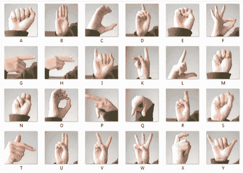**

**(手语-MNIST 数据集)，截图自 kaggle.com**

# **数据**

**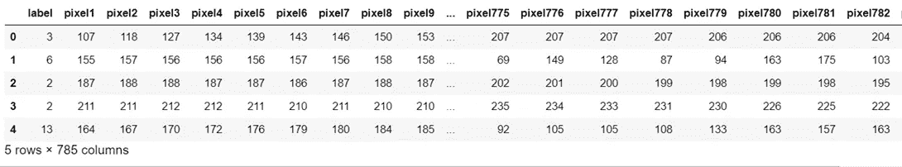******

**训练数据的大小**

**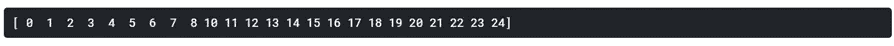**

**唯一标签的数量**

***注意:有 25 个独特的标签代表不同手语的数量。现在为了更好的可视化(“在单个可视化中观察所有 24 个类是非常困难的”)和更快的计算。我只保留前 10 个标签，省略其余的。***

## **实现绘图功能**

## ****数据标准化****

## ****实施 PCA****

**在应用 PCA 之后，与 x 数据的 784 个特征相比，数据的新维度现在只有 3 个特征。**

**维度的数量已经大幅减少，同时试图尽可能多地保留信息中的“变化”。**

# **— PCA — 2D —**

```
plot_2d(principalComponents[:, 0],principalComponents[:, 1])
```

**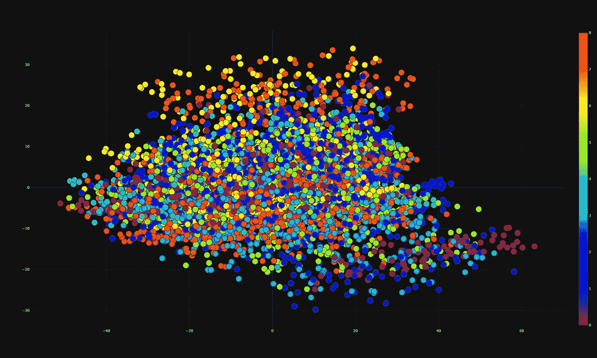**

**作者图片**

**从 2D 图中，我们可以看到这两个部分肯定包含了一些信息，尤其是特定的数字，但显然不足以将它们区分开来。**

# **— PCA— 3D —**

```
plot_3d(principalComponents[:, 0],principalComponents[:, 1],principalComponents[:, 2])
```

**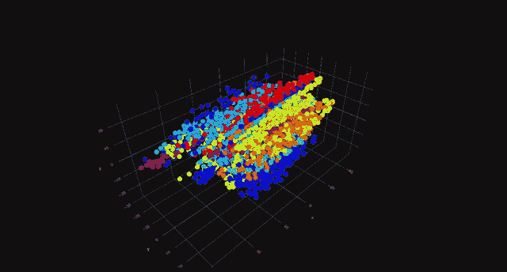**

**作者图片**

# **实施 t-SNE**

**需要注意的一点是， **t-SNE** 的计算开销非常大，因此在其文档中提到:**

***“如果特征的数量非常多，强烈建议使用另一种降维方法(例如，针对密集数据的 PCA 或针对稀疏数据的 TruncatedSVD)将维数减少到合理的数量(例如，50)。这将抑制一些噪声，并加快样本之间成对距离的计算。”[2]***

**因此，我应用了 PCA，选择保留原始数据中的 50 个主成分，以减少对更多处理能力的需求，并且如果我们考虑了原始数据，将需要时间来计算维度缩减。**

***这三种技术的速度将在以下章节中进一步详细分析和比较。***

# **— t-SNE — 2D —**

```
plot_2d(tsne[:, 0],tsne[:, 1])
```

**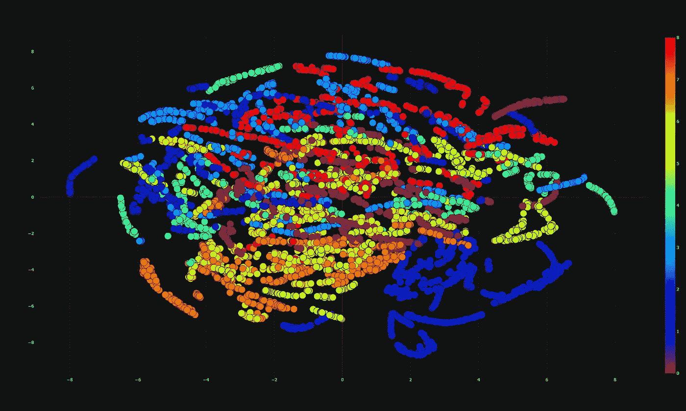**

**作者图片**

**与 PCA 2d 结果相比，我们可以清楚地看到不同聚类的存在以及它们是如何定位的。**

# **— t-SNE — 3D —**

```
plot_3d(tsne[:, 0],tsne[:, 1],tsne[:, 2])
```

**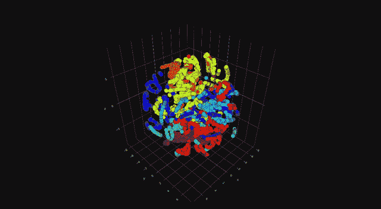**

**作者图片**

# **实施 UMAP**

**UMAP 具有不同的超参数，这些参数会对生成的嵌入产生影响:**

*   **`n_neighbors`**

**该参数控制 **UMAP** 如何平衡数据中的本地和全局结构。n _ neighbours 的低值迫使 **UMAP** 关注非常局部的结构，而较高的值将使 **UMAP** 关注较大的街区。**

*   **`min_dist`**

**该参数控制允许 **UMAP** 将点打包在一起的紧密程度。较低的值意味着这些点将紧密地聚集在一起，反之亦然。**

*   **`n_components`**

**该参数允许用户确定降维空间的维度。**

*   **`metric`**

**此参数控制如何在输入数据的环境空间中计算距离。**

**更详细的信息，我建议查阅 **UMAP** 文档[://umap-learn . readthedocs . io/en/latest/](https://umap-learn.readthedocs.io/en/latest/)**

**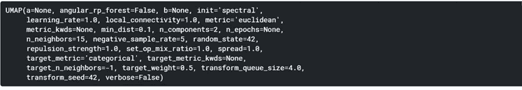**

**UMAP(默认设置)**

**对于本教程，我选择保留默认设置 ***n_components*** ，我为 3d 空间图设置为 3。最好试验不同的超参数设置，以获得算法的最佳效果。**

# **— UMAP— 2D —**

```
plot_2d(reducer.embedding_[:, 0],reducer.embedding_[:, 1])
```

**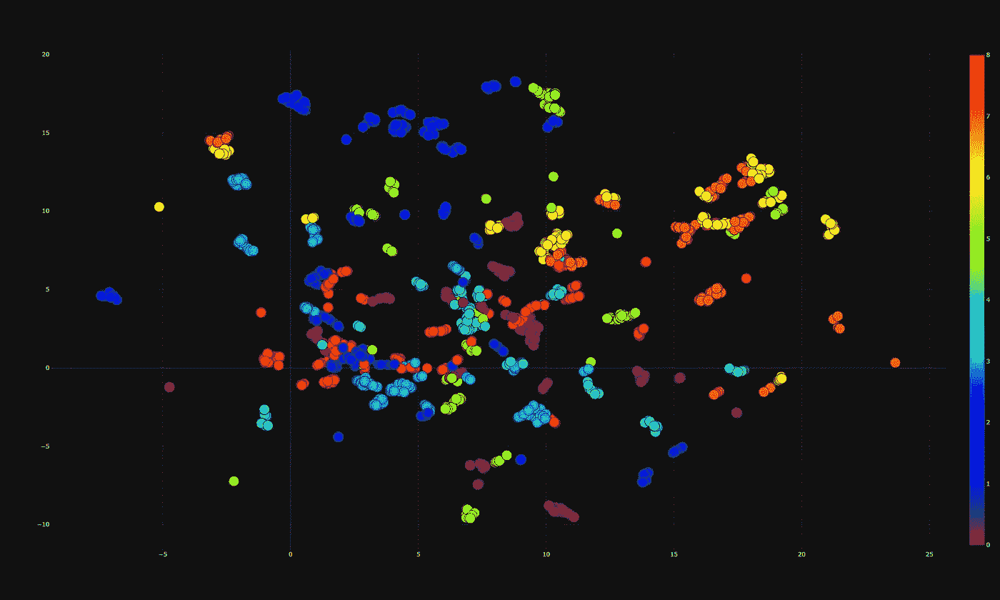**

**作者图片**

**我们可以清楚地看到，与 t-SNE 和 PCA 相比，UMAP 在分离数据点方面做得非常好。然而，从 2d 的角度来看，没有大的聚类充分地分隔符号，在其他部分也有相似的数据点聚集在一起。**

# **— UMAP— 3D —**

```
plot_3d(reducer.embedding_[:, 0],reducer.embedding_[:, 1],reducer.embedding_[:, 2])
```

**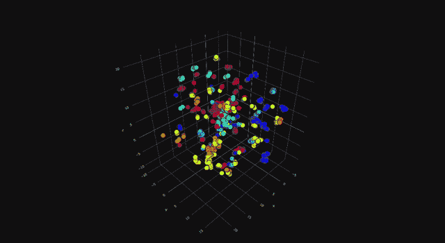**

**作者图片**

# **实施 LDA**

# **— LDA— 2D —**

```
plot_2d(X_LDA[:, 0],X_LDA[:, 1])
```

**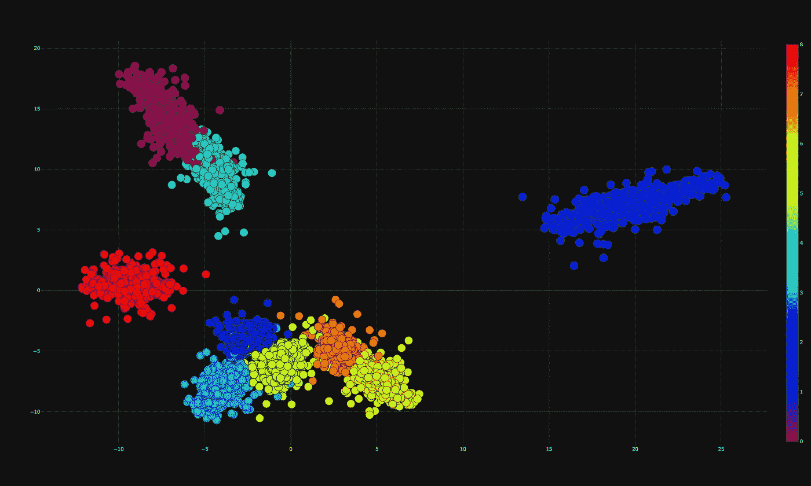**

**作者图片**

**利用 LDA，我们可以清楚地识别出这九个具有显著分离的集群的存在。如果使用 UMAP 和 SNE 霸王龙，我们几乎看不到聚类的主干，而使用 LDA，我们可以看到聚集在相同聚类区域的数据点的整个聚类。**

# **— LDA— 3D —**

```
plot_3d(X_LDA[:, 0],X_LDA[:, 1],X_LDA[:, 2])
```

**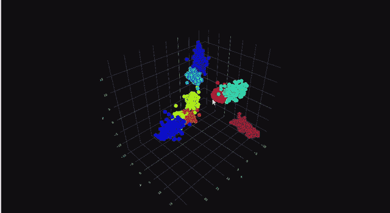**

**作者图片**

# **降维技术的比较:主成分分析 vs t-SNE vs UMAP vs LDA**

**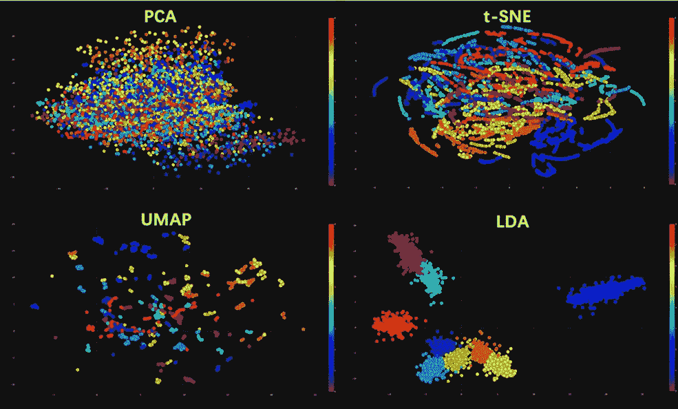**

**作者图片**

**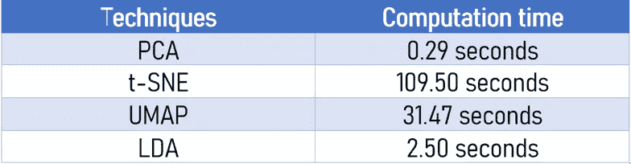**

**速度比较**

***注意:上表是考虑到 Kaggle 上使用 GPU 的内核的计算时间而构建的。***

*   **PCA 不能很好地区分这些信号。PCA 的主要缺点是受数据中异常值的影响很大。PCA 是一种**线性投影**，这意味着它不能捕捉非线性依赖关系，它的目标是找到使数据集中的方差最大化的方向(所谓的主成分)。**
*   **与 **PCA** 相比，t-SNE 在可视化集群的不同模式方面做得更好(它试图保持拓扑邻域结构)。相似的标签被聚集在一起，即使有大量的数据点在彼此之上，当然也不足以期望聚类算法表现良好。**
*   ****UMAP** 的表现优于 **t-SNE** 和 **PCA** ，如果我们观察 2d 和 3d 图，我们可以看到被很好分离的迷你星团。这对于可视化集群或**组数据点及其相对接近度**非常有效。然而，对于这个用例来说，肯定没有好到期望一个聚类算法来区分模式。 **UMAP** 比 **t-SNE** 快得多，后者面临的另一个问题是需要*另一种降维方法优先，否则计算时间会更长。***
*   **最后， **LDA** 在各方面都超过了之前所有的技术。出色的计算时间(第二快)以及证明我们所期望的分离良好的集群。**

> **注意:LDA 比其他技术表现得更好并不奇怪，这正是我们所期望的。与 LDA 不同，PCA、TSNE 和 UMAP 是在不知道真实类别标签的情况下执行的。**

# ****总结****

**我们探索了四种用于数据可视化的降维技术:(PCA、t-SNE、UMAP、LDA)并尝试使用它们在 2d 和 3d 图中可视化高维数据集。**

> **注意:很容易陷入认为一种技术比另一种技术更好的陷阱，最终没有办法将高维数据映射到低维，同时保留整个结构，总有一种技术与另一种技术相比的质量权衡。**

**再次感谢到达这里，希望这是一个信息丰富的职位！值得你花时间。还有许多其他变体和其他用例，我强烈鼓励您探索这一令人惊叹且发展良好的科学领域。**

# **参考**

**[1]麦金尼斯和希利(2018 年)。UMAP:一致流形逼近和降维投影。ArXiv 电子印花。**

**[2]范德马滕，l . j . p . t-分布式随机邻居嵌入**

**[](https://lvdmaaten.github.io/tsne/) [## t-SNE

### t 分布随机近邻嵌入(t-SNE)是一种降维技术，特别适用于

lvd maten . github . io](https://lvdmaaten.github.io/tsne/) 

[3]Kaggle.com. 2020。与 T-SNE 一起观想卡纳达语 MNIST。可在:[https://www . ka ggle . com/parulpandey/visualizing-kannada-Mn ist-with-t-SNE](https://www.kaggle.com/parulpandey/visualizing-kannada-mnist-with-t-sne)获取

[4]通过 Scikit-Learn、Keras & Tensorflow 实践机器学习，作者 Aurelien Geron

[5]https://sebastianraschka.com/Articles/2014_python_lda.html**