# 降维取证

> 原文：<https://towardsdatascience.com/dimensionality-reduction-forensics-50014430767f?source=collection_archive---------23----------------------->

## [入门](https://towardsdatascience.com/tagged/getting-started)

## 何时应用哪种降维技术

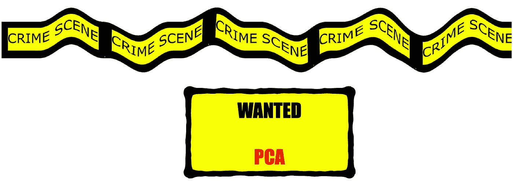

照片由 Pixabay 上的[路缘石](https://pixabay.com/de/illustrations/tatort-band-szene-kriminalit%C3%A4t-999123/)拍摄，编辑为 me :D

# 介绍

在我上一篇关于 Gap-Statistics 的博文中，我解释了大多数时候数据都有很多特征(数百个甚至有时数千个)。我们认为具有 100 个特征的数据集是 100 维的。所以每个特征代表数据集的一个维度。对于可视化数据来说，这是相当多的维度。我们不能只保留三个特征，不是吗？当然**不是**！一个例外是，100 个特征中有 98 个高度相关(通过热图找出)，所以我们省略了 97 个，只取其中的一个。然后我们会得到一个三维数据集。
**但这种可能性极小！**

因此，我将介绍两个在处理数据时需要了解的重要主题:

*   1)维度的诅咒——更深入的解释
*   2)降维取证

# 1)维度的诅咒

> 直观但重要的是要知道，所有模式分析或数据探索任务的复杂性随着维度的增加而增加。

我们称这种复杂性的增加为维度的诅咒。通常一些特征是完全无用的或者高度相关的。因此，可以应用降维技术来去除尽可能多的维度。我们真的想处理尽可能低维度的数据。

在处理高维数据时，我们可以推断出三个问题:

## 第一期:

**如何绘制三维以上的数据？**

> 是的，我们甚至可以在 4D 或 5D 的空间里进行策划，但是升级很快。

从技术上讲，有一些方法可以做到这一点。例如，我们可以改变数据点的大小来可视化第四维，或者我们可以额外引入一些颜色作为第五维。但是你可以看到升级的速度有多快，我们作为人类再也不能从 5D 的情节中读到任何有价值的东西了。所以这基本上是没用的，因为主要的一点是我们想从这些可视化中获取信息。

## 第二个问题:

**特征空间的细分随着维度的增加呈指数上升。**

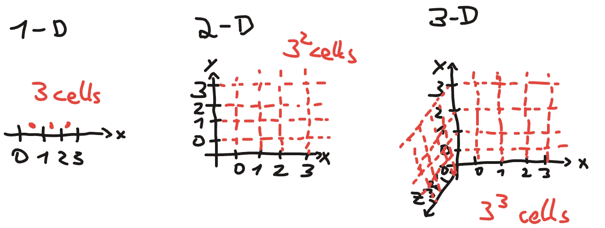

图 1)特征空间

在上图最右边的图中，我们看到，在三维空间中，我们已经有 27 个大小相等的细胞。对于 15 个特征(=15 个维度)，我们最终将在特征空间中拥有 1500 万个大小相等的细胞(3^15)。随机森林需要大量的参数来适应这个高维特征空间。如果你知道随机森林是如何工作的，那么你就知道它将特征空间分割成不同的分类区域，如果它是随机森林分类器而不是随机森林回归器的话。但是其他分类方法也需要不可行的更多参数来适应这样的高维空间。

## **第三期:**

这可能是最重要的，但也是最令人惊讶的问题:

> **维度越高，位于特征空间最外边界的数据点越多。**

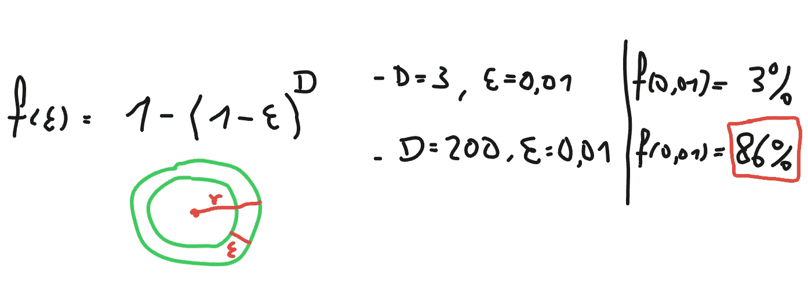

图 2)边界行为|来自 HTF 第 2.5 节

从上面的图 2 中我们可以看到计算**的公式，其中**数据位于特征空间中。 **D** 是尺寸的数量，而 **ε** 表示边界壳的极限。如果选择 **ε** 为 0.01，表示有多少个数据点位于特征空间的外侧 **1%** 。ε = 0.75 意味着有多少数据点位于特征空间的外部 **75%** 。上面的绿色圆圈代表特征空间，其中 **ε** 表示它总是从边缘开始向圆圈的中心**移动。**

因此，回到图 1 我们可以看到，对于 **200** 的维度，我们有 **86%** 的数据点位于特征空间的外层 **1%** 。而在 3D 空间中，3%的数据位于 1%的外壳上。

> 这太疯狂了，不是吗？

特征空间的稀疏性随着维度的增加而显著增加。我们将需要大量的新数据样本来维持特征空间的恒定密度。但是，除非你使用一些非常奇特的生成模型，如甘的模型，否则你无法轻松地生成新的数据样本。

# 2)降维取证

在这一节中，我们将介绍四种降维技术。我对它们中的每一个都进行了简要的概述，但是仅仅是为了理解如何执行取证。不是每种维度技术都适合每种数据分布。在选择四种方法中的一种时需要非常小心，因为如果你选择了错误的技术，你会惊讶地发现它并没有像预期的那样起作用。我们需要区分全局和局部降维技术。这是我们将要介绍的四种技术:

*   1) PCA(全球)
*   2) MDS(全球)
*   3) ISOMAP(本地)
*   4)拉普拉斯特征映射(局部)

有更多的方法，但让我们把重点放在我认为基本上是主要的方法上。最先进的 t-SNE 没有包括在内，因为它会打破这个帖子的限制。

## 主成分分析

当您不知道需要使用哪种技术时，主成分分析(PCA)总是首选。对于许多数据科学家来说，这是一项繁重的工作，它通常会产生正确的结果，但也有失败的情况。我提到过 PCA 是一种全球性的技术。这意味着 PCA 仅通过矩阵乘法计算，然后将数据投影到新的轴上。

> **重要提示**:投影的每一个轴都是相互正交的。因此，您可以将图 1 中的基本笛卡尔坐标系想象为投影轴。

基本步骤是:

1.  将数据标准化为平均值 0(第 5 行)
2.  对数据的协方差矩阵执行特征分解(第 9 行)
3.  按照特征值的大小降序排列特征向量(第 11–15 行)
4.  选择最大特征值的个数，将数据投影到特征向量上，将其作为新的轴。(第 19–21 行)

这四个步骤没什么特别的。它实际上只是几行 Python 代码:

```
92.46+0.00j% explained variance in vector 0
5.30+0.00j% explained variance in vector 1
1.72+0.00j% explained variance in vector 2
0.52+0.00j% explained variance in vector 3
```

你可以看到全局降维技术有另一个非常有用的特点，这是局部技术所没有的。全局方法揭示了在应用降维之后数据保留了多少差异。*虹膜数据集*是一个众所周知的尝试降维的数据集。它有四个维度，但只保留一个维度仍然保持数据总方差的 **92.46%** (从上面的灰色输出框“92.46+0.00j”->可以看出，这是一个复数表示)。这意味着 92.46%的信息仍然只保存在一个维度内。

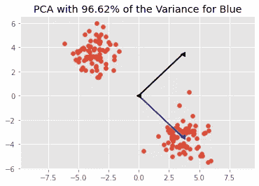

图 3)我制作的 PCA 示例

左图显示了 PCA 的另一个例子。请注意每个红色数据点是如何投影到新的蓝色轴上的。这将保留红点所有位置信息的 96.62%。

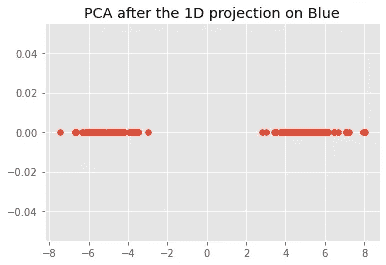

图 4)我制作的 1D 主成分分析投影示例

我使用了具有两个不同聚类的数据集。在减少了从 2D 到 1D 的维度后，即使将它们投射到蓝色箭头上，星团之间仍然保持着距离。

**结论**:我们只能用 PCA 将数据线性投影到特征向量轴上。请记住这一点。你能想象 2D 数据分布很难线性映射并保留大部分信息吗？

# 2) MDS

经典的多维标度(MDS)将更简单，因为它非常类似于 PCA。MDS 和 PCA 之间的唯一区别是，MDS 将点之间的距离作为输入。如果欧几里德距离范数用于 MDS，**它的行为 100%类似于 PCA** 。因此，MDS 也能够测量保留了多少差异。保存的公式是:

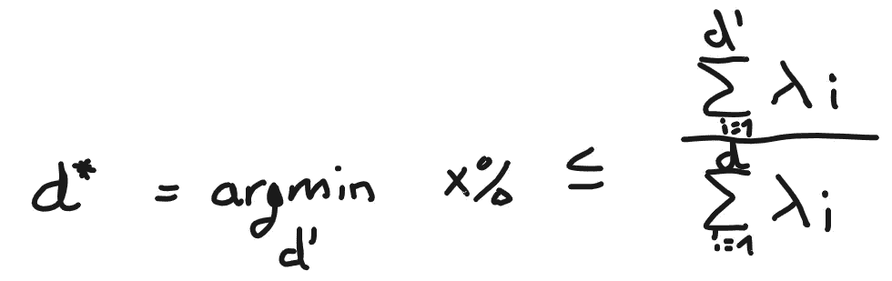

图 5)方差的最大保存

请注意，d’(d 撇)是缩减的维度(例如 1D)，d 是初始维度(例如 3D)。d* (d 星)是最佳降维。我们可以将所有的目标维度方差相加，然后除以 100，因为它从 100%方差开始。

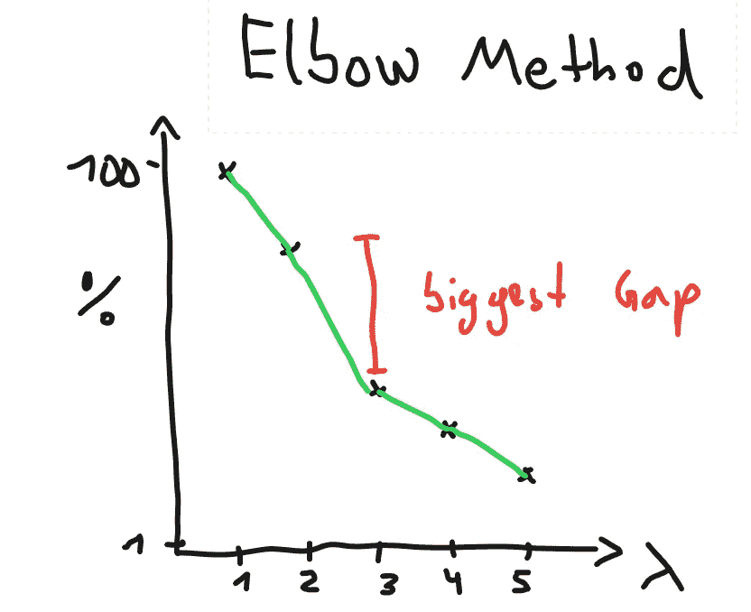

图 6)弯头方法

当你阅读我上一篇关于差距统计的博文时，你会注意到上面的这个数字是多么的相似。肘方法可用于可视化方差如何随着维度的减少而缩小。x 轴表示维度的减少。例如，在 x=2 时，初始维度减少了两个维度，我们仍然保留了大约 80%的总方差。最大的差距表明我们的最佳缩减结果可能是在**只缩减两个维度，**因为我们通过缩减三个维度的初始数据丢失了如此多的方差。

当对 MDS 使用不同的距离度量时

*   欧几里德距离
*   曼哈顿距离
*   汉明距离
*   LogFC

很难知道最佳指标是什么。当您确定全局降维技术足以完成您的任务时，您可以尝试许多不同的距离度量，并绘制肘方法图，以查看哪种最小维度可以保持最大的差异。

**结论:**由于使用欧几里德距离时 MDS 与 PCA 相同，所以可以直接选择 MDS 而非 PCA。然后你很快就能使用不同的测试距离指标。

# PCA 和 MDS 的线性取证

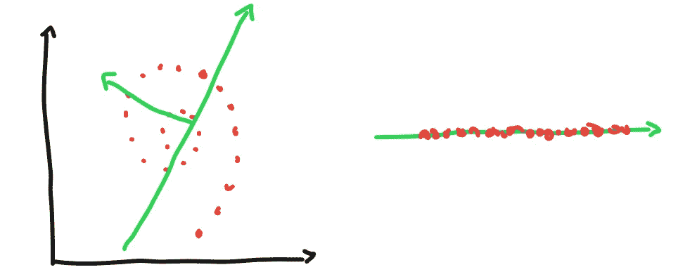

图 7)线性取证

让我们看看上面图 7 中的数据分布。它看起来像蜗牛的壳。无论我们如何将数据投射到绿色的主成分线(或 MDS 线)上，我们都**永远**不能保留太多的方差。上图的右部显示了数据如何理想地投影到绿线上。这并没有给我们带来任何进展。

这同样适用于非常高维度的空间。我们真的无法想象 100 维的特征空间会是什么样子，但同样的原理也适用。有些分布不能用线性降维技术来解释。

因此，当我们看到降维揭示了对潜在数据聚类的零洞察时，如上所述，我们可以肯定 PCA 或 MDS 不是正确的选择。

# 3) ISOMAP

先说局部降维。我会给你算法，然后我会解释它:

1.  使用 K 最近邻算法(kNN)定义局部邻域。
2.  用欧几里得距离计算所有点到另一个点的距离，以得到我们的图在所有点之间的边。
3.  使用 Dijktra 算法计算所有点到另一个点的最短距离。
4.  使用此最短距离矩阵作为 MDS 算法的距离度量。

啊，我们亲爱的 MDS。这么有用！kNN 需要一个固定的超参数，即 K 的数量。问题是，我们不能真正知道 K 的最佳值是多少。因此，由于 kNN 的半径变得太大，局部邻域可能包括并不真正属于它的点，因为存在太稀疏的数据点。应用 Dijkstras 的算法并使用这个距离矩阵作为 MDS 的输入很简单，但是困难在于这四个步骤中的第一步。

# ISOMAP 的全球取证

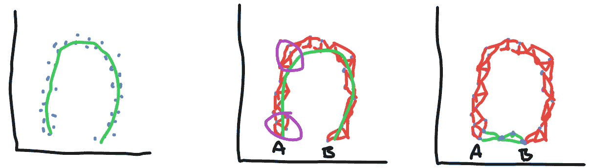

图 8)全球取证第 1 部分

让我们考虑一下图 8 最左侧上方底部开放的蛋形数据分布。如果我们能沿着绿线投影数据，那将是最好的降维映射。数据分布的本地结构将被保留。紫色圆圈表示两个**本地邻域**的例子。

你可以这样想象:

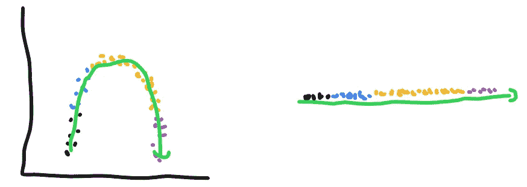

图 9)全球取证第 2 部分

这是最理想的情况。如果数据分布看起来像这样，它将完全工作。但是我已经提到了 ISOMAP 的问题行为。如果你仔细观察图 8 最右边的图，你会发现有两个新的蓝色数据点。这些可能是由于样本噪声造成的。这导致投射到绿线上的致命变化。

**结论**:由于 kNN，ISOMAP 对噪声样本非常敏感。因为 kNN 对于每个局部邻域的半径是不同的，因为它想要例如在它的局部邻域中找到 5 个点，而不管这些点位于多远或多近。这就产生了问题，并成为图 8 中 A 点到 B 点的桥梁，尽管这些点应该相距很远。

# 4)拉普拉斯特征映射

我也将从编写 LE 的基本算法开始，然后我将解释它:

1.  定义局部邻域，并根据所有数据点构建邻接图。
2.  测量图中各边的权重
3.  对该图进行特征分解(如 PCA)。
4.  像 PCA 一样，通过选择最大特征值的数量来执行低维嵌入，并且相对于它们相应的特征向量来映射数据。

邻接图基本上只是表示图中所有邻域点位置的矩阵(亲和矩阵),但是在一个矩阵内。这个**亲和矩阵**看起来像这样(它是二进制的，但是它也可以用除了二进制热核之外的其他核来计算):

# 拉普拉斯特征映射的全局取证

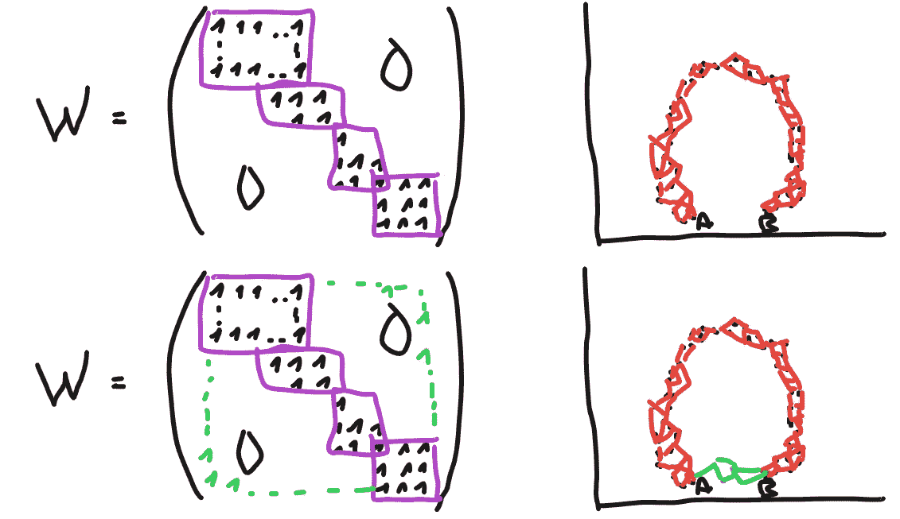

图 10)全球取证第 3 部分

**W** 表示二元亲和矩阵。上面的 W 是没有噪声的数据分布，而下面的 **W** 包括一些绿色噪声样本点。你可以看到，嘈杂的点想要再次创建一个从 A 到 B 的桥梁，但亲和矩阵阻止了这种情况的发生，因为紫色的局部邻域键在对角线上太强了。噪声对拉普拉斯特征映射没有影响。优化的目的是使局部邻域尽可能靠近(因此邻域的距离尽可能小)。

因此，对于拉普拉斯特征映射会有最小化问题，但是对于 PCA、MDS 和 ISOMAP 会有最大化问题(这三个想要最大化数据的方差信息)。

**结论**:LE 本质上更适合执行这种流形学习(=学习低维嵌入)，因为它对于噪声数据分布更鲁棒。正如我们所知，数据中经常存在噪声。在所有情况下，LE 都优于 ISOMAP。

# 进一步的调查

最后，让我们考虑一些测试示例:

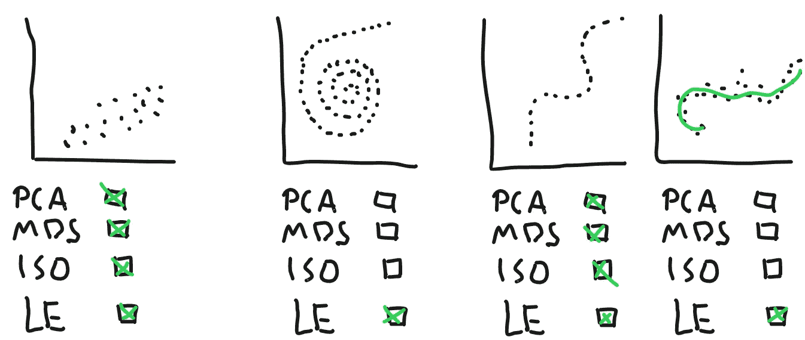

图 11)进一步调查

*   在第一个图中，我们可以很容易地拟合一条线或一个邻居通过。
*   对于第二个地块来说，附近可能会有问题，因此 LE 是安全的选择。
*   第三个图也将保留足够的方差，即使在拟合直线时也是如此。ISOMAP 和 LE 也没有问题，因为没有样本噪声和容易的局部邻域
*   最后一个例子用绿色显示地面实况。当我们想从中取样时，有噪声的样本可能会使地面实况向不希望的方向移动。这就是为什么我们真的想使用 LE，因为 ISOMAP 可能会受到噪声的负面影响，从而产生错误的降维。

我希望你发现这篇文章内容丰富！如果你有问题，可以给我发邮件。你可以在我的[网站](https://timloehr.me/)上找到我的邮箱地址。

# 参考

[1] Trevor Hastie，Robert Tibshirani 和 Jerome Friedman，[统计学习的要素:数据挖掘、推理和预测](https://web.stanford.edu/~hastie/ElemStatLearn/) (2009)

这篇博文基于从弗里德里希·亚历山大大学埃尔兰根-纽伦堡的课程模式分析中获得的知识。我使用了 Christian Riess 博士演讲的部分内容来说明这篇文章的例子。所以所有权利归克里斯汀·里斯博士所有。