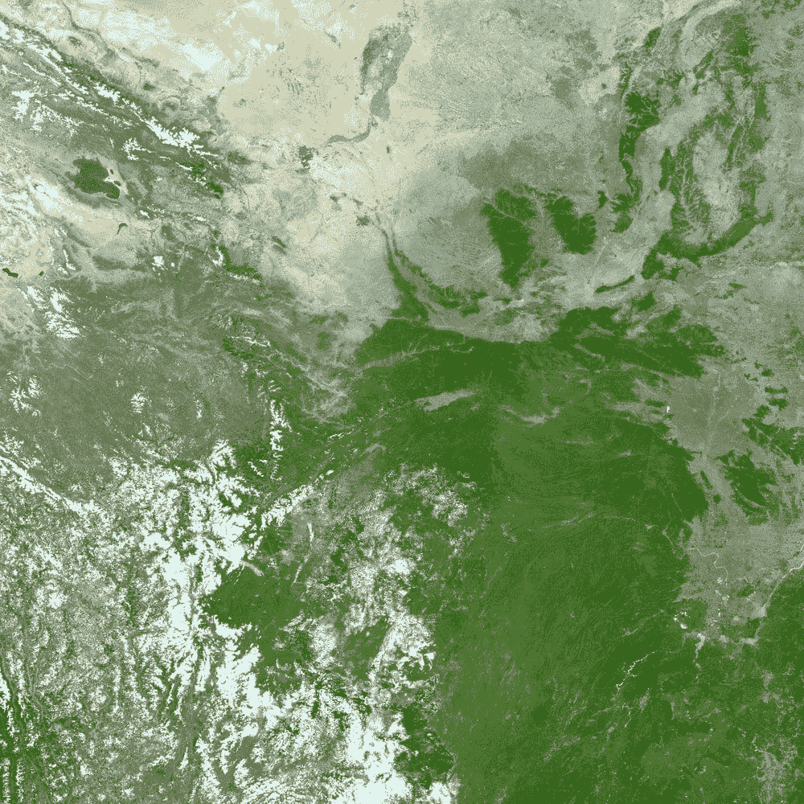
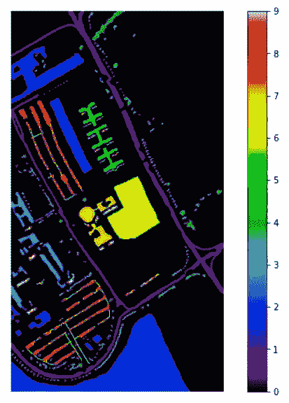
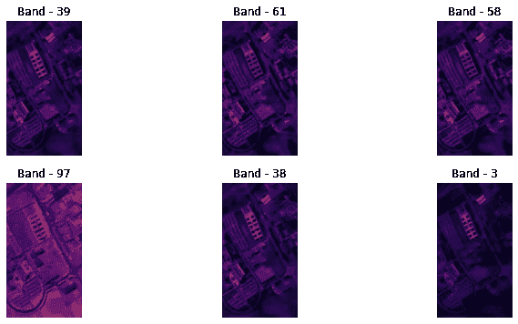
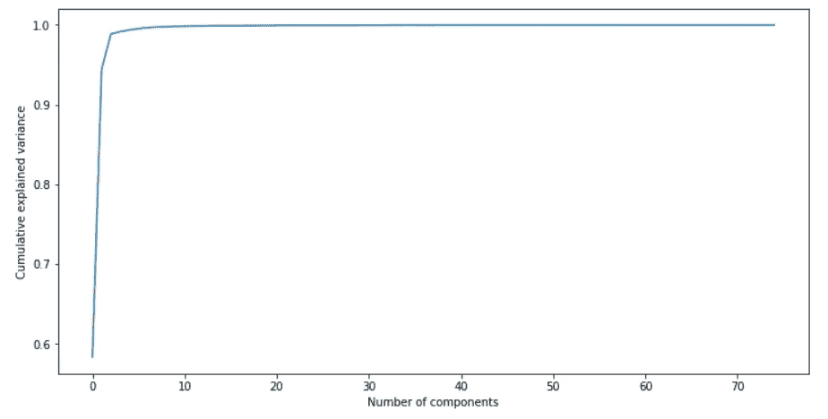
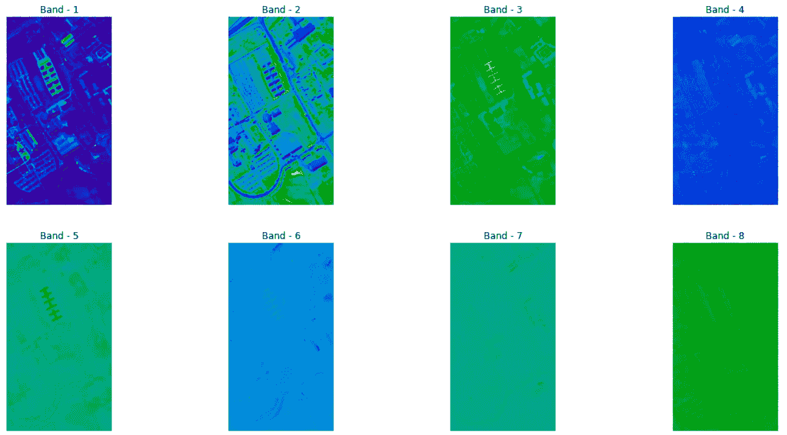

# 利用 Python 实现高光谱图像的降维

> 原文：<https://towardsdatascience.com/dimensionality-reduction-in-hyperspectral-images-using-python-611b40b6accc?source=collection_archive---------40----------------------->

## 初学者指南

## 高光谱图像的降维技术。

美国地质勘探局在 [Unsplash](https://unsplash.com/?utm_source=unsplash&utm_medium=referral&utm_content=creditCopyText) 上拍摄的照片

本文详细介绍了高光谱图像降维技术的实现。

# 目录

*   **高光谱图像简介**
*   **什么是降维？**
*   **降维需求**
*   **HSI 上的降维**
*   **参考文献**

# 超光谱图像(HSI)介绍

高光谱图像(HSI)提供了广泛的光谱信息，可用于解决各种问题，如作物分析、地质制图、矿产勘探等。由于数据中存在大量的波段，降维已经成为机器学习的一个重要方面。它通常被认为是解决分类和聚类等机器学习问题的预处理步骤。一般来说，任何分类和聚类算法的准确性都会受到维度或特征数量的影响。

降维技术用于减少数据集的维数，从而为分类器以低计算成本生成综合模型铺平了道路。因此，降维在提高高光谱图像像素分类精度方面变得越来越重要。

> 要更好地了解 HSI，请阅读下面题为“超光谱图像分析—入门”的文章。

 [## 超光谱图像分析—入门

### 使用 Python 进行高光谱图像分析的演练。

towardsdatascience.com](/hyperspectral-image-analysis-getting-started-74758c12f2e9) 

# 什么是降维？

降维是减少数据集的维度或特征的过程。可以使用两种方法来减少数据集的维度。它们是:

*   **功能选择**
*   **特征提取**

**特征选择**是选择数据集特征维度的过程，该数据集为机器学习任务(如分类、聚类等)提供模式。这可以通过使用不同的方法来实现，如相关性分析、单变量分析等

**特征提取**特征提取是通过选择和/或组合现有特征来创建缩减的特征空间，同时仍然准确和完整地描述数据集而不丢失信息，从而发现新特征的过程。

基于准则函数和收敛过程，降维技术也分为凸和非凸两类。一些流行的降维技术包括 PCA、ICA、LDA、GDA、核 PCA、Isomap、局部线性嵌入(LLE)、Hessian LLE 等。

我们将使用主成分分析(PCA)来降低 HSI 的维度。

## 主成分分析

PCA 是一种线性无监督降维技术，可以描述为数据协方差矩阵的特征分解。它通过创建方差最大化的不相关要素来减少信息损失，从而提高可解释性。

为了理解主成分分析(PCA)背后的数学原理，请使用下面的教程:

 [## 主成分分析算法—降维| Coursera

### 斯坦福大学为“机器学习”课程制作的视频。在本模块中，我们将介绍主要…

www.coursera.org](https://www.coursera.org/lecture/machine-learning/principal-component-analysis-algorithm-ZYIPa) 

# 需要降维

维数灾难指的是在高维空间中分类、分析数据时出现的现象，这种现象在低维空间中不会出现。随着维数或特征在最佳点之后增加，分类性能逐渐降低。

降维技术用于减少数据集的维数，从而为分类器以降低的计算成本生成综合模型铺平了道路。

# HSI 上的降维

*帕维亚大学数据集*用于说明目的。在意大利北部帕维亚上空的一次飞行活动中，[安明传感器](http://www.opairs.aero/rosis_en.html)拍摄到的 HSI 场景。*光谱波段*的数量为 103 个*，HSI 的*大小为610*340 *像素*，地物包含 9 个*类*。图像中的一些像素不包含信息，并且在分析之前必须被丢弃。

## 读取 HSI 数据

使用下面的代码从 SciPy 中的' load_mat '函数读取帕维亚大学 HSI 的数据。

## 可视化数据

让我们来看看帕维亚大学高光谱影像的地面真相。

帕维亚大学 HSI 的基本事实—作者图片

让我们看看帕维亚大学 HSI 的几个乐队，这些乐队是随机挑选的。

Pavia 大学 HSI 样本带的可视化——图片由作者提供

## 主成分分析

让我们降低帕维亚大学 HSI 的维度。首先，**我们要降多少维？**。

使用解释的方差比图，我们可以选择要减少的最佳维数。图表的 x 轴代表主成分的数量，y 轴代表累计解释方差。*我们可以选择具有> 95%累积解释方差的成分数量。*在这种情况下，我们选择了 *8 个主成分*，也就是说，我们正在将帕维亚大学数据的维度减少到 8 个维度。

累积解释方差和组件数量之间的图表-按作者分类的图片

现在，我们知道应该减少多少个恒指数据维度。对 HSI 数据应用主成分分析(PCA)。下面的代码可以满足这个目的。

在减少数据的维度之后，为了将来的目的，添加类别标签。以下代码用于显示降维后的波段。

我们来看看帕维亚大学 HSI 用 PCA 降维后的八个波段。

应用主成分分析后条带的可视化—作者提供的图像

我编写的在 HSI 上执行 PCA 的整个代码被保存为一个 Colab 笔记本。请随意使用。

 [## 基于主成分分析的 HSI 数据降维

### 基于主成分分析的高光谱图像降维。

colab.research.google.com](https://colab.research.google.com/drive/1Lstx55MxHT8bpXlgnaXYloVCmagE_xC7?usp=sharing) 

# 参考

 [## 奇异值分解和主成分分析

### 编辑描述

link.springer.com](https://link.springer.com/chapter/10.1007%2F0-306-47815-3_5)  [## sk learn . decomposition . PCA-sci kit-learn 0 . 23 . 1 文档

### 主成分分析。使用数据的奇异值分解进行线性降维…

scikit-learn.org](https://scikit-learn.org/stable/modules/generated/sklearn.decomposition.PCA.html)