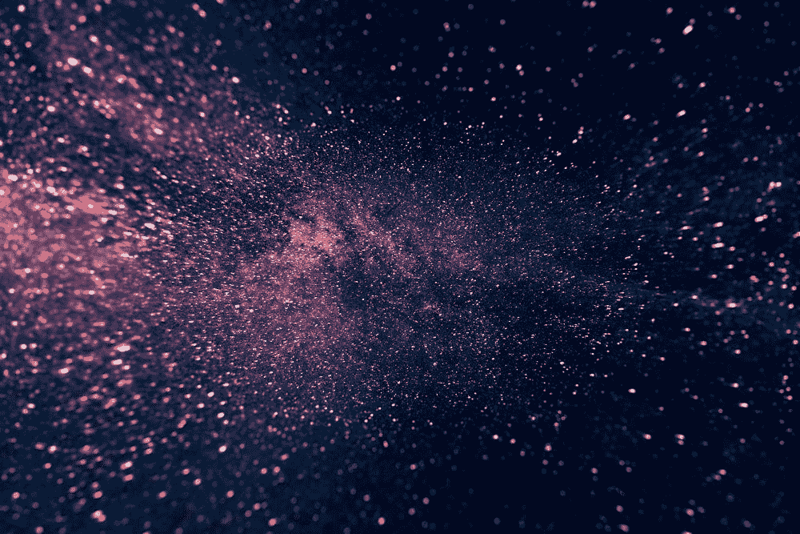
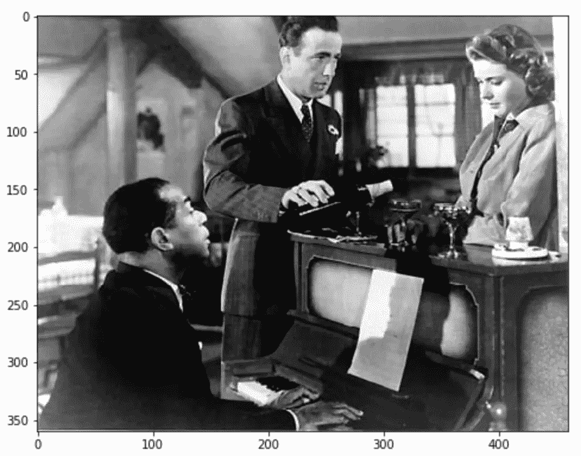
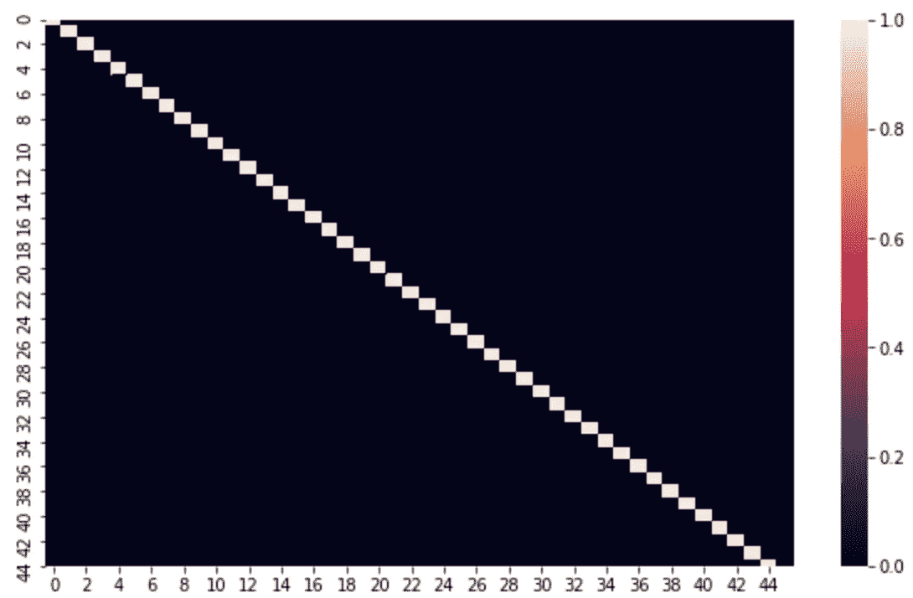
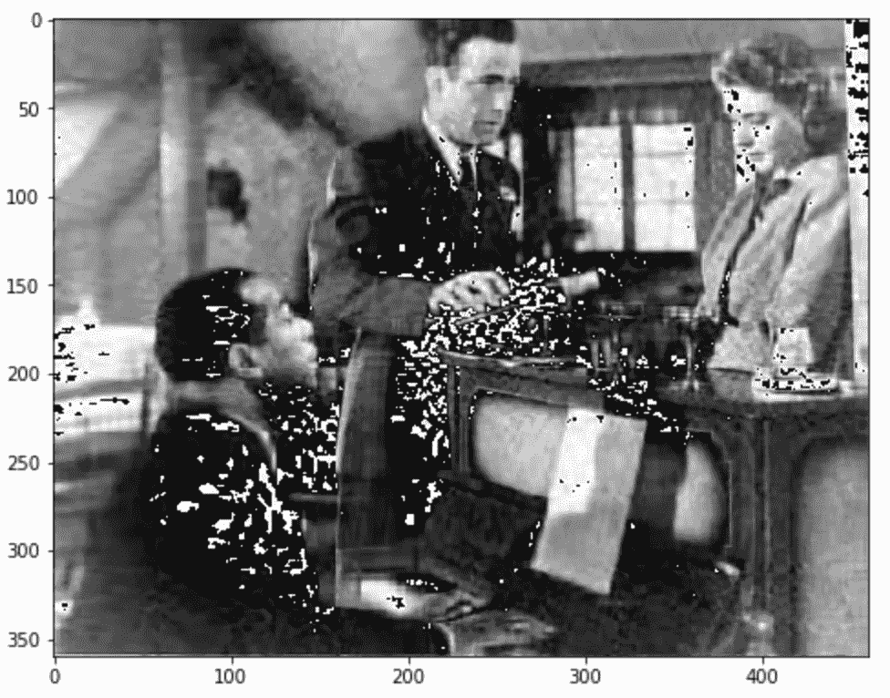
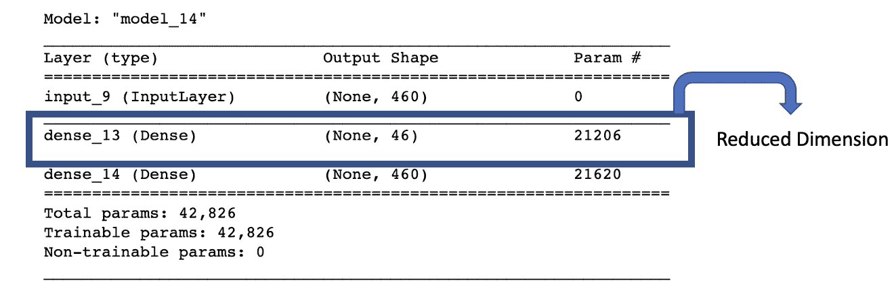
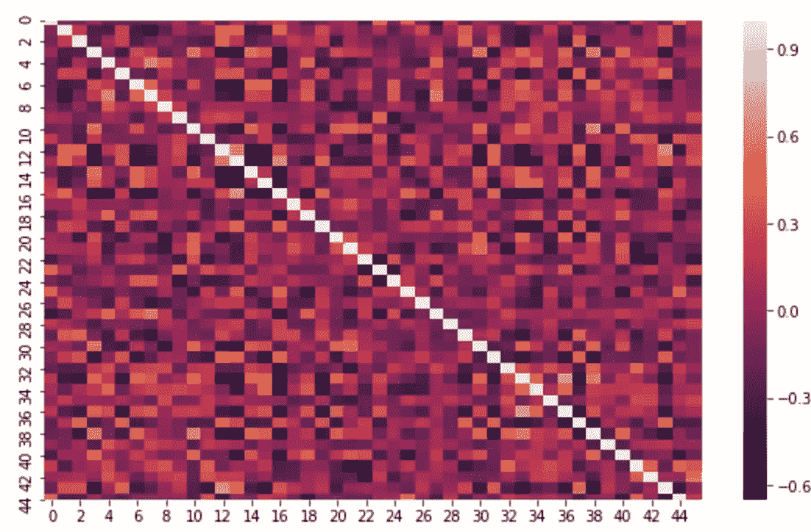
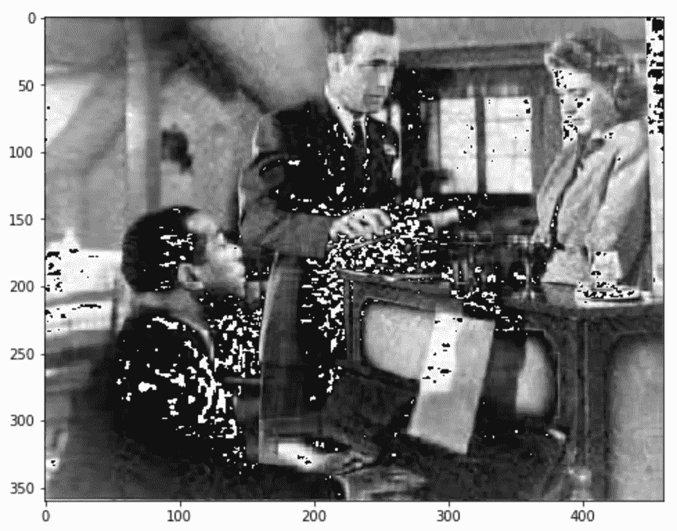
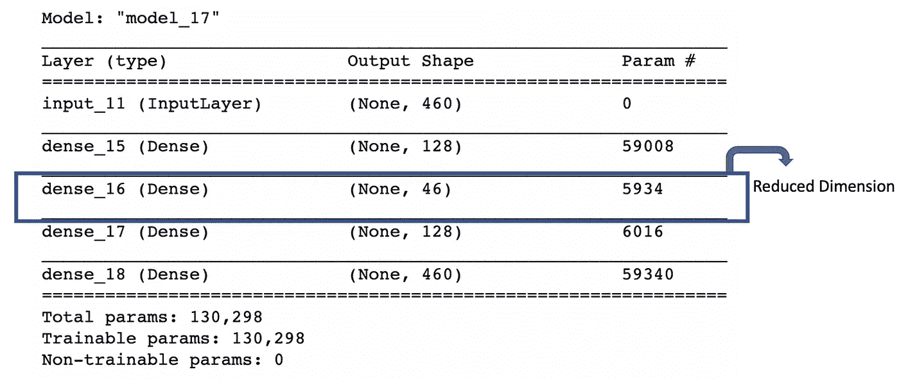
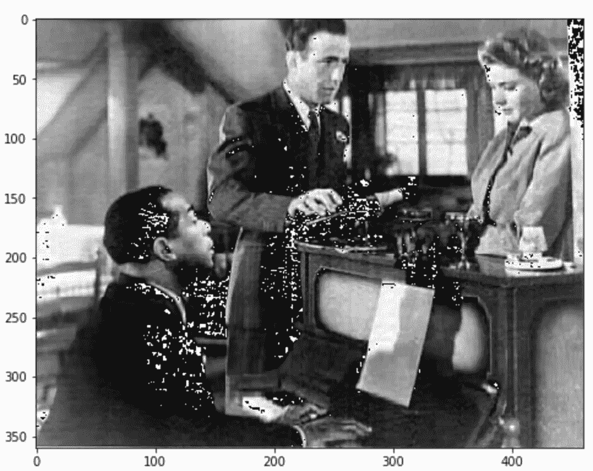

# 降维:PCA 与自动编码器

> 原文：<https://towardsdatascience.com/dimensionality-reduction-pca-versus-autoencoders-338fcaf3297d?source=collection_archive---------9----------------------->

## 主成分分析和自动编码器降维的比较



图片由[比利·胡恩](https://unsplash.com/@billy_huy)在 [Unsplash](https://images.unsplash.com/photo-1496715976403-7e36dc43f17b?ixlib=rb-1.2.1&ixid=eyJhcHBfaWQiOjEyMDd9&auto=format&fit=crop&w=1950&q=80) 上拍摄

[降维](https://en.wikipedia.org/wiki/Dimensionality_reduction)是一种减少特征空间的技术，以获得稳定且统计上合理的机器学习模型，避免[维数灾难](https://en.wikipedia.org/wiki/Curse_of_dimensionality)。降维主要有两种方法:[特征选择](https://en.wikipedia.org/wiki/Feature_selection)和[特征变换](https://en.wikipedia.org/wiki/Feature_extraction)。

[特征选择](https://en.wikipedia.org/wiki/Feature_selection)方法试图对重要特征进行子集划分，并移除共线或不太重要的特征。你可以在这里读到更多。

[特征转换](https://en.wikipedia.org/wiki/Feature_extraction)也称为特征提取，试图将高维数据投影到较低的维度。一些特征变换技术有 [PCA](https://en.wikipedia.org/wiki/Principal_component_analysis) ，[矩阵分解](https://en.wikipedia.org/wiki/Matrix_decomposition)，[自动编码器](https://en.wikipedia.org/wiki/Autoencoder)， [t-Sne](https://en.wikipedia.org/wiki/T-distributed_stochastic_neighbor_embedding) ， [UMAP](https://en.wikipedia.org/wiki/Nonlinear_dimensionality_reduction#Uniform_manifold_approximation_and_projection) 等。

通过这篇博文，我打算深入研究 PCA 和自动编码器。我们将看到这两种技术的优点和缺点，并通过一个有趣的例子来清楚地理解它。该解决方案的完整源代码可以在[这里](https://github.com/samread81/PCA-versus-AE)找到。

*你也可以在 Youtube 上找到我关于同一主题的视频。*

我在 Youtube 上的同主题视频

# 主成分分析

[主成分分析](https://en.wikipedia.org/wiki/Principal_component_analysis)是一种[无监督技术](https://en.wikipedia.org/wiki/Unsupervised_learning)，将原始数据向高方差方向投影。这些高方差方向[彼此正交](https://en.wikipedia.org/wiki/Orthogonality)，导致投影数据中的相关性[非常低或几乎接近 0](https://en.wikipedia.org/wiki/Correlation_and_dependence)。这些功能转换是线性的，其方法是:

***第一步:*** 计算 n 维组成的[相关矩阵](https://en.wikipedia.org/wiki/Correlation_and_dependence#Correlation_matrices)数据。相关矩阵的形状为 n*n。

***第二步:*** 计算这个矩阵的[特征向量和特征值](https://en.wikipedia.org/wiki/Eigenvalues_and_eigenvectors)。

***第三步:*** 取特征值最高的前 k 个特征向量。

***第四步:*** 将原始数据集投影到这 k 个特征向量中，得到 k 维，其中 k ≤ n。

# 自动编码器

[Autoencoder](https://en.wikipedia.org/wiki/Autoencoder) 是一个无监督的[人工神经网络](https://en.wikipedia.org/wiki/Artificial_neural_network)，它将数据压缩到较低的维度，然后将输入重构回来。Autoencoder 通过更多地关注重要特征来消除噪声和冗余，从而在较低的维度中找到数据的表示。它基于编码器-解码器架构，其中编码器将高维数据编码为低维数据，解码器获取低维数据并尝试重建原始高维数据。


基本自动编码器的模式:[维基百科](https://en.wikipedia.org/wiki/Autoencoder#/media/File:Autoencoder_schema.png)


深度自动编码器的模式:[维基百科](https://en.wikipedia.org/wiki/File:Autoencoder_structure.png)

在上图中，X 是输入数据，z 是输入 X 的低维表示，X '是重构的输入数据。根据对[激活功能](https://en.wikipedia.org/wiki/Activation_function)的选择，较高维度到较低维度的映射可以是线性的或非线性的。

# 比较:PCA 与自动编码器

1.  PCA 是数据的线性变换，而 AE 可以是线性的或非线性的，这取决于激活函数的选择。
2.  PCA 非常快，因为存在可以快速计算它的算法，而 AE 通过梯度下降训练，并且相对较慢。
3.  PCA 将数据投影到彼此正交的维度中，导致投影数据中的相关性非常低或接近零。PCA 得到正交子空间，因为特征向量(数据投影到其上)来自应用于协方差矩阵(对称半正定)的特征分解，并且在这种情况下，特征分解产生正交特征向量。AE 转换数据不能保证这一点，因为它的训练方式仅仅是为了最小化重建损失。
4.  PCA 是输入空间到最大变化方向的简单线性变换，而 AE 是更复杂的技术，可以模拟相对复杂的关系和非线性。
5.  一个经验法则可能是数据的大小。对于小数据集使用 PCA，对于相对较大的数据集使用 AE。
6.  PCA 超参数是“k ”,即投影数据的正交维数，而对于 AE，它是神经网络的架构。
7.  具有单层和线性激活的 AE 具有与 PCA 相似的性能。称为深度自动编码器的具有多层和非激活功能的 AE 易于过拟合，并且可以通过规范化和仔细设计来控制。请参考下面两篇博客来了解更多。

[](https://blog.keras.io/building-autoencoders-in-keras.html) [## 在 Keras 中构建自动编码器

### 在本教程中，我们将回答一些关于自动编码器的常见问题，我们将涵盖代码的例子…

blog.keras.io](https://blog.keras.io/building-autoencoders-in-keras.html) [](https://iq.opengenus.org/types-of-autoencoder/) [## 不同类型的自动编码器

### 阅读时间:30 分钟自动编码器是一种人工神经网络，用于学习有效的数据编码

iq.opengenus.org](https://iq.opengenus.org/types-of-autoencoder/) 

# 图像数据示例:了解 PCA 和自动编码器

让我们以下图为例，用这两种方法进行降维。



[图像来源](https://iq.opengenus.org/types-of-autoencoder/)

这幅图像的尺寸是 360 * 460。从另一个角度来看，它是一个包含 360 个数据点和 460 个特征/维度的数据集。

我们将尝试将维数从 460 减少到 10%，即 46 维，首先使用 PCA，然后使用 AE。再来看看重构和其他属性的区别。

## 使用主成分分析进行降维

```
pct_reduction = 0.10
reduced_pixel  = int( pct_reduction* original_dimensions[1])#Applying PCA
pca = PCA(n_components=reduced_pixel)
pca.fit(image_matrix)#Transforming the input matrix
X_transformed = pca.transform(image_matrix)
print("Original Input dimesnions {}".format(original_dimensions))
print("New Reduced dimensions {}".format(X_transformed.shape))
```

输出

```
Original Input dimesnions (360, 460)
New Reduced dimensions (360, 46)
```

让我们检查来自 PCA 的新变换特征的相关性。

```
df_pca = pd.DataFrame(data = X_transformed,columns=list(range(X_transformed.shape[1])))figure = plt.figure(figsize=(10,6))
corrMatrix = df_pca.corr()
sns.heatmap(corrMatrix, annot=False)
plt.show()
```



变换特征的相关矩阵:PCA

相关矩阵显示新的变换特征彼此不相关，相关度为 0。原因是在 PCA 中将数据投影到正交维度中。

接下来，我们将尝试仅通过来自我们可用的缩减特征空间的信息来重建原始数据。

```
reconstructed_matrix = pca.inverse_transform(X_transformed)
reconstructed_image_pca = Image.fromarray(np.uint8(reconstructed_matrix))
plt.figure(figsize=(8,12))
plt.imshow(reconstructed_image_pca,cmap = plt.cm.gray)
```



重建图像:主成分分析

计算重建图像的 [RMSE](https://en.wikipedia.org/wiki/Root-mean-square_deviation)

```
def my_rmse(np_arr1,np_arr2):
    dim = np_arr1.shape
    tot_loss = 0
    for i in range(dim[0]):
        for j in range(dim[1]):
            tot_loss += math.pow((np_arr1[i,j] - np_arr2[i,j]),2)
    return round(math.sqrt(tot_loss/(dim[0]* dim[1]*1.0)),2)error_pca = my_rmse(image_matrix,reconstructed_matrix)
```

RMSE 是 11.84(越低越好)。

> 如果原始图像和重建图像之间没有差异，RMSE 将为 0。如果使用大约 120 个来自 PCA 的维度，则 RMSE 接近于 0。

## 使用具有线性激活的单层自动编码器进行降维

```
# Standarise the Data
X_org = image_matrix.copy()
sc = StandardScaler()
X = sc.fit_transform(X_org)# this is the size of our encoded representations
encoding_dim = reduced_pixel # this is our input placeholder
input_img = Input(shape=(img.width,))# "encoded" is the encoded representation of the input
encoded = Dense(encoding_dim, activation='linear')(input_img)# "decoded" is the lossy reconstruction of the input
decoded = Dense(img.width, activation=None)(encoded)# this model maps an input to its reconstruction
autoencoder = Model(input_img, decoded)#Encoder
encoder = Model(input_img, encoded)# create a placeholder for an encoded (32-dimensional) input
encoded_input = Input(shape=(encoding_dim,))# retrieve the last layer of the autoencoder model
decoder_layer = autoencoder.layers[-1]# create the decoder model
decoder = Model(encoded_input, decoder_layer(encoded_input))autoencoder.compile(optimizer='adadelta', loss='mean_squared_error')autoencoder.fit(X, X,
                epochs=500,
                batch_size=16,
                shuffle=True)encoded_imgs = encoder.predict(X)
decoded_imgs = decoder.predict(encoded_imgs)
```



模型架构/摘要

让我们检查从 AE 出来的新变换特征的相关性。

```
df_ae = pd.DataFrame(data = encoded_imgs,columns=list(range(encoded_imgs.shape[1])))
figure = plt.figure(figsize=(10,6))
corrMatrix = df_ae.corr()
sns.heatmap(corrMatrix, annot=False)
plt.show()
```



变换特征的相关矩阵:AE

相关矩阵显示新的变换特征在某种程度上是相关的。皮尔逊相关因子偏离 0 很多。AE 训练的原因仅仅是为了最小化重建损失。

接下来，我们将尝试仅通过我们可用的缩减的特征空间来重建回原始数据。

```
X_decoded_ae = sc.inverse_transform(decoded_imgs)reconstructed_image_ae = Image.fromarray(np.uint8(X_decoded_ae))
plt.figure(figsize=(8,12))
plt.imshow(reconstructed_image_ae,cmap = plt.cm.gray)
```



重建图像:声发射

计算重建图像的 [RMSE](https://en.wikipedia.org/wiki/Root-mean-square_deviation) 。

```
error_ae = my_rmse(image_matrix,X_decoded_ae)
```

> RMSE 是 12.15。接近 PCA 的 RMSE 11.84。具有单层和线性激活的自动编码器的性能类似于 PCA。

## 使用具有非线性激活的三层自动编码器进行降维

```
input_img = Input(shape=(img.width,))
encoded1 = Dense(128, activation='relu')(input_img)
encoded2 = Dense(reduced_pixel, activation='relu')(encoded1)
decoded1 = Dense(128, activation='relu')(encoded2)
decoded2 = Dense(img.width, activation=None)(decoded1)autoencoder = Model(input_img, decoded2)
autoencoder.compile(optimizer='adadelta', loss='mean_squared_error')autoencoder.fit(X,X,
                epochs=500,
                batch_size=16,
                shuffle=True)
# Encoder
encoder = Model(input_img, encoded2)
# Decoder
decoder = Model(input_img, decoded2)encoded_imgs = encoder.predict(X)
decoded_imgs = decoder.predict(X)
```



模型架构/摘要

接下来，我们将尝试仅通过我们可用的缩减的特征空间来重建回原始数据。

```
X_decoded_deep_ae = sc.inverse_transform(decoded_imgs)reconstructed_image_deep_ae = Image.fromarray(np.uint8(X_decoded_deep_ae))
plt.figure(figsize=(8,12))
plt.imshow(reconstructed_image_deep_ae,cmap = plt.cm.gray)
```



计算重建图像的 [RMSE](https://en.wikipedia.org/wiki/Root-mean-square_deviation) 。

```
error_dae = my_rmse(image_matrix,X_decoded_deep_ae)
```

RMSE 是 8.57。相对于 PCA 的增益是 28 %,同时减少了相同数量的维数。

> 具有非线性激活的额外层的 Autoencoder 能够更好地捕捉图像中的非线性。与 PCA 相比，它能够更好地捕捉复杂的模式以及像素值的突然变化。尽管它伴随着相对较高的培训时间和资源的成本。

# 结论

通过这篇博文，我们深入研究了 PCA 和自动编码器。我们也看到了这两种技术的优缺点。这些概念在图像数据集上进行了尝试，其中具有额外非线性激活层的自动编码器优于 PCA，尽管代价是更高的训练时间和资源。该解决方案的完整源代码可以在[这里](https://github.com/samread81/PCA-versus-AE)找到。

> 如果你有任何疑问，请联系我。我很想知道你是否面临过高维度的问题，以及你尝试了哪些方法来克服它。

***我的 Youtube 频道更多内容:***

[](https://www.youtube.com/channel/UCg0PxC9ThQrbD9nM_FU1vWA) [## 阿布舍克·蒙戈利

### 嗨，伙计们，欢迎来到频道。该频道旨在涵盖各种主题，从机器学习，数据科学…

www.youtube.com](https://www.youtube.com/channel/UCg0PxC9ThQrbD9nM_FU1vWA) 

> ***关于作者-:***
> 
> Abhishek Mungoli 是一位经验丰富的数据科学家，拥有 ML 领域的经验和计算机科学背景，跨越多个领域并具有解决问题的思维方式。擅长各种机器学习和零售业特有的优化问题。热衷于大规模实现机器学习模型，并通过博客、讲座、聚会和论文等方式分享知识。
> 
> 我的动机总是把最困难的事情简化成最简单的版本。我喜欢解决问题、数据科学、产品开发和扩展解决方案。我喜欢在闲暇时间探索新的地方和健身。关注我的 [**中**](https://medium.com/@mungoliabhishek81) 、**[**Linkedin**](https://www.linkedin.com/in/abhishek-mungoli-39048355/)**或**[**insta gram**](https://www.instagram.com/simplyspartanx/)**并查看我的[以前的帖子](https://medium.com/@mungoliabhishek81)。我欢迎反馈和建设性的批评。我的一些博客-********

*   ******[体验遗传算法的威力](/experience-the-power-of-the-genetic-algorithm-4030adf0383f)******
*   ******[每个数据科学家都应该避免的 5 个错误](/5-mistakes-every-data-scientist-should-avoid-bcc8142d7693)******
*   ******[以简单&直观的方式分解时间序列](/decomposing-a-time-series-in-a-simple-and-intuitive-way-19d3213c420b?source=---------7------------------)******
*   ******[GPU 计算如何在工作中拯救了我？](https://medium.com/walmartlabs/how-gpu-computing-literally-saved-me-at-work-fc1dc70f48b6)******
*   ******信息论& KL 分歧[第一部分](/part-i-a-new-tool-to-your-toolkit-kl-divergence-5b887b5b420e)和[第二部分](/part-2-a-new-tool-to-your-toolkit-kl-divergence-736c134baa3d)******
*   ******[使用 Apache Spark 处理维基百科，创建热点数据集](/process-wikipedia-using-apache-spark-to-create-spicy-hot-datasets-1a59720e6e25)******
*   ******[一种基于半监督嵌入的模糊聚类](/a-semi-supervised-embedding-based-fuzzy-clustering-b2023c0fde7c)******
*   ******[比较哪个机器学习模型表现更好](/compare-which-machine-learning-model-performs-better-4912b2ed597d)******
*   ******[分析 Fitbit 数据，揭开疫情封锁期间身体模式变化的神秘面纱](/analyzing-fitbit-data-to-demystify-bodily-pattern-changes-amid-pandemic-lockdown-5b0188fec0f0)******
*   ******[神话与现实围绕关联](/myths-and-reality-around-correlation-9b359456d8e1)******
*   ******[成为面向业务的数据科学家指南](/a-guide-to-becoming-business-oriented-data-scientist-51da5c829ffa)******