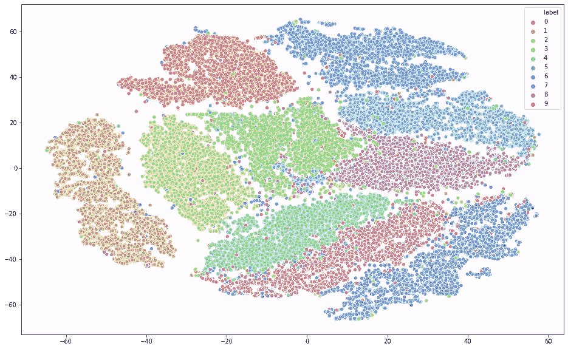
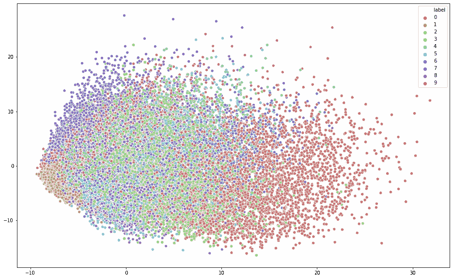
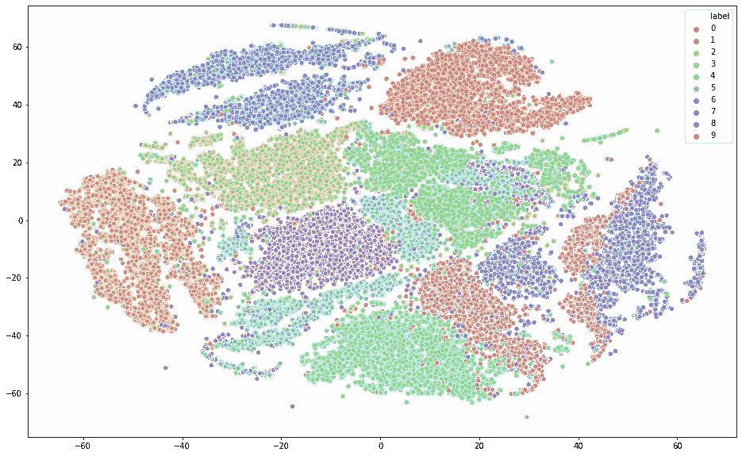

# 在 MNIST 数据集上使用 t 分布随机邻居嵌入(t-SNE)进行降维

> 原文：<https://towardsdatascience.com/dimensionality-reduction-using-t-distributed-stochastic-neighbor-embedding-t-sne-on-the-mnist-9d36a3dd4521?source=collection_archive---------13----------------------->



应用 PCA (n_components = 50)和 t-SNE 后 MNIST 数据的 2D 散点图

我们很容易将二维或三维数据可视化，但一旦超出三维，就很难看到高维数据是什么样子了。

今天，我们经常处于这样一种情况，我们需要在具有数千甚至数百万维的数据集上分析和发现模式，这使得可视化有点挑战性。然而，一个绝对可以帮助我们更好地理解数据的工具是**降维**。

在这篇文章中，我将讨论 t-SNE，一种流行的非线性降维技术，以及如何使用 *sklearn* 在 Python 中实现它。我在这里选择的数据集是流行的 MNIST 数据集。

# 古玩目录

1.  [什么是 t-SNE，它是如何工作的？](#f297)
2.  [t-SNE 与 PCA 有何不同？](#b00c)
3.  我们如何改进 t-SNE？
4.  [有哪些局限性？](#6a66)
5.  [接下来我们能做什么？](#fdf3)

# 概观

t-分布式随机邻居嵌入，或 t-SNE，是一种机器学习算法，通常用于在低维空间嵌入高维数据[1]。

简单来说，SNE 霸王龙的方法可以分为两步。第一步是通过构建概率分布 **P** 来表示高维数据，其中相似点被选取的概率高，而不同点被选取的概率低。第二步是用另一个概率分布 **Q** 创建一个低维空间，它尽可能地保持 P 的性质。

在步骤 1 中，我们使用条件概率 p 来计算两个数据点之间的相似性。例如，给定 I 的 j 的条件概率表示 *x_j* 将被 *x_i* 挑选为其邻居，假设在以*x _ I*【1】为中心的**高斯**分布下，邻居与其概率密度成比例地被挑选。在步骤 2 中，我们让 *y_i* 和 *y_j* 分别是 *x_i* 和 *x_j，*的低维对应物。然后，我们认为 q 是被 *y_i* 挑选的 *y_j* 的类似条件概率，并且我们在低维图中采用了**学生 t 分布**。通过最小化来自 q 的概率分布 P 的[**kull back–lei bler 散度**](http://hanj.cs.illinois.edu/cs412/bk3/KL-divergence.pdf) 来确定低维数据点的位置

关于 t-SNE 的更多技术细节，请查看本文。

我选择了 Kaggle ( [link](https://www.kaggle.com/c/digit-recognizer) )的 MNIST 数据集作为这里的例子，因为它是一个简单的计算机视觉数据集，包含手写数字(0–9)的 28x28 像素图像。我们可以把每个实例想象成一个嵌入 784 维空间的数据点。

要查看完整的 Python 代码，请查看我的 [Kaggle 内核](https://www.kaggle.com/dehaozhang/t-sne-visualization)。

事不宜迟，让我们进入细节！

# 探测

请注意，在最初的 Kaggle 竞赛中，目标是使用具有真实标签的训练图像来建立 ML 模型，该模型可以准确预测测试集上的标签。出于我们的目的，我们将只使用训练集。

像往常一样，我们首先检查它的形状:

```
train.shape
--------------------------------------------------------------------
(42000, 785)
```

有 42K 个训练实例。785 列是 784 像素值，以及“标签”列。

我们还可以检查标签分布:

```
label = train["label"]
label.value_counts()
--------------------------------------------------------------------
1    4684
7    4401
3    4351
9    4188
2    4177
6    4137
0    4132
4    4072
8    4063
5    3795
Name: label, dtype: int64
```

**主成分分析**

在实现 t-SNE 之前，我们先来试试 PCA，这是一种流行的线性降维方法。

标准化数据后，我们可以使用 PCA 转换数据(将“n_components”指定为 2):

```
from sklearn.preprocessing import StandardScaler
from sklearn.decomposition import PCAtrain = StandardScaler().fit_transform(train)
pca = PCA(n_components=2)
pca_res = pca.fit_transform(train)
```

让我们制作一个散点图来直观显示结果:

```
sns.scatterplot(x = pca_res[:,0], y = pca_res[:,1], hue = label, palette = sns.hls_palette(10), legend = 'full');
```



应用主成分分析后 MNIST 数据的 2D 散点图

如散点图所示，含有两种成分的五氯苯甲醚不足以提供关于不同标签的有意义的见解和模式。我们知道 PCA 的一个缺点是线性投影不能捕捉非线性相关性。现在让我们试试 SNE 霸王龙。

**T-SNE 与*sk learn***

我们将使用 *sklearn.manifold* ( [文档](https://scikit-learn.org/stable/modules/generated/sklearn.manifold.TSNE.html))实现 t-SNE:

```
from sklearn.manifold import TSNEtsne = TSNE(n_components = 2, random_state=0)
tsne_res = tsne.fit_transform(train)

sns.scatterplot(x = tsne_res[:,0], y = tsne_res[:,1], hue = label, palette = sns.hls_palette(10), legend = 'full');
```



应用 t-SNE 后 MNIST 数据的 2D 散点图

现在我们可以看到，与主成分分析的结果相比，不同的聚类更加可分。以下是对该图的一些观察:

1.  与“2”和“4”等其他聚类相比，“5”数据点似乎更加分散。
2.  有几个“5”和“8”数据点类似于“3”
3.  有两个“7”和“9”的集群，它们彼此相邻。

**结合两者的方法**

通常建议在应用 t-SNE 之前，使用 PCA 或 TruncatedSVD 将维数减少到合理的数量(例如 50)[2]。

这样做可以降低噪音水平并加快计算速度。

让我们先尝试主成分分析(50 个成分)，然后应用 t-SNE。这是散点图:


应用 PCA(50 个成分)和 t-SNE 后 MNIST 数据的 2D 散点图

与之前的散点图相比，我们现在可以更好地分离出 10 个星团。以下是一些观察结果:

1.  大多数“5”数据点不像以前那样分散，尽管有几个看起来仍然像“3”。
2.  现在有一簇“7”和一簇“9”。

此外，这种方法的运行时间减少了 60%以上。

更多互动 3D 散点图，请查看[这篇文章](http://colah.github.io/posts/2014-10-Visualizing-MNIST/)。

# 限制

以下是 SNE 霸王龙的一些局限性:

1.  与主成分分析不同，t-SNE 的成本函数是非凸的，这意味着我们有可能陷入局部最小值。
2.  类似于其他维度缩减技术，压缩维度的含义以及转换后的特征变得更难解释。

# 后续步骤

以下是我们接下来可以尝试的几件事:

1.  超参数调整—尝试调整“困惑”并查看其对可视化输出的影响。
2.  尝试其他一些非线性技术，如**均匀流形近似和投影** (UMAP)，这是 t-SNE 的推广，它基于黎曼几何。
3.  根据转换后的数据训练 ML 模型，并将其性能与未经降维的模型进行比较。

# 摘要

让我们快速回顾一下。

我们在 MNIST 数据集上使用 *sklearn* 实现了 t-SNE。我们将可视化输出与使用主成分分析的输出进行了比较，最后，我们尝试了一种混合方法，该方法首先应用主成分分析，然后应用 t-SNE。

我希望你喜欢这篇博文，并请分享你的想法:)

看看我关于独立性卡方测试的另一篇文章:

[](/chi-square-test-for-independence-in-python-with-examples-from-the-ibm-hr-analytics-dataset-97b9ec9bb80a) [## Python 中独立性的卡方检验以及 IBM HR 分析数据集的示例

### 员工流失是否取决于因素“X”？

towardsdatascience.com](/chi-square-test-for-independence-in-python-with-examples-from-the-ibm-hr-analytics-dataset-97b9ec9bb80a) 

# 参考

[1][https://en . Wikipedia . org/wiki/T-distributed _ random _ neighbor _ embedding](https://en.wikipedia.org/wiki/T-distributed_stochastic_neighbor_embedding)
【2】[https://sci kit-learn . org/stable/modules/generated/sk learn . manifold . tsne . html](https://scikit-learn.org/stable/modules/generated/sklearn.manifold.TSNE.html)