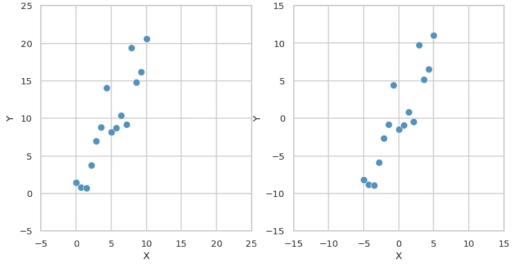
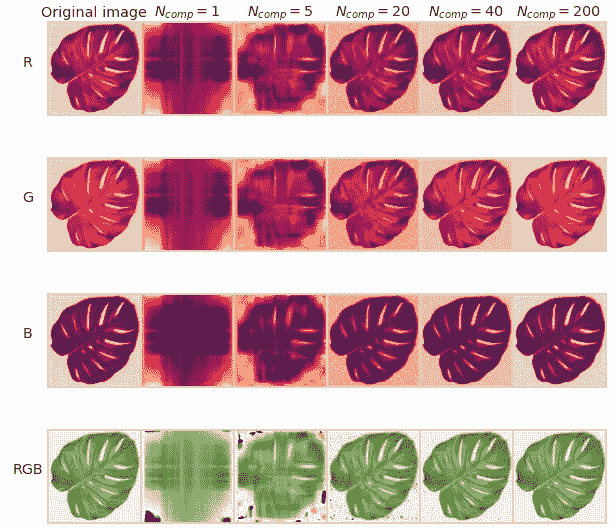

# PCA 降维:从基本思想到完全推导。

> 原文：<https://towardsdatascience.com/dimensionality-reduction-with-pca-from-basic-ideas-to-full-derivation-37921e13cae7?source=collection_archive---------11----------------------->

## 在本文中，我们将在一个简单的例子上建立一些关于维数约简和 PCA 的直觉，然后整理其背后的数学，并推导出一般情况下的算法。

主成分分析(PCA)是一种强大的算法，其思想是由卡尔·皮尔逊在 1901 年[【1】](https://zenodo.org/record/1430636#.XpGEef2A5hF)为一个数据拟合问题提出的。与最小二乘回归不同，它不依赖于哪个变量是独立的，反映了变量之间的普遍关系。主成分分析有许多应用，如噪声过滤、特征提取或高维数据可视化，但最基本的应用是数据降维。在下面的帖子中，我将从这个角度描述 PCA。

# 内容

在本文中，我们将:

*   深入了解降维。
*   在 ***2d*** 和 ***3d*** 中几乎不用数学就能建立一些关于 PCA 的直觉。
*   推导一般情况下的主成分分解。
*   总结一下 PCA 降维算法。
*   看看它如何处理图像压缩。

# **降维**的基本思想**降维**

一般意义上，降维是对原始***M***-维度数据***N***-维度子空间的一种表示，其中 ***N < M*** 。为了建立一些直觉，让我们从一个简单的例子开始。假设我们的数据是从汽车中的 GPS 传感器获取的坐标。假设它是真实世界的数据，所以它包含一些噪声。

图一。汽车坐标的二维数据，生成为 y=2*x +噪声。

因此，我们手头有二维数据，在这种情况下降低维度意味着找到数据的一维表示。这可以通过将每个点投影到一维子空间上来实现。不一定是正交投影。例如，让我们取由基向量***【b】****跨越的子空间**并使用某种投影矩阵 ***P*** 来投影我们的数据。***

****

**图 2 我们以某种方式将数据投射到低维空间。低维坐标称为代码。然后，我们可以通过子空间基向量和编码将数据重构回原始维度。**

**现在，在子空间**中，我们可以为每个数据点仅存储一个值——子空间 ***U*** 中对应的坐标λ。这些低维坐标称为 ***代码*** 。使用这些坐标λ和一个基向量 **b** 我们可以将数据重建回原始维度，结果称为 ***重建*** 。****

**你可以在这里提到，重建的数据不同于原始数据，我们可以用原始点和重建点之间的欧几里德距离来衡量这种差异。我们可以看到降维是有一定代价的，我们要付出的代价是信息损失。但它仍然有一些意义:即使使用这样的随机投影，重建的数据也反映了原始数据的一些属性:我们仍然可以看到 ***X*** 和 ***Y*** 正相关，甚至重建数据的斜率也非常接近原始数据。**

**我们使用了一些随机的无动机的投射，所以问题是“我们能做得更好吗”？我们当然可以，这就引出了 PCA 算法。但首先，在一般情况下推导它之前，让我们对它建立一个更好的理解。**

# **主成分直觉**

**在我们开始之前，让我们进行一个小的数据准备，让我们把我们的数据转移到中心(从每个维度减去平均值)。正如我们所见，这种转变似乎很有帮助。它不改变变量之间的关系，很容易回到原始数据，我们只需要添加相应变量的平均值。**

****

**图 3。数据居中:X_c= X -E[X]，Y_c = Y -E[Y]。对于逆变换，我们保持 E[X]和 E[Y]。**

**所以现在我们要进行降维，保存尽可能多的信息。我们可以用重建误差来衡量信息损失，重建误差定义为原始数据和重建点之间的平均平方距离:**

****

**这里我们需要首先提到的是，我们应该使用正交投影，以便最小化原始点和投影点之间的距离。考虑图 4 的左图:正交投影(灰色)的距离总是小于非正交投影(橙色)的距离。这可以用三角形不等式来证明，稍后我们将从另一个角度再次看到它。**

****

**图 4。正交投影可以最小化距离。现在我们需要找到最佳拟合向量 b。**

**所以我们已经介绍了投影类型，现在我们需要找到这样一个向量***【b】****，它最小化 ***L*** 。从图 4 中可以明显看出 ***b2*** 比 ***b1*** 好，但是如何在所有的中找到最好的一个呢？***

**现在让我们稍微作弊一下，跳过大部分数学运算，通过旋转基向量*并为每个向量***【b】***计算相应的重建误差，在数值上优化 ***L*** 。我还在右图中添加了投影点的方差，因此您可以注意到我们稍后将讨论的一个关键特性。***

****

**图 5 .我们旋转基向量 b 并将数据投影到相应的子空间上，然后计算重建误差 L 和投影方差 Var(λ)。**

**可以看出，通过这种方式，我们可以找到一个使重建误差最小化，同时使投影方差最大化的向量。这是一个重要的特性，所以让我们稍微关注一下:**

*   **跟随左边的动画:当我们向最优解移动时，投影(灰色)点试图尽可能远离原点。**
*   **这是因为正交距离的最小化与投影和原点之间距离的最大化是相同的。从任何蓝点到原点的距离保持固定，我们最小化正交距离(虚线),因为根据勾股定理，这与最大化从原点到投影点的距离是相同的。**
*   **投影的期望值为零(因为我们在开始时将数据居中)，从原点到投影的距离最大化也会导致方差最大化。这是一个至关重要的特征，我们将在后面的一般推导中面对它。**

**还有一件事要讨论。让我们考虑子空间(***)U2***)正交，因为我们刚刚在下图上找到(*):***

******

***图 6。我们找到的基本向量是我们数据的主要组成部分。主成分描述了大多数数据差异。***

***这些子空间上的投影是我们数据的主要组成部分。考虑图 6 中的投影方差:相应的子空间具有一个重要的性质，即第一投影包含大部分方差，而第二投影包含最小方差。它们一起描述了所有的数据差异。将总数据方差视为它们的总和，我们可以计算出子空间*描述了 97.1%的数据方差，子空间 ***U2*** 描述了 2.9%。因此，如果我们降低维数，只保留在 ***U1*** 上的投影，信息损失将仅为 2.9%。****

**让我们从一个稍微不同的角度来看看我们到目前为止所做的事情:我们用一种新的基来执行数据的正交分解，其方式是基向量之一跨越一个具有最大方差的子空间。根据[正交分解定理](https://mathworld.wolfram.com/OrthogonalDecomposition.html)我们总是可以通过某个子空间及其正交补来分解任何向量，并且在 PCA 中，我们正在搜索包含大部分数据方差的子空间。**

**比如在 ***3d*** 中我们可以找到 ***2d*** (一个平面)或者 ***1d*** (一条线)数据方差最大的子空间。考虑跨越具有最大方差的平面的两个基向量和与其正交的第三个基向量:**

****

**图 7。红线代表数据主成分。大多数数据方差可以用基于前两个主成分的平面来描述。**

**对于更高维度，很难绘制或想象所有这些，但想法是相同的:找到一个子空间(线、平面、超平面),其中包含大部分数据方差及其正交补。跨越这些子空间的向量是主分量。**

**一旦我们得到这个，我们就可以进入一个普通的案例。**

# **一般情况 PCA 推导**

**假设我们有数据***×数据*** 由 N 个*数据点组成，每个点都是一个 ***D*** 维向量:***

****

**就像前面提到的例子一样，我们希望在另一个标准正交基中分解每个数据点，以使第一组分量包含大部分数据方差。我们可以这样写:**

****

**这里 ***b*** 是我们新的基向量，β是对应的坐标。我们希望找到这样的 ***b*** 和β，使得第一个 ***M*** 基向量所跨越的子空间上的投影包含大部分数据方差。让我们回顾一下例子:**

*   **在 ***2d M=1*** 中，我们找到了一个方差最大的子空间(一条直线)，一个正交子空间包含最小方差。**
*   **在图 7 上的***3d******M = 2***中，我们找到了一个方差最大的子空间(一个平面)，它的正交补又包含最小的数据方差。**

**为了降维，我们去掉了具有最小方差的第二项，并用第一个 ***M*** 基向量来表示我们的数据:**

****

*****注****:****【x *】****仍然是一个* ***D*** *维度向量，但现在它生活在一个更小的子空间中，可以用* ***M*** *坐标描述在新的****基础上*****

****我们的目标保持不变:最小化我们定义为原始点和重建点之间的均方距离的重建误差:****

********

****但是现在我们要推导出解析解。为此，让我们重写损失函数。首先，让我们用数据在相应基向量上的点积来表示投影坐标:****

********

*******注:*** *一个人可以证明正交投影是最优解，考虑 L 关于β的偏导数并设为零，得到同样的结果。*****

****使用β的表示，我们可以将 ***x**** 重写如下:****

********

****我们可以基于同样的推理重写 ***x*** :****

********

****所以数据和重建的区别在于:****

********

****损失可以写成:****

********

****已知 ***b*** 是正交基的组成部分，得到如下:****

********

****然后我们可以重新排列总数，得到这个:****

********

****这里有一件好事:假设我们的数据居中，括号中的一项是协方差矩阵 ***S=Cov(X)*** ，所以我们可以这样写:****

********

****我们将最小化在 ***{M+1，D}*** 基础上预测的方差(这与在 ***{1，M}*** 基础上最大化的方差相同，在图 6 中概括结果)。****

****还有最后一步要走:我们要最小化 ***L*** 关于*b***b***假设**b*b***是一个标准正交基，它应该满足下面的等式:*****

********

****因此，我们手头有一个约束优化问题。这可以用拉格朗日法解决(如果你不熟悉，这里有一个[伟大的来源](https://www.khanacademy.org/math/multivariable-calculus/applications-of-multivariable-derivatives#lagrange-multipliers-and-constrained-optimization)):****

********

****为了找到 ***b*** 我们需要将拉格朗日的梯度设置为零，因此对于 ***b*** 的导数，我们得到:****

********

****最后，我们得到:****

********

****这就是协方差矩阵的特征向量问题！这意味着协方差矩阵的特征向量是主分量*(注意，由于协方差矩阵的对称性，它们是正交的)*。****

****如果我们将它们代入损失函数的最终方程，我们也可以清楚地看到相应特征值的含义:****

********

****这意味着为了使 ***L*** 最小，我们应该取一个由具有最小特征值的 ***D-M*** 特征向量构成的子空间。换句话说，对应于第一个 ***M 个*** 最大特征值的特征向量跨越具有最大数据方差的子空间。因此，如果我们按特征值降序排列特征向量，第一个特征向量将代表最大数据方差的方向，第二个特征向量将代表来自其余正交方向的最大数据方差的方向，依此类推。****

****设置 ***M=0，*** 我们可以计算最大损耗。它等于所有特征值的总和*(这是非常明显的，因为我们去掉了所有的主成分，即我们去掉了所有的信息)*。这意味着我们可以计算每个主成分中包含的方差(信息)的比率，如下所示:****

********

****这就很容易决定我们应该为降维留下多少组件。为了方便起见，我们可以绘制解释方差的比率(scree plot)及其累积比率。考虑我们已经在图 7 中看到的数据示例:****

********

****图 8 . 3D 数据示例的碎石图，第一主成分解释了约 65%的数据差异，第二主成分解释了约 25%，第三主成分解释了约 10%。****

****因此，对于这个例子，如果我们减少 1 维，去掉第三个主成分，我们将丢失大约 10%的信息(数据方差)。****

****现在我们准备定义一个用主成分分析进行降维的最终算法。****

# ****主成分分析的降维算法****

****最后是 PCA 算法，用于由*数据点组成的数据 ***X*** ，其中每个点是一个 ***D*** 维向量:*****

********

1.  ****首先，我们需要集中我们的数据:****

********

****2.然后我们计算中心数据的协方差矩阵 ***S*** 并找到它的特征向量 ***b*** 和特征值λ。****

********

****3.按对应的特征值降序排列特征向量。****

****4.然后我们从第一个**(M<【D】**特征向量形成矩阵 ***B*** 并进行降维:******

********

****5.对于逆变换，我们需要回到原始空间(寻找投影)并将数据从中心移回，加上平均值:****

********

# ****龟背竹压缩示例****

****我们已经做了很多工作，所以让我们玩得开心点。还记得特色图片中的龟背竹吗？让我们用 PCA 压缩它。它是[225，255，3] RGB 图像，因此我们可以分别对每个通道应用 PCA，并探索不同数量的主分量的解释方差。****

********

****图 9 解释了不同颜色通道的差异。****

****请注意，完全分解由 255 个分量组成，同时第一个分量解释了 40%以上的方差，前 40 个分量解释了大约 99%的方差。因此，我们可以使用大约 6 倍的较小表示来压缩图像，并且能够以接近零的损失来重建图像。让我们看看它是什么样子的:****

********

****图 10。使用 PCA 压缩的图像重建示例。****

# ****编后记****

****到目前为止，我们已经想出了一个基本的 PCA 算法，并用其中一种可能的方法推导出了它。除了基本 PCA，还有其他更具体的实现，如稀疏 PCA、鲁棒 PCA、内核 PCA 等。其中一个扩展是从称为概率 PCA 的潜在变量模型的角度来看的 PCA，我很想写一篇关于它的帖子。敬请关注更新。感谢阅读！****