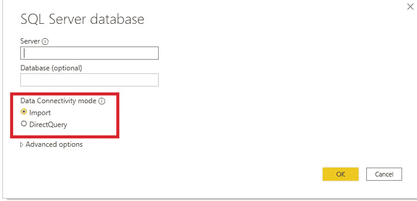
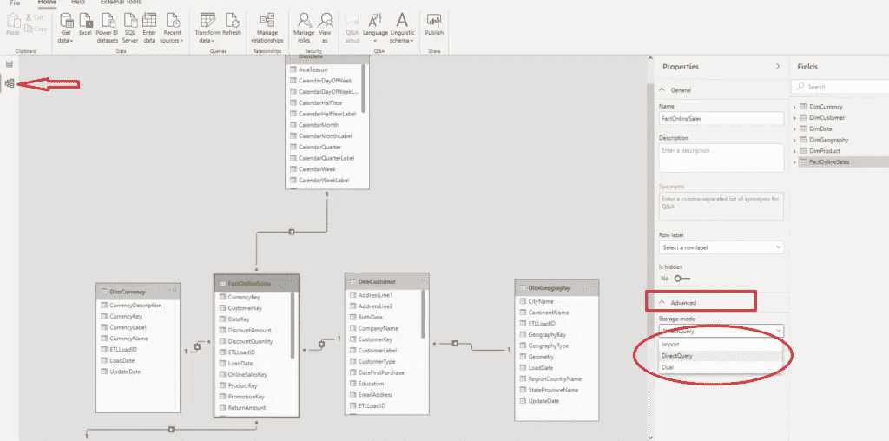
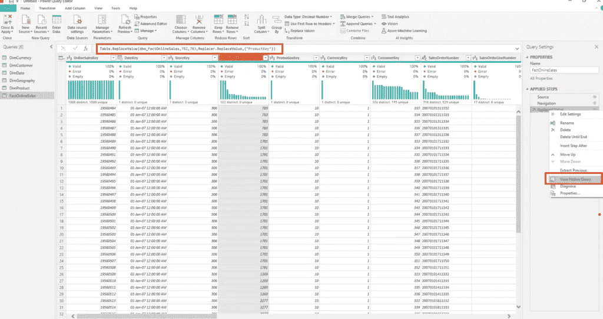
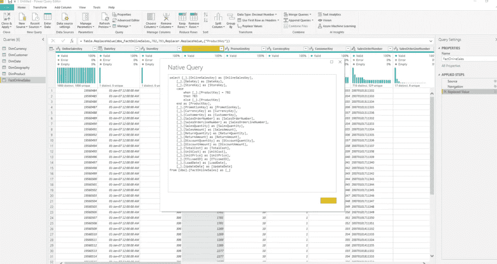
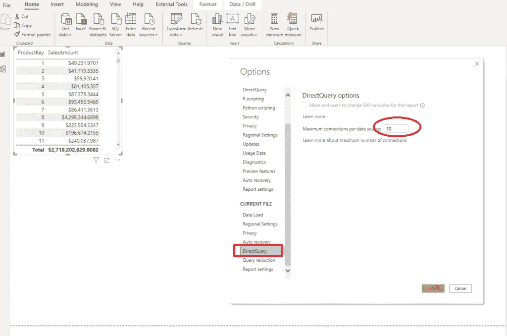
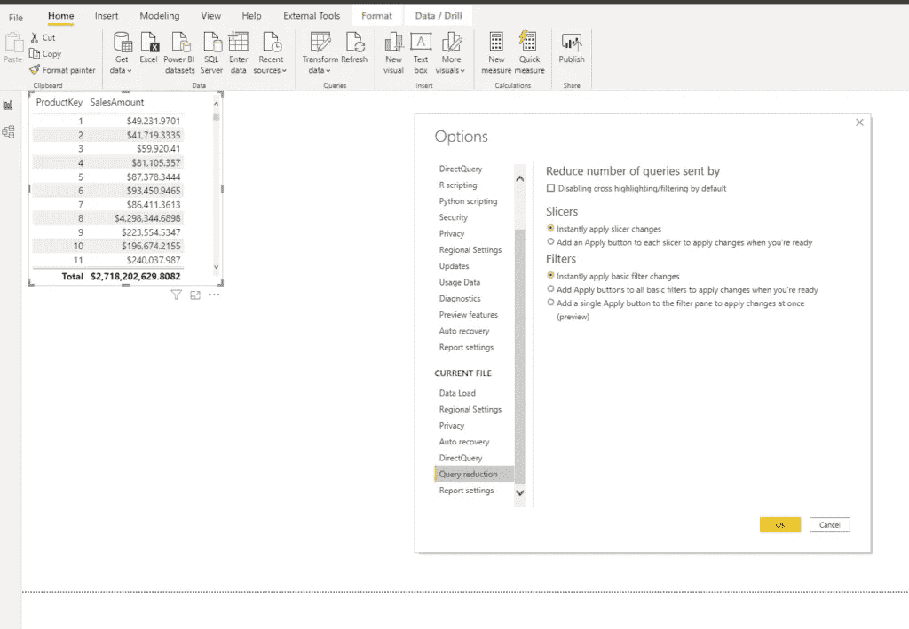

# Power BI 中的直接查询—什么、何时以及为什么？

> 原文：<https://towardsdatascience.com/direct-query-in-power-bi-what-when-why-8180825812d2?source=collection_archive---------5----------------------->

## 关于 DirectQuery 您想知道但不敢问的一切！导入模式的 Power BI 替代方案的最终指南

皮查拜在 Pexels.com 拍摄的照片

使用 Power BI 时，您需要首先做出以下决定:

一旦您计划获取一些数据，Power BI 会要求您选择数据连接模式。如果您已经阅读了[这篇文章](/how-to-reduce-your-power-bi-model-size-by-90-b2f834c9f12e)，或者更好，从[这篇文章](/vertipaq-brain-muscles-behind-power-bi-eecd6c8891e3)开始，您可能会熟悉导入选项，以及表格模型如何在 Power BI 的背景下支持您的查询并生成闪电般快速的报告。

在本文中，我想更深入地研究 DirectQuery 选项，因为我感觉这个选项仍然没有得到充分利用(不管是好是坏，我们将在本文中进行探讨)。

## 什么是 DirectQuery？

顾名思义，DirectQuery 是一种检索数据的方法，它在查询时间 直接从数据源 ***中提取数据！这句话的最后一部分掌握着关键—虽然导入模式将数据的快照存储在内存中，但 DirectQuery (DQ)不存储任何数据。对于每一个请求，它都直接进入数据源(在 99%的情况下是 SQL 数据库)，并从那里提取数据。***

***因此，在查询执行之前、期间和之后，数据都驻留在其原始源中！***

在与报表交互时，您的用户会生成一个查询(或者大多数情况下是一组查询)，需要执行该查询才能满足请求。您可能还记得本文中的[，表格模型由公式引擎(FE)和存储引擎(SE)组成。Formula Engine 接受请求，创建查询计划，然后根据您在 Import 和 DirectQuery 模式之间的选择，生成针对相应数据源的查询。](/inside-vertipaq-in-power-bi-compress-for-success-68b888d9d463)

Pexels.com 上 Lum3n 的照片

您可能会注意到，当您选择 DQ 选项时，公式引擎会将 DAX“翻译”为 SQL，并将查询直接发送到数据源。

一旦选择了 DirectQuery 选项，Power BI 将不会从底层表中导入数据。它将只保存它们的元数据。

好消息是:您可以在 Power BI 中使用复合模型。简而言之，这意味着您可以在数据模型中结合 DQ 和导入模式，为每个表设置首选选项！

正如您可能看到的，一旦我使用 DQ 选项创建了 Power BI 数据模型，当我在 model 视图中打开我的数据时，在 Advanced 下，我可以选择对所选表应用哪种存储模式。*重要提示*:您可以从直接查询模式切换到导入模式，但不能从导入模式切换到直接查询模式！

双重模式就像一个混合体——导入模式和 DirectQuery 的结合。表中的数据被加载到内存中，但是在查询时，也可以直接从源中检索。

## 什么时候使用 DirectQuery？

老实说，这是一个“百万美元”的问题:)…而且，和大多数情况一样，唯一正确的答案是: ***【看情况】*** 。但是，让我们看看这取决于什么！

乔治·贝克尔在 Pexels 上的照片

*   您需要“实时”或接近实时的数据吗？如果您对这些问题的回答是:是的，您应该考虑使用 DirectQuery 模式。为什么？因为，导入模式会保存数据的快照，并且需要定期刷新以获取最新数据。例如，如果您需要最大延迟为 1 分钟的数据，使用导入模式实际上是不可能的
*   您的数据模型规模大吗？我说的大，就是大！大到你无法在最大限度内容纳它。pbix 文件大小(专业版许可 1 GB，高级版/嵌入式版 10 GB)。假设您的用户需要在高粒度级别上分析十亿行表中的数据。您不能简单地将十亿行的表数据导入到表格模型中，相反，数据会保留在源中，并且在细化的结果返回到报表之前，您的聚合/计算会在源中执行

## 为什么(不)使用 DirectQuery？

如果您的工作负载需要上述场景之一(“实时”分析和/或过大的数据模型)，DirectQuery 将是一个显而易见的选择。

但是，让我们研究一下在更频繁的情况下使用 DirectQuery 的一些一般优缺点:

使用 DirectQuery 时最重要的考虑是，整体用户体验几乎完全取决于底层数据源的性能。这意味着，如果您的源数据库没有针对分析工作负载进行优化(缺少索引；不适当的索引；数据建模不充分，以至于查询需要针对多个表)，您的报表性能会很差！

此外，与报告并行交互的用户数量也会产生影响。想象一下这样一个场景，10 个人浏览带有 20 个视觉效果的报告页面——这将同时生成对底层数据源的 200 个查询！请记住，每个可视化将生成(至少)一个对数据源的查询！

此外，如果您有机会通过应用不同的技术来改善这两个方面，您还应该记住，有些事情是您无法控制的，例如:

*   *源服务器的性能* —例如，如果在同一台服务器上运行数十种不同的工作负载，您将无能为力
*   *网络延迟*

## 优化数据源的技术

正如我上面提到的，有不同的技术可以提高数据源的性能(假设您可以访问底层数据源，并且可以应用结构性更改)。

皮查拜在 Pexels.com 拍摄的照片

*   ***添加合适的索引***——支持你最详尽的查询。您应该考虑为大型分析工作负载创建[列存储索引](/rows-or-columns-where-should-i-put-my-index-on-65d429692dee)，但是设计良好的 B 树索引也应该提高性能
*   ***数据完整性到位*** —确保维度表包含正确的键，并且这些键与事实表相关(每个事实表键值在维度表中都有相应的值)
*   ***在源数据库*** 中创建持久对象——这意味着，尝试物化所有的聚合、转换和计算，无论是在特殊的表中还是在[索引视图](https://docs.microsoft.com/en-us/sql/relational-databases/views/create-indexed-views?view=sql-server-ver15)中。这样，Power BI 可以从一个地方检索所有数据，而不是每次执行查询时都执行复杂的操作(比如多个表之间的连接)
*   ***使用源系统*** 中的数据表——每一个(合适的)数据模型都应该依赖一个[单独的日期维度](/tiq-part-1-how-to-destroy-your-power-bi-model-with-auto-date-time-8fec32b22aff)。确保您已经在数据库中建立了[日期表](/tiq-part-3-ultimate-guide-to-date-dimension-creation-98b951ffa68c)

## Power BI 和 DirectQuery 最佳实践

一旦您使用了 Power BI，在使用 DirectQuery 模式时，您应该坚持以下最佳实践:

*   ***避免复杂的 Power Query 转换*** —每次将转换应用到数据模型时，Power Query 都会生成一个查询并将其发送到源数据库。假设我想用 783 替换我所有的 ProductKey 值 782。如果我在超级查询编辑器中这样做，会发生以下情况:

您可以看到 Power Query 为满足我们的请求而生成的 M 语句，但是如果您右键单击该步骤并选择 View Native Query 选项，您还可以看到将被发送到 SQL Server 数据库的 SQL 查询:

现在，对于这些简单的转换，Formula Engine 足够智能，可以在一次迭代中完成所有工作。但是，如果您执行一些更复杂的东西，打开 SQL Server Profiler 或 DAX Studio，看看有多少请求被发送到您的源数据库…

*   如果您需要使用 ***计算列*** ，请尝试将它们的创建推送到源数据库并保持它们的持久性
*   避免复杂的 DAX 度量——由于您的 DAX 语句需要“翻译”成 SQL，请记住，此过程可能会产生昂贵的 SQL 查询。同样，只要有可能，在源端执行所有的计算
*   避免 GUID 列(唯一标识符)上的关系— Power BI 不支持这种数据类型，需要在查询执行期间应用一些数据转换，这会影响性能。解决方案是在 Power BI 生成自己的查询之前，在源数据库中转换这种数据类型
*   尽可能限制并行度—您可以定义 DQ 可以同时打开的最大连接数:

如果转到“选项”,在“当前文件”下，可以为每个数据源的最大连接数指定一个值(默认为 10)。

*   在 Power BI 报告中，几乎没有额外的优化选项:

这些选项中的大多数都是不言自明的。基本上，您可以限制切片器和过滤器，因为默认情况下，当您更改一个切片器值时，所有切片器都会生成对数据源的查询(即使是那些没有更改的数据)！

因此，您可以添加“应用”按钮，以便用户可以具体选择需要刷新的数据部分。当然，这将影响您的报表设计，因为您需要为这些按钮提供额外的空间:

你还应该仔细想想报表页面上的 [***视觉效果的数量***](/how-i-speed-up-my-power-bi-report-5x-155255415895) —视觉效果越多，数据检索所需的时间就越长。

最后，你应该 ***关闭视觉效果之间的交叉高亮和交叉过滤*** ，因为这将减少生成的查询数量。您可以在整个报告级别上关闭这些功能(在选项- >查询缩减- >中，选中选项:默认情况下禁用交叉突出显示/过滤)，或者仅针对特定视觉效果关闭这些功能。

还有一个非常重要的建议— ***与您的用户*** 交谈，尝试向他们解释导入模式和 DirectQuery 之间的区别，他们使用这两种模式中的每一种可以获得什么好处，以及预计会有哪些缺点(尤其是在选择 DQ 模式时)。

## 结论

正如你自己可能得出的结论: ***如果你正在考虑使用 DirectQuery，为工作选择正确的工具*** 是最好的建议。

在做出最终决定之前，请仔细评估您的潜在工作负载，并尝试确定导入和 DirectQuery 方法的所有优缺点。

感谢阅读！

[成为会员，阅读媒体上的每一个故事！](https://datamozart.medium.com/membership)

订阅[这里](http://eepurl.com/gOH8iP)获取更多有见地的数据文章！

[https://youtu.be/7dssvnKEmCA](https://youtu.be/7dssvnKEmCA)