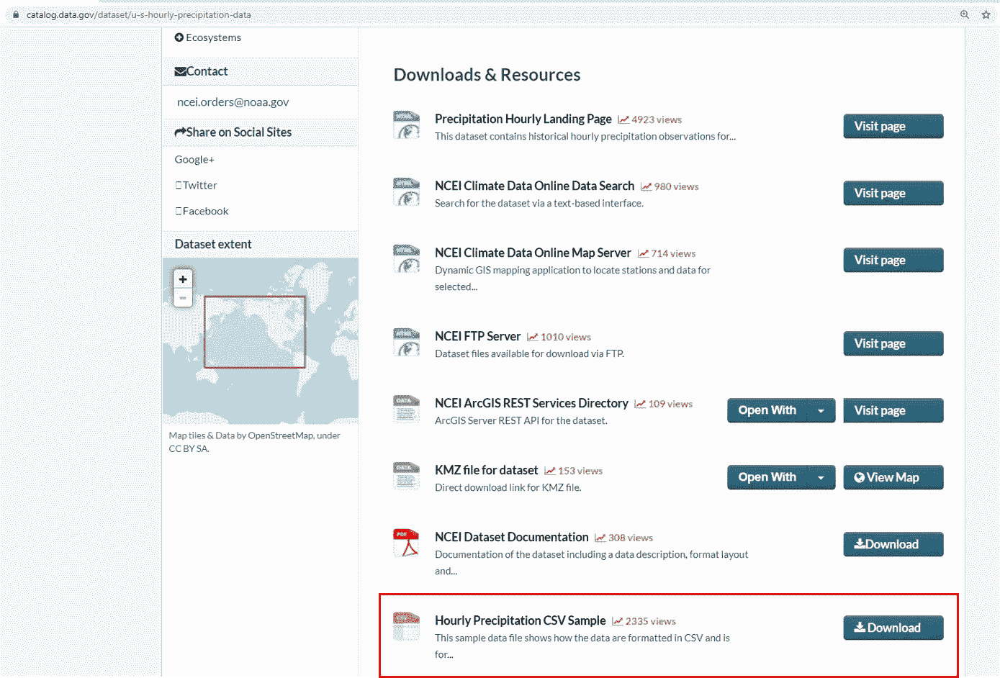
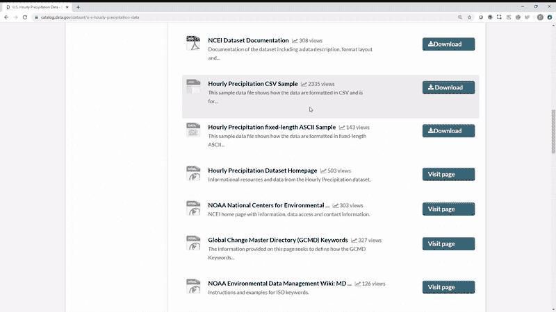
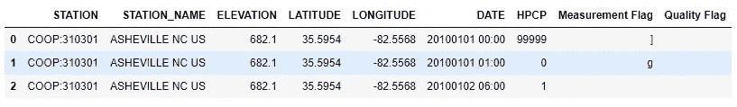
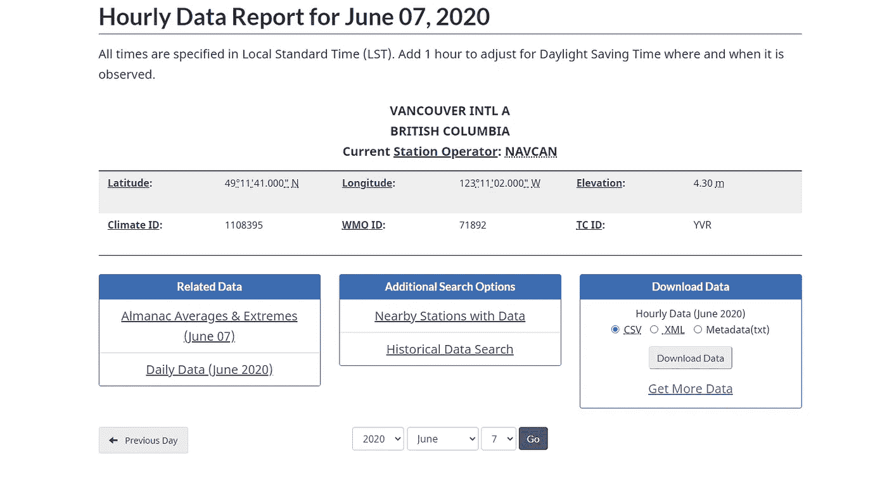
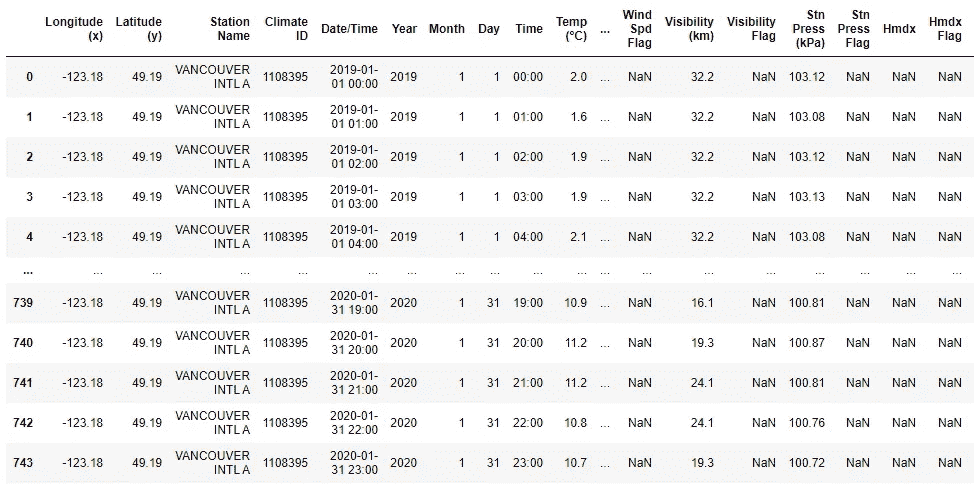

# 直接到熊猫数据框

> 原文：<https://towardsdatascience.com/direct-to-pandas-dataframe-ab2e97ae7574?source=collection_archive---------43----------------------->

## 使用 Chrome DevTools 和 Python 直接从远程 URL 下载和读取数据到熊猫数据框架的 3 分钟指南

照片由[帕特里克·福尔](https://unsplash.com/@patrickian4?utm_source=medium&utm_medium=referral)在 [Unsplash](https://unsplash.com?utm_source=medium&utm_medium=referral) 拍摄

# 挑战

对于新的数据科学家和软件开发人员来说，从远程 URL 下载数据通常是自动化的首要任务之一。例如，在下图中，我想下载并解析来自 Data.gov[的*每小时降水量 CSV 样本*数据，并将其直接解析到熊猫数据帧中。](https://catalog.data.gov/dataset/u-s-hourly-precipitation-data)

**问题是不清楚如何找到下载按钮重定向到的 URL 路径。**

# 查找远程 URL 路径

使用 Chrome DevTools(或类似工具)并遵循以下步骤，很容易找到远程 URL 路径。

1.  导航到要下载数据的页面。
2.  用*右键打开 Chrome DevTools 检查*或导航到 *Chrome 菜单→更多工具→开发者工具*。
3.  在 Chrome 开发工具中导航到控制台。您可能会在控制台中看到文本，可以使用*右键→清除控制台来清除。*
4.  打开控制台，点击下载按钮或类似按钮。
5.  下载按钮重定向到的 URL 路径现在显示在控制台中。

使用 Chrome DevTools 控制台查找 URL 路径

# **直接下载数据到熊猫数据框**

一旦找到远程 URL 路径，就很容易将数据读入 Pandas 数据帧。下面的代码演示了如何解析 CSV 文件，但是对于 JSON、Excel 和其他文件类型来说，这样做也很容易。

从远程 URL 直接读取数据到熊猫数据框

上述代码的输出

# 直接批量下载到熊猫数据框

通常你不会自动下载单个文件，而是从一个远程 URL 下载一批文件。例如，下图显示了温哥华国际机场每小时天气数据的[下载门户](https://climate.weather.gc.ca/climate_data/hourly_data_e.html?hlyRange=2013-06-11%7C2020-06-07&dlyRange=2013-06-13%7C2020-06-07&mlyRange=%7C&StationID=51442&Prov=BC&urlExtension=_e.html&searchType=stnName&optLimit=yearRange&StartYear=1840&EndYear=2020&selRowPerPage=25&Line=39&searchMethod=contains&Month=6&Day=7&txtStationName=vancouver&timeframe=1&Year=2020)。问题是下载时间为 1 个月，所以如果我想下载 1 年的数据，我需要下载 12 次。

让我们检查一下*下载数据*按钮使用 Chrome DevTools 控制台重定向的远程 URL。

> [" https://climate . weather . GC . ca/climate _ data/bulk _ data _ e . html？format = CSV&station id = 51442&Year = 2020&Month = 6&Day = 7&time frame = 1&submit =下载+数据](https://climate.weather.gc.ca/climate_data/bulk_data_e.html?format=csv&stationID=51442&Year=2020&Month=6&Day=7&timeframe=1&submit=Download+Data)

注意，除了其他唯一标识符之外，还有下载年、月和日。因此，让我们编写一个简短的脚本来下载 1 年的数据，并将其合并到一个单一的熊猫数据帧中。

从远程 URL 读取多个文件的数据并合并

上述代码的输出

# 结论

Pandas 是任何数据科学家的必备工具，Chrome DevTools 是工具箱中的绝佳补充。按照上面的步骤，很容易将数据直接下载到 Pandas 数据框架中，并且很容易将其扩展到其他文件类型。

编码快乐！