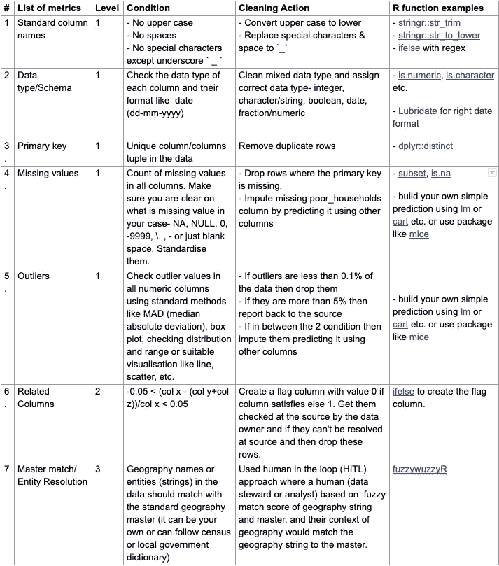
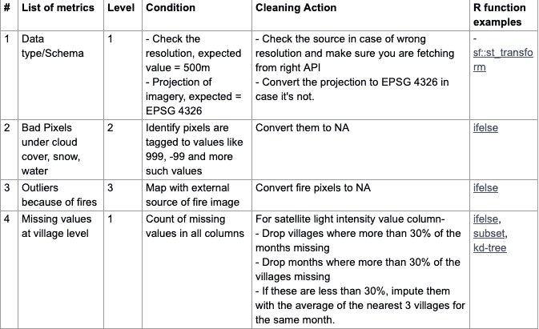
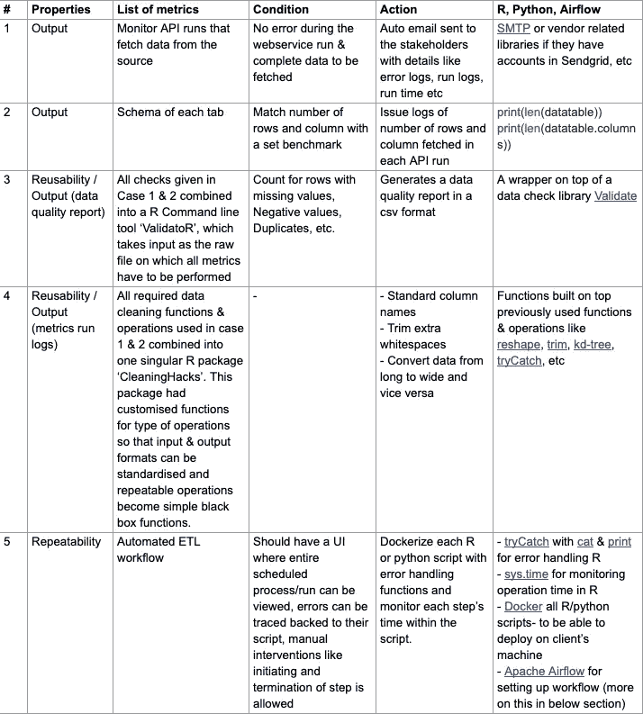
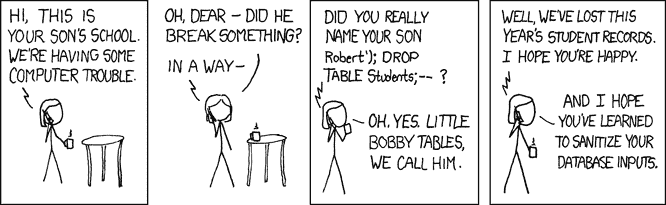

# 脏数据—质量评估和清理措施

> 原文：<https://towardsdatascience.com/dirty-data-quality-assessment-cleaning-measures-39efb90ad734?source=collection_archive---------23----------------------->

在《坏数据手册》一书中，伊森·麦卡勒姆说得对，“我们都说我们喜欢数据，但我们在乎的不是数据，而是我们从中获得的见解。”然而，数据分析师只能将 20%的时间投入到从数据中产生洞见的艺术和科学中。他们剩下的时间花在构建和清理数据上😫

为了最大限度地减少数据清理的时间投入，需要适用于不同行业、职能部门和领域的不同数据和业务用例的标准化框架和工具。

这个博客旨在让你具备构建和执行这种标准化数据质量框架所需的知识，这些框架适用于你的数据和用例。我们将重点关注:

1.  数据质量和数据清理的基本概念，以及如何根据您的数据周期需求构建一个框架。
2.  使用适合您的数据质量和清理流程的工具和技术快速跟踪执行。

# I/什么是数据质量和数据清理？

***数据质量*** *是通过检查不一致、不准确、不完整或不合理的数据值来评估数据质量的方法。*

***数据清洗*** *是根据数据的质量来修正数据的方法。*

数据质量和清理方法循环运行，直到我们达到所需的数据质量状态。用例以及数据属性定义了这个过程的所有组成部分:比如要测量的数据度量或者检查的数量、需要的自动化程度、错误处理的复杂度等等。

*例如，一个组织的销售数据每天为销售、营销和增长团队的多个仪表盘提供动力。这些团队中的每一个都依赖于底层数据的准确性。在这种情况下，流程应该包含所有可能的检查，维护可共享的数据质量报告，并运行日志来追溯错误。然而，如果我们使用除我们之外的任何人都不会使用的广告数据进行特定的分析，那么数据检查只需要应用于对该分析至关重要的表的相关列。*

## 数据质量(DQ)指标

数据质量和清理都在一个共同的线程上运行，我们喜欢称之为**数据质量** **(DQ)** **指标**。它们奠定了评估质量和定义清洁措施的基础。每个指标就像一个 Q & A，每个响应都有一个相关的动作。

例如，X 列中缺失观测值的计数是一个 DQ 度量。此指标的值有助于评估数据质量，并相应地构建清理操作，例如用 X 的中值替换 X 中所有缺失的值。

# II/如何建立数据质量和清理流程？

要构建您的数据质量流程，理解以下数据属性和相关用例至关重要，这些属性和用例决定了您的整个数据质量和清理过程。

1.  **模式:**数据的模式包括 R*C 矩阵形式的数据大小和列的数据类型(字符串、整数、日期等)。关于图式[的有趣讨论在这里](https://stackoverflow.com/questions/298739/what-is-the-difference-between-a-schema-and-a-table-and-a-database)。
2.  **数据来源:**导入导出来源。例如:数据库、数据仓库、数据湖、API、设备文件、商业智能工具等。和文件扩展名，如。xlsx，。csv，。shp，。兽人，。拼花地板。pdf，。tiff 等。
3.  **数据上下文:**数据所有者、原始数据源(数据收集或进入系统的方式)、数据谱系、所有必需的列及其元单元、预期值或范围、相互关系等方面的数据上下文。越多越开心。
4.  **用例:**干净数据支持的用例的上下文。这是非常重要的，但困难和费时，所以要聪明。从业务涉众那里了解数据的主要用例，并相应地构建您的流程。
5.  **规模:**数据的规模包括过去、当前和未来数据表的规模，尤其是当数据更新且过程可重复时。
6.  **技术堆栈:**用户对工具的偏好，包括代码工具与非代码工具、开源软件与付费软件、所需的自动化水平、现有的数据工具&软件以及资源投资。
7.  **输出:**理想的输出结构。例如:干净数据表的结构，数据质量报告，错误表，日志等。
8.  **可重用性:**对数据质量可重用性水平的需求&清理代码，确定所需的自动化水平。人们可以使用 excel 清理静态数据表，编写快速代码来清理多个相似的文件，用 R/python 构建多用途黑盒库或函数，以便团队使用。
9.  **可重复性:**整个数据质量的可重复性&清洗过程取决于相同数据表的更新频率，例如，一家快速消费品公司的销售数据每天都会刷新。这包括选择工具来构建协调的数据清理工作流、数据质量分析或报告、错误处理、运行日志维护等。

# III/确定数据质量(DQ)指标列表

它以一个简单的问题开始:这个数据集会出什么问题？**模式、数据格式、数据上下文、用例以及输出**:这些是数据&用例的属性，将有助于回答这个问题，并建立您的 DQ 度量的详尽列表。

根据我们的经验，我们将 DQ 指标分为三个级别:

**级别 1** :不管数据集类型或用例的类型如何，都应该检查通用的 DQ 度量。几个例子:

*   数据类型/模式
*   缺少值
*   唯一主键
*   极端值
*   负值等。

点击 阅读更详细的一级 DQ 指标 [**。**](https://medium.com/@shilpaarora992/detailed-level-1-data-quality-dq-metrics-a6ceb2d1b6dd)

**级别 2** :不同数据集和用例的上下文检查。例如:

*   列关系-列应遵循其预期的关系，如人口普查数据文件中的人口列值不能小于家庭列值。
*   上下文数据范围-基于数据的上下文，测试期望值或值的范围，例如，如果数据是从 2014 年开始的，则日期不能在 2013 年之前。

**级别 3** :比较检查，将数据表与理想或主数据表进行比较。

*   主匹配/实体解析-检查地理名称、产品名称、电子邮件域等实体。对照标准主文件剔除不良名称并用正确的名称替换它们。

# IV/数据质量(DQ)指标的执行

除了一系列 DQ 度量标准，关于属性的知识，如**可重用性、可重复性、规模和技术堆栈**有助于执行 DQ 度量标准来评估质量，并相应地选择正确的工具集&技术来清理数据

为了更好地说明这一点，我们采用了三个场景，类似于我们过去遇到的场景，它们具有这些特征的不同组合，来演示不同的执行方法和手段。

## [案例 1] —创建一次性仪表板来显示国家电力计划的进度

国家电力计划的数据是印度所有地区的月度时间序列数据。xlsx 格式(2 个小于 25k 行的文件& 15 列)。由于它是为一次性用例创建的(用于会议中的演示)，所涉及的任务没有**可重复性。**然而，无论如何，该过程最好是**可重复使用/可再现的**，以便在达到最终期望输出之前考虑数据处理的多次迭代。

**解决方案:**

完成这项任务的最合适的工具可以是一个**无代码开源工具，也可以是 R** 中的一个脚本(由于我们对这种语言的熟悉程度)，它将生成一个 **CSV** ，进而驱动一个 **R 闪亮的仪表板。**

我们使用 R 来评估数据质量，并为我们的 R shiny 仪表板生成干净的结构化文件。

> [链接](https://airtable.com/shrxJmNVsejvMepG6)到与其相应的 web 链接一起使用的 R/python 函数列表。

或者，您也可以使用:

1.  [MS Excel](https://support.office.com/en-us/article/quick-start-create-a-macro-741130ca-080d-49f5-9471-1e5fb3d581a8):Excel 的宏功能可以自动执行可重复的功能，如找出缺失值、删除重复数据等。并安装额外的插件，如模糊的地理主匹配。
2.  [Tableau](https://www.tableau.com/en-in/products/desktop/download) : Tableau 既有可视化&数据清理工具——假设你愿意用 Tableau 代替 R shiny。你还是得做一场地理大师赛。
3.  如果你喜欢无代码的方法，那么这是一个很好的选择，因为它将 UI 命令转换成 R 代码片段，可以存储并在以后使用。

## [案例 2] —创建一个显示进度指标的控制面板，并使用通过卫星图像捕获的外部代理指标进行分析和验证。

在这种情况下，方案数据在村庄级别(60 万以上的印度村庄)持续 5 年，每月卫星图像的粒度是印度村庄的 10 倍。因此，**数据量很大**，输入数据格式多种多样—**CSV 和地理空间栅格(图像)，**输出仪表板需要一个带有数据表的 shapefile，以便能够绘制地图，并且我们要求清理代码可重复使用**。**

**解决方案:**

在这种情况下，我们使用 R，因为它可以处理 CSV 以及空间矢量和栅格格式。我们也更喜欢使用 QGIS，因为它非常适合视觉验证。以下是除案例研究 1 中提到的检查之外，我们对卫星图像和地理标记村庄数据文件进行的一些额外检查。

> [将](https://airtable.com/shrxJmNVsejvMepG6)链接到与其对应的 web 链接一起使用的 R/python 函数列表。

或者，您也可以使用:

1.  Python:在这种情况下，使用 R 或 python 没有区别。它只是基于分析师的偏好和技能。
2.  ArcGIS:对于所有的空间/卫星操作和可视化来说，它是一个伟大的无代码选项，但它是一个付费许可软件。

> ***加成*:在 R**-【https://atlan.com/courses/introduction-to-gis-r/】学习 GIS

## [案例 3] —创建一个实时仪表盘，每月使用方案和卫星图像数据进行更新，无需任何人工干预。

在这种情况下，亮点是自动化的 ETL 工作流，它将为实时仪表板提供动力。除了我们在案例 I 和案例 II 中涉及的检查，我们还需要做出正确的决策，并对以下数据和用例属性执行:

*   全自动**可重复**和**可重用**流程，用于提取/导入数据、运行转换(数据结构化、DQ 指标、清理操作)以及在仪表板中加载/导出数据(ETL 工作流)。所有这些将以不同的频率运行(每周、每月和每年)。
*   通过 API(JSON 和 XML 格式)处理**输入**，过去的数据存储在 AWS cloud 和 mysql DB 中。
*   管理**日益增长的** **大规模数据**(5 年内每月约 400 万行 x 400 列)和 DQ 指标。这是因为存在更多数量的方案，因此需要检查更多这样的 DQ 度量。
*   **所需的输出**不仅仅是每月的干净数据文件，还有错误日志、运行日志、数据质量报告和错误表。
*   改变**技术堆栈**以实现上述所有要点。

为实现这些特性而采取的附加措施列表-

> [将](https://airtable.com/shrxJmNVsejvMepG6)链接到 R/python 函数列表，这些函数与相应的 web 链接一起使用。

Docker 是一个开源工具，可以帮助开发一个与机器无关的应用程序或一组脚本。Docker 引入了容器概念，这是一个标准化的软件单元，允许开发人员将他们的应用程序与其环境隔离开来，解决了“但它可以在我的机器上工作”的头痛问题。由于我们的 ETL 过程是在我们的系统上构建的，但是应该在客户的系统上运行，所以需要对它们进行分类。点击了解更多关于 docker [的信息。](https://djangostars.com/blog/what-is-docker-and-how-to-use-it-with-python/)

[Apache Airflow](https://airflow.apache.org/) 是支持该数据管道自动运行的系统，并向用户提供 UI 来查看日志、监控管道等。这是一个开源的工作流程管理工具，由 Airbnb 于 2008 年启动。在我们的例子中，每个方案都是一个独立的工作流或 DAG(直接无环图),每个都由不同的节点组成。每个节点执行一个步骤:从 API 获取数据、存储数据、检查数据、清理和转换数据，最后将最终输出写入指定的目的地。可以有多个输入和输出到达和去往不同的源。对于每个节点，我们可以跟踪它运行了多长时间，或者运行失败了多少次，等等。评估仪表板上的数据更新所需的净时间。

这种设置也有助于将项目轻松移交给其他团队，他们将来会负责监控和更新 scheme 的数据。要了解更多关于气流的信息，请查看这个博客:[如何在 Apache Airflow 中创建工作流来跟踪印度的疾病爆发](https://www.vinayakmehta.com/2018/06/18/apache-airflow-disease-outbreaks-india/)。此外，日志和警报在此设置中至关重要，因为它们有助于故障排除和准确识别问题所在的步骤。我们可以在 R 和 Python 中使用简单的、描述性的打印语句和其他日志库，如 [log4r](https://cran.r-project.org/web/packages/log4r/) 、[日志](https://docs.python.org/2.6/library/logging.html)、 [tryCatch](https://www.rdocumentation.org/packages/R.oo/versions/1.2.7/topics/trycatch) 。

或者，现在市场上有一些有趣的工具可以帮助你用更少的资源更快地构建一个类似的过程

1.  Python:这是一种开源语言，可用于构建数据质量指标，并通过设置端到端 ETL 工作流来自动化其运行过程。虽然它适用于数据和用例规模不是如此之大的情况，但是没有资源编排或在外部机器上部署脚本，并且您或您的项目同事非常了解 python——那么 python 可以在某种程度上解决可重复性问题。查看这些关于这个主题的好文章，给 mac 或 linux 用户和 windows 用户。
2.  [Alteryx](https://www.alteryx.com/) :在 ETL 工具类别中，Alteryx 是市场上的一个既定名称。您可以使用大量可用于表格和空间数据的数据转换节点和质量度量来设置工作流，同时提供易于使用的错误处理和其他工作流管理流程。它有一些限制，如:与 Mac 或 Linux 不兼容(只有一个 Windows 兼容的桌面应用程序)或数据大小的挑战，这取决于您的 PC 或笔记本电脑在测试&构建工作流时的配置。根据您的预算和需求，您还可以查看类似的产品，如 [Informatica](https://www.informatica.com/in/) 、 [Talend](https://www.talend.com/) 、[datataiku](https://www.dataiku.com/)等。
3.  [Atlan](https://atlan.com/workflows/) : Atlan 是一个云优先的现代数据质量管理工具&。就构建和维护数据工作流而言，您几乎可以做上面讨论的所有事情——完全不需要了解 docker 或 apache airflow，也不需要工程师的帮助。您可以根据您的数据使用其数据质量&清理建议来测试数据质量，也可以使用其度量库定义您自己的自定义数据检查，或者使用 SQL、regex 等构建您自己的度量。虽然在图像数据上构建数据质量检查在该产品上还不可用。由于 Atlan 是作为 web 应用程序部署的，因此不存在操作系统兼容性问题。*免责声明:安基塔和我目前都在 Atlan 工作，所以不要质疑我们的偏见。*😛

# 五.结论

在这篇博客中，我们试图揭开数据清理和质量实际需要什么的神秘面纱，这样你就可以最大限度地利用你的时间。在开始分析或建模部分之前，列出数据质量指标及其相关的数据清理活动有助于预先发现数据问题并优化清理工作。对可用工具和产品的了解有助于您学习和选择适合您的技能和团队技术的工具和产品。

> 无论数据有多大，只有质量好，才能产生有用的见解。否则，就等于垃圾进，垃圾出。

来源:[讲解 xkcd](https://www.explainxkcd.com/wiki/index.php/327:_Exploits_of_a_Mom)；许可证: [CC BY-NC 2.5](https://creativecommons.org/licenses/by-nc/2.5/#)

**接下来的步骤:** *岗位数据清洗和质量是最期待的部分，数据分析，统计&机器学习。为了下一步，我们创建了一个关于统计和机器学习的 python 课程。*

*我们的 Github repo****'***[***简介 _ to _ Statistical _ Learning _ summary _ python***](https://github.com/shilpa9a/Introduction_to_statistical_learning_summary_python)***'****总结本书《* [*统计学习简介》由 Daniela Witten、Trevor Hastie、Gareth M. James、Robert Tibshirani*](https://www.ime.unicamp.br/~dias/Intoduction%20to%20Statistical%20Learning.pdf) *编写，并将其变成一门 python 课程这本书的每一章都被翻译成一本 jupyter* [*笔记本*](https://github.com/shilpa9a/Introduction_to_statistical_learning_summary_python/tree/master/notebook) *用概念总结、数据& python 代码来练习。*

***欲知该系列更多脉络，请通读其*** [***简介***](https://medium.com/@shilpaarora992/data-science-for-analytical-minds-introduction-8900b8d2477f) ***为好。***

## 有趣的资源可以查看-

***数据清洗概念-***

1.  [http://www . unofficialgogledatascience . com/2016/10/practical-advice-for-analysis-of-large . html](http://www.unofficialgoogledatascience.com/2016/10/practical-advice-for-analysis-of-large.html)
2.  [http://2.droppdf.com/files/GU2nI/bad-data-handbook.pdf](http://2.droppdf.com/files/GU2nI/bad-data-handbook.pdf)
3.  [https://www . Reddit . com/r/data science/comments/fzweaf/my _ giant _ data _ quality _ check list/？UTM _ source = share&UTM _ medium = IOs _ app&UTM _ name = iossmf](https://www.reddit.com/r/datascience/comments/fzweaf/my_giant_data_quality_checklist/?utm_source=share&utm_medium=ios_app&utm_name=iossmf)

***数据清理工具列表-***

1.  [https://www.kdnuggets.com/software/data-cleaning.html](https://www.kdnuggets.com/software/data-cleaning.html)
2.  [https://www . analyticsvidhya . com/blog/2016/09/18-free-explorative-data-analysis-tools-for-people-dont-code-so-well/](https://www.analyticsvidhya.com/blog/2016/09/18-free-exploratory-data-analysis-tools-for-people-who-dont-code-so-well/)

***数据清洗在 R-***

1.  [https://cran . r-project . org/doc/contrib/de _ Jonge+van _ der _ Loo-Introduction _ to _ data _ cleaning _ with _ r . pdf](https://cran.r-project.org/doc/contrib/de_Jonge+van_der_Loo-Introduction_to_data_cleaning_with_R.pdf)
2.  [https://towards data science . com/data-cleaning-with-r-and-the-tidy verse-detecting-missing-values-ea23 c 519 BC 62](/data-cleaning-with-r-and-the-tidyverse-detecting-missing-values-ea23c519bc62)
3.  [R 中 dlookr 包的数据质量](https://cran.r-project.org/web/packages/dlookr/vignettes/diagonosis.html)
4.  [汇总数据最喜欢的 R 包](https://dabblingwithdata.wordpress.com/2018/01/02/my-favourite-r-package-for-summarising-data/)&[R-汇总数据包-第 2 部分](https://dabblingwithdata.wordpress.com/2018/02/26/r-packages-for-summarising-data-part-2/)

***R-***中的错误处理

1.  [http://mazamascience.com/WorkingWithData/?p=912](http://mazamascience.com/WorkingWithData/?p=912)
2.  [http://adv-r.had.co.nz/Exceptions-Debugging.html](http://adv-r.had.co.nz/Exceptions-Debugging.html)

## 关于我们 **:**

我和我的合著者 Ankita mathur 花了 6 年多的时间共同致力于数据项目，从社会计划和跟踪仪表板到位置智能，并为国际慈善机构、非政府组织、国家中央政府机构和各种企业建立替代数据 API。

这些年来，我们发现了数据质量和清理过程的模式，这些模式帮助我们建立了框架和工具，以最大限度地减少我们的数据处理和清理时间，并在 [SocialCops](https://socialcops.com/) 运行这些大型项目。

在 2018 年初，我们意识到这些工具和框架可以被世界各地的数据团队使用。那时我们开始了与 [Atlan](https://atlan.com/what-is-a-data-catalog/) 的旅程——构建工具来帮助数据团队减少他们在数据质量、清理、设置 ETL 流程方面的时间投资，并花费更多时间从他们的数据中找到有意义的见解。

作为我们社区努力的一部分，我们已经通过[博客](https://humansofdata.atlan.com/)，课程，研讨会和实践研讨会帮助世界各地的数据团队建立他们的数据质量和清理流程。

特别感谢我们这个系列的杰出编辑——[艾西瓦娅·比德卡尔](https://medium.com/u/97afa6e5fbf3?source=post_page-----8900b8d2477f----------------------)🎉(并承诺再也不用“和”开头的句子🙈)