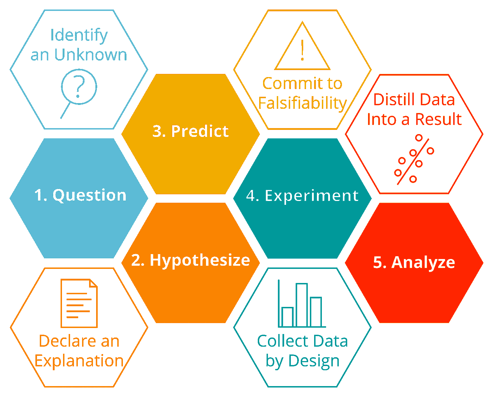

# 肮脏的科学:实践中的纪律

> 原文：<https://towardsdatascience.com/dirty-science-discipline-in-practice-9b2dfc165686?source=collection_archive---------25----------------------->

## 在数据科学中保持“科学”的挑战。

在没有某种方向的情况下探索原始数据就像在垃圾场翻箱倒柜。当然，垃圾场里可能有一件有价值的古董，你甚至可能会偶然发现它。话又说回来，你可能只是花一下午的时间来分类垃圾。另一方面，如果你有一个具体的问题，可以用各种部件解决，并且你知道要找什么，那么从垃圾中筛选是值得的。区别在于有一个明确的目标，所以很容易接受/拒绝许多项目，而不是评估每个项目的价值。

如果你在一个收集所有可能数据的组织中，你不会像一个穿着干净的白大褂做实验的科学家一样。你将分类垃圾，寻找零件，并(希望)将它们组装成有用的东西。虽然你不是一个纯粹的科学家，但科学方法将帮助你完成这个过程。如果你不愿意弄脏你的手，把你的期望工资减半，申请一些研究基金。

# 科学是一个过程

卡尔·萨根写道:“对我来说，把握宇宙的本来面目要比坚持妄想好得多，无论这种妄想多么令人满意和安心。”太多时候，我看到数据科学家和分析师无意中充当宣传机器，用数据编织故事，无意识地扩散证实和事后诸葛亮的偏见。在一个充满数据的世界里，声称“数据驱动”很容易，但现实是，如果没有纪律，它往往会让人们相信一堆热气腾腾的垃圾是一顿热腾腾的营养餐。

科学旨在解释和理解自然界。该过程的主要部分是获得准确的测量值，并对其进行分析以得出结论。当数据以这种方式被收集和分析时，它是非常强大的。想要成为数据驱动的组织应该努力使用更多基于证据的实践。这里强调的是努力，因为在实验室和真正的随机对照试验之外，科学标准通常是无法达到的。

# 扫地

没有背景和方法，数据不是证据，它只是原始信息，可能有用，也可能没用。作为数据科学家，我们面临的挑战是，在不产生不必要的摩擦的情况下，通过建立上下文来大致应用科学方法。这是一个很难把握的平衡，你不可能让每个人都开心，但这不是我的工作。工作就是用数据来解释和理解你周围的世界。

这已经够难的了，所以不要通过个人失败来重新发现科学方法。遵守纪律，相信 500 年的老流程。我试着记住这是一门肮脏的科学，永远不会是完全干净的。因此，与其拿着一个可能会让我因为拖慢一切而被解雇的标准，我不如把它当成扫地，这样其他的工作也能完成。推扫帚是遵循科学方法的步骤。

# 1.问题

永远从好奇开始。找出一个未知的因素来激励你的组织，比如为什么某些客户会重复购买。这也可以更具体，比如我们如何设计更好的注册体验或开发一个应用程序来激励健康的习惯。这一步的关键是清楚地识别未知并记录下来。这将为剩下的过程提供方向和动力。我们都有好奇的天性，所以要了解它。

# 2.假设

接下来，制定一个明确的假设。这相当于为上一步中确定的未知因素声明一个解释。假设应该写成类似“简化注册过程将提高转化率”的陈述形式。在写假设的时候，留意下一步，帮助收紧。例如，“注册过程太复杂”不会导致明显的预测，而“简化注册过程将提高转化率”会。

一个好的假设是可证伪的，这意味着证据可以反驳或证伪它。“一艘外星飞船坠毁在罗斯威尔”这一说法是不可证伪的，因为如果这不是真的，那就只是缺乏证据。然而，“从来没有飞船降落在罗斯威尔”是可证伪的。找到一艘宇宙飞船，这个陈述就被证明是错误的。太多的组织持有不可证伪的信念，如“人们忠于我们的品牌。”推行这些信念就像用糖果来安抚一个有不良行为的孩子。不要走捷径。做一名科学家。

# 3.预测

有了明确的假设，是时候把筹码放在桌子上做个预测了。接受假设的逻辑结果，并致力于有证据支持的结果。例如，“如果我们简化注册体验，转化率将至少提高 1%”是一个可以实际测试的预测。预测通常会映射到多个假设或解释，因此重要的是要具体，并将其与主要调查紧密联系起来。

在实践中，我们想要做出的预测通常无法正确测试，或者它们可能会构成政治挑战。这就是纪律至关重要的地方。写下预测，好像一切皆有可能，然后评估测试的可行性。不采取这一步是一个滑坡，因为它很快导致完全避免预测。由于缺乏时间、资源或我无法改变物理定律，我做出的绝大多数预测都不可能得到验证。尽管如此，我不会限制自己的想象力，把事情写下来。

# 4.实验

现在是时候投入一些时间和精力来进行一项实验了。这是获取知识的黄金标准，正确地使用它并不简单。例如，测试更简单的注册体验的影响需要设计新的体验，将其与当前体验并行部署，将新用户随机分配到不同的组，并跟踪每个组中的指标。这伴随着硬开发成本以及你传递的其他东西的机会成本。

有时，这些测试可以像改变按钮颜色或字体一样简单，但在我看来，在那里没有多少知识可以获得。像这样的快速 A/B 测试对微调很有帮助，但在解释或理解我们的世界方面，它们并没有给我们太多帮助。有意义的发现有巨大的成本和风险。我们不得不花费资源来获取知识，并冒着假设错误的风险。科学是艰难的，这通常是外界压力毒害过程的地方。

另一方面，对我们来说，并不是一切都是科学。让每个想法都经过严格的实验过程是疯狂的。有时候，简化注册体验并自信地交付会更好，因为这是合理的做法。竞争瞬息万变，能够辨别新知识相对于获取成本的价值是一项非常高级的技能。

# 5.分析

最后，数据！如果你做了定义一个明确的假设，做出一个可证伪的预测，并运行一个干净的实验，那么这应该像比较两个组的统计数据并分享结果一样简单。在这种情况下，挑战通常是解决模糊性，并向非技术人员传达统计概念。对于年轻的数据科学家和分析师来说，这是一个在商界崭露头角的好地方。然而，通常情况下，它并没有这么干净。

当你丢失了随机对照试验的重要组成部分时，事情就变得肮脏了。也许你不能随机分配小组，或者根本无法创建实验小组。你可能会被迫分析时间序列数据或寻找一个自然实验来检测预期的效果。无论如何，分析应该总是在预测之后进行。如果你不能进行实验，在你寻找证据之前，对证据会是什么样子做出硬性承诺，并对你做出的让步极其清楚。

统计学家常常以开发出越来越复杂的方法来处理像这样的混乱局面而自豪。这是我见过的最底层的竞争。有时候，数据就是不存在，不准确的结论比根本没有结论更糟糕。至少“我们不知道”是诚实的，并把问题留待进一步调查。你从一个干净的、适当的随机实验中得到的越多，你就应该越不舒服。也就是说，不要害怕弄脏你的手，试一试。只要诚实，通过记录必要的让步来保护你的正直。

# 结论

当不可能严格遵循科学方法时，我经常听到非常聪明的、有良好意愿的人说“有总比没有好”之类的话。我倾向于同意这种观点，但会使用更谨慎的语言:“更准确是首选，但并不总是可以达到的。”你愿意没有尺子还是一把随机不准确的尺子？没有尺子，我有一个适定的问题:找一把好的尺子。有了一个有缺陷的统治者，我可能会在没有意识到的情况下制造更大的问题。

科学的目标是解释和理解世界。科学的方法提供了明确的步骤来识别和获取必要的知识。在各种环境中应用它需要纪律和视角。对我们来说，科学是一个大部分但不总是有用的过程，能够区分这两者是一个独特的挑战。数据科学是一门肮脏的科学。现在拿起扫帚回去工作。