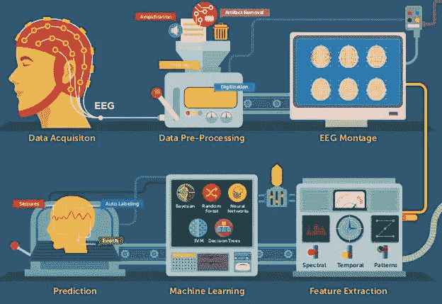
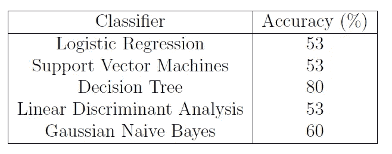
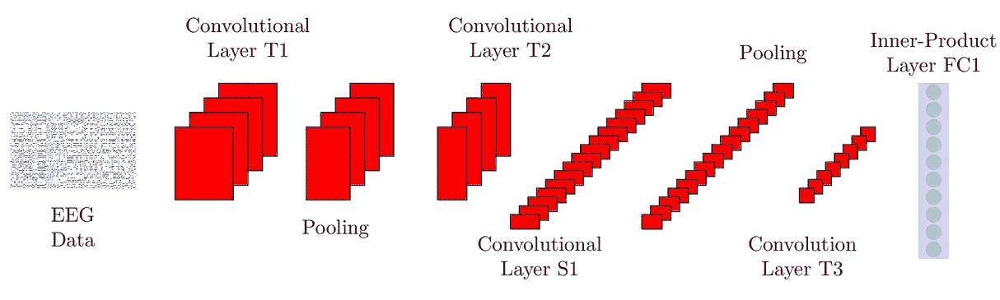
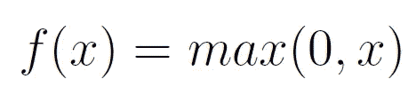
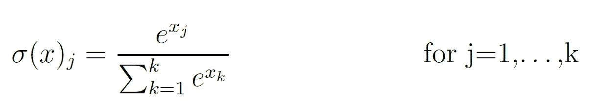
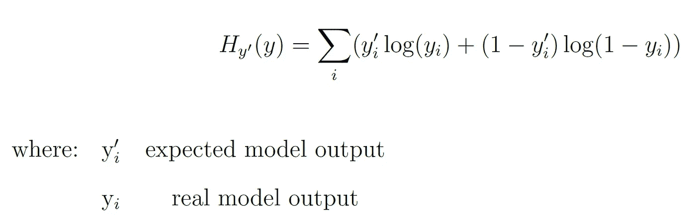
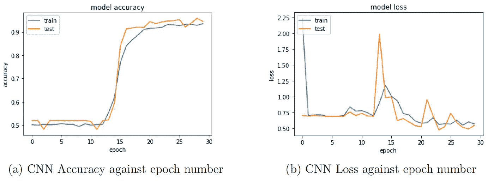

# 基于脑电时间序列分析的残疾诊断

> 原文：<https://towardsdatascience.com/disability-diagnostic-using-eeg-time-series-analysis-8035300837ac?source=collection_archive---------21----------------------->

## 一种关于如何通过使用卷积神经网络(CNN)分析脑电图(EEG)记录来识别儿童是否受到自闭症影响的研究方法。

(来源:[http://epscicon . vidyacademy . AC . in/WP-content/uploads/2017/12/EEG . jpg](http://epscicon.vidyaacademy.ac.in/wp-content/uploads/2017/12/eeg.jpg))

# 介绍

儿童出生时可能会有残疾。在早期发现他们的问题可以在以后的生活中带来更持续的改善。这主要取决于神经可塑性(大脑在一生中自我重组的能力)，这在我们生命的最初几年要高得多。

自闭症谱系障碍(ASD)是一种神经发育障碍。这些类型的疾病主要被认为是正常脑功能的破坏。在过去的几年里，有报道称越来越多的儿童出现这种症状。美国 2014 年的一项调查数据显示，与 2012 年进行的同一调查相比，增长了 16%。根据这项研究，美国约有 1/59 的儿童患有自闭症谱系障碍(“CDC 的自闭症和发育障碍监测(ADDM)网络”，[1])。

最近的研究表明，强化的早期开始干预方法可以导致这种情况的重大改善。因此，使用机器学习的早期检测可以在这一领域发挥至关重要的作用。

在这篇文章中，我将概述我采用的不同方法来分析标记的 EEG 数据(已经预处理),这些数据包含受 ASD 影响和不受 ASD 影响的儿童的脑电波记录。利用诸如[、支持向量机(SVM)](/svm-feature-selection-and-kernels-840781cc1a6c) 、决策树、CNN 和 LSTM 的算法，已经有可能实现 96%以上的分类准确度。

# 机器学习

我一直在处理的数据集由 129 列组成。前 128 列代表信号采集期间使用的 128 个 EEG 通道，最后一列是数据标签(受自闭症影响或不受自闭症影响)。数据集的每 250 行代表一个时间序列重复。每个孩子的时间序列重复在 20 和 80 之间变化，取决于主题。数据集被证明是平衡的，包含 49.03%的无自闭症儿童的数据和 50.97%的自闭症儿童的数据。

数据预处理包括首先加载数据，将其标准化，然后针对输入和输出值将其分为训练集(70%)和测试集(30%)。为此，我使用了 python 库，如 pandas、numpy、matplotlib.pyplot、sklearn 和 itertools。所使用的 ML 模型试图仅使用单一的刺激重复来识别儿童是否受到 ASD 的影响。

获得的结果总结在表 1 中。

表 1: ML 分类精度。

决策树获得了最准确的结果。决策树是一种监督学习算法，可用于分类或回归任务。决策树与其他 ML 算法的区别在于它们能够使用倒置的树状表示来显示决策过程。在树中，每个节点代表数据集中的一个特征，每个分支代表一个决策规则，每个叶子代表一个决策结果。在这个实现中，我决定使用 CART(分类和回归树)算法实现，它利用基尼指数作为度量。

# 卷积神经网络(CNN)

为了提高分类性能，我决定使用 Keras Python 库设计一个 CNN 模型。CNN 是一类神经网络，通常用于图像识别/分类，但也可用于时间序列分析。这可以通过将时间序列转换成类似灰度图像的格式来实现。

图 1: CNN 的脑电图分析[2]

模型架构包括:

1.  64 个滤波器的一个 2D 卷积层、5×5 的核大小、ReLU(校正线性单元，等式 1)函数和相同的填充。
2.  另一个 2D 卷积层具有 32 个滤波器、5×5 的核大小、ReLU(校正线性单元)函数、相同的填充和 0.01 的 L2 正则化系数(以防止过拟合)。
3.  2x2 大小的 2D 最大池层。
4.  强度为 0.2 的丢弃层(为了避免过拟合数据)。
5.  一个层首先将数据从三维展平为一维，然后另一个层压缩输入以提供给分类器 128 特征(总是使用 ReLU 函数和 L2 正则化)。
6.  强度为 0.5 的第二脱落层。
7.  最后，密集层(两个神经元)使用 Softmax 激活函数产生分类结果。在这种情况下，Softmax 函数(等式 2)将从神经元获取两个输入，并将它们转换为两个概率，这两个概率的总和为 1。较大概率被向上/向下舍入到 1 或 0，以表示 CNN 输出选择。

等式 1: ReLU 激活函数

等式 2: Softmax 函数

为了优化训练，采用 Adam(自适应矩估计)梯度下降算法，并用交叉熵函数计算模型损失。在二元分类的情况下，交叉熵函数可以通过使用等式 3 来计算。

等式 3:交叉熵函数

该模型在仅仅三十个训练周期中实现了 94.58%的总体验证准确率。

图 2: CNN 的准确性和损失

# 结论

本文证明了在预处理的 EEG 数据上使用 ML 和深度学习模型总体上可以获得良好的分类结果。作为这个项目的进一步发展，我还设法开发了一个 LSTM 模型，能够达到 96%以上的分类准确率。其他指标，如混淆矩阵、灵敏度、特异性和 AUC-ROC 曲线已被用于交叉验证这些模型的准确性。

此外，在预处理阶段应用自动编码器网络[3]来检查是否可以使分类更容易并加快模型训练时间也是有意义的。

本实验中需要考虑的一个问题可能是所用数据的可靠性(例如，数据是否收集正确，测量过程中记录的所有噪声是否已被正确过滤……)以及使用不同类型的 EEG Cap 或在不同实验室条件下收集的其他形式的数据，这些精度结果的可重复性如何。

当试图在医疗应用中使用人工智能时，必须获得高精度和可靠性。可解释的人工智能(创建能够解释自己分类决策过程的模型)可以帮助医生理解在决策时如何/是否使用人工智能。

此研究项目的完整在线图书版本可通过此[链接获得。](https://pierpaolo28.github.io/thesis_book/)

我要感谢*kou shik Maharatna*教授给我这个机会开展这个项目。

# 联系人

如果你想了解我最新的文章和项目[，请通过媒体](https://medium.com/@pierpaoloippolito28?source=post_page---------------------------)关注我，并订阅我的[邮件列表](http://eepurl.com/gwO-Dr?source=post_page---------------------------)。以下是我的一些联系人详细信息:

*   [领英](https://uk.linkedin.com/in/pier-paolo-ippolito-202917146?source=post_page---------------------------)
*   [个人博客](https://pierpaolo28.github.io/blog/?source=post_page---------------------------)
*   [个人网站](https://pierpaolo28.github.io/?source=post_page---------------------------)
*   [中等轮廓](https://towardsdatascience.com/@pierpaoloippolito28?source=post_page---------------------------)
*   [GitHub](https://github.com/pierpaolo28?source=post_page---------------------------)
*   [卡格尔](https://www.kaggle.com/pierpaolo28?source=post_page---------------------------)

# 文献学

[1]疾病控制和预防中心，国家出生缺陷和发育障碍中心，出生缺陷处。访问时间:【https://www.cdc.gov/ncbddd/autism/data.html】T22018 年 12 月。

[2]使用卷积神经网络的单次试验 EEG RSVP 分类，Jared Shamwell，Hyungtae Lee et al. 访问:[https://www . spiedicallibrary . org/conference-proceedings-of-spie/9836/983622/Single-trial-EEG-RSVP-classification-using-convolutionary-neural-networks/10.11117/12.224172 . short？SSO = 1](https://www.spiedigitallibrary.org/conference-proceedings-of-spie/9836/983622/Single-trial-EEG-RSVP-classification-using-convolutional-neural-networks/10.1117/12.2224172.short?SSO=1)2019 年 6 月。

[3]杰瑞米·乔登自动编码器简介。访问日期:[https://www.jeremyjordan.me/autoencoders/](https://www.jeremyjordan.me/autoencoders/)2019 年 3 月。