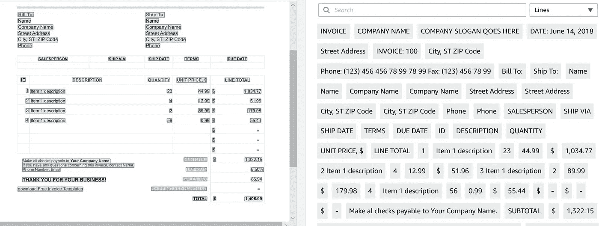
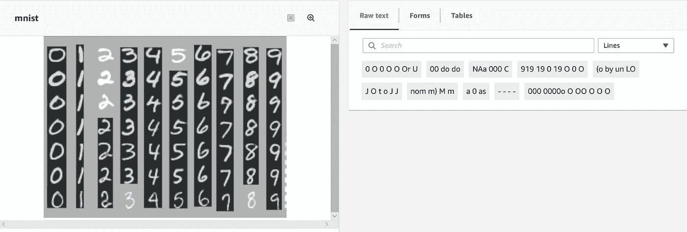
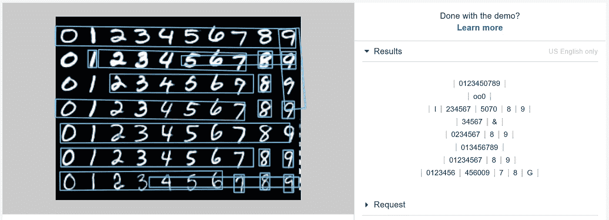
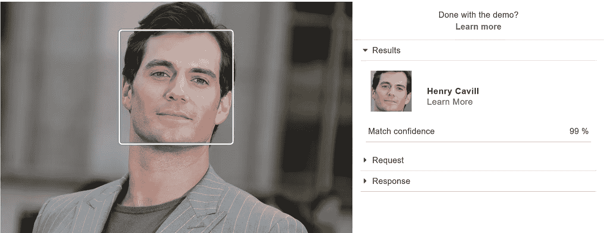
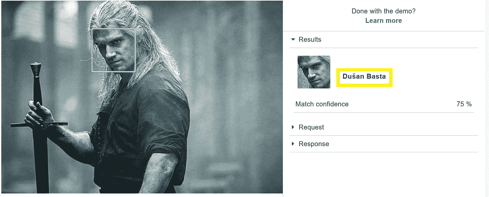
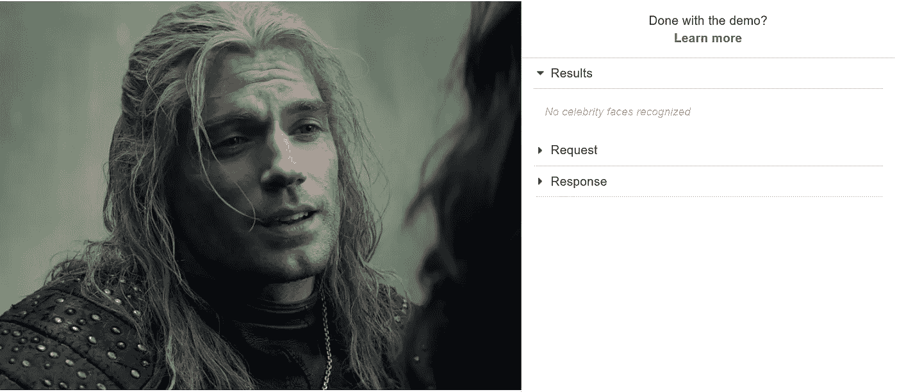

# 令人失望的人工智能:使用 AWS 进行 OCR 和名人识别

> 原文：<https://towardsdatascience.com/disappointing-ai-using-aws-for-ocr-celebrity-recognition-818b8ba2a95c?source=collection_archive---------27----------------------->

## 或者当 AWS 把巫师误认为塞尔维亚足球运动员时。

[摇滚猴子](https://unsplash.com/@rocknrollmonkey?utm_source=medium&utm_medium=referral)在 [Unsplash](https://unsplash.com?utm_source=medium&utm_medium=referral) 上的照片

据 [Forbes](https://www.forbes.com/sites/louiscolumbus/2018/01/07/83-of-enterprise-workloads-will-be-in-the-cloud-by-2020/#6223d3c86261) 报道，到 2020 年，83%的企业工作负载将在云中，其中 41%在 AWS、谷歌云平台或微软 Azure 等公共平台上。在我最近作为数据科学家的一个项目中，我不得不开始习惯云计算、存储和部署。在这个方向上的另一个好的步骤可能是开始试验云服务，如图像识别、字符识别和语音识别，如果不只是为了了解它们提供的性能。

## 在黑客马拉松中测试 OCR 服务

测试提供光学字符识别的云服务是我几周前参加的一次黑客马拉松的主题，那是在我目前工作的公司。这让我有机会测试 AWS 的**人工智能服务，主要集中在 **OCR** ( *Textract，Rekognition* )，但也有一些有趣的服务，如**名人识别** ( *Rekognition* )。事实上，AWS Rekognition 应该是一个相当完整的服务，可以检测物体，识别人脸和检测文本。现实与此略有不同。**

## 关于 OCR 的一个小提示

OCR 代表系统将键入的、手写的或印刷的文本检测为机器编码的文本的能力，无论该文本是来自扫描的文档、文档的照片、标志还是照片中显示的其他类型的文本。它目前是一个热门话题，因为许多“老”机构(如政府机构、银行或保险)都致力于将所有文档(如可能包含印刷和手写字符的印刷合同)数字化。通常，OCR 可以分为两组:

*   **HCR** :手写字符识别
*   **PCR** :印刷字符识别

HCR 往往比 PCR 更具挑战性，原因很明显:大多数人的笔迹令人困惑。这种差异在我们体验的结果中也是显而易见的。

# 第一个失望:使用 AWS Textract 的 OCR

黑客马拉松旨在比较 AWS、谷歌视觉和微软 Azure 的人工智能服务在光学字符识别方面的表现。在 AWS 的一个数据工程项目中有了成功的经验，我选择了加入 AWS AI 服务团队。我很兴奋，期待亚马逊再次展示其世界领先的性能。以下是亚马逊对这项服务的承诺:

> Amazon Textract 是一项从扫描的文档中自动提取文本和数据的服务。Amazon Textract 超越了简单的光学字符识别(OCR ),还可以识别表单中的字段内容和存储在表格中的信息。

示例发票上的 AWS Textract 结果(印刷字符识别)

由于 PCR 似乎是 Textract ( *扫描文件*)的重点，我用我能在网上找到的一份发票样本进行了尝试。事实上，结果相当准确，除了一些拼写错误的单词。

Mnist 数据集的 AWS 文本摘要结果

由于 Textract 应该“超越 OCR ”,我希望它也能处理手写文本，比如众所周知的 MNIST 数据集。不幸的是，我错了。Textract 在手写字符识别方面做得很糟糕。

然而，Textract 似乎更像是一个 PCR 服务，而不是我们所期望的完整的 OCR 服务。然而，这就像三天前你在网站上订购了一台咖啡机，亚马逊却推荐给你另一台一样令人失望。

为了弄清楚我是错过了什么还是在 AWS 中选择了错误的服务，我进一步研究了云提供商的 OCR 选项。这时我发现 Rekognition 也应该检测文本。如果 Rekognition 是为了处理手写作业而创建的呢？

# 第二个失望:使用 AWS Rekognition 的 OCR

事实上，AWS Rekognition 也被认为擅长检测图片上的文本。亚马逊声称:

> 文本检测是 Amazon Rekognition 的一项功能，允许您检测和识别图像或视频中的文本，如街道名称、标题、产品名称、叠加图形、视频字幕和车辆牌照。文本检测专门用于处理真实世界的图像和视频，而不是文档图像。

同样，没有明确提到手写文本，但我不得不尝试一下。

同一 MNIST 数据集上自动气象站识别中的文本检测结果

结果比 Textract 提供的要好得多，尽管我们可以期待更好的结果。许多数字被误认为是字母，没有一行被完全准确地检测到(第 5 行几乎被检测到，但不知何故数字 2 根本没有被检测到)。令人惊讶的是，虽然我们预计亚马逊会提供出色的性能，但我的同事们发现，在 MNIST 数据集等手写内容上，谷歌视觉和微软 Azure 的表现优于 AWS(尽管我没有他们的结果来证明这一点)。

## 那么目标检测和名人识别呢？

为了克服 AWS 中的 OCR 所带来的失望，同时为了确保我们不会(再次)错过能够更好地执行此任务的服务，我们研究了 AWS 提供的其他服务。正如我在上面简要提到的，AWS Rekognition 服务的主要目的是检测目标，但它也可以识别成千上万的名人，在体育，政治等。由于我们在 OCR 上找不到其他服务，为了给自己留点娱乐，我们在 Rekognition 上尝试了名人识别选项。

# 第三个失望:亨利·卡维尔，《女巫》(The Witcher)和一个金发足球运动员。

AWS Rekognition 承认亨利·卡维尔。最初的照片来自[托马斯·桑森](https://www.gettyimages.nl/search/photographer?family=editorial&photographer=THOMAS+SAMSON)/法新社 Getty Images

就像世界上其他成千上万的人一样，我最近在疯狂地看了《The Witcher》之后，成了亨利·卡维尔的超级粉丝。好的故事，好看的演员，魔术，龙，最重要的是，马(主要是罗奇，但至关重要的故事)。我完全被说服了。无论如何，当我们发现了名人识别软件，我的第一个想法是看看它是否会承认亨利·卡维尔是…嗯，亨利·卡维尔。没什么好惊讶的，确实如此！(耶，一个准确的探测！).

在第二个例子中，我想挑战这个系统，看看它是否能把巫师 T4 认出来，也就是亨利·卡维尔。老实说，我没想到它会起作用。他的头发颜色完全不同，长度也完全不同，眼睛颜色也不一样，他的脸甚至还做了额外的修饰，使它看起来更瘦更白。这对于一款人工智能车型来说是不公平的竞争，即便它的动力来自于巨头亚马逊。然而，我绝对没有准备好这个结果…

AWS Rekognition 把 Witcher 误认为塞尔维亚足球运动员。首张照片来自[卡塔林凡尔纳/网飞](https://www.imdb.com/title/tt5180504/mediaviewer/rm354388225)

杜三·巴斯塔(见下文)是塞尔维亚的一名国际足球运动员，他和亨利·卡维尔和 The Witcher 没有任何关系(除了他是金发和长头发)。公平地说，我想被娱乐，我得到了一个很好的笑了这个。

杜三·巴斯塔，足球运动员，(据 AWS 报道)新任命的 Witcher

我把这项服务用在了《The Witcher》中亨利·卡维尔的其他几张照片上，脸上的照明效果更好，相机的角度也更好。在这些案例中，既没有名人面孔被认出，也没有发现塞尔维亚足球运动员。

另一张巫师的照片上写着“不认识任何名人”。最初的照片来自[卡塔琳·凡尔纳/网飞](https://www.imdb.com/title/tt5180504/mediaviewer/rm354388225)

总之，我不认为 AWS 人工智能服务不可用，但与其他云提供商相比，它们在 OCR 方面肯定落后。这些结果对于手写字符识别来说是不够准确的，并且当检测扫描文档(PCR)中的文本时仍然可以改进。然而，我查询了几次 API，它检测文本的速度是惊人的。API 的可用性也是一个很大的优势。免费层允许每月分析 5000 张图像，之后，每张图像的价格仍然非常实惠，为每张图像 0.001 美元。

最重要的是，我必须承认名人识别服务是一个有趣的工具。同样有趣的是，当一个男人留着长长的金发时，人们很容易被弄糊涂。因为我相信我们只是触及了可能性的表面，所以我会很高兴地收到关于 AWS 服务的建议，无论是对其性能、结果还是任务的娱乐性而言，这些服务都是有趣的。

*如果你喜欢这篇文章，请关注我的* [*Medium*](https://medium.com/@julia.d.russo) *和*[*Twitter*](https://twitter.com/DIRUSSOJulia)*，以便在新文章发布时获得通知。*

 [## 如何成功转向数据科学职业

### 许多人希望有不同的职业道路，并希望过渡到数据科学家的职位，但这只是一个…

towardsdatascience.com](/how-to-make-a-successful-switch-to-a-data-science-career-537e55469af8)  [## 向任何人解释版本控制的简单故事

### 让我们一起盖房子吧…用 git。

towardsdatascience.com](/a-simple-story-to-explain-version-control-to-anyone-5ab4197cebbc)