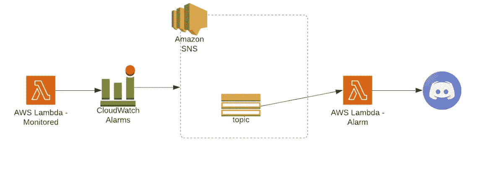
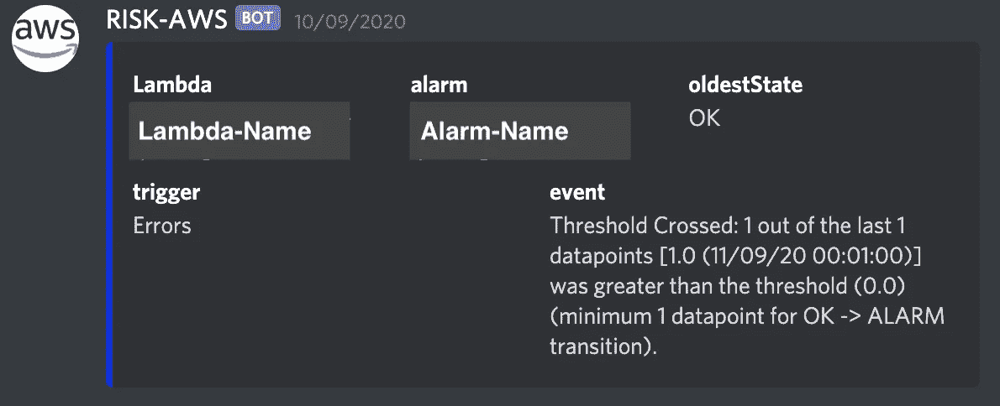
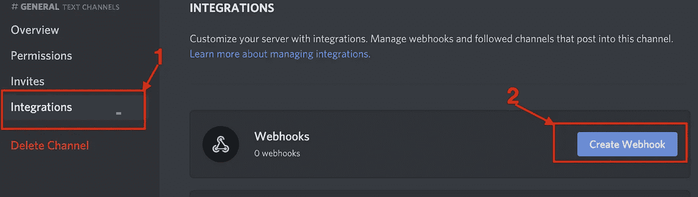

# 使用 CloudWatch 警报、SNS 和 AWS Lambda 的不一致通知

> 原文：<https://towardsdatascience.com/discord-notification-using-cloudwatch-alarms-sns-and-aws-lambda-71393861699f?source=collection_archive---------17----------------------->

由 [Khadeeja Yasser](https://unsplash.com/@k_yasser?utm_source=medium&utm_medium=referral) 在 [Unsplash](https://unsplash.com?utm_source=medium&utm_medium=referral) 上拍摄的照片

警报的存在是为了在我们的系统以一种意外的方式运行时通知我们*，这保证了手动干预来纠正*。当我们在一个生产环境中有多个系统而一个错误没有被注意到时，后果可能是灾难性的。

当系统无法自动恢复，需要人工干预时，应发出警报。如果警报发生得过于频繁，可能会导致更长的响应时间，甚至被遗漏。

在本文中，我们将为 AWS Lambda 函数构建一个警报通知管道。为此，将使用 3 个 AWS 服务:AWS Lambda、简单通知服务(SNS)和 CloudWatch。*目标是在触发 CloudWatch 警报时向不和谐频道发送通知*。

使用 Lucidchart 设计:[https://www.lucidchart.com](https://www.lucidchart.com)

# 步骤 1 —云监控警报

## 选择指标

首先，您需要选择一个 CloudWatch 指标来观察警报。对于 Lambda 函数，有 3 种类型的指标:

*   **调用度量**:调用结果的二进制指示器。例子:*调用*，*错误*，*死信错误*，*目的交付失败*，*节流*。
*   **性能指标**:单次调用的性能细节。如:*时长*、*迭代器*。
*   **并发度量**:跨函数、版本、别名或 AWS 区域处理事件的实例数量的总数。示例:*并发执行*、*ProvisionedConcurrentExecutions*、*ProvisionedConcurrencyUtilization*、*UnreservedConcurrentExecutions。*

你可以在 [AWS 开发者指南](https://docs.aws.amazon.com/lambda/latest/dg/monitoring-metrics.html)中阅读更多关于 AWS Lambda 指标的细节。

在这个例子中，我们将监控**错误度量**，即导致函数错误的调用次数。

## 图表度量

接下来，您需要为指定时间段内的数据聚合选择[统计](https://docs.aws.amazon.com/AmazonCloudWatch/latest/monitoring/cloudwatch_concepts.html#Statistic)，即应用上面定义的度量的统计:*样本计数*、*平均值*、*总和*、*最小值*、*最大值*。我们将使用**总和**。

变量 period 表示应用上述*统计数据*的时间，单位为秒。我们将它设置为 **60s。**数据与指定阈值进行比较的周期数将被设置为 1，因为我们希望我们的*错误*指标仅在 1 分钟的间隔内进行评估。

## 情况

最后，您需要设置比较运算符，这是在比较指定的统计数据和阈值时使用的算术运算。支持的条件:

*   GreaterThanOrEqualToThreshold
*   更大的阈值
*   小于阈值
*   LessThanOrEqualToThreshold

我们将使用条件: **GreaterThanThreshold** ，阈值为 **0** 。

## **通知**

正如本文开头提到的，CloudWatch 警报将触发一个 SNS 主题来通知警报何时处于`ALARM`状态。

## 地形代码

下面的代码包含了上面讨论的所有设置。它还包含一些这里不会讨论的附加设置。您可以看到，我在变量`alarms_actions`中添加了我们将在下一节中创建的 SNS 的 ARN，这意味着当 SNS 转换到`ALARM`状态时，该警报将触发 SNS。

上面的代码允许您创建任意数量的 CloudWatch 警报。您只需编辑`local.alarms_dimensions`:

# 步骤 2 —简单通知服务(SNS)

来自 [AWS 文档](https://aws.amazon.com/sns/?nc1=h_ls&whats-new-cards.sort-by=item.additionalFields.postDateTime&whats-new-cards.sort-order=desc):

> Amazon Simple Notification Service(Amazon SNS)是一种 web 服务，用于协调和管理向订阅端点或客户端发送消息。它使您能够通过[发布/订阅](https://aws.amazon.com/pub-sub-messaging/)(发布/订阅)模式在系统之间进行通信

我们的 SNS 需要向 Lambda-Alarm 发布消息，然后 Lambda-Alarm 会向 Discord 通道发送一条自定义消息。

## 地形代码

在下面的代码中，我们为 SNS 主题订阅了 Lambda-Alarm，并在`endpoint`参数中传递了 lambda ARN。

# 第 3 步—λ警报

当被 SNS 主题触发时，该 Lambda 将使用以下消息格式向不和谐频道发送警报:

不和谐频道截图

## 不和谐的网钩

首先，您需要在所需的频道中创建一个 Webhook。在*编辑频道*页面，你将进入*整合*，以及*创建 Webhook。*

不和谐频道设置截图

然后，您将复制 Webhook URL 并将其粘贴到您的 Lambda 代码中。

## λ代码

下面的代码非常直观，不需要过多解释。你可以在 [Discord 的开发者门户](https://discord.com/developers/docs/resources/channel#embed-limits)上获得关于*通道对象*的更多信息。

# 结论

在本文中，我们使用 CloudWatch Alarms、SNS 和 AWS Lambda 构建了一个警报通知系统。当我们的 lambda 中出现错误时，我们将在 Discord 通道中收到一条消息。

当然，您可以将 Lambda 警报与除 Discord 之外的其他服务集成在一起，例如:

*   任何电子邮件服务:Gmail，Outlook，雅虎等
*   松弛的
*   微软团队

你可以在这里查看完整代码！

# 参考

 [## 基于静态阈值创建云观察警报

### 您为要观察的警报选择一个 CloudWatch 指标，以及该指标的阈值。警报进入警报状态…

docs.aws.amazon.com](https://docs.aws.amazon.com/AmazonCloudWatch/latest/monitoring/ConsoleAlarms.html)  [## Discord 开发者门户-面向机器人和开发者的 API 文档

### 将你的服务与不和谐融为一体——无论是机器人、游戏还是你能想到的任何东西…

discord.com](https://discord.com/developers/docs/resources/channel#embed-limits)  [## 使用 AWS Lambda 函数度量

### 当您的函数处理完一个事件时，Lambda 会将关于调用的指标发送到 Amazon CloudWatch。你…

docs.aws.amazon.com](https://docs.aws.amazon.com/lambda/latest/dg/monitoring-metrics.html)  [## 地形注册表

### 编辑描述

registry.terraform.io](https://registry.terraform.io/providers/hashicorp/aws/latest/docs/resources/cloudwatch_metric_alarm)