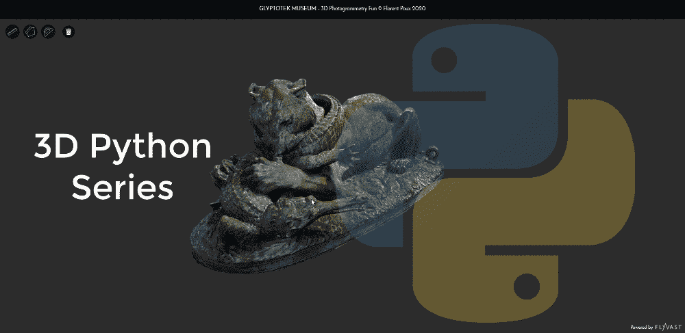
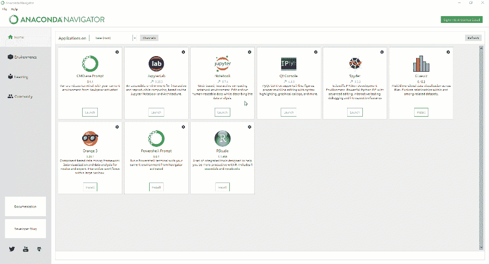
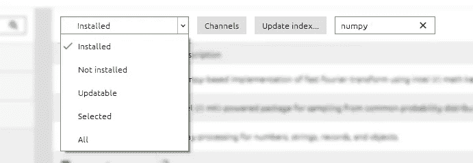
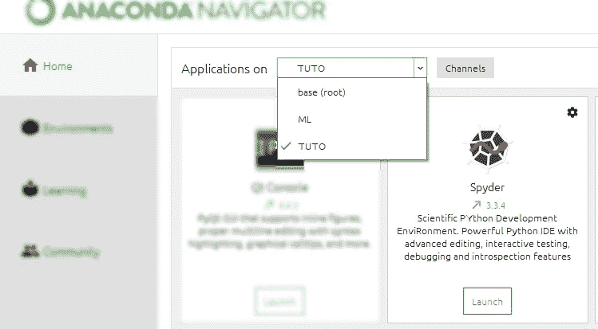
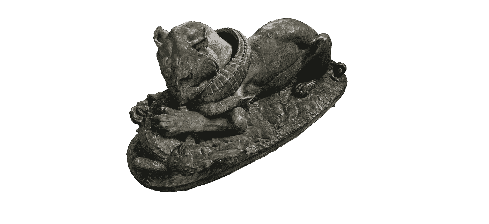
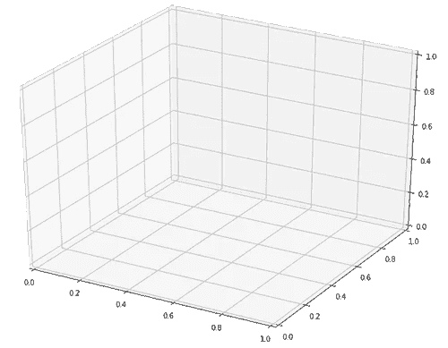
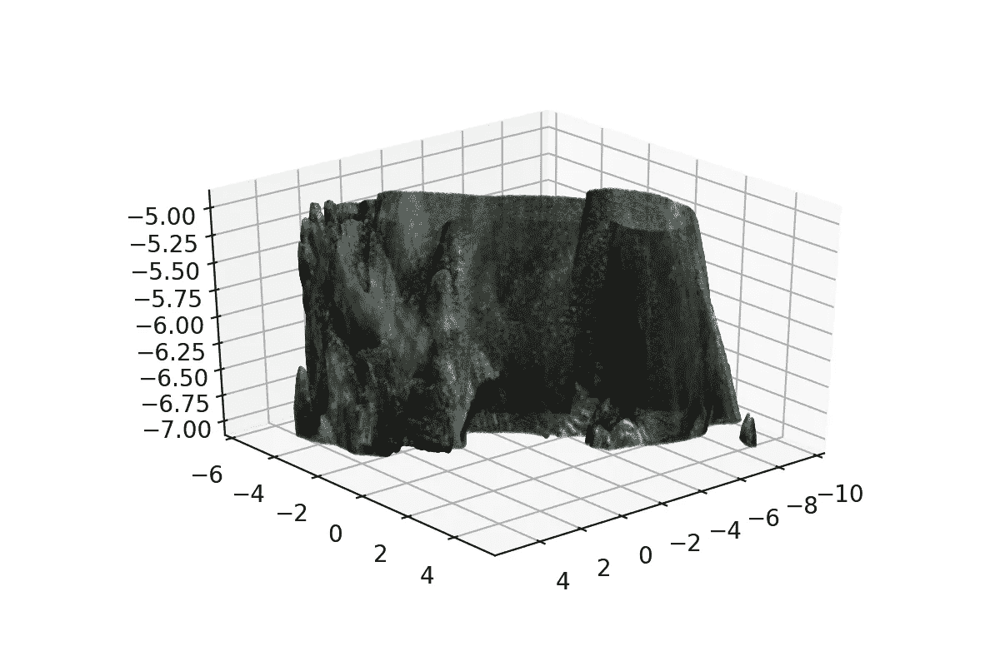

# 使用 Python 探索 3D 点云处理

> 原文：<https://towardsdatascience.com/discover-3d-point-cloud-processing-with-python-6112d9ee38e7?source=collection_archive---------4----------------------->

## 3D Python

## *教程简单地设置您的 python 环境，开始处理和可视化 3D 点云数据。重点介绍 Anaconda、NumPy、Matplotlib 和 Google Colab。*



# 设置 python 环境的 5 步指南

*   我们需要建立我们的环境。我推荐下载 [Anaconda Navigator](https://www.anaconda.com/distribution/) ，它有一个简单的 GUI。
*   下载并安装后，创建一个环境(左边的第二个选项卡> create 按钮)，它允许您指定 python 版本(最新版本即可)。当绿色箭头出现在它旁边时，您就知道它被选中了。



anaconda GUI——通过具有不同库/ Python 版本的环境管理独立项目

*   创建后，您可以链接所需的库，而不会发生冲突。非常得心应手！为此，只需在已安装的软件包中搜索软件包(如 NumPy，Matplotlib)，如果没有弹出，则选择未安装，选中它们并单击应用安装它们。Numpy 和 Matplotlib 是标准库，将对这个项目和未来的项目有用。



在 conda 库包管理器中搜索库

*   您已经差不多设置好了，现在回到 Anaconda Home 选项卡，确保您处于正确的环境中(XXX 上的应用程序)，然后您可以安装 Spyder 作为 IDE(集成开发环境)来启动您的代码项目。

🤓 ***注*** *: Spyder 对于任何初学 python 编码的业余爱好者来说都是最好的工具之一。另一个很棒的工具是 Jupyter，它可以很好地将交互式代码呈现给高层管理人员，以实现更好的可视化。我们将在以后的文章中探讨这一点以及 Google Colab。*



*   一旦安装进度条完成，你就准备好了！您现在可以启动 Spyder 了。虽然 GUI 可能允许几种可能性，但要直接获得结果，首先要编写您的脚本(1)，执行您的脚本(2)并在控制台中探索并与结果交互(3)。


Spyder Python 界面的 3 个基本元素

# 下载您的点云数据集

对于未来的实验，我们将使用一个采样点云，您可以从这个库免费下载。如果想在不安装任何东西的情况下提前可视化，可以查看 [webGL 版本](https://www.flyvast.com/flyvast/app/page-snapshot-viewer.html#/333/ec8d9a6c-de38-7249-e6fc-026c4ff67ef7)。



哥本哈根 Glyptotek 博物馆雕像的 3D 点云，用摄影测量法重建。数据集的获取扩展了本文的范围，将在另一篇文章中讨论。如果你想学习这些技术，你可以参观[地理数据学院](https://learngeodata.eu/)和[三维重建器](https://learngeodata.eu/order_step/3d-reconstructor/)。

[](https://learngeodata.eu/point-cloud-processor-formation/) [## 点云处理在线课程- 3D 地理数据学院

### 编队学习先进的点云处理和三维自动化。开发新的 python 地理数据技能和开源…

learngeodata.eu](https://learngeodata.eu/point-cloud-processor-formation/) 

# 你的第一行代码

在 Sypder 中，让我们从使用一个非常强大的库开始:NumPy。您已经可以在脚本区域(左侧窗口)编写您的第一个短代码了:

```
1 import numpy as np
2 file_data_path=”E:\sample.xyz”
3 point_cloud= np.loadtxt(file_data_path, skiprows=1, max_rows=1000000)
```

此短代码(1)导入库 NumPy 以进一步用作短名称“NP”；(2)创建保存指向包含点的文件的字符串的变量；(3)将点云作为名为 point_cloud 的变量导入，跳过第一行(例如，保存点数)，并设置运行测试的最大行数，而不会出现内存短缺。

现在，您可以运行您的脚本(绿色箭头)，并在弹出窗口出现时将其保存为硬盘上的. py 文件。现在，您可以通过直接在控制台中写入以下内容来访问保存数据的实体的第一个点(point_cloud):

```
In: point_cloud[0]
```

然后，您将获得一个包含第一个点的内容的数组，在本例中是 X、Y 和 Z 坐标。

```
Out: array([0.480, 1.636, 1.085])
```

这是你使用 python 和点云的第一步。现在您已经知道如何加载点数据，让我们来看看一些有趣的过程。

# 提取所需的属性

我们有一个具有 6 个属性的点云:X，Y，Z，R，G，b。需要注意的是，当使用 NumPy 数组时，索引总是从 0 开始。因此，如果加载时没有字段名，那么获取第二个点就完成了:

```
In: point_cloud[1]
Out: array([0.480, 1.636, 1.085, 25, 44, 68])
```

如果我们想从那里获得红色(R)属性(NumPy“列”的索引是 3)，我们可以这样做:

```
In: point_cloud[1][3]
Out: 25
```

如果我们想要提取点云中所有点的 Z 属性:

```
In: point_cloud[:,1]
Out: array([2.703, 2.716, 2.712, …, 2.759, 2.741, 2.767])
```

如果我们只想提取所有点的 X，Y，Z 属性:

```
In: point_cloud[:,:3]
Out: array([[4.933, 2.703, 2.194],
[4.908, 2.716, 2.178],
[4.92 , 2.712, 2.175],
…,
[5.203, 2.759, 0.335],
[5.211, 2.741, 0.399],
[5.191, 2.767, 0.279]])
```

恭喜你，你刚刚玩了多维索引👏。注意，在上面的例子`:3]`中，第三列(R)被排除在选择之外。如果需要多次使用，每个结果都可以存储在变量中:

```
xyz=point_cloud[:,:3]
rgb=point_cloud[:,3:]
```

# 基于属性的数据分析

现在让我们来看一些有用的分析。如果你想知道你的点云的平均高度，你可以很容易地做到:

```
In: np.mean(point_cloud,axis=0)[2]
Out: 2.6785763
```

💡 ***提示:*** *这里将轴设置为 0 是要求独立查看每个“列”。如果忽略，则对所有值求平均值，如果设置为 1，将对每行求平均值。*

如果现在您想要提取距离平均高度 1 米以内的点(我们假设该值存储在 mean_Z 中):

```
In: point_cloud[abs( point_cloud[:,2]-mean_Z)<1]
Out: array([…])
```

💡 ***提示:*** *在 python 中，以及一般的编程中，解决一个问题的方法不止一种。提供的是一种非常简短有效的方法，可能不是最直观的。尝试使用 for 循环来解决它是一个很好的练习。这样做的目的是在清晰度和效率之间取得良好的平衡，参见* [*PEP-8 指南*](https://www.python.org/dev/peps/pep-0008/) *。*

现在您知道如何设置您的环境，使用 Python、Spyder GUI 和 NumPy 进行编码工作。你可以加载点云并玩属性，但你可以尝试其他场景，如颜色过滤，点邻近…

# 基本 3D 可视化

对于这第一次 3D 点云绘图体验，我们将得到一个基本的库:Matplotlib。首先，我们将在初始脚本的导入部分添加包，以允许我们使用它们:

```
1 import numpy as np
2 import matplotlib.pyplot as plt
3 from mpl_toolkits import mplot3d
```

导入的依赖项的作用如下:

*   你已经知道这个了😉
*   `matplotlib.pyplot`处理绘图
*   `mpl_toolkits.mplot3d`允许创建 3d 投影

从这里，我们可以添加之前探索过的代码:

```
4 file_data_path=”E:\sample.xyz”
5 point_cloud= np.loadtxt(file_data_path,skiprows=1)
6 mean_Z=np.mean(point_cloud,axis=0)[2]
7 spatial_query=point_cloud[abs( point_cloud[:,2]-mean_Z)<1]
8 xyz=spatial_query[:,:3]
9 rgb=spatial_query[:,3:]
```

🤓 ***注意*** *:我们通常会在编码时尝试增强可读性，如果你想要更好的指导方针，那么*[*PEP-8*](https://www.python.org/dev/peps/pep-0008/#prescriptive-naming-conventions)*是一个很好的资源。理想情况下，变量名应该小写，单词之间用下划线隔开。*

你得到的是 4 个变量(xyz 和 rgb)，基于空间查询过滤初始点云。现在让我们深入了解如何简单地绘制结果。首先，让我们创建一个 3d 轴对象。为此，我们将`projection='3d'`传递给`plt.axes`，后者返回一个`Axes3DSubplot`对象。

```
10 ax = plt.axes(projection='3d')
```



这是我们将要绘画的空白画布。然后我们将绘制一个散点图，我们想给每个点分配一种颜色。这可能是一个非常繁琐的过程，下面的代码行简化了这一过程

```
11 ax.scatter(xyz[:,0], xyz[:,1], xyz[:,2], c = rgb/255, s=0.01)
```

如你所见，我们通过`xyz[:,0]`、`xyz[:,1]`、`xyz[:,2]`将坐标 x、y、z 传递给函数；通过标准化到[0:1]间隔除以最大值，每个点的颜色通过`c = rgb/255`；通过`s = 0.01`显示屏幕上各点的尺寸。

最后，我们可以使用下面的命令绘制图表，并欣赏可视化效果:

```
12 plt.show()
```



💡 ***提示*** *:在 Spyder 4.1.2 及以上版本中，您可以在变量资源管理器窗口的 graph 选项卡中访问您的绘图，默认情况下会创建图像。如果你想创建一个交互式可视化，在启动脚本之前，键入* `%matplotlib auto` *切换到“自动”(即交互式)绘图。*

完整的脚本可以在[这里](https://colab.research.google.com/drive/1irHovjyr_zGnv6R3yiFkuVdQ_S2-chU0)获得，并且可以在 Google Colab 上远程执行。

# 结论

您刚刚学习了如何导入、处理和可视化由数百万个点组成的点云，只需 12 行代码！干得好的👏。但这条路并没有到此为止，未来的帖子将深入点云空间分析、文件格式、数据结构、可视化、动画和网格划分。我们将特别关注如何管理大点云数据，如下面的文章中所定义的。

[](/the-future-of-3d-point-clouds-a-new-perspective-125b35b558b9) [## 三维点云的未来:一个新的视角

### 被称为点云的离散空间数据集通常为决策应用奠定基础。但是他们能不能…

towardsdatascience.com](/the-future-of-3d-point-clouds-a-new-perspective-125b35b558b9) 

我的贡献旨在浓缩可操作的信息，以便您可以从零开始为您的项目构建 3D 自动化系统。你可以从今天开始在[地理数据学院](https://learngeodata.eu/)参加一个编队

[](https://learngeodata.eu/point-cloud-processor-formation/) [## 点云处理在线课程- 3D 地理数据学院

### 编队学习先进的点云处理和三维自动化。开发新的 python 地理数据技能和开源…

learngeodata.eu](https://learngeodata.eu/point-cloud-processor-formation/) 

## 3 向数据科学文章推荐

如果你有时间，我认为这些额外的资源值得一读，如果你曾经分别被 NumPy、Matplotlib 或者如果你在 Mac 上编码所困扰的话。

[](/the-ultimate-beginners-guide-to-numpy-f5a2f99aef54) [## NumPy 初学者终极指南

### 开始使用 NumPy 需要知道的一切

towardsdatascience.com](/the-ultimate-beginners-guide-to-numpy-f5a2f99aef54) [](/all-your-matplotlib-questions-answered-420dd95cb4ff) [## 为赶时间的人准备的 Matplotlib 指南

### Matplotlib 是一个常用的绘图库，但有时很难绘制自定义的绘图。这篇文章是一篇…

towardsdatascience.com](/all-your-matplotlib-questions-answered-420dd95cb4ff) [](/how-to-successfully-install-anaconda-on-a-mac-and-actually-get-it-to-work-53ce18025f97) [## 如何在 Mac 上成功安装 Anaconda(并让它实际工作)

### 正确安装 Anaconda 和修复可怕的“找不到 conda 命令”错误的快速而简单的指南

towardsdatascience.com](/how-to-successfully-install-anaconda-on-a-mac-and-actually-get-it-to-work-53ce18025f97)