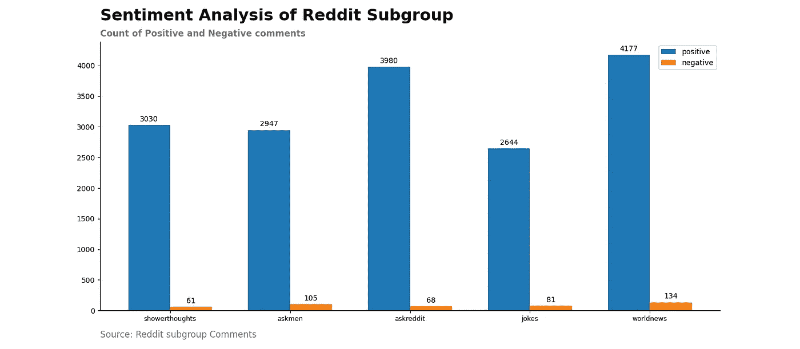

# 利用 RoBERTa 模型发现 Reddit 子群的情感

> 原文：<https://towardsdatascience.com/discover-the-sentiment-of-reddit-subgroup-using-roberta-model-10ab9a8271b8?source=collection_archive---------27----------------------->

## 我们将使用预训练的 RoBERTa 模型来建立情感分析模型，以发现 Reddit 子群的情感。

被困在付费墙后面？点击这里阅读这篇文章和我的朋友链接。


资料来源:jeffrey grospe(联合国统计司)

当你登录社交媒体账号，阅读开篇帖子时，你有什么感受？它是让你微笑还是让你悲伤或生气？我有一个复杂的经历。大多数时候，社交媒体上的帖子让我很开心。怎么会？好吧，我们不能控制其他人发布什么，但我们可以控制我们想在自己的社交媒体账户上看到什么。

如果你加入了一个负面评价很高的群体，那么你会更频繁地阅读那些评论。那会让你生气和难过。在它对你精神健康造成损害之前，离开那些有毒的群体。

所以如果我让你找出你社交媒体账户的有毒群体，你能做到吗？

这篇文章将帮助你建立一个模型，帮助你总结所有帖子或评论的观点。所以你可以在他们让你觉得想退出社交媒体之前离开那些群。

我们将在本文中使用 Reddit 社交媒体参考。我将分析我的 Reddit 子群。并且检查这些子群是否具有高数量的负面评论。

## 为什么是 Reddit？

像 Reddit 和 twitter 这样的社交媒体将允许你通过 API 访问用户的帖子和评论。您可以在 Reddit 数据上测试和实现情感分析模型。

**本文分为两部分。在第一部分中，我将建立一个 RoBERTa 模型。在第二部分，我们分析了 Reddit 子群的情感。**

# 罗伯塔模型的建立

我们将使用 twitter 数据集对预训练模型 RoBERTa 进行训练和微调。你可以在这里找到数据。该数据集包含积极和消极情绪的推文。我选择了二元情感数据来提高准确性。二元预测很容易解读。此外，它使决策过程变得容易。

Huggingface 团队变形金刚库将帮助我们访问预训练的罗伯塔模型。RoBERTa 模型在 NLP 基准，通用语言理解评估(GLUE)上表现非常好。RoBERTa 模型的性能与人类水平的性能相匹配。点击了解更多关于罗伯塔[的信息。点击](https://ai.facebook.com/blog/roberta-an-optimized-method-for-pretraining-self-supervised-nlp-systems/)了解更多关于变形金刚库[的信息。](https://huggingface.co/transformers/)

现在，让我们依次检查代码的不同部分。

## 第一部分。配置和令牌化

预训练模型具有包含信息片段的配置文件，例如层数和注意力头的数量。RoBERTa 模型配置文件的细节如下所述。

```
{
    “architectures”: [
    “RobertaForMaskedLM”
    ],
    “attention_probs_dropout_prob”: 0.1,
    “bos_token_id”: 0,
    “eos_token_id”: 2,
    “hidden_act”: “gelu”,
    “hidden_dropout_prob”: 0.1,
    “hidden_size”: 768,
    “initializer_range”: 0.02,
    “intermediate_size”: 3072,
    “layer_norm_eps”: 1e-05,
    “max_position_embeddings”: 514,
    “model_type”: “roberta”,
    “num_attention_heads”: 12,
    “num_hidden_layers”: 12,
    “pad_token_id”: 1,
    “type_vocab_size”: 1,
    “vocab_size”: 50265
}
```

标记化意味着将 python 字符串或句子转换成整数的数组或张量，这是模型词汇表中的索引。每个模型都有自己的标记器。此外，它还有助于为模型准备数据。

```
from transformers import RobertaTokenizer
roberta_tokenizer = RobertaTokenizer.from_pretrained(“roberta-base”)
```

**注意:代码的最终版本可以在本文末尾找到。**

## 第二部分。数据预处理

在本节中，我们使用分词器对句子或输入数据进行分词。这种模式需要在序列的开头和结尾添加标记，如[SEP]、[CLS]或或~~。~~

```
def convert_example_to_feature(review):
  return roberta_tokenizer.encode_plus(review,
                                       add_special_tokens=True,
                                       max_length=max_length,
                                       pad_to_max_length=True,
                                       return_attention_mask=True,
  )def encode_examples(ds, limit=-1):
     # prepare list, so that we can build up final TensorFlow dataset from slices.
  input_ids_list = []
  attention_mask_list = []
  label_list = []
  if (limit > 0):
    ds = ds.take(limit)
  for review, label in tfds.as_numpy(ds):
    bert_input = convert_example_to_feature(review.decode())
    input_ids_list.append(bert_input[‘input_ids’])
    attention_mask_list.append(bert_input[‘attention_mask’])
    label_list.append([label])
  return tf.data.Dataset.from_tensor_slices((input_ids_list,
                                             attention_mask_list,
                              label_list)).map(map_example_to_dict)
```

max_length:这个变量表示句子允许的最大长度。此变量的最大值不应超过 512。

pad_to_max_length:如果为真，标记器在句尾添加[PAD]。

罗伯塔模型需要 3 个输入。

1.input_ids:数据点的序列或索引。

2.attention_mask:它将原词与特殊记号或填充词区分开来。

3.标签:带标签的数据

## 第三部分。模型训练和微调

Transformers 库在一行代码中加载预训练的 RoBERTa 模型。权重被下载并缓存在本地机器上。我们根据 NLP 任务微调这些模型。

```
from transformers import TFRobertaForSequenceClassificationmodel = TFRobertaForSequenceClassification.from_pretrained(“roberta-base”)
optimizer = tf.keras.optimizers.Adam(learning_rate=learning_rate, epsilon=1e-08)
loss=tf.keras.losses.SparseCategoricalCrossentropy(from_logits=True)
metric = tf.keras.metrics.SparseCategoricalAccuracy(‘accuracy’)
model.compile(optimizer=optimizer, loss=loss, metrics=[metric])
model.fit(ds_train_encoded, 
          epochs=number_of_epochs, 
          validation_data=ds_test_encoded, 
          callbacks=[metrics])
```

使用以下指针微调模型。

1.1e-05 到 1e-06 之间的 learning_rate 变量的值给出了良好的准确度分数。

2.批量的增加提高了准确性，也增加了训练时间。

3.预训练模型不需要在更多的时期上训练。3 到 10 之间的纪元就可以了。

## 第四部分。准确性、F1 得分并保存模型

准确性分数有助于您检测模型中的偏差和差异。模型的改进主要取决于准确性得分。在平衡数据中使用准确度分数，在不平衡数据中使用 F1 分数。F1 分数告诉我们模型是否平等地学习了所有数据。我们将使用 Keras 回调函数来计算模型的 F1 分数。

```
class ModelMetrics(tf.keras.callbacks.Callback): def on_train_begin(self, logs={}):
    self.count_n = 1 def on_epoch_end(self, batch, logs={}):
    os.mkdir(‘/create/folder/’ + str(self.count_n))
    self.model.save_pretrained(‘/folder/to/save/model/’ + str(self.count_n))
    y_val_pred = tf.nn.softmax(self.model.predict(ds_test_encoded))
    y_pred_argmax = tf.math.argmax(y_val_pred, axis=1)
    testing_copy = testing_sentences.copy()
    testing_copy[‘predicted’] = y_pred_argmax
    f1_s = f1_score(testing_sentences[‘label’],
                    testing_copy[‘predicted’])
    print(‘\n f1 score is :’, f1_s)
    self.count_n += 1metrics = ModelMetrics()
```

我们将使用 save_pretrained 方法来保存模型。您可以保存每个历元的模型。我们将保留具有高准确度的模型，并删除其余的。

# 分析 Reddit 子群的情绪

一旦你完成了 RoBERTa 模型的构建，我们将检测 Reddit 子群的情绪。这些是你完成任务的步骤。

```
1\. Fetch the comment of the Reddit subgroup. Learn more about how to fetch comments from Reddit here.2\. Check the sentiment of each comment using your RoBERTa model.3\. Count the positive and negative comments of the Reddit subgroup.4\. Repeat the process for different Reddit subgroup.
```

你可以在这里找到第 1 步和第 2 步[的详细解释。我选择了我最喜欢的五个子网格进行分析。我们分析排名前 10 的每周帖子的评论。由于 Reddit API 请求的限制，我限制了评论。](/automate-sentiment-analysis-process-for-reddit-post-textblob-and-vader-8a79c269522f)

正面和负面评论的数量会给你 Reddit 子群的整体情绪。我已经在代码中实现了这些步骤。你可以在本文末尾找到这段代码。

我最喜欢的 5 个 Reddit 子群的情感分析图。



Reddit 子群被他们的版主高度监管。如果你的评论违反了任何子编辑规则，那么 reddit 机器人将删除你的评论。Reddit 机器人不会根据他们的情绪删除评论。但你可以说，大多数负面评论都打破了 subreddit 规则。

# 结论

在这篇文章中，你可以学习如何发现社交媒体平台 Reddit 的情绪。本文还介绍了情感分析任务的 RoBERTa 模型的构建。在预先训练好的模型的帮助下，我们可以解决很多 NLP 问题。

NLP 领域中的模型正在变得成熟和强大。Huggingface 变形金刚库使得访问这些模型变得非常容易。用不同的配置和任务尝试这些模型。

**作者其他文章**

1.  [EDA 的第一步:描述性统计分析](https://medium.com/analytics-vidhya/first-step-in-eda-descriptive-statistics-analysis-f49ca309da15)
2.  [路透社文章的文本数据分析和可视化](/analysis-and-visualization-of-unstructured-text-data-2de07d9adc84)
3.  [为 Reddit Post: TextBlob 和 VADER 自动化情感分析流程](/automate-sentiment-analysis-process-for-reddit-post-textblob-and-vader-8a79c269522f)

**构建 RoBERTa 分类模型的代码**

**分析 Reddit 子组的代码**