# 发现你下一个最喜欢的餐馆 Yelp 数据集上的探索和可视化

> 原文：<https://towardsdatascience.com/discover-your-next-favorite-restaurant-exploration-and-visualization-on-yelps-dataset-157d9799123c?source=collection_archive---------30----------------------->

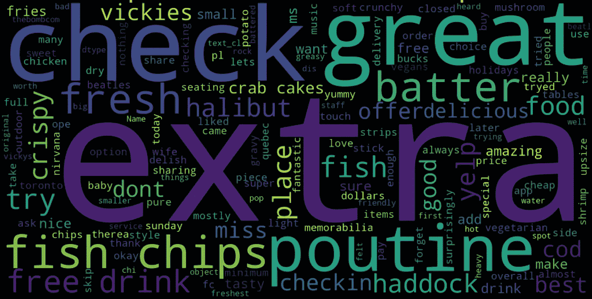

我为餐馆 X 生成的单词云(你会在这篇文章的结尾找到 X)

你这辈子第一次来到这个城市。

午餐时间到了。你想找一家好的当地餐馆，但不幸的是，你不知道该地区有谁可以推荐你。你现在做什么？

如果你选择继续 **Yelp** 寻找答案，你不是唯一的一个。


由[乔纳斯·洛伊普](https://unsplash.com/@jonasleupe?utm_source=medium&utm_medium=referral)在 [Unsplash](https://unsplash.com?utm_source=medium&utm_medium=referral) 上拍摄的照片

作为一个发布关于企业的众包评论的平台，Yelp 可以帮助用餐者进行决策，提供有价值的功能，如餐厅评级、提示和其他用餐者提供的评论。截至 2020 年 3 月，Yelp [1]上有**2.11 亿**条累积评论。

有了这些海量数据，Yelp 还发布了他们的业务、评论和用户数据的子集，用于教育和学术目的[2]。它还举办了“Yelp 数据集挑战”，为学生提供了一个通过挖掘这些数据进行研究和分析的机会(查看过去几轮获奖者及其论文[此处](https://www.yelp.com/dataset/challenge/winners))。

现在我确信你对这个数据集中有什么和我们能发现什么很好奇。事不宜迟，让我们开始探索之旅吧！

# 古玩目录

1.  [业务数据中有什么？](#07d5)
2.  [餐厅位于哪里？](#2ac6)
3.  [哪些餐厅出现率高？他们的评分有可比性吗？](#fb39)
4.  [我们能在餐厅属性中找到什么？](#c622)
5.  如何根据我们的需求找到顶级餐厅？
6.  我们下一步能做什么？

# **数据集**

在这篇文章中，我将通过 **Kaggle** 探索 Yelp 数据集(此处链接到数据集[)。请注意，数据集是在 2020 年 3 月用更新的数据更新的，我的分析是在**更新的**数据集(截至 2020 年 7 月)上进行的。](https://www.kaggle.com/yelp-dataset/yelp-dataset)

该数据集包含 6 个 JSON 文件:

**business.json** —位置、评级(星级)和属性等业务数据。
**review.json** —用户评论包括用户 id、商家 id 等。
**user.json** —用户数据，比如写的评论数、朋友和一些元数据。
**checkin.json** —签入数据，包括签入 id 和业务 id。
**tip.json** —用户写的提示，是比较短的评论(一开始我以为这是客户服务后留下的“提示”。对我们的另一个提醒是确保在分析前充分理解数据。
**photo.json** —包含标题和标签的照片数据。

有关这些文件和数据格式的完整文档，请查看此[链接](https://www.yelp.com/dataset/documentation/main)。

值得注意的是，这个数据集是 Yelp 拥有的所有数据的一个子集，所以我们在做出任何大胆的结论之前需要注意。这篇文章使用了 **business.json** 和 **tip.json** 文件，我将在以后的文章中使用其他一些文件( **review.json** 等)。).

要查看我的完整 Python 代码，请查看我的 [Kaggle 内核](https://www.kaggle.com/dehaozhang/yelp-eda)或我的 [Github 页面](https://github.com/terryz1/yelp_dataset)。这篇文章旨在展示分析结果和发现，而不是详细检查代码。

**窥视业务数据**

因为每个文件都是 JSON 格式的，所以我们需要先把它加载到 DataFrame 中。然后，让我们看看业务数据的维度:

```
(209393, 14)
```

有 209393 个业务，14 个属性。

让我们看看有哪些不同的属性:

```
Index(['business_id', 'name', 'address', 'city', 'state', 'postal_code', 'latitude', 'longitude', 'stars', 'review_count', 'is_open', 'attributes', 'categories', 'hours'], dtype='object')
```

由于我们最感兴趣的是餐馆，我们需要使用*类别*列对其进行子集划分。让我们检查一下这一栏中是否有任何缺失的数据:

```
0.002502471429321897
```

在该数据集中的所有企业中，只有大约 0.25%的企业缺少*类别*数据。我们可以在分析中安全地排除这些。之后，让我们再次检查它的形状:

```
(208869, 14)
```

Yelp 上有超过 1200 种不同的商业类别。哪个类别的企业数量最多？我们的直觉可能是餐馆。让我们通过条形图快速确认一下:

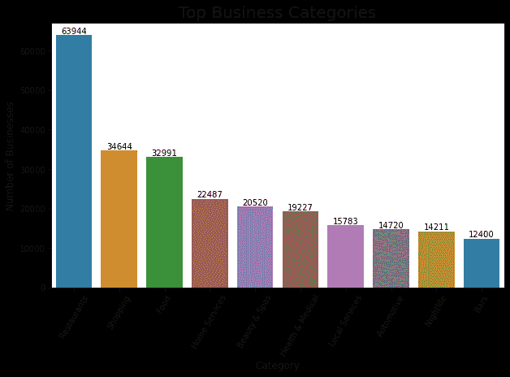

事实上，“餐馆”拥有最多的业务。请注意，每个企业最多可以分为三类[3]。

现在，我们可以将数据集仅划分为餐馆。一个很自然的问题是这些餐馆在哪里？

**地理可视化**

由于我们事先不知道这些选定餐馆的位置，我们先把它们标在世界地图上:

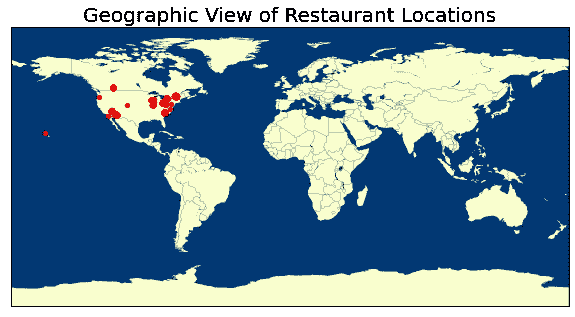

似乎 Yelp 数据集中的所有餐馆都在北美地区。让我们放大一下:

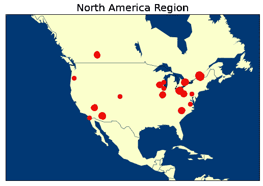

所有餐厅都位于美国或加拿大。

让我们找出在这个数据集中餐馆数量最多的城市:

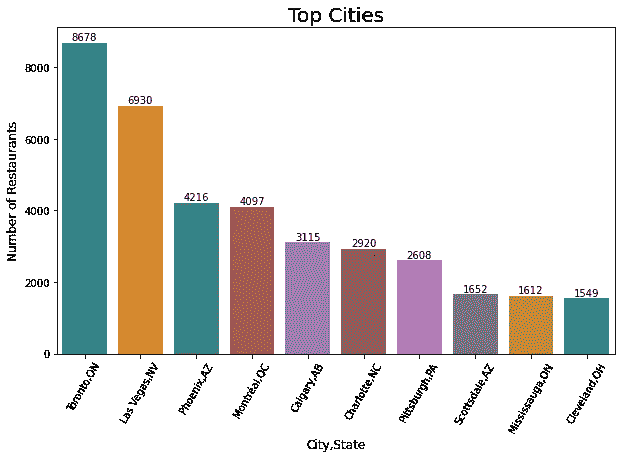

多伦多和拉斯维加斯是餐馆数量最多的两个城市。让我们来看看这两个城市中这些餐厅的位置:

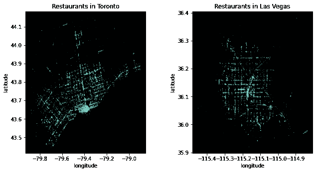

该地区越明亮，该地区的餐馆就越多。

**出现率高的餐厅&评级对比**

在该数据集中的所有餐馆中，哪些餐馆比其他餐馆出现的频率高？我们的直觉可能是快餐连锁店。

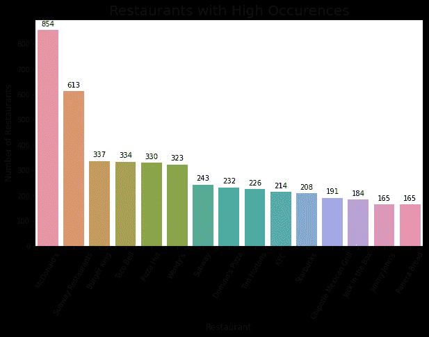

我们的直觉是正确的。注意“地铁餐厅”是“地铁”被命名为两个不同的餐厅，但它们应该是相同的。让我们来解决它:

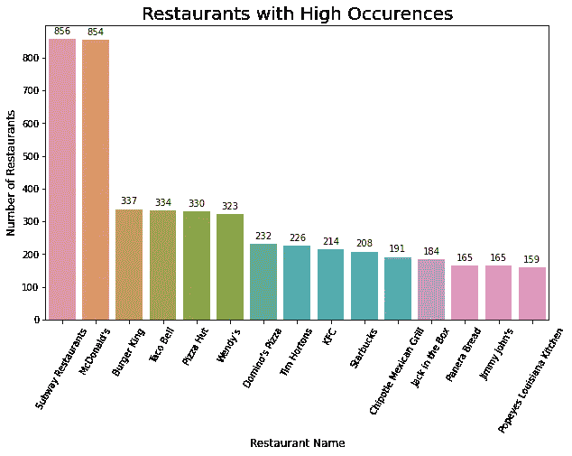

赛百味和麦当劳在前 2 名。注意，总部位于多伦多的 Tim Hortons 也名列前茅。

由于每个单独的餐厅分店都有一个“星级”栏(评分在 1.0 到 5.0 之间，增量为 0.5)，我们可以通过并排的方框图来比较这些受欢迎的连锁餐厅分店的评分:

> 麦当劳 vs 汉堡王

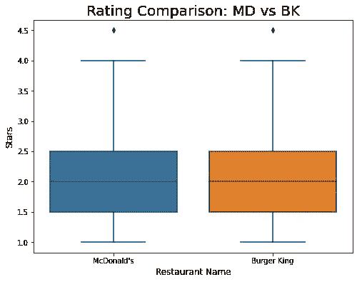

有趣的是，他们的评分似乎一点区别都没有。他们的评级中值是 2.0，利差大致相同。中间的 50%(第 25 百分位—第 75 百分位)分支有 1.5 星— 2.5 星。

> 必胜客 vs 达美乐比萨

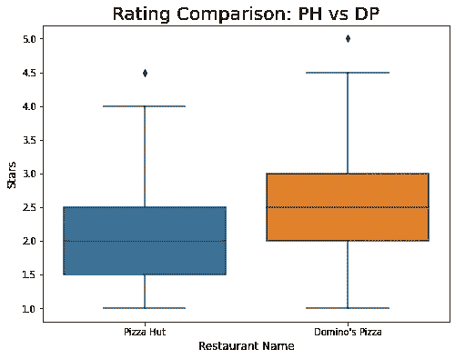

两相比较，达美乐比萨的评分略高于必胜客。中间 50%的分店的必胜客星级为 1.5-2.5，达美乐比萨星级为 2.0-3.0。

> 赛百味 vs 吉米·约翰

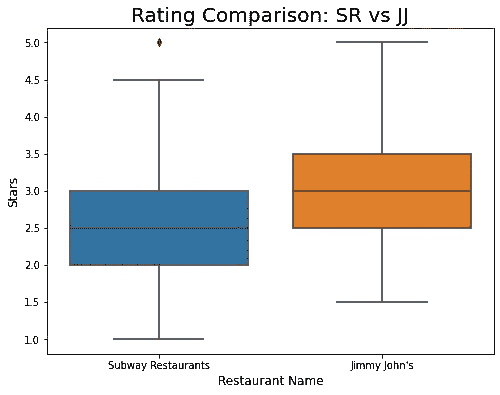

与之前的对比相似，吉米约翰的评分比赛百味略高。位于中间 50%的分店，赛百味为 2.0-3.0 星，吉米约翰为 2.5-3.5 星。

> 塔可钟 vs 墨西哥烤肉店

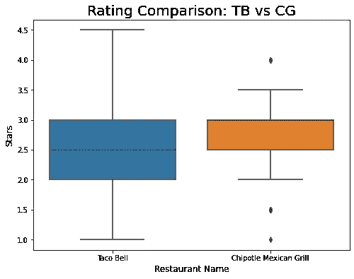

最后一对比较显示了有趣的结果。与 Chipotle 相比，Taco Bell 的价差更大，IQR 更高(Q3-Q1)。这可能部分是因为 Taco Bell 在这个数据集中比 Chipotle 多了 100 多家餐厅。此外，也可能是 Chipotle 的食品质量和服务更加均衡。请注意，我们看不到 Chipotle 的中线，因为它与其 Q1 或 Q3 重叠。让我们检查它的中值来确认:

```
3.0
```

好吧，和 Q3 重叠了。这种重叠的原因是因为 Chipotle 有大量的“3 星”。

通过这些比较，我们可以看到，对于同一家餐厅，不同分店的评分可能会有很大差异(Chipotle 可能是个例外)，而且在我们观察的每个比较对中，评分都没有明显的优势。

> 评论数量和评级之间的关系

除了“stars”属性，还有一个“review_count”属性，表示 Yelp 用户提交的评论数量。让我们创建一个散点图来直观显示评论数和评分之间的关系:

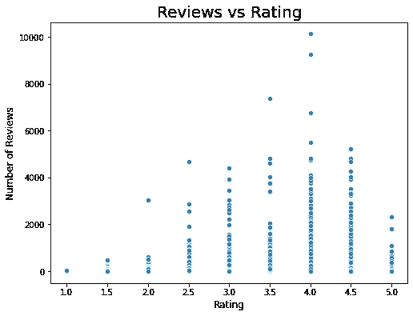

我们可以看到，随着评分从 1.0 增加到 4.0，评论的数量也趋于增加。然而，随着评分的进一步增加，尤其是从 4.5 增加到 5.0，评论的数量会减少。

**深入了解餐厅属性**

该业务数据集中的一列是“属性”，表示商业设施。让我们来看看它们:

```
Index(['RestaurantsAttire', 'RestaurantsTakeOut', 'BusinessAcceptsCreditCards', 'NoiseLevel', 'GoodForKids', 'RestaurantsReservations', 'RestaurantsGoodForGroups', 'BusinessParking', 'RestaurantsPriceRange2', 'HasTV', 'Alcohol', 'BikeParking', 'RestaurantsDelivery', 'ByAppointmentOnly', 'OutdoorSeating', 'RestaurantsTableService', 'DogsAllowed', 'WiFi', 'Caters', 'Ambience', 'GoodForMeal', 'HappyHour', 'WheelchairAccessible', 'BYOB', 'Corkage', 'DietaryRestrictions', 'DriveThru', 'BusinessAcceptsBitcoin', 'Music', 'BestNights', 'GoodForDancing', 'Smoking', 'BYOBCorkage', 'CoatCheck', 'AgesAllowed', 'RestaurantsCounterService', 'Open24Hours', 'AcceptsInsurance', 'HairSpecializesIn'], dtype='object')
```

> 比特币餐馆

这些属性中的大多数都非常简单。我发现“BusinessAcceptsBitcoin”属性很有趣，所以让我们看看这个数据集中有多少家餐馆接受比特币:

```
False    4245
True       74
Name: BusinessAcceptsBitcoin, dtype: int64
```

在包含这一属性的 4319 家餐厅中，有 74 家接受比特币。

> 大衣格子与价格区间的关系

我的直觉是，随着价格区间的扩大，提供衣帽寄存服务的餐厅比例也会增加。

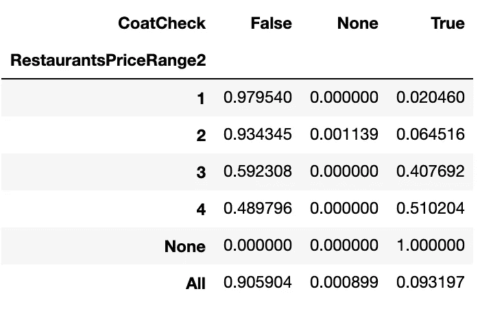

价格范围和是否有大衣格子之间的交叉列表(列出的数字是百分比)

请注意，对于价格范围，“1”表示“$”,“2”表示“$$”等。查看[这里](https://www.yelp.com/topic/san-diego-can-anyone-give-me-the-actual-dollar-range-for-the-dollar-sign-symbols-in-rrgards-to-pricing)Yelp 美元符号和实际价格范围之间的映射。

我们可以看到，当价格范围在 100 美元到 100 美元之间时，几乎没有一家餐馆提供衣帽寄存服务.然而，当价格范围为$$$-$$$，近一半的餐厅提供 coatcheck。

> 餐厅外卖与评分的关系

我的直觉是，随着餐馆评分的增加(1.0-3.0)，提供外卖的餐馆的百分比也应该增加，随着餐馆评分从 3.0 增加到 5.0，该百分比可能会略有下降。

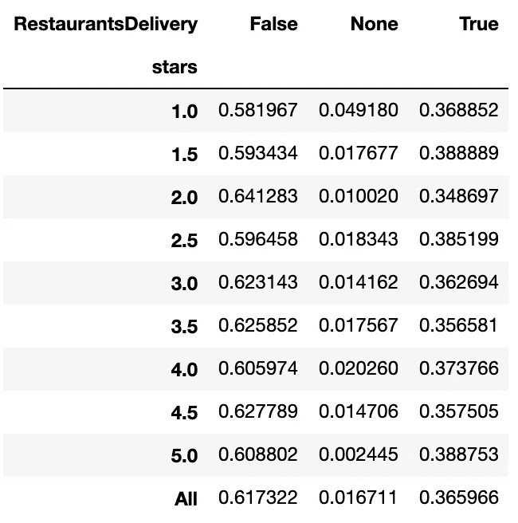

评分和餐厅是否提供送货服务之间的交叉列表

提供外卖服务的餐馆的比例实际上保持不变，与其评级无关。

请注意，在给定的属性和评级/评论数量之间，我们可以研究更多的二元或多元关系！

**根据你的需求发现餐馆**

假设您想在多伦多找到一家符合以下条件的餐厅:

1.  评分> 3.5 星
2.  100 多篇评论
3.  打开(重要！)
4.  价格范围为 11-30 美元
5.  接受外卖服务(#社交距离)
6.  接受信用卡

假设我们希望看到按评分(第一)和评论数(第二)排序的前 15 家餐馆:

```
28918                      Ramen Isshin
46423             Fresco's Fish & Chips
49260                           BarChef
37688    Descendant Detroit Style Pizza
4472                         Hodo Kwaja
49245                      Saigon Lotus
27989                           deKEFIR
60497                      Banh Mi Boys
30969           Manpuku Japanese Eatery
16129                       Le Gourmand
2827                White Brick Kitchen
30799                        La Palette
43941           Aoyama Sushi Restaurant
4794                      Mangia & Bevi
4136                          La Cubana
```

现在你可能在想拉面伊申，以及人们对这家餐厅有什么建议。为此，我们需要查看**提示**数据。以下是用户在拉面伊申上给出的五个随机提示:

```
1\. 'Very small place fits about 30 people. They don't quite have a big sign.'
2\. 'Try the soft tofu appetizer! It's quite light but I find it really tasty!'
3\. 'They have a really cool chart in the front of their menu that breaks down each dish!'
4\. 'Order the white sesame ramen! Quite tasty!'
5\. 'By far, the most spacious ramenya in Toronto.'
```

单词云是一种有趣的方式来可视化文本组中的流行单词/短语。要创建一个，我们需要首先处理原始文本(删除非字母字符/标点符号/停用词等。).点击阅读关于 NLP 文本处理[的更多信息。](/introduction-to-natural-language-processing-for-text-df845750fb63)

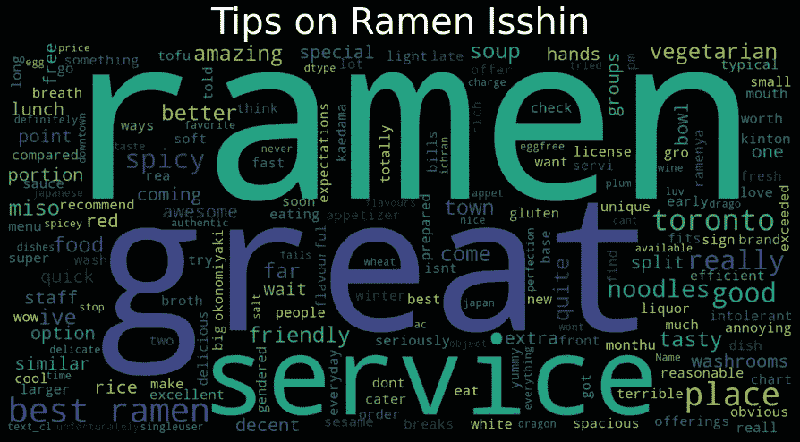

不太喜欢拉面，你更喜欢“弗雷斯科的鱼和薯条”？当然…这里有一些人们给“弗雷斯科炸鱼薯条”的随机提示:

```
1\. 'Check in for a free drink!!'
2\. 'Add extra fish for only a few dollars, great for sharing!'
3\. 'Ask to add extra piece of fish to order if you don't want too many chips but want two orders; more fish less chips less money. ;)'
4\. 'Use the free drink checking offer!'
5\. 'Sunday! 3 items for just $5! I like the shrimp!'
```

我们可以看到“**入住**免费饮料”和“加**额外**鱼”在这里都被提到了两次。我知道你现在可能在想什么…你是对的。这篇博文的特色图片确实是“Fresco 的鱼&薯条”。

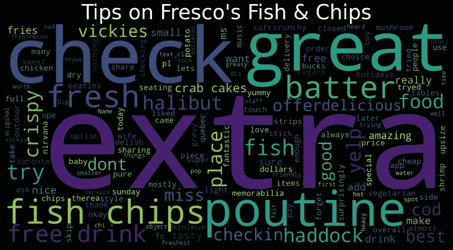

# 接下来

Yelp 数据集有如此多的文本信息，我们在这篇文章中没有涉及。 **review.json** 文件包含的用户评论比一般的提示长**。这些数据可用于建立情感分析模型。具体来说，问题如下:有可能预测用户基于他们的文本评论给出的餐馆评级(或总体正面/负面情绪)吗？**

**点击这里查看我如何使用逻辑回归[创建情感分类模型。](/sentiment-classification-with-logistic-regression-analyzing-yelp-reviews-3981678c3b44?source=friends_link&sk=b9493a3cadf935f4b5c78c1d6c6df25d)**

# ****总结****

**我们研究了 Yelp 数据集中的业务数据，并检查了一些快餐连锁店的餐厅评级。然后我们看了看不同的餐馆属性和它们之间的关系。最后，我们通过一个例子来说明如何找到符合我们需求的顶级餐厅，并使用小费数据来创建可视化效果，以帮助我们理解餐厅小费。**

**我希望你喜欢这篇文章，并请分享你的想法:)**

**DS/ML 初学者？查看我的另一篇关于如何使用 Iris 数据集构建第一个 Python 分类器的帖子:**

**[](/exploring-classifiers-with-python-scikit-learn-iris-dataset-2bcb490d2e1b) [## 使用 Python Scikit-learn-Iris 数据集探索分类器

### 如何用 Python 构建第一个分类器的分步指南。

towardsdatascience.com](/exploring-classifiers-with-python-scikit-learn-iris-dataset-2bcb490d2e1b)** 

# **参考**

**[1][https://www.yelp-ir.com/overview/default.aspx](https://www.yelp-ir.com/overview/default.aspx)
【2】[https://www.yelp.com/dataset](https://www.yelp.com/dataset)
【3】[https://blog.yelp.com/2018/01/yelp_category_list](https://blog.yelp.com/2018/01/yelp_category_list)**