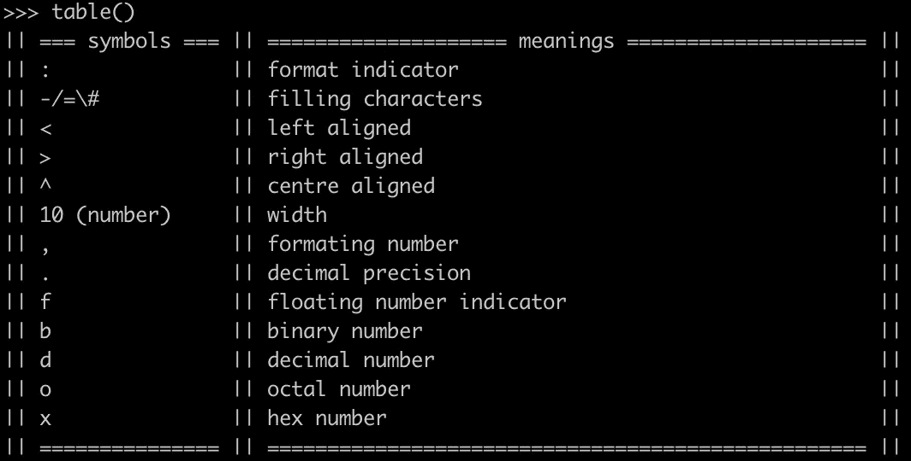

# 发现 Python3 字符串格式函数的所有魅力

> 原文：<https://towardsdatascience.com/discovering-all-the-charms-in-python3-string-format-function-af07d609c760?source=collection_archive---------32----------------------->


照片由[克里斯里德](https://unsplash.com/@cdr6934?utm_source=medium&utm_medium=referral)在 [Unsplash](https://unsplash.com?utm_source=medium&utm_medium=referral) 拍摄

## 一个神奇的函数格式化 Python 字符串，给你更多呈现字符串和数字的想法。

由于 Python3 涉及到了`[str.format()](https://docs.python.org/3.8/library/stdtypes.html#str.format)`函数，我们有了一种更优雅的方式来定义字符串模板，并将变量值作为参数插入到这个函数中。

本文列出了使用该函数的所有不同方式，并展示了我们可以用它做的事情的潜力。

# 0x01 按位置传递参数

我们需要使用花括号`{}`作为占位符，然后将格式函数中的参数传递给字符串模板。有许多使用这种技术的方法，如下所列。

如果我们不指定位置，参数将按默认顺序传递。

```
>>> '{} {} {}'.format('I', 'love', 'Python')
'I love Python'
```

我们也可以定义位置，实现同样的事情。

```
>>> '{0} {1} {2}'.format('I', 'love', 'Python')
'I love Python'
```

在字符串模板中，我们可以自定义位置。

```
>>> '{1} {0} {2}'.format('love', 'I', 'Python')
'I love Python'
```

如果`format`函数中的参数比字符串模板中定义的多，那么多余的参数将被忽略。

```
>>> '{0} {1} {2}'.format('I', 'love', 'Python', 'yes')
'I love Python'
```

我们还可以在字符串模板中的特定位置多次使用该参数。当然，这样使用`format`功能需要明确指定位置。

```
>>> '{0} {1} {2}. {3} {1}s {2}, too'.format('I', 'love', 'Python', 'She')
'I love Python. She loves Python, too'
```

# 0x02 通过键传递参数

与位置号相比，使用文本定义的键会使代码更具可读性。所以，有时你可能想通过键传递参数。

```
>>> '{subject} {verb} {object}'.format(subject='I', verb='love', object='Python')
'I love Python'
```

# 0x03 传递字典

我们可以直接传入一个字典，而不是在`format`函数中使用“键=值”对，因为它也是“键:值”格式。

```
>>> dict = {'subject': 'I', 'verb': 'love', 'object': 'Python'}
>>> '{subject} {verb} {object}'.format(**dict)
'I love Python'
```

# 0x04 传递列表

在使用`format`函数将值传递给字符串模板之前，不必从列表中提取值。

```
>>> l = ['I', 'love', 'Python']
>>> '{0} {1} {2}'.format(*l)
'I love Python'
```

还可以通过下标访问列表中的元素。

```
>>> l = ['I', 'love', 'Python']
>>> '{0[0]} {0[1]} {0[2]}'.format(l)
'I love Python'
```

# 高级用法:格式化符号

在花括号`{}`中，我们不仅可以插入位置指示器，还可以插入格式化符号。下表显示了可用的格式化符号。



上表完全是用`format`函数打印出来的，源代码如下。

```
def table():
 print('|| {:=^15} || {:=^50} ||'.format(' symbols ', ' meanings '))
 print('|| {:<15} || {:<50} ||'.format(':', 'format indicator'))
 print('|| {:<15} || {:<50} ||'.format('-/=\\#', 'filling characters'))
 print('|| {:<15} || {:<50} ||'.format('<', 'left aligned'))
 print('|| {:<15} || {:<50} ||'.format('>', 'right aligned'))
 print('|| {:<15} || {:<50} ||'.format('^', 'centre aligned'))
 print('|| {:<15} || {:<50} ||'.format('10 (number)', 'width'))
 print('|| {:<15} || {:<50} ||'.format(',', 'formating number'))
 print('|| {:<15} || {:<50} ||'.format('.', 'decimal precision'))
 print('|| {:<15} || {:<50} ||'.format('f', 'floating number indicator'))
 print('|| {:<15} || {:<50} ||'.format('b', 'binary number'))
 print('|| {:<15} || {:<50} ||'.format('d', 'decimal number'))
 print('|| {:<15} || {:<50} ||'.format('o', 'octal number'))
 print('|| {:<15} || {:<50} ||'.format('x', 'hex number'))
 print('|| {0:=^15} || {0:=^50} ||'.format(''))
```

这些格式化符号将在下一节解释。

# 0x05 填充、对齐和宽度

**对准**和**宽度**必须一起使用。前者必须是`<`左对齐、`>`右对齐或`^`居中对齐，后者必须是整数。

```
>>> print('|{:<15}|'.format('left'))
|left           |
>>> print('|{:^15}|'.format('centre'))
|    centre     |
>>> print('|{:>15}|'.format('right'))
|          right|
```

如果提供了填充字符，上面字符串中的所有空格都将被给定的字符替换。

```
>>> print('|{:=<15}|'.format('left'))
|left===========|
>>> print('|{:*^15}|'.format('centre'))
|****centre*****|
>>> print('|{:$>15}|'.format('right'))
|$$$$$$$$$$right|
```

请注意，填充字符可以是任何字符，但只能是一个字符。

# 0x06 十进制精度

`format`功能还允许我们指定十进制数的精度。

```
>>> print('{:.3f}'.format(3.1415926))
3.142
```

我们甚至可以通过计算直接显示百分比

```
>>> print('{:.2%}'.format(7/8))
87.50%
```

# 0x07 数字格式

我发现`format` 功能的数字格式化功能还是挺有用的。它可以很容易地在正确的位置添加逗号。

```
>>> print('{:,}'.format(123456789))
123,456,789
```

此外，我们可以控制正数和负数的输出格式，以便有更好的表示。

始终显示标志:

```
>>> print('{:+f}\n{:+f}'.format(100, -100))
+100.000000
-100.000000
```

在正数前加一个空格，使数字从负数的相同位置开始:

```
>>> print('{: f}\n{: f}'.format(100, -100))
 100.000000
-100.000000
```

# 0x08 基数转换

我们还可以使用`format`函数快速转换数字的基数。

十进制到二进制:

```
>>> print('{:b}'.format(100))
1100100
```

二进制到十进制

```
>>> print('{:d}'.format(0b1100100))
100
```

十进制到八进制

```
>>> print('{:o}'.format(100))
144
```

十进制到十六进制

```
>>> print('{:x}'.format(100))
64
```

# 0x09 直接将日期时间转换为字符串

通常我们需要使用`strftime`函数将一个`datetime`对象转换成特定格式的`string`类型。但是，如果你只想打印`datetime`，你可以不使用该功能。

```
>>> from datetime import datetime
>>> print('{:%d-%B,%Y %A %H:%M:%S}'.format(datetime.now()))
11-March,2020 Wednesday 22:17:44
```

# 摘要


尼尔斯·斯塔尔在 [Unsplash](https://unsplash.com?utm_source=medium&utm_medium=referral) 上拍摄的照片

下面是 Python 中`str.format()`函数的全部魔力。我希望这能让你在打印或格式化 Python 字符串和数字时有更多的想法。

[](https://medium.com/@qiuyujx/membership) [## 通过我的推荐链接加入 Medium 克里斯托弗·陶

### 作为一个媒体会员，你的会员费的一部分会给你阅读的作家，你可以完全接触到每一个故事…

medium.com](https://medium.com/@qiuyujx/membership) 

如果你觉得我的文章有帮助，请考虑加入 Medium 会员来支持我和成千上万的其他作者！(点击上面的链接)