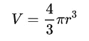

# 发现数学思维

> 原文：<https://towardsdatascience.com/discovering-mathematical-mindset-d856ec63c21a?source=collection_archive---------40----------------------->

## ***数据科学是如何帮助我养成数学态度的！***

照片由[乔恩·泰森](https://unsplash.com/@jontyson?utm_source=medium&utm_medium=referral)在 [Unsplash](https://unsplash.com?utm_source=medium&utm_medium=referral) 拍摄

或者许多人认为，数学灌输了恐惧、仇恨、厌倦或者至少是某种程度的冷漠。这是一个很难理解的话题。人们很容易联想到诗歌、文学、音乐、法律或历史。但是数学在很大程度上被认为是神秘的，没有灵魂的。上面这张照片抓住了这种感觉:*“美术比数学重要”*。但是我倾向于不同意**因为我相信数学也是一门艺术**

这篇文章试图从新的角度来看待数学。

让我们从最基本的开始。

# 什么是数学？

照片由 [Antoine Dautry](https://unsplash.com/@antoine1003?utm_source=medium&utm_medium=referral) 在 [Unsplash](https://unsplash.com?utm_source=medium&utm_medium=referral) 上拍摄

有人会说数学是对数字的研究。其他人可能会将其描述为一套用于计数和测量的技术/函数/方程。数学是一门你必须找到解决问题的方法的学科。你被要求解代数方程并计算出 x 的值。你学习处理微分、积分、极限、概率、三角函数、向量微积分等等。我们可以学习如何做到这一点，我们中的许多人甚至在考试中取得好成绩。然而，有很多人对这整个练习感到超脱。做这件事有什么意义？这到底意味着什么？数学方程式或数学公式代表什么？

这些都是重要的问题。要回答这个问题，我们必须深入一点。让我们闭上眼睛， ***思考*** 讲述 ***学习*** ，总的来说。

照片由[安特·哈默斯特](https://unsplash.com/@ante_kante?utm_source=medium&utm_medium=referral)在 [Unsplash](https://unsplash.com?utm_source=medium&utm_medium=referral) 上拍摄

> 当你观察到一种现象并认识到一种模式时，学习就发生了。你试图通过发现现象中涉及的实体之间是否有任何关系来理解这种模式。

花点时间。你会意识到，对任何事物的任何一种理解或知识，都不过是对模式的识别和解释。想想农业、季节变化、行星运动、生命进化、化学反应、股票市场分析、心理学研究、临床试验、药物开发…几乎每一个对知识的追求都包括对某种模式的识别。(查看此[条](/human-learning-vs-machine-learning-dfa8fe421560))

如果你同意……..请继续阅读。

一旦模式被识别出来，它就必须被表达出来。人类使用“语言”、“符号”和“图画”来表达、描述和交流思想和认识。

由[乔尔·那仁](https://unsplash.com/@joeljnaren?utm_source=medium&utm_medium=referral)在 [Unsplash](https://unsplash.com?utm_source=medium&utm_medium=referral) 上拍摄的照片

例如，如果我们必须描述“民主”的概念，我们可以用英语来解释。在[维基百科](https://en.wikipedia.org/wiki/Democracy)上你可以找到如下描述:

> D **emocracy** ( [希腊语](https://en.wikipedia.org/wiki/Greek_language) : δημοκρατία， *dēmokratiā* ，来自*dēmos*‘人民’和*奎*‘统治’)是[政府](https://en.wikipedia.org/wiki/Government)的一种形式，其中[人民](https://en.wikipedia.org/wiki/People)拥有[权力](https://en.wikipedia.org/wiki/Authority)来选择他们的统治[立法](https://en.wikipedia.org/wiki/Legislation)。

如果非要描述如何从一个城市到达另一个城市，可以画一张 ***地图*** 来表达。仅使用文本不太适合表达这个想法。

来源:谷歌地图

现在，自然界中有许多模式或想法是抽象的。比方说，你有两个橘子放在一个篮子里，三个香蕉放在另一个篮子里。你总共有多少水果？你可以把 2 加 3 得到 5，也可以把 3 加 2 得到 5。顺序不重要。实际上这是 ***加法交换律*** 它可以用英语表达为:

> 当两个数相加时，数字的顺序不起任何作用。

然而，表达上述想法的更有效的方式是:

> **P + Q = Q + P**

关于数学的伟大思想来了

# 数学是表达“模式”的语言之一。

对于什么样的模式，应该使用数学？

> *更正式或更抽象的模式，可以用数学语言高效地表达出来。*

例如，如果一个人以某个恒定的速度驾驶一辆汽车，在行驶距离、他的速度和驾驶的总时间之间是否存在关系或模式。

是的，有一种模式可以用英语表达如下:

> "司机行驶的距离总是等于他的速度乘以他行驶的时间"。

这种解释是正确的，但如果我们用数学符号和运算来表达它，会更有用，如下所示:

**距离=速度*时间**

# ✕ **T**

数学上，我们可以说，如果速度不变，距离和时间之间存在线性关系。和学校里教的直线方程比较一下。

在我们的例子中，直线穿过原点，因此 b=0。在时间 0，没有距离被覆盖。速度是“斜率”,即我们线的米数)

现在，为什么数学表达式更有用？这是因为它抓住了现象背后的“广义”概念。自然界中任何存在线性关系的现象都可以用直线的形式来表达，我们可以通过遍历这条线来预测未来的值。

[这就是**线性回归**在很高的水平上]

# 新的视角

S 顶级思维数学作为一门解决问题的学科。开始把它当成一种语言——一种表达自然界模式的语言。

# “数学是上帝书写宇宙的语言”——伽利略·伽利雷

不同类型的模式导致不同的数学分支:

1.  形状的模式:几何
2.  运动和变化的模式:微积分
3.  位置模式:拓扑
4.  机会模式:概率
5.  推理模式:逻辑

一旦你开始认为数学是一种模式语言，你就可以开始从不同的思维模式来看待方程。可以把一个等式看作是该模式的表达式。试着想象这个等式想要表达的模式。就当是故事情节，人物之间有关系。

先说一个基本形状: ***圆***

圆心在原点(0，0)的圆的数学公式为:

现在想想这个等式表达的模式。

> **“圆上的每一点离圆心的距离都是一样的”。**

实际上，这种模式使它成为一个圆。一个形状的每一点到一个固定点的距离都相等，这个形状就是圆。它不能是矩形或三角形或任何其他形状。只有圆圈遵循这种模式。这是知识或学习，上面的等式是想说！有没有其他的方式，可以表达这种模式？

> 用世界上任意一个圆的直径除以圆周！你将总是得到一个常数' **𝜋'(大约 3.14159)**

这是描述圆背后图案的另一种方式。任何数学公式中只要有一个圆圈，就会有 **𝜋.**

**圆的面积，**球体的体积，圆柱体的体积:

当然，你可以推导出这些公式的证明，但我试图传达的基本思想是，它们背后有一个共同的模式——“圆形”——因此有了 **𝜋**

让我们更进一步。以前，我把圆形(或球形)称为基本形状。如果你认为，这是自然界中最丰富的形状(可能不是完美的圆形或球形，但仍然足够接近)，像行星和其他天体的形状，气泡，雨滴，原子，行星的旋转和公转，星系的形状等

自然界中存在一种基本模式吗？我认为有。而这个基本模式就是“**重复**”。有许多重复的自然现象。例如地球(行星)绕轴旋转、行星绕恒星公转、整个星系公转、电子绕原子核运动、季节变化、波浪起伏、光合作用等生物化学循环等等。(人说历史也是重演的。😎)

你看出其中的联系了吗？

# 这里的想法是，任何遵循重复模式的现象，都可以被认为是一个圆或圆的一部分。因此在其数学形式的某个地方， **𝜋将找到一个位置。**

所以现在，每当你看到一个带有 **𝜋的数学公式或方程，**就想到一个圆，然后思考这个方程试图表达的现象中是否有任何重复。您将看到一个连接。

一些例子:

**单摆的时间周期**:

来源:维基百科

有“反复”的议案！

**开普勒行星运动第三定律:**

它捕捉了行星离太阳的距离和它们的轨道周期之间的关系。(轨道是“松散的”圆形。行星“反复”围绕太阳转)

**库仑电力定律:**

电荷周围的电场遵循圆形轨迹。

来源:维基百科

…….你可以找到更多。当然，所有这些过程背后的实际数学和物理学比这里定义的要复杂得多。但我所建议的是从一个不同的心态来看待这些方程式或公式。**哪里有** **𝜋，哪里就会有**圆圈(重复)的存在

正如 **𝜋** 对于循环模式，自然界中还有其他模式可以被概括。例如，任何涉及指数增长或下降的现象几乎总是可以用“e”来表示。想想放射性衰变或人口增长，或新冠肺炎感染人数的增加，或你银行的复利。(亲爱的读者，我将把它留在这里让你思考这些模式)

# 这与机器学习和数据科学有什么关系？

照片由[亨特·哈里特](https://unsplash.com/@hharritt?utm_source=medium&utm_medium=referral)在 [Unsplash](https://unsplash.com?utm_source=medium&utm_medium=referral) 拍摄

数据科学和机器学习是用来模仿人类学习的领域。目标是自动发现数据中“模式”并建立输出变量和输入变量之间的关系。表达这种关系的最好方式是什么？如前所述，数学是表达这种形式关系的最佳语言。

像线性/逻辑回归或神经网络这样的机器学习算法使用线性代数和概率定理。ML 模型的成本优化采用微积分。单词和句子嵌入使用向量演算。所以，下次你实现任何机器学习算法的时候，想想为什么要使用特定的数学方法或函数，你想找出什么模式？

和所有自然循环一样，我将 ***重复*** (双关语):

> 数学是表达模式的语言。数学方程式或公式只是该模式的模型或解释。