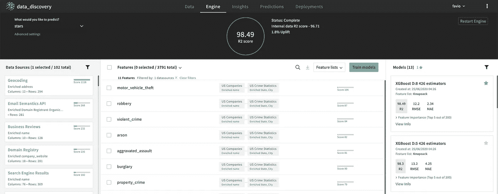

# 发现新数据

> 原文：<https://towardsdatascience.com/discovering-new-data-9be5ae5787ca?source=collection_archive---------28----------------------->

## 使用 Explorium 和 Python 通过几个简单的步骤发现数据。


Héizel Vázquez 插图

当你在数据科学领域工作时，最困难的部分之一是发现在试图解决业务问题时使用哪些数据。

请记住，在试图获得数据来解决问题之前，您需要了解业务和项目的背景。我所说的背景是指所有关于公司如何运作其项目、公司如何建立、其竞争对手、有多少部门、他们有不同的目标和目的，以及他们如何衡量成功或失败的细节。

当你拥有了所有这些，你就可以开始考虑获取解决业务问题所需的数据了。在本文中，我不会过多地谈论数据收集，相反，我想讨论并向您展示用新数据丰富您已有数据的过程。

请记住，获取新数据必须以系统的方式进行，而不仅仅是凭空获取数据，我们必须始终如一地做这件事，规划它，创建一个流程来做这件事，这取决于工程、架构师、数据运营以及我将在其他文章中讨论的更多内容。

# 设置环境

在本文中，我们将使用三种工具:Python、GitHub 和 Explorium。如果你想了解更多关于探索博物馆的信息，请点击这里:

[](/where-is-the-data-798faccb4e29) [## 数据在哪里？

### 或者如何丰富数据集并自动创建新要素。

towardsdatascience.com](/where-is-the-data-798faccb4e29) 

让我们从创建一个新的 git repo 开始。我们将在这里存储我们的数据、代码和文档。转到您的终端，创建一个新文件夹并移到那里:

```
mkdir data_discovery
cd data_discovery
```

然后初始化 git repo:

```
git init
```

现在让我们在 [GitHub](https://github.com/) 上创建一个远程回购:


现在转到您的终端并键入(将 URL 改为您的):

```
git remote add origin [https://github.com/FavioVazquez/data_discovery.git](https://github.com/FavioVazquez/data_discovery.git)
```

现在让我们检查一下:

```
git remote -v
```

您应该看到(当然是您自己的 URL):

```
origin [https://github.com/FavioVazquez/data_discovery.git](https://github.com/FavioVazquez/data_discovery.git) (fetch)
origin [https://github.com/FavioVazquez/data_discovery.git](https://github.com/FavioVazquez/data_discovery.git) (push)
```

现在让我们开始一个自述文件(我正在使用 [Vim](https://www.vim.org/) ):

```
vim Readme.md
```

你想在里面写什么都行。

现在让我们将文件添加到 git:

```
git add .
```

并创建我们的第一个提交:

```
git commit -m "Add readme file"
```

最后，让我们把这个推给我们的 GitHub repo:

```
git push --set-upstream origin master
```

此时，您的回购应该如下所示:


# 寻找数据

我们来找一些数据。我不打算在这里做理解数据、探索数据、建模或类似事情的整个数据科学过程。我只是去找一些有趣的数据给你做个演示。

对于这个例子，我们将从一些企业的 YELP 评论中探索数据。数据最初在 Kaggle 上:

[https://www.yelp.com/dataset/challenge](https://www.yelp.com/dataset/challenge)

但是我在这里使用的是来自[的 CSV 数据集。我使用的 CSV 文件叫做“yelp_reviews_RV_categories.csv”](/converting-yelp-dataset-to-csv-using-pandas-2a4c8f03bd88)

让我们将它添加到 git 中:

```
git add .
git commit -m "Add data"
git push
```

我们将从加载 Pandas 上的数据并执行基本 EDA 开始:

```
from pandas_profiling import ProfileReport
profile = ProfileReport(df, title="Pandas Profiling Report")
profile
```

这将为您提供一份全面的数据报告，如下所示:


# 使用 Explorium 获取更多数据

太好了，现在该去探索博物馆了。要了解更多关于 Explorium 的信息，请点击此处:

[](https://hubs.ly/H0r3HMF0) [## 增强数据科学平台|探索

### 自动连接到数以千计的源，并发现 Explorium 正在驱动的精确模型的功能…

hubs.ly](https://hubs.ly/H0r3HMF0) 

让我们创建一个新项目:


命名项目后，您应该从本地机器添加数据。我们将添加我们的主数据集。你会看到这样的东西:


您可以在下面的浏览栏中获得关于 Explorium 上的专栏的更多基本信息:


我们拥有的数据包含关于特定企业的信息，比如它的位置(城市、州、邮政编码)、它的名称、类别，以及关于它的评论者的数据。但是我们想知道更多。关于生意的更多信息。我们将首先将所有我们不关心的信息列入黑名单:

*   用户标识
*   文本


现在，让我们试着获得更多关于这个数据集的信息。Explorium 现在会要求您预测一些能够运行的东西，我们实际上不想预测任何东西，但让我们把一些东西放进去，这样它就能运行(我们将使用“星星”作为目标):


以星星为目标

当我们单击“播放”时，系统将开始收集有关数据集的信息。我们必须在这里等。在这一点上，系统不仅从外部来源引入新数据，还基于我们现有的列创建新功能。我们现在不使用它，但是在下一篇关于特性工程的文章中，它将是重要的。

几分钟后，我看到了这个屏幕:



这意味着 Explorium 找到了 102 个可以补充我的原始数据的数据集，最终，它从我的数据和外部来源创建/获取了 3791 列。请记住，我们有兴趣找到有关业务的更多信息，所以我将从外部数据集中挑选一些列，并将它们添加到我的原始数据中。

这是丰富数据的实际过程。正如你所看到的，系统可以告诉你前 50 个特征是什么，但是关于什么呢？如果你记得我们试图从其他列中“预测”星星，那么它告诉你的是这 50 或 100 个特征对我们选择的目标有一些预测能力。

您实际上可以获得关于感兴趣的特定列的更多信息。

让我们从最基本的开始。获取企业网站。为此，我将使用数据集:搜索引擎结果:


如果你点击箭头，你将下载它。之后，你可以把它装在熊猫身上:

```
# search engine
search = pd.read_csv("Search  Engine  Results.csv")
```

正如您将看到的，我们有许多缺失的数据，但这在您进行数据充实时是正常的。太好了，让我们选择公司的网站:

```
search[["name", "Company Website"]]
```


你看到的是给定名称的最有可能是某个特定企业的网页。很酷吧？

各商家周边的暴力犯罪数量呢？为此，我将使用“美国犯罪统计”数据集:


我们将使用不同的方法下载这些数据。我希望直接显示暴力犯罪，因此在我的要素部分，在按犯罪数据集过滤后，我将只选择暴力犯罪:


然后单击下载。让我们在 Python 上看看:

```
crimes[["name","violent_crime"]].dropna().drop_duplicates()
```


就像这样，你知道你有多少具体的商店暴力犯罪。创建这个变量的实际过程相当复杂。要了解更多信息，请访问 Explorium 并在选择变量时单击了解更多:


在“要素来源”部分，您可以看到它是如何创建的以及来自哪些数据源:


如你所见，这个过程并不那么简单，但是系统已经在为你做了，这太棒了:)

您可以对系统为您收集或创建的每一个变量都这样做，这样，您就可以完全控制整个过程。

# 更多数据

如果你记得我们把“星星”列为预测。尽管我们对此不感兴趣，但 Explorium 尽了最大努力来获取预测该列的数据。在以后的文章中，我将使用该工具创建整个项目，这样您就可以看到全貌了。

现在，我们可以选择最好的 50 个特征来预测我们选择的“测试”变量。为此，我们转到引擎选项卡并选择功能:


我们将仅从系统收集和创建的 3791 个变量中获得最佳的 50 个变量。然后我们会像以前一样下载它们。默认情况下，我们下载的数据集名为“all_features.csv”。让我们将它载入我们的 EDA 笔记本:

```
data = pd.read_csv("all_features.csv")
```

这些是我们的栏目:

```
['name',
 'address',
 'latitude',
 'longitude',
 'categories',
 'review_stars',
 'KNeighbors(latitude, longitude)',
 'review_stars.1',
 '"rv" in categories',
 'KNeighbors(Latitude, Longitude)',
 '"world" in Results Snippets',
 '"camping" in Results Snippets',
 '"camping" in Title of the First Result',
 '"camping" in Results Titles',
 '"world rv" in Results Titles',
 '"motorhomes" in Results Snippets',
 '"campers" in Results Snippets',
 '"accessories" in Results Titles',
 '"rated based" in Results Snippets',
 '"parts accessories" in Results Snippets',
 '"5th wheels" in Results Snippets',
 '"sale" in Results Titles',
 '"based" in Results Snippets',
 '"service center" in Title of the First Result',
 '"rvs" in Results Titles',
 '"buy" in Results Snippets',
 '"dealer" in Results Titles',
 '"inventory" in Results Snippets',
 '"travel" in Results Titles',
 'KNeighbors(LAT, LONG)',
 'Number of Related Links',
 'day(Website Creation Date)',
 'month(Website Creation Date)',
 '"service" in Website Description',
 'year(Website Creation Date)',
 'Percentile',
 'Number of Website Subdomains',
 '"rv" in Website Description',
 'MedianLoadTime',
 '"camping" in Website Description',
 '"buy" in Website Description',
 '"rv dealer" in Title',
 '"dealer" in Title',
 'Number of Connections to Youtube',
 '"trailers" in Website Description',
 'month(Domain Update Date)',
 'Domain Creation Date - Domain Update Date',
 'Domain Creation Date - Domain Expiry Date',
 'Stopword Count(Associated Keywords)',
 '"pinterest instagram" in Social Networks',
 'Number of Social Networks',
 '"facebook" in Social Networks',
 'Year of Establishment',
 'AdultContent->False',
 'AdultContent->empty',
 'Results From Facebook->False',
 'Results From Facebook->True',
 'Url Split(Company Website).company_website_10->empty',
 'Url Split(Company Website).company_website_10->utm_campaign=Yext%20Directory%20Listing',
 'Url Split(Company Website).company_website_10->utm_medium=organic',
 'Url Split(Company Website).company_website_10->utm_source=moz',
 '_TARGET_']
```

如你所见，我们有非常不同的数据，但当然很有趣。我现在不打算做更多的事情，因为我的想法是向您展示如何为您已经拥有的数据获取更多的数据，但同样，我将创建完整的项目，在其中我将遵循整个数据科学过程。

# 结论

我们可以看到，这个过程非常简单和直观，如果您不需要建模，您可以保留新数据并自己工作。如果您将这种类型的软件与对业务的良好理解和有效的数据科学方法相结合，您将更快地震撼数据科学世界。

请务必查看他们的网页了解更多信息:

[](https://hubs.ly/H0r3HMF0) [## 增强数据科学平台|探索

### 自动连接到数以千计的源，并发现 Explorium 正在驱动的精确模型的功能…

hubs.ly](https://hubs.ly/H0r3HMF0) 

感谢阅读:)