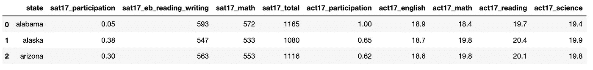
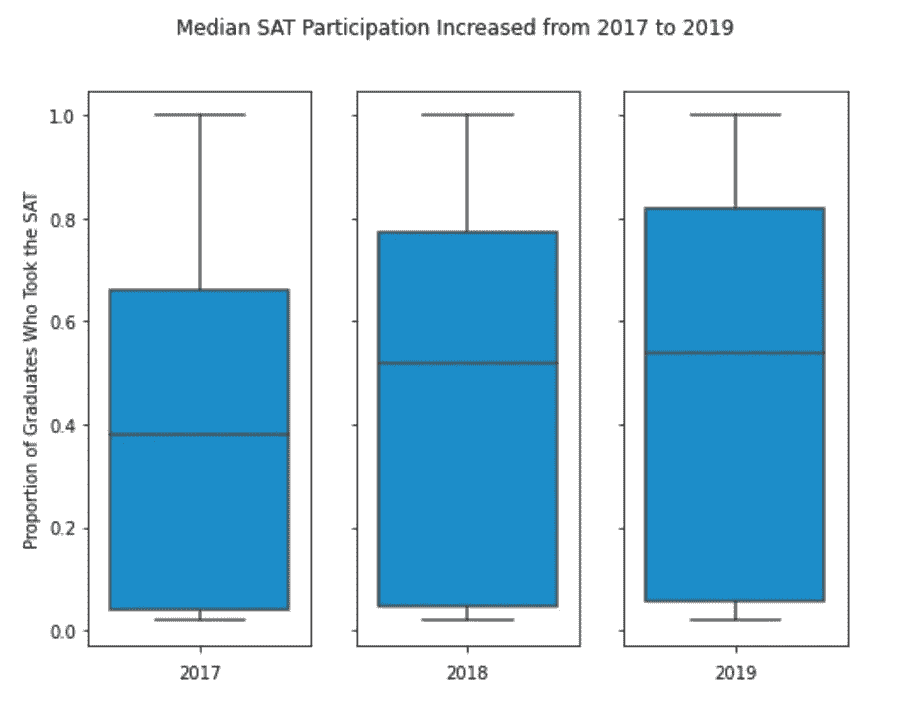
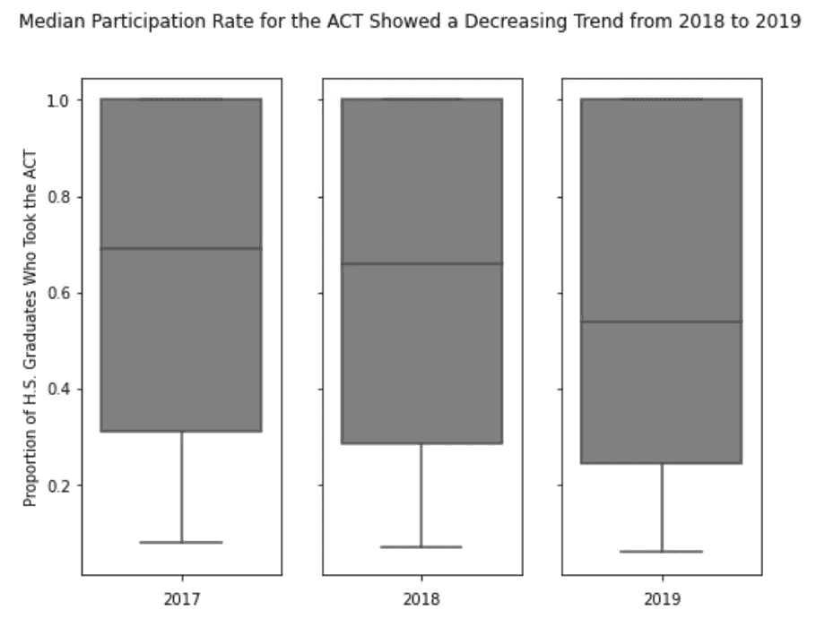
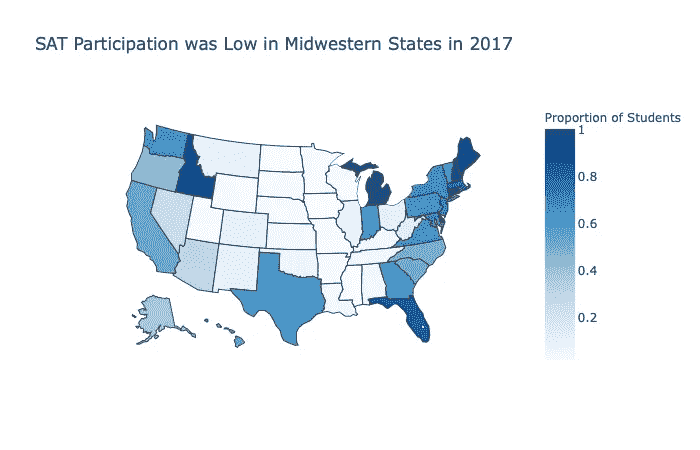
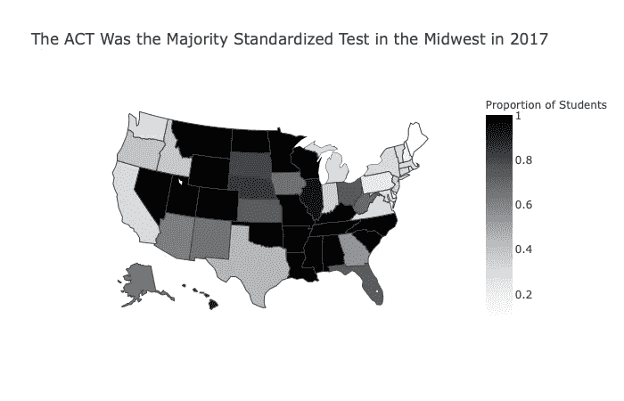
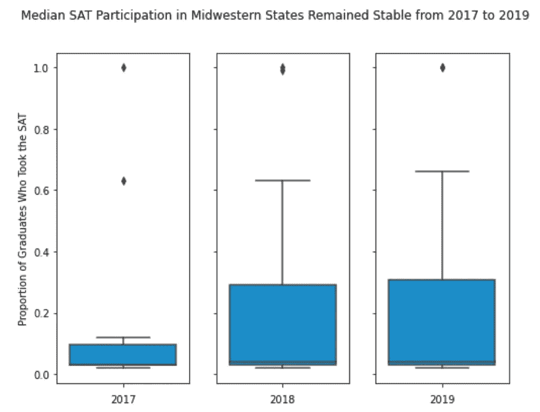
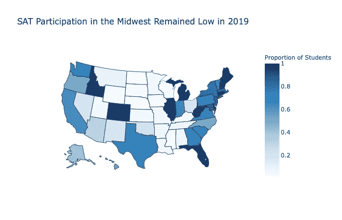

# 通过探索性数据分析发现数据中的模式

> 原文：<https://towardsdatascience.com/discovering-patterns-in-data-with-exploratory-data-analysis-fd07ce1c5efa?source=collection_archive---------34----------------------->

## 使用 Pandas、Seaborn 和 Plotly 对 SAT 和 ACT 数据的可视化探索

探索性数据分析(EDA)由 John W. Tukey 于 1977 年首次描述，指的是探索数据以了解变量之间的关系、检测异常并了解变量是否满足统计推断的假设的过程。EDA 是一个非常强大的工具，可以发现数据中的模式，并促进新的研究问题的发展。在这篇文章中，我将描述我如何使用 EDA 来揭示数据集中的趋势，以及这些趋势如何帮助我制定和回答一个研究问题。

# 背景

该项目是作为大会数据科学沉浸式训练营的一部分完成的。这个项目的目标是使用 EDA 来揭示 SAT 和 ACT 数据的趋势，以便为数据科学问题提出建议。对于这个项目，我收到了六个数据集，提供了 2017 年、2018 年和 2019 年各州的 SAT 和 ACT 数据。数据集中的变量包括各州的平均分数和平均参与率。为了准备 EDA，我清理了数据，并将所有六个数据集合并到一个 51 行 23 列的 Pandas 数据框架中。数据帧的部分报头如下所示。

显示 2017 年 SAT 和 ACT 数据的标题

# 探索性数据分析

作为我的 EDA 的一部分，我创建了几个数字来调查 SAT 和 ACT 的参与率趋势。我最感兴趣的是 SAT 和 ACT 参与率如何随时间和地理位置而变化。

为了探索参与率随时间的变化趋势，我使用 Seaborn 和 Matplotlib 为每个测试和年份创建了箱线图。比较参与率的分布让我不仅了解了平均参与率是如何随着时间变化的，还了解了分布的方差是如何变化的。

使用 Matplotlib 和 Seaborn 创建的箱线图。从这个图中，我们可以看到，SAT 参与率中位数从 2017 年的 38%上升到 2019 年的 54%。此外，第三个四分位数(第 75 个百分位数)的参与率从 2017 年的 66%上升到 2019 年的 82%。

从上面的图中，我注意到从 2017 年到 2019 年，SAT 参与人数中位数有增加的趋势。

使用 Matplotlib 和 Seaborn 创建的箱线图。从这个图中，我们可以看到中位数 ACT 参与率从 2017 年的 69%下降到 2019 年的 54%。此外，第一个四分位数(第 25 个百分位数)的参与率从 2017 年的 31%下降到 2019 年的 25%。

上面的方框图开始说明 2017 年至 2019 年 ACT 和 SAT 参与率的全国趋势。越来越多的州开始增加 SAT 的参与率，而 ACT 的参与率则有所下降。

当我研究这些数据时，我还使用 Plotly 创建了各州 SAT 和 ACT 参与率的 choropleth 图。如下所示，这些图表明，2017 年，除密歇根州和印第安纳州外，沿海各州的 SAT 参与率最高，而 ACT 参与率在中部各州占主导地位。

使用 Plotly 创建的 Choropleth 地图。这张地图显示，东部和西部海岸的 SAT 参与率最高。

使用 Plotly 创建的 Choropleth 地图。这张地图显示，在美国中部，青蒿素综合疗法的参与率较高。

考虑到我用箱线图揭示的参与率的时间趋势和用 choropleth 图说明的参与的地理差异，形成了一个研究问题。因为大多数中西部州在基线(2017 年)时表现出较低的 s at 参与率，所以我决定探索中西部在 2017 年至 2019 年期间是否也经历了 SAT 参与率中位数的整体增长。

首先，我创建了一个只包含中西部各州(伊利诺伊州、印第安纳州、爱荷华州、堪萨斯州、密歇根州、明尼苏达州、密苏里州、内布拉斯加州、北达科他州、俄亥俄州、南达科他州和威斯康星州)数据的 Pandas 数据框。从那里，我能够使用 Seaborn 和 Matplotlib 创建一个方框图，以查看 2017 年至 2019 年 SAT 参与的分布情况。如下图所示，虽然参与率的差异从 2017 年到 2019 年有所增加，但 SAT 参与率的中位数在三年期间保持相似。对数据的进一步研究显示，2017 年至 2018 年差异的增加主要是由于伊利诺伊州和俄亥俄州 SAT 参与率的增加。

使用 Plotly 创建的 Choropleth 地图。从这张地图中，我们可以看到，尽管伊利诺伊州和俄亥俄州的 SAT 参与率在 2017 年至 2019 年期间有所增长，但大多数中西部州的 SAT 参与率并没有增长。

# 结论

这个项目展示了 EDA 在揭示数据趋势方面的能力，这些数据可以在以后用于产生一个研究问题。通过使用 Matplotlib、Seaborn 和 Plotly 创建的简单图，我能够发现从 2017 年到 2019 年 SAT 参与率的增长趋势以及中西部各州在基线(2017 年)对 ACT 的地理偏好。综合来看，这些见解激励我调查 SAT 参与率的上升趋势是否也在中西部各州出现。仅用六个简单的图表(只有两种类型)，我就能确定一个研究问题并寻求答案。想象一下用 EDA 你能发现什么样的洞察力！