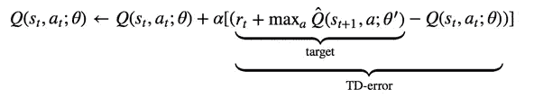
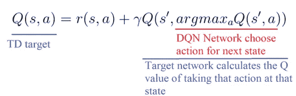
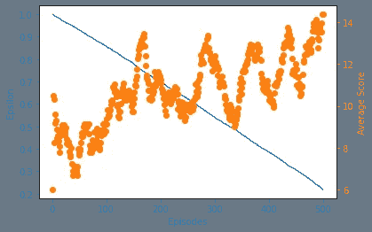
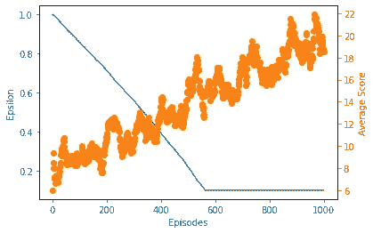
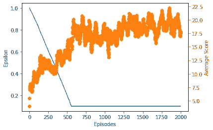

# 使用双深度 Q 学习构建改进的末日智能体

> 原文：<https://towardsdatascience.com/discovering-unconventional-strategies-for-doom-using-double-deep-q-learning-609b365781c4?source=collection_archive---------37----------------------->

## Pytorch 中强化学习的实现。

# **简介**

O 在过去的几篇文章中，我们已经[讨论了](https://medium.com/gradientcrescent/fundamentals-of-reinforcement-learning-navigating-cliffworld-with-sarsa-and-q-learning-cc3c36eb5830)和[在](/automating-pac-man-with-deep-q-learning-an-implementation-in-tensorflow-ca08e9891d9c) [VizDoom 游戏环境](/playing-doom-with-ai-multi-objective-optimization-with-deep-q-learning-736a9d0f8c2)中实现了 [深度 Q 学习](/optimized-deep-q-learning-for-automated-atari-space-invaders-an-implementation-in-tensorflow-2-0-80352c744fdc) (DQN)并测试了它的性能。深度 Q-learning 是一种高度灵活且响应迅速的在线学习方法，它利用场景内的快速更新来估计环境中的状态-动作(Q)值，以便最大化回报。Q-learning 可以被认为是一种策略外的 TD 方法，其中该算法旨在选择独立于当前遵循的策略的最高值的状态-动作对，并且已经与 OpenAI Atari 健身房环境的许多原始突破相关联。

我们的[香草 DQN 代理](/playing-doom-with-ai-multi-objective-optimization-with-deep-q-learning-736a9d0f8c2)的游戏性，训练超过 500 集。

然而，DQN 倾向于乐观地高估 Q 值，特别是在训练的初始阶段，导致次优动作选择的风险，因此收敛较慢。为了理解这个问题，回想一下 Q 学习更新方程，该方程利用当前状态奖励和最高值的状态-值对来估计当前状态的 Q 值，该 Q 值用于训练 DQN。



q-学习更新。

请注意，误差项中存在一个 TD-target，它由当前奖励和最高值的状态-动作对的 Q 值之和组成，与代理的当前策略无关，因此，Q-学习通常被称为非策略 TD 学习。

因此，Q-learning 依赖于为下一个状态选择具有最高值的动作的“远见”。但是我们怎么能确定下一个状态的最佳行动是具有最高 Q 值的行动呢？根据定义，Q 值的准确性取决于我们之前探索过的状态动作。因此，在训练开始时计算的 Q 值的准确性往往是不准确的，因为我们还没有完全探索状态-动作空间。在这种状态下取最大 Q 值可能会选择一个次优的行动，阻碍收敛。由于 TD 目标计算和行动选择是在同一个网络中进行的，这一事实加剧了这一问题，这可能会导致对次优行动选择的强化偏向。

为了解决这个问题，双深度 Q 学习(DDQN)首先由 Van Hasselt 等人[引入。a1 通过使用两个网络将动作选择与 Q 值目标计算步骤分离。我们可以通过将 TD 目标的 Q 值部分重写为两个部分来实现这一点，如下所示:](https://arxiv.org/abs/1509.06461)



在特定的时间步长和状态，我们使用我们的 DQN 网络为我们的下一个状态选择具有最高 Q 值的动作。然后使用目标网络来计算在下一个状态采取该行动的 Q 值，然后将其与当前状态行动的奖励相结合，以形成 TD 目标。网络定期对称更新。

因此，DDQN 可以减少 Q 值高估，从而确保稳定的学习和更快的收敛。

在我们的[上一篇文章](/playing-doom-with-ai-multi-objective-optimization-with-deep-q-learning-736a9d0f8c2)中，我们探索了如何通过使用开源的 OpenAI gym 包装库 [Vizdoomgym](https://github.com/shakenes/vizdoomgym) ，将深度 Q-learning 应用于训练代理在经典 FPS 游戏 **Doom** 中扮演一个基本场景。我们将在那篇文章的基础上修改我们的方法，在 Pytorch 中加入 DDQN 架构。

# **实施**

**我们将在与上一篇文章相同的 VizDoomgym 场景中实现我们的方法，*保卫防线，*使用相同的多目标条件。**环境的一些特征包括:

*   一个 3 的动作空间:开火，左转，右转。不允许扫射。
*   向玩家发射火球的棕色怪物，命中率为 100%。
*   试图以之字形靠近来咬玩家的粉红色怪物。
*   重生的怪物可以承受更多伤害。
*   杀死一个怪物+1 点。
*   -死了得 1 分。


“防线方案”的初始状态

回想一下，在[我们最初的 DQN 实现](/playing-doom-with-ai-multi-objective-optimization-with-deep-q-learning-736a9d0f8c2)中，我们已经利用了两个并发网络——一个用于行动选择的评估网络，以及一个定期更新的目标网络，以确保生成的 TD 目标是固定的。我们可以利用这个现有的设置来构建我们的 DDQN 架构，而无需初始化更多的网络。

请注意，由于两个网络定期更新彼此的权重，因此这两个模型仍然是部分耦合的，但重要的是，动作选择和 Q 值评估是由在特定时间步长不共享同一组 a 权重的独立网络完成的。

我们的 Google 协作实现是利用 Pytorch 用 Python 编写的，可以在 [GradientCrescent Github 上找到。](https://github.com/EXJUSTICE/GradientCrescent)我们的方法基于泰伯优秀强化学习[课程](https://www.manning.com/livevideo/reinforcement-learning-in-motion)中详述的方法。由于我们的 DDQN 实现类似于我们之前的普通 DQN 实现，所以整个高级工作流是共享的，这里不再重复。

让我们从导入所有必需的包开始，包括 OpenAI 和 Vizdoomgym 环境。我们还将安装火炬视觉所需的 AV 包，我们将使用它进行可视化。请注意，安装完成后必须重新启动运行时。

```
#Visualization cobe for running within Colab
!sudo apt-get update
!sudo apt-get install build-essential zlib1g-dev libsdl2-dev libjpeg-dev nasm tar libbz2-dev libgtk2.0-dev cmake git libfluidsynth-dev libgme-dev libopenal-dev timidity libwildmidi-dev unzip# Boost libraries
!sudo apt-get install libboost-all-dev# Lua binding dependencies
!apt-get install liblua5.1-dev
!sudo apt-get install cmake libboost-all-dev libgtk2.0-dev libsdl2-dev python-numpy git
!git clone [https://github.com/shakenes/vizdoomgym.git](https://github.com/shakenes/vizdoomgym.git)
!python3 -m pip install -e vizdoomgym/!pip install av
```

接下来，我们初始化我们的环境场景，检查观察空间和动作空间，并可视化我们的环境..

```
#Check the environment. You'll need to restart the runtime for it to work
import gym
import vizdoomgym

env = gym.make('VizdoomCorridor-v0')# use like a normal Gym environment
state = env.reset()
state, reward, done, info = env.step(env.action_space.sample())
print(state.shape)
# env.render()
env.close()
```

接下来，我们将定义预处理包装器。这些类继承自 OpenAI gym 基类，覆盖了它们的方法和变量，以便隐式地提供所有必要的预处理。我们将开始定义一个包装器来重复许多帧的每个动作，并执行元素方式的最大值以增加任何动作的强度。您会注意到一些三级参数，如 *fire_first* 和*no _ ops*——这些是特定于环境的，在 Vizdoomgym 中对我们没有影响。

```
class RepeatActionAndMaxFrame(gym.Wrapper):
  #input: environment, repeat
  #init frame buffer as an array of zeros in shape 2 x the obs space
    def __init__(self, env=None, repeat=4, clip_reward=False, no_ops=0,
                 fire_first=False):
        super(RepeatActionAndMaxFrame, self).__init__(env)
        self.repeat = repeat
        self.shape = env.observation_space.low.shape
        self.frame_buffer = np.zeros_like((2, self.shape))
        self.clip_reward = clip_reward
        self.no_ops = no_ops
        self.fire_first = fire_first def step(self, action):
        t_reward = 0.0
        done = False
        for i in range(self.repeat):
            obs, reward, done, info = self.env.step(action)
            if self.clip_reward:
                reward = np.clip(np.array([reward]), -1, 1)[0]
            t_reward += reward
            idx = i % 2
            self.frame_buffer[idx] = obs
            if done:
                break max_frame = np.maximum(self.frame_buffer[0], self.frame_buffer[1])
        return max_frame, t_reward, done, info def reset(self):
        obs = self.env.reset()
        no_ops = np.random.randint(self.no_ops)+1 if self.no_ops > 0    else 0
        for _ in range(no_ops):
            _, _, done, _ = self.env.step(0)
            if done:
                self.env.reset()

        if self.fire_first:
            assert self.env.unwrapped.get_action_meanings()[1] == 'FIRE'
            obs, _, _, _ = self.env.step(1) self.frame_buffer = np.zeros_like((2,self.shape))
        self.frame_buffer[0] = obs return obs
```

接下来，我们为我们的观察定义预处理函数。我们将使我们的环境对称，将它转换到盒子空间，将通道整数交换到张量的前面，并将其从原始(320，480)分辨率调整到(84，84)区域。我们也将我们的环境灰度化，并通过除以一个常数来归一化整个图像。

```
class PreprocessFrame(gym.ObservationWrapper):
  #set shape by swapping channels axis
 #set observation space to new shape using gym.spaces.Box (0 to 1.0)
    def __init__(self, shape, env=None):
        super(PreprocessFrame, self).__init__(env)
        self.shape = (shape[2], shape[0], shape[1])
        self.observation_space = gym.spaces.Box(low=0.0, high=1.0,
                                    shape=self.shape, dtype=np.float32) def observation(self, obs):
        new_frame = cv2.cvtColor(obs, cv2.COLOR_RGB2GRAY)
        resized_screen = cv2.resize(new_frame, self.shape[1:],
                                    interpolation=cv2.INTER_AREA)
        new_obs = np.array(resized_screen, dtype=np.uint8).reshape(self.shape)
        new_obs = new_obs / 255.0 return new_obs
```

接下来，我们创建一个包装器来处理帧堆叠。这里的目标是通过将几个帧堆叠在一起作为单个批次，帮助从堆叠帧中捕捉运动和方向。这样，我们可以捕捉环境中元素的位置、平移、速度和加速度。通过堆叠，我们的输入采用(4，84，84，1)的形状。

```
class StackFrames(gym.ObservationWrapper):
  #init the new obs space (gym.spaces.Box) low & high bounds as repeat of n_steps. These should have been defined for vizdooom

  #Create a return a stack of observations
    def __init__(self, env, repeat):
        super(StackFrames, self).__init__(env)
        self.observation_space = gym.spaces.Box( env.observation_space.low.repeat(repeat, axis=0),
                              env.observation_space.high.repeat(repeat, axis=0),
                            dtype=np.float32)
        self.stack = collections.deque(maxlen=repeat) def reset(self):
        self.stack.clear()
        observation = self.env.reset()
        for _ in range(self.stack.maxlen):
            self.stack.append(observation) return  np.array(self.stack).reshape(self.observation_space.low.shape) def observation(self, observation):
        self.stack.append(observation) return np.array(self.stack).reshape(self.observation_space.low.shape)
```

最后，在返回最终环境供使用之前，我们将所有的包装器绑定到一个单独的 *make_env()* 方法中。

```
def make_env(env_name, shape=(84,84,1), repeat=4, clip_rewards=False,
             no_ops=0, fire_first=False):
    env = gym.make(env_name)
    env = PreprocessFrame(shape, env)
    env = RepeatActionAndMaxFrame(env, repeat, clip_rewards, no_ops, fire_first)

    env = StackFrames(env, repeat) return env
```

接下来，让我们定义我们的模型，一个深度 Q 网络。这基本上是一个三层卷积网络，它采用预处理的输入观察值，将生成的展平输出馈送到一个全连接层，生成将游戏空间中的每个动作作为输出的概率。请注意，这里没有激活层，因为激活层的存在会导致二进制输出分布。我们的损失是我们当前状态-动作的估计 Q 值和我们预测的状态-动作值的平方差。我们将使用 RMSProp 优化器来最小化我们在训练期间的损失。

```
import os
import torch as T
import torch.nn as nn
import torch.nn.functional as F
import torch.optim as optim
import numpy as npclass DeepQNetwork(nn.Module):
    def __init__(self, lr, n_actions, name, input_dims, chkpt_dir):
        super(DeepQNetwork, self).__init__()
        self.checkpoint_dir = chkpt_dir
        self.checkpoint_file = os.path.join(self.checkpoint_dir, name) self.conv1 = nn.Conv2d(input_dims[0], 32, 8, stride=4)
        self.conv2 = nn.Conv2d(32, 64, 4, stride=2)
        self.conv3 = nn.Conv2d(64, 64, 3, stride=1) fc_input_dims = self.calculate_conv_output_dims(input_dims) self.fc1 = nn.Linear(fc_input_dims, 512)
        self.fc2 = nn.Linear(512, n_actions) self.optimizer = optim.RMSprop(self.parameters(), lr=lr) self.loss = nn.MSELoss()
        self.device = T.device('cuda:0' if T.cuda.is_available() else 'cpu')
        self.to(self.device) def calculate_conv_output_dims(self, input_dims):
        state = T.zeros(1, *input_dims)
        dims = self.conv1(state)
        dims = self.conv2(dims)
        dims = self.conv3(dims)
        return int(np.prod(dims.size())) def forward(self, state):
        conv1 = F.relu(self.conv1(state))
        conv2 = F.relu(self.conv2(conv1))
        conv3 = F.relu(self.conv3(conv2))
        # conv3 shape is BS x n_filters x H x W
        conv_state = conv3.view(conv3.size()[0], -1)
        # conv_state shape is BS x (n_filters * H * W)
        flat1 = F.relu(self.fc1(conv_state))
        actions = self.fc2(flat1) return actions def save_checkpoint(self):
        print('... saving checkpoint ...')
        T.save(self.state_dict(), self.checkpoint_file) def load_checkpoint(self):
        print('... loading checkpoint ...')
        self.load_state_dict(T.load(self.checkpoint_file))
```

回想一下，Q-learning 的更新功能需要:

*   当前状态 *s*
*   当前动作*一*
*   当前动作后的奖励 *r*
*   下一个状态*s’*
*   下一个动作*a’*

为了以有意义的数量提供这些参数，我们需要按照一组参数评估我们当前的策略，并将所有变量存储在一个缓冲区中，我们将在训练期间从该缓冲区中提取迷你批次中的数据。因此，我们需要一个重放内存缓冲区来存储和提取观察值。

```
import numpy as npclass ReplayBuffer(object):
    def __init__(self, max_size, input_shape, n_actions):
        self.mem_size = max_size
        self.mem_cntr = 0
        self.state_memory = np.zeros((self.mem_size, *input_shape),
                                     dtype=np.float32)
        self.new_state_memory = np.zeros((self.mem_size, *input_shape),
                                         dtype=np.float32) self.action_memory = np.zeros(self.mem_size, dtype=np.int64)
        self.reward_memory = np.zeros(self.mem_size, dtype=np.float32)
        self.terminal_memory = np.zeros(self.mem_size, dtype=np.bool)#Identify index and store  the the current SARSA into batch memory
    def store_transition(self, state, action, reward, state_, done):
        index = self.mem_cntr % self.mem_size
        self.state_memory[index] = state
        self.new_state_memory[index] = state_
        self.action_memory[index] = action
        self.reward_memory[index] = reward
        self.terminal_memory[index] = done
        self.mem_cntr += 1def sample_buffer(self, batch_size):
        max_mem = min(self.mem_cntr, self.mem_size)
        batch = np.random.choice(max_mem, batch_size, replace=False)
        #I believe batch here is creating a list limit that is acquired through max_mem, whihch we use to subselect memory
        states = self.state_memory[batch]
        actions = self.action_memory[batch]
        rewards = self.reward_memory[batch]
        states_ = self.new_state_memory[batch]
        terminal = self.terminal_memory[batch] return states, actions, rewards, states_, terminal
```

接下来，我们将定义我们的代理，它不同于我们普通的 DQN 实现。我们的代理正在使用一个勘探率递减的ε贪婪策略，以便随着时间的推移最大化开发。为了学会预测使我们的累积奖励最大化的状态-行动-值，我们的代理人将使用通过抽样存储的记忆获得的贴现的未来奖励。

您会注意到，作为代理的一部分，我们初始化了 DQN 的两个副本，并使用方法将原始网络的权重参数复制到目标网络中。虽然我们的常规方法利用这种设置来生成固定的 TD 目标，但我们的 DDQN 方法将扩展到这一范围之外:

*   从重放存储器中检索状态、动作、奖励和下一状态(sar)。
*   评估网络用于生成当前状态的所有动作的 Q 值。
*   评估网络用于创建下一状态的 Q 值，最高 Q 值保存为 *max_actions。*
*   目标网络还用于创建下一个状态的 Q 值。
*   当前状态的 TD-target 通过将当前状态中的奖励与通过评估网络识别的 *max_actions* 从下一个状态的目标网络导出的 Q 值相结合来计算。
*   通过将 TD 目标与当前状态 Q 值进行比较来计算损失函数，然后将其用于训练网络。

```
import numpy as np
import torch as T
#from deep_q_network import DeepQNetwork
#from replay_memory import ReplayBufferclass DDQNAgent(object):
    def __init__(self, gamma, epsilon, lr, n_actions, input_dims,
                 mem_size, batch_size, eps_min=0.01, eps_dec=5e-7,
                 replace=1000, algo=None, env_name=None, chkpt_dir='tmp/dqn'):
        self.gamma = gamma
        self.epsilon = epsilon
        self.lr = lr
        self.n_actions = n_actions
        self.input_dims = input_dims
        self.batch_size = batch_size
        self.eps_min = eps_min
        self.eps_dec = eps_dec
        self.replace_target_cnt = replace
        self.algo = algo
        self.env_name = env_name
        self.chkpt_dir = chkpt_dir
        self.action_space = [i for i in range(n_actions)]
        self.learn_step_counter = 0 self.memory = ReplayBuffer(mem_size, input_dims, n_actions) self.q_eval = DeepQNetwork(self.lr, self.n_actions,
                                    input_dims=self.input_dims,
                                    name=self.env_name+'_'+self.algo+'_q_eval',
                                    chkpt_dir=self.chkpt_dir) self.q_next = DeepQNetwork(self.lr, self.n_actions,
                                    input_dims=self.input_dims,
                                    name=self.env_name+'_'+self.algo+'_q_next',
                                    chkpt_dir=self.chkpt_dir) #Epsilon greedy action selection
    def choose_action(self, observation):
        if np.random.random() > self.epsilon:
          # Add dimension to observation to match input_dims x batch_size by placing in list, then converting to tensor
            state = T.tensor([observation],dtype=T.float).to(self.q_eval.device)
            actions = self.q_eval.forward(state)
            #Return tensor, but use item() to reutnr integer
            action = T.argmax(actions).item()
        else:
            action = np.random.choice(self.action_space) return actiondef store_transition(self, state, action, reward, state_, done):
        self.memory.store_transition(state, action, reward, state_, done) def sample_memory(self):
        state, action, reward, new_state, done = \
                                      self.memory.sample_buffer(self.batch_size) states = T.tensor(state).to(self.q_eval.device)
        rewards = T.tensor(reward).to(self.q_eval.device)
        dones = T.tensor(done).to(self.q_eval.device)
        actions = T.tensor(action).to(self.q_eval.device)
        states_ = T.tensor(new_state).to(self.q_eval.device) return states, actions, rewards, states_, dones def replace_target_network(self):
        if self.learn_step_counter % self.replace_target_cnt == 0:
            self.q_next.load_state_dict(self.q_eval.state_dict()) def decrement_epsilon(self):
        self.epsilon = self.epsilon - self.eps_dec \
                           if self.epsilon > self.eps_min else  self.eps_min def save_models(self):
        self.q_eval.save_checkpoint()
        self.q_next.save_checkpoint() def load_models(self):
        self.q_eval.load_checkpoint()
        self.q_next.load_checkpoint()
    #Main DDQN difference here
    def learn(self): #First check if memory is even big enough
        if self.memory.mem_cntr < self.batch_size:
            return self.q_eval.optimizer.zero_grad() #Replace target network if appropriate
        self.replace_target_network() states, actions, rewards, states_, dones = self.sample_memory()
        #Fetch indices for  matrix multiplication for q_pred
        indices = np.arange(self.batch_size) #Calculate the value of the states taken using the eval network
        # We use the indices here to make sure our output q_pred is of shape batch_size instead of batch_size x action_size 
        q_pred = self.q_eval.forward(states)[indices, actions]
        # calculate the state action value of the next state according to target network
        q_next = self.q_next.forward(states_)
        # calculate the state action value of the next state according to eval network
        q_eval = self.q_eval.forward(states_) #Calculate the maximum action value for the new states according to the eval network
        max_actions = T.argmax(q_eval, dim=1)

        #Set q_next to 0 for terminal states
        q_next[dones] = 0.0
        q_target = rewards + self.gamma*q_next[indices, max_actions] loss = self.q_eval.loss(q_target, q_pred).to(self.q_eval.device)
        loss.backward()
        self.q_eval.optimizer.step()
        self.learn_step_counter += 1 self.decrement_epsilon()
```

定义了所有支持代码后，让我们运行主训练循环。我们已经在最初的总结中定义了大部分，但是让我们为后代回忆一下。

*   对于训练集的每一步，在使用ε-贪婪策略选择下一个动作之前，我们将输入图像堆栈输入到我们的网络中，以生成可用动作的概率分布
*   然后，我们将它输入到网络中，获取下一个状态和相应奖励的信息，并将其存储到我们的缓冲区中。我们更新我们的堆栈，并通过一些预定义的步骤重复这一过程。
*   在一集的结尾，我们将下一个状态输入到我们的网络中，以便获得下一个动作。我们还通过对当前奖励进行贴现来计算下一个奖励。
*   我们通过 Q 学习更新函数生成我们的目标 y 值，并训练我们的网络。
*   通过最小化训练损失，我们更新网络权重参数，以便为下一个策略输出改进的状态-动作值。
*   我们通过跟踪模型的平均得分(在 100 个训练步骤中测量)来评估模型。

```
env = make_env('VizdoomCorridor-v0')
best_score = -np.inf
load_checkpoint = False
n_games = 5000
agent = DDQNAgent(gamma=0.99, epsilon=1.0, lr=0.0001,input_dims=(env.observation_space.shape),n_actions=env.action_space.n, mem_size=5000, eps_min=0.1,batch_size=32, replace=1000, eps_dec=1e-5,chkpt_dir='/content/', algo='DDQNAgent',env_name='vizdoogym')if load_checkpoint:
  agent.load_models()fname = agent.algo + '_' + agent.env_name + '_lr' + str(agent.lr) +'_'+ str(n_games) + 'games'
figure_file = 'plots/' + fname + '.png'n_steps = 0
scores, eps_history, steps_array = [], [], []for i in range(n_games):
  done = False
  observation = env.reset()score = 0
  while not done:
    action = agent.choose_action(observation)
    observation_, reward, done, info = env.step(action)
    score += rewardif not load_checkpoint:
      agent.store_transition(observation, action,reward, observation_, int(done))
      agent.learn()
    observation = observation_
    n_steps += 1scores.append(score)
  steps_array.append(n_steps)avg_score = np.mean(scores[-100:])if avg_score > best_score:
    best_score = avg_score

    print('Checkpoint saved at episode ', i)
    agent.save_models()print('Episode: ', i,'Score: ', score,' Average score: %.2f' % avg_score, 'Best average: %.2f' % best_score,'Epsilon: %.2f' % agent.epsilon, 'Steps:', n_steps)eps_history.append(agent.epsilon)
if load_checkpoint and n_steps >= 18000:
    break
```

我们绘制了 500、1000 和 2000 集的代理商平均得分和 epsilon 比率。



500 集后我们经纪人的奖励分配。



1000 集后我们经纪人的奖励分配。



2000 集后我们经纪人的报酬分配。

查看结果并将其与我们的普通 DQN [实现](/playing-doom-with-ai-multi-objective-optimization-with-deep-q-learning-736a9d0f8c2)进行比较，您会立即注意到 500、1000 和 2000 集的评分分布有显著改善。此外，您会注意到振荡是如何被显著抑制的，这表明与普通实现相比，收敛性得到了改善。

我们可以想象我们的代理人在 500 集以下的表现。你可以将它与文章顶部的游戏视频进行比较，视频来自我们在相同的剧集持续时间内训练的香草 DQN 实现。

但是在 1000 集以上，我们开始看到有趣的行为——代理人停止与怪物接触，只是不停地转圈。这一点之前在 [2017 Spark AI 峰会](https://databricks.com/session/real-time-in-flight-drone-route-optimization-with-apache-spark)的 Vizdoom 环境中已经观察到了。

虽然在峰会演示中，他们通过奖励功能工程解决了这个问题，但理解为什么会出现这种情况很重要。因为每一次重生都被证明可以显著增加怪物的生命值，所以有可能代理人发现棕色怪物的火球的高伤害在每一次重生中都更加可靠。然而，考虑到粉色怪物的移动模式有些随机，在多集游戏中依赖它们并不是一个可靠的策略。

解决这个问题要么需要改变环境(用扫射代替转弯可能是一种选择)，要么通过奖励工程——例如，根据生存的持续时间增加奖励。

这就结束了双深度 Q 学习的实现。在我们的下一篇文章中，我们将继续用更高级的 Q-learning 方法来检查我们的代理在这些环境中的性能。

我们希望你喜欢这篇文章，并希望你查看 GradientCrescent 上的许多其他文章，涵盖人工智能的应用和理论方面。为了保持对 [GradientCrescent](https://medium.com/@adrianitsaxu) 的最新更新，请考虑关注该出版物并关注我们的 [Github](https://github.com/EXJUSTICE/GradientCrescent) 资源库。

# 来源

萨顿等人。al，“强化学习”

塔博尔，“运动中的强化学习”

西蒙尼尼，[“深度 Q 学习的改进*](https://www.freecodecamp.org/news/improvements-in-deep-q-learning-dueling-double-dqn-prioritized-experience-replay-and-fixed-58b130cc5682/)