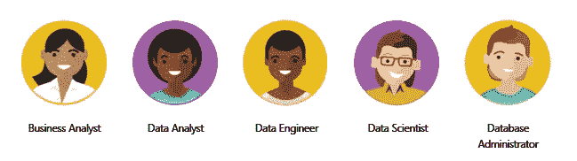

# 数据分析的发现

> 原文：<https://towardsdatascience.com/discovery-of-data-analysis-66471b5cab91?source=collection_archive---------42----------------------->

## 数据不仅对企业或机构很重要，对生活的每个领域也很重要，甚至对一个简单的个人也是如此。甚至我们的记忆也是数据。有了数据，我们对过去感到愤怒，对未来充满希望。

穆罕默德·哈桑·pixabay.com

# **简介**

**数据**和信息是一个组织最具战略性的工具之一。如果一个企业正确理解和处理它的数据，它可以使用它**来改进它的流程**。数据直接转化为盈利。数据可以用于许多不同的目的；

*   股票跟踪，
*   欺诈和诈骗检测，
*   价格和折扣决策，
*   购买和品牌忠诚度，
*   识别和分组用户行为，
*   LFL 金融分析，
*   趋势分析和预测，

除了将数据转化为有意义的结果之外，数据处理速度提高得越快，企业在决策阶段就越有优势。

Stephen Dawson 在 [Unsplash](https://unsplash.com/?utm_source=medium&utm_medium=referral) 上拍摄的照片

快速准确地获得数据并将其转化为有意义的结果当然很重要，但仅此还不够。数据**应该成为企业内部的一种文化**。将数据转化为文化；

*   要知道如何用数据告诉**正确的故事**。
*   故事将在哪里或在什么样的环境中讲述，这一点应该很清楚。
*   故事应该传达给正确的人，并采取行动。
*   能够采取行动并需要数据的人应该能够容易地访问数据或数据衍生分析，并且总是知道如何访问它。
*   能够从数据中采取行动的人应该很容易理解这个故事，并利用他们从这个故事中获得的东西**来引发行动**。
*   创建的动作**必须不断测试**并且过程必须返回到顶部并注入新的故事。

# **数据分析概述**

数据分析过程基于**数据清理、建模和可视化**。

[JESHOOTS.COM](https://unsplash.com/@jeshoots?utm_source=medium&utm_medium=referral)在 [Unsplash](https://unsplash.com/?utm_source=medium&utm_medium=referral) 上的照片

*   **数据清理:**我们**在商业生活中很少遇到干净的数据**，通常我们需要**移除**扰乱分析的数据或者**以不扰乱完整性的方式填充**。
*   **数据建模:按统计区间对数据进行公式化、分组或分组**通过对研究的原始数据建立数学函数，将数据带到下一个层次。我们利用它让数据更有价值。
*   **数据可视化:**干净且有意义的数据仍然可以处于不必要的细分或细节中。**分组和汇总**这些数据可以让我们更专注于数据的故事。我们需要用图形和颜色来刺激**汇总数据，使人脑更容易感知。**

有一些**基本组件**根据它们的级别来分析数据。分析的类型将改变从数据中获得的内容。例如，看到客户希望从你那里得到的过去情况的后果，正在等待你的解释性分析。

# ***描述性分析***

以史料为依据，回答了“**发生了什么**”的问题。KPI 和绩效指标就属于这一类。此外，监控销售、库存和价格的 LFL 趋势分析也是解释性分析的一部分。

[M. B. M.](https://unsplash.com/@m_b_m?utm_source=medium&utm_medium=referral) 在 [Unsplash](https://unsplash.com/?utm_source=medium&utm_medium=referral) 上拍摄的照片

# *诊断分析*

再次，基于过去的数据，它是一个回答**“为什么”**一个事件发生的问题的分析。当我们想要解释在基于过去几个月的数据的描述性分析中看到的急剧的销售下降时，我们使用它。要解释这种下降的原因，我们必须首先确定异常现象。一旦检测到恶意代码，可能还需要从不同来源收集数据。结合数据后，我们需要找到**关系或趋势**来解释这种异常。在这个阶段，它主要受益于统计数据。

# *预测分析*

对于一个企业来说，知道“未来会发生什么”这个问题的答案至关重要。在即将上映的电影中，马蒂·邓泽旭的行动救了他的命，他知道未来会发生什么。这种未来的信息可以挽救一个企业的生命，或者帮助其竞争对手扩大差异。

詹·西奥多在 [Unsplash](https://unsplash.com/?utm_source=medium&utm_medium=referral) 上的照片

但是预测通常是困难的。很难将有意义的数据和关系数据结合在一起，并且需要非常专业的知识。数据必须由合格人员解释和批准。相反，统计操纵的预测可能会产生不良后果。

为了进行预测分析，你可能需要输入**机器学习**方法，并使用高级算法。最常用的有**回归、决策树和神经网络**。

# *规定性分析*

指导性分析与预测性分析交织在一起。或者预测分析的继承者。在相信我们已经找到了问题"**会发生什么**"的答案后，如果我们能找到问题"**我们将如何做**"和"**我们应该做什么**"的答案，它就能告诉我们对未来的一个事件应该提前采取什么行动。

# *认知分析*

认知分析依赖于机器学习、深度学习和人工智能算法。如果情况发生变化，这有助于探索可能出现的情况。事实上，认知分析是一个循环的表达。它通过在旧数据上添加新数据来创建一个持续的学习循环。

# 数据处理角色

随着数据的增长，它变得更加复杂；获取和呈现数据所需的主要步骤产生了各自不同的专业。根据业务的规模和业务中的数据，有些职位可能是向内的。

[https://docs . Microsoft . com/tr-tr/learn/modules/data-analytics-Microsoft/3-roles](https://docs.microsoft.com/tr-tr/learn/modules/data-analytics-microsoft/3-roles)

商业中最广泛使用的能力分布是**业务分析师、数据分析师、数据工程师、数据科学家和数据库经理**。

*   **业务分析师:**数据分析师和业务分析师在很多业务中是同一个人。将业务分析师与数据分析师区分开来的最大特征是其与流程的接近性，并且擅长解释数据。
*   **数据分析师:**他经常使用可视化、报告和数据处理工具。他的主要目的是**处理、转换，然后汇总和可视化原始数据**。在这样做的时候，他根据业务的需要采取行动。他擅长创造故事，是一个目的性很强的大师。大多数时候，他主导业务流程并提供建议。数据分析师的成功取决于他所能创造的洞察力的质量。数据分析师与数据工程师密切合作。他设计收集数据的过程，工程师和分析数据，并不断生产资源养活自己。
*   **数据工程师:**他负责**从多个不同来源导入、提取、处理、转换和存储数据**。为此，他使用内部环境或云技术。与数据库经理的区别在于，他对操作数据流不感兴趣。因为他可能需要不同的专业知识。数据工程师还需要**数据的安全性、数据流的管理以及设计警告机制**。他们与数据科学家和数据分析师密切合作，在数据采集阶段设计和实施解决方案。
*   **数据科学家:**为了获得比数据更高层次的数据，数据科学家还使用统计方法进行高级分析研究。**用描述性分析评估数据**，而**揭示趋势、模式和异常**。确定敏感点。他**通过以上这些观点产生洞见**。他为这些预测的持续生存建立了灵活的模型。在这样做的过程中，他实施了机器学习、深度学习、人工智能等方法，并使用了先进的工具。他用不变的假设来测试它们。数据分析师和数据科学家的任务在许多方面是相同的。在某些业务中，他们可以是同一个人。在一些业务中，根据数据大小和目的，它们需要密切合作，并且是相同的。
*   **数据库经理:**实施和管理业务上的**数据库服务、云数据平台和混合解决方案**。数据库管理员负责保存数据的环境的性能、速度和连续性。数据工程师负责管理用于分析和可预测性的数据和分析环境，这主要取决于数据科学，而数据库经理更负责**运营数据和原始数据的流动**。当然，就像数据科学家和数据分析师在某些业务中交织在一起一样，数据库经理和数据工程师的任务和职责也可以交织在一起，并且可以是唯一的。

# **数据分析师任务的详细概述**

如果数据分析师**正确管理其数据并保持其连续性**，对业务数据和数据分析师工作的信心将会增加。如果数据管理不当，建模不当，或者流很快就容易出错，那么除了他对数据的不信任之外，他还会导致企业做出错误的决策，从而导致比预期更多的问题。

穆罕默德·哈桑·pixabay.com

一个数据分析师基本上执行 5 个步骤；

*   **准备:**准备数据的过程需要与数据工程师密切合作。增值的分析数据应该从分析数据仓库环境中提供。该数据**必须以性能方式**进行清理、提取和获取。没有哪个部门会希望在业务中使用整天都不更新的数据。
*   **建模:**决定将哪些数据**与结果数据**组合。**通过增加数据的附加值来增加新的项目、类别和计算**。
*   **可视化:**高级数据现在需要**进行汇总、着色、分组和交互**。可视化不仅仅是用图形来写，还可以用大点来写，用指定的范围来着色和高亮，高亮的数字和文字也是可视化的一部分。
*   **推论:**被形象化和概括的数据必须被解释。根据数据中的模式，可能需要对数据进行多样化处理，或者根据不同的故障进行下降。
*   共享:组织好的数据应该在企业内部容易访问。此外，并非所有数据在企业中都可见。**访问组的管理，相似报告的分组，应用程序接口**也包含在共享中。

正确处理数据并使其可食用并不像看起来那么简单，这是一顿美味的大餐。如果一个企业想要获得正确的数据，它**必须首先获得数据文化，并使其有价值，根据数据行动**。如果这种思维模式一开始就不存在，那么无论输出有多好，建立起来的数据步骤和组织都将保持不活动。此外，处于接触数据位置的人**应该密切关注不断发展的技术，跟上创新**。今天，许多数据处理、数据存储、数据可视化和机器学习环境要么在两三年前不存在，要么不那么先进和用户友好。

资源；

[1-https://docs . Microsoft . com/tr-tr/learn/paths/data-analytics-Microsoft/](https://docs.microsoft.com/tr-tr/learn/paths/data-analytics-microsoft/)

[2-https://eksisozluk . com/data-analyst-1282941](https://eksisozluk.com/data-analyst--1282941)

3-[https://towardsdatascience.com/tagged/data-analysis](https://towardsdatascience.com/tagged/data-analysis)

4-[https://en.wikipedia.org/wiki/Data_analysis](https://en.wikipedia.org/wiki/Data_analysis)

5-[https://data science . Berkeley . edu/about/what-is-data-science/](https://datascience.berkeley.edu/about/what-is-data-science/)

我的 Linkedin 个人资料；

[https://www.linkedin.com/in/onur-okyol-ba253b72/](https://www.linkedin.com/in/onur-okyol-ba253b72/)