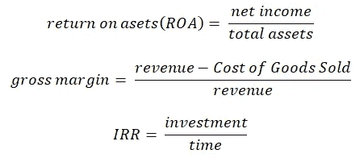

# 价值发现

> 原文：<https://towardsdatascience.com/discovery-of-value-8444ffff3c0c?source=collection_archive---------84----------------------->

## 机遇、挑战和经验教训

Chan2545 在[Shutterstock.com](https://www.shutterstock.com/image-illustration/background-abstract-fintech-financial-technology-transformation-1099749896)拍摄的照片

**序言。第四次工业革命已经来临。世界经济论坛将其描述为*信息物理系统*的出现，涉及人和机器的全新能力，以及技术嵌入我们社会的新方式。数据科学是一个很好的例子，其中全新的社区正在形成，具有非常不同但高效的学习和再学习、创新、信息交流流程，并拥有为有效利用现有和新知识以及创业繁荣提供激励的环境。然而，世界经济论坛抓住了一个重大挑战:**

> “因此，我们应该记住，所有工业革命最终都是由人们的个人和集体选择推动的。重要的不仅仅是开发底层技术的研究人员、发明家和设计师的选择，更重要的是在日常生活中采用和使用这些技术的投资者、消费者、监管者和公民的选择。”

因此，随着数据科学社区的蓬勃发展，研究人员、发明家和设计师必须意识到共同的挑战，以及将他们有价值的新发现嵌入现有商业领域的机会。更一般地说，这种情况会延伸到其他技术领域，在这些领域，问题往往不在于组织未能理解新技术或新能力，从而导致缺乏资金或支持，而是与文化和创新的一般方法有关。理解这一点是关键。

考虑这个简短的例子。柯达已经在市场上存在了 130 多年，在 2012 年申请破产之前，它被认为是当时最具创新性的公司之一。所有人都知道，他们未能应对从胶片到数码相机的需求转变。但也许不是每个人都知道柯达是第一家在 70 年代末制造出可用数码相机的公司，甚至当苹果在 90 年代发布其第一款数码相机时，它实际上也是由柯达设计的。前副总裁唐·斯特里克兰(Don Strickland)在 90 年代初离开了公司，因为他无法说服公司追求数码相机市场，他说:“我们开发了世界上第一台消费数码相机，但由于担心对电影市场的影响，我们无法获得批准推出或销售它。”正如唐所说，当市场条件被新技术或新能力动摇，企业在捍卫现有地位时，会有一种恐惧。然而，这不是恐惧，而是一系列完全理性的决定，这些决定根植于组织文化和创新的一般方法中。当你读完这篇文章时，回到这一段，并思考一下——柯达就像今天许多其他公司一样，在红海中游泳。数据科学的发现被许多组织接受，就像柯达接受数码相机一样。在本文中，您将了解为什么会发生这种情况，以及如何解决它。

# 介绍

在的文献中，几乎很难找到关于如何寻找和发现新价值的实用而清晰的指南。在这篇文章的最后，看看我关注的人的名单，他们是世界上在他们的学科中最有影响力的思想家。我已经深入研究了他们的工作，并注意到他们的方法主要是服务于高管或高层管理人员的需求，在这种情况下，学习直接融入到战略中，并清楚地传达了对公司增长的影响。所有的案例研究、理论和观察都是围绕着这种*高管文化*展开的。这是完全合理的，因为高管设定方向并执行公司增长战略，然后分配资源并批准新项目。然而，一旦项目被批准，或者一个总的方向被设定，更多的决策和优先次序在一个层级中被降低，并且当团队开发技术时几乎每天都是如此。随着我们过渡到知识社会，创新的欲望空前增长，这些技术交付的动力变得更加活跃。为了应对不断增长的创新需求，成熟的组织正在从行动缓慢的层级结构向灵活、更具协作性和敏捷的结构转变。麦肯锡&公司将这种转变定义为从*机器般的*转变为*有机体般的*结构，赋予公司在快速变化和模糊的市场环境中更新自我、适应、改变和成功的更大能力。因此，传统上在团队和部门之间划分界限的盒子和线条现在变得不那么重要了，允许跨职能部门进行更少层级的协作，据报道，这将大大提高生产力和创新。因此，在这个动态的环境中，自主性在不断增加，这也是公司实现创新目标的有效性的主要定义。换句话说，更好的效率允许执行更高要求的目标，并允许组织追求更高要求的增长战略。因此，有两个因素有助于组织释放新价值的能力——高管创造并交付的成功战略，以及员工对该战略的交付。虽然我看到的所有实用指南都是针对前者的，但后者往往没有得到应有的重视。想一想亨利·福特(Henry Ford)对他的行业的名言:“如果我问顾客想要什么，他们会说是一匹更快的马”。尽管他的问题是在高管层面发掘新的价值，但同样的推理模式也可以应用于组织层级中其他层面出现的其他问题。虽然当前用于发现价值最大化和风险最小化的解决方案以解决我们在创新中的日常问题的通用方法很麻烦，并且通常缺乏清晰的定义和系统的程序，

> 我的问题是:如何将世界上最成功的高管发现和执行新市场的战略制定成一个系统框架，使其也适用于层级较低的其他每个人，这些人肩负着实现高管设定的创新目标的重要责任？

在这种情况下，这是一个更广泛的理念——不仅是发现新市场和创造能够带来长期盈利增长的战略，而且更广泛地说，我称之为*发现价值*,能够更有效地实现创新目标，推动组织对可能性的理解。

我的观点是，不仅是高管，任何级别、任何角色的其他创新人员都应该意识到发现价值和执行战略背后的机遇、挑战和斗争。有趣的是，在创建最成功的公司的过程中，我们可以从世界顶级思想家和企业家身上学到很多东西。无论你是一名渴望开始一个有意义的副业项目的大学生，一名将你的企业带上天空的企业家，一名准备推销的员工，一名追求新研究议程的教授，还是一名寻找新增长机会的知名领导者，这里都有适合每个人的伟大课程。

尽情享受吧！

# 机遇、挑战和经验教训

许多世界顶级思想家为我们提供了清晰理解创新类型之间的根本差异以及所做选择如何影响长期业务增长的方法。这些创新战略以不同的名字被推广，如硅谷的彼得·泰尔的*竞争*对*垄断*，哈佛的克雷·克里斯滕森的*持续*对*颠覆性*创新，INSEAD 的 Chan Kim 等人的*红海*对*蓝海*，或者*全球本地化*对*。通用电气公司的杰夫·伊梅尔特等人的逆向创新。然而，它们都传递相同的信息。公司有时会陷入竞争的红海中，这种竞争会侵蚀他们的利润，阻止他们创造有意义的差异化，并阻止他们投资可以创造新市场和新价值的颠覆性产品。世界上最成功的公司通过投资于专注的、差异化的、创造新市场的技术，设法逃避竞争，使竞争变得无关紧要。他们设法创造了蓝海和 T21，并利用创新技术来扰乱他们的市场，这导致了强劲和有利可图的增长的新轨迹。*

在他的畅销书《零比一》中，彼得·泰尔写道，“它的竞争[……]就像战争:据称是必要的，据称是勇敢的，但最终是毁灭性的”。发现新市场和创造垄断的公司可以创造压倒性的价值。“我们所说的垄断是指这样一种公司，它在所做的事情上非常出色，没有任何其他公司能够提供与之相当的替代品。[……]垄断拥有自己的市场，所以可以自己定价。由于没有竞争对手，它以最大化利润的数量和价格组合进行生产。”然而，根据 Clay Christensen 的说法，运营良好的公司的经理通常会有意或无意地追求颠覆性创新，Thiel 称之为垄断。这是因为它从根本上挑战了他们的供应链、成本结构、流程、价值观和文化，而这些都是他们在了解和熟知的市场中最强大的客户的需求时发展起来的。需要一种根本不同的战略来应对颠覆性创新，这些创新创造了新的市场、新的竞争、新的需求、新的客户群体，或者以新产品属性和商业模式瞄准现有的既定客户群体。Chan Kim 等人调查了世界上最成功、最持久和最有远见的公司为持续超越市场和反复创造蓝海所遵循的战略的共性。他们发现，发现蓝海的成功战略的基石是*价值创新*，而不是专注于击败竞争对手，重点应该是通过为客户创造价值的飞跃，让竞争变得无关紧要，从而开辟新的无竞争市场空间。“基于竞争的红海战略假设一个行业的结构条件是给定的，企业被迫在其中竞争。[……]相比之下，价值创新基于这样一种观点，即市场边界和行业结构不是给定的，可以通过行业参与者的行动和信念来重构。”然而，Chan Kim 等人认为,“目前的竞争环境严重失衡，有利于工具和分析框架在红海中取得成功。只要这一点保持不变，红海将继续主导公司的战略议程，即使创造蓝海的业务需求变得更加紧迫。也许这解释了为什么尽管之前呼吁公司超越现有的行业空间，但公司还没有认真对待这些建议。"

通用电气(General Electric)前首席执行官杰夫伊梅尔特(Jeff Immelt)等人已经很好地记录了追求蓝海的影响以及在现有组织内调整其战略的实际挑战。杰夫等人在《哈佛商业评论》上写道,“通用电气迫切需要创新……不仅要扩展到高端市场……还要抢先于其他公司创造类似的产品，然后用它们来瓦解通用电气。坦率地说，如果通用电气的业务要在未来十年生存和繁荣，它们必须变得像在红海中竞争一样擅长(追逐蓝海)。”然而，蓝海战略的发现和执行远非一帆风顺。Jeff 举了一个很好的例子，他描述了通用电气公司在交付的各个阶段带领蓝海所面临的巨大挑战。他写道，作为阿格的领导者，你通常严格负责实现增长计划，满足现有市场中现有客户的需求——换句话说，重点是维持或逐步改善红海。你将很少有时间参加像发现蓝海和创造新策略这样的课外活动。但是，与在内部销售蓝海方案相比，将你的战略写在纸上的这些挑战算不了什么。这样做需要引起公司层级中多个其他领导的注意，例如制造主管、营销主管、财务主管、全球研发主管&,他们都有自己的日程安排，几乎没有时间来说明情况。而且，即使这个提议成功了，你也需要年复一年地与更多短期回报的项目争夺资金。与此同时，你仍然需要担心日常工作的季度数据。杰夫认为，开发全新产品的成功案例少之又少，这不足为奇。

在 Jeff Immelt 等人描述的例子中，组织挑战背后的机制可以用 Christensen 的逻辑很好地解释。问题的核心是普遍接受和实践的衡量增长的方法。当增长是用相对值而不是绝对值来衡量时，比较机会就更容易了。因此，比率被用来衡量和比较提案、项目、投资组合或公司之间的增长。最常用的是资产回报率(ROA)和毛利润。第三个是内部收益率(IRR)，它通过评估所有现金流的净现值等于零的贴现率来估计潜在投资的盈利能力，可以理解为一段时间内的投资。优秀的经理会做有意义的事情，而有意义的事情就是关注并投资那些能最大化 ROA、毛利润和 IRR 的项目。这可以通过增加净收入、收入或投资，或者减少资产数量和制造成本，或者投资于为投资者提供更高净现金流的短期项目来实现。前者通常更难实现，因此后者是增长背后最大的意图和焦点。因此，根据这一逻辑，红海文化是一种倾听最强大客户意见的文化，积极投资于近期技术，以满足这些客户的需求，寻求更高的利润，并瞄准足够大的市场以维持增长预期。如果你仔细观察，这里的悖论是，这些是完全理性的行为，但它们与追求蓝海——提供最大价值——背道而驰。这正是杰夫伊梅尔特等人的故事背后的挑战，或许还有更多其他人试图向他们的经理推销想法。作为一名经理，看着蓝海提案，你会得出这样的结论:这些提案通常会被你最强大的客户拒绝，利润较低，表现不如现有技术，投资回报较长，初始市场规模可能微不足道。因此，蓝海的价值不应该用比率来表示和比较，而应该用绝对值来表示和比较。鉴于蓝海在创造无与伦比的价值方面取得的显著成功，我们应该给予它应有的关注和耐心。

作者图片

克里斯滕森和泰尔已经很好地研究了聚焦于蓝海的发现和执行的困难背后的原因。它触及了个人和组织行为的核心。组织开发符合其主要业务需求的流程和价值观。这些流程和价值观是构成*组织能力*的要素，并决定公司成功建立市场领先地位的能力。员工学习什么可以被定义为最佳解决问题的方法和决策标准，当他们成功地使用这些方法并做出决策来解决重复出现的任务时，*流程*就被定义了。流程可以包括产品开发、采购、市场研究、预算、计划、员工发展和薪酬以及资源分配。做出决策的标准既可以是符合道德的，例如与公司愿景和使命一致，也可以是*资源-流程-价值观*，这是员工做出优先决策并判断某些行动是否更有吸引力、某些客户是否更重要、或者某些想法是否更有吸引力的标准。组织变得越大越复杂，就越有必要建立适当的流程，并培训员工独立决定优先事项。一旦员工开始通过假设而不是有意识的决定来使用流程和价值观，那么组织*文化*就建立起来了，这使得员工能够自主一致地行动。通常是文化决定了公司的发展方向，并最终决定了公司的长期发展轨迹。克里斯滕森认为，文化是我们看到经营良好的大公司最终失去市场地位，无法应对竞争基础变化的核心原因。公司没有文化，公司就是文化。文化使员工自主一致地行动，定义员工将做出什么决定，决定资源分配的路径，并决定成本结构。成长文化是由肩负使命的个人建立的，并由他们自己对价值所在的理解所驱动。一些文化重视竞争和满足最强大客户的需求，而另一些文化则通过差异化和创造新市场来推动增长。换句话说，文化将最终决定一个组织脱离竞争并创造新价值的能力。当组织能力已经根植于文化之中时，就像杰夫·伊梅尔特(Jeff Immelt)等人详述的通用电气(GE)的案例那样，变革可能会异常困难。

克服这一困难的一种方法是建立一个独立的增长团队，该团队类似于一个初创环境，拥有决策自主权，并有潜力创造自己的文化，旨在创造新的市场。杰夫·伊梅尔特(Jeff Immelt)等人写道，通用电气通过创建独立的本地增长团队(LGT)来应对他们追求蓝海的组织挑战，他们自己的流程、价值观和文化与业务的其他部分分离，使发现过程比以前更有效，而主流组织的重点是红海。在 2008 年严重的全球经济衰退中，通用电气的一些主要业务增长了 25%,这主要是因为其 LGT 子公司开发的新技术创新为客户创造了价值飞跃，并开辟了新的市场空间。其他人也有类似的战略努力。1998 年至 2007 年间，美国宇航局高级概念研究所(NIAC)每年的预算约为 400 万美元，一个由企业家、研究人员和发明家组成的社区承担了发现蓝海的任务。他们有效地脱离了主流组织强加的障碍。该研究所在其 9 年的生命周期中评估了 10 到 40 年规划范围内的约 1309 项建议，5-10%的选定概念后来被纳入 NASA 的主流长期计划。与此同时，欧洲航天局建立了自己的先进概念小组(ACT ),每年预算 100 万€，任务是监测、执行和促进创新概念和工作方法的进展。NIAC 和 ACT 的成功被评估为采用选定的高风险、高回报的概念、技术、想法和方法，并加以证明，然后转移到主流组织，成功率在 10-30%之间。如果没有他们先进的概念单元，就不可能以如此大的规模和如此高的成功率评估蓝海提案。同样，近年来，在整个航空航天行业，我们可以看到专业业务单位/团体/团队的创建，它们拥有自主权和一套探索先进概念和新市场的策略。例如空客创建了 A3 实验室，R-R 创建了 R2 实验室，GKN 创建了全球技术中心。这是人工智能、区块链、量子计算、物联网、新型推进技术、增材制造等先进概念的地方。被评估为他们的客户创造价值的飞跃，并为新的利润增长设定轨迹。

最后，重申 Chan Kim 等人的观察结果——虽然我们看到一些公司正在采取行动来占领蓝海，但仍有更多的公司尚未采取行动。那些不采取行动的公司，迟早会看到新的陌生竞争的出现，失去市场份额，或者无法留住他们的客户。

# 底线

努力做到真实和原创，不要将自己的行为与他人进行比较，创造有针对性、差异化的解决方案，为你的目标客户创造价值飞跃。注意你周围文化的特征——这将最终决定你传达和接受对你各种愿景的支持的能力。如果你在挣扎，和那些绝对看到价值的人在一起。然后，当你向在红色海洋中游泳的人推销想法时，要注意你如何接近他们以及信息是如何呈现的。最后，培养你的情感勇气，接受潜在的不适、不确定、拒绝、失败或不安全感。这些是承诺一些更大的和超越常规的事情的风险，如果你想完成任何有价值的事情，这些是你可能不得不感受到的感觉。

无论你如何决定，追求蓝海绝对是值得的！祝你好运，度过一波又一波的挑战，我希望我已经帮助你预见到这些挑战会是什么。

但是如何真正发现价值呢？我有一个好消息，我正在开发一个价值发现的系统框架——敬请关注最新消息！

# 在我的研究中选择的关键人物

**彼得·泰尔**是硅谷精英，他共同创立了 PayPal，并成为脸书的风险投资人和早期投资者。他还共同创立了中情局支持的初创企业 Palantir，最近估值约为 260 亿美元。

**克莱·克里斯滕森**(1952-2020)是哈佛商学院的教授。他被认为是世界上创新和增长方面的顶级专家之一。2011 年，他被评为世界上最具影响力的商业思想家。《经济学人》将他的书*创新者的困境*命名为有史以来最重要的六本商业书籍之一。

W. Chan Kim 是 INSEAD 蓝海战略研究所的联合主任，也是 INSEAD 大学战略和国际管理的讲座教授。他在世界顶级管理大师中排名前三，并因商业和经济思维领导力获得诺贝尔学术讨论会奖。他与 renée maoborgne 合著的《蓝海战略》一书被认为是有史以来最具标志性和影响力的战略书籍之一。

**彼得·布雷格曼**是畅销书作家，伯格曼合伙人公司的首席执行官，该公司帮助首席执行官和高级领导人完成困难的事情。

彼得·德鲁克(1909-2005)被认为是管理学的创始人，2002 年他被老布什总统授予总统自由勋章。

丹尼尔·贝尔(1919-2011)可能是我们这个时代最著名的社会学家。他在他的书《后工业社会的到来》(T2，1973)中提出了后工业社会或信息时代的概念。后来，他将这一概念重新命名为信息社会，一般认为他是这一术语的创造者(1979)。

**桑尼·贝恩斯**是伦敦 UCL 的科学家和记者，也是《解释未来:如何研究、分析和报道新兴技术的作者。

James Surowiecki 是一名报道金融和人类行为的记者。他是研究群体及其集体知识和智力的主要贡献者之一。詹姆斯写了一本畅销书《群体的智慧》。

**Richard Peterson** 是行为经济学家、精神病学家、作家和 *MarketPsych* 的创始人，这是汤森路透 MarketPsych 指数(TMRI)背后的一股创新力量。在他的《基于情绪的交易》一书中，理查德展示了管理情绪是如何帮助顶级投资者跑赢大盘的。理查德正在开发突破性的基于预测情绪的模型，分析新闻和社交媒体中的情绪，帮助顶级投资者大幅跑赢大盘。他的团队开发了一个市场中立的基于社交媒体的对冲基金，在 2008 年金融危机期间，该基金的表现超过标准普尔 500 指数 24%。

感谢阅读！如果你觉得这篇文章有用或者有任何问题，请给我留言。同样让我们连线上 [**Linkedin**](https://www.linkedin.com/in/david-bosak-7b196142/) 或 [**Medium**](https://medium.com/@david.bosak)