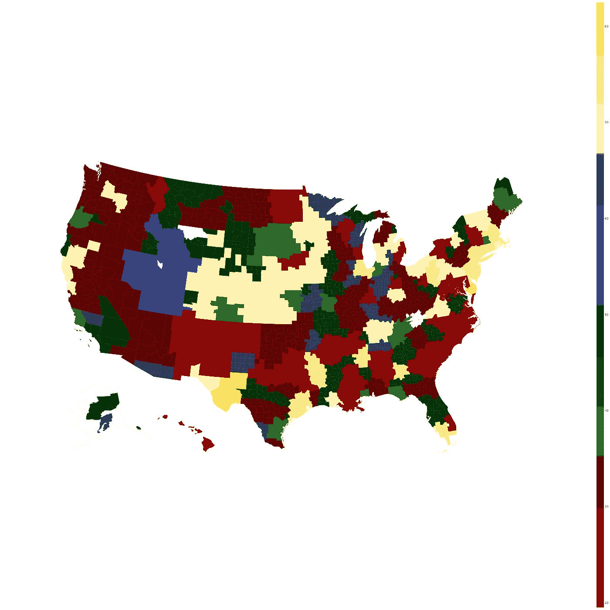
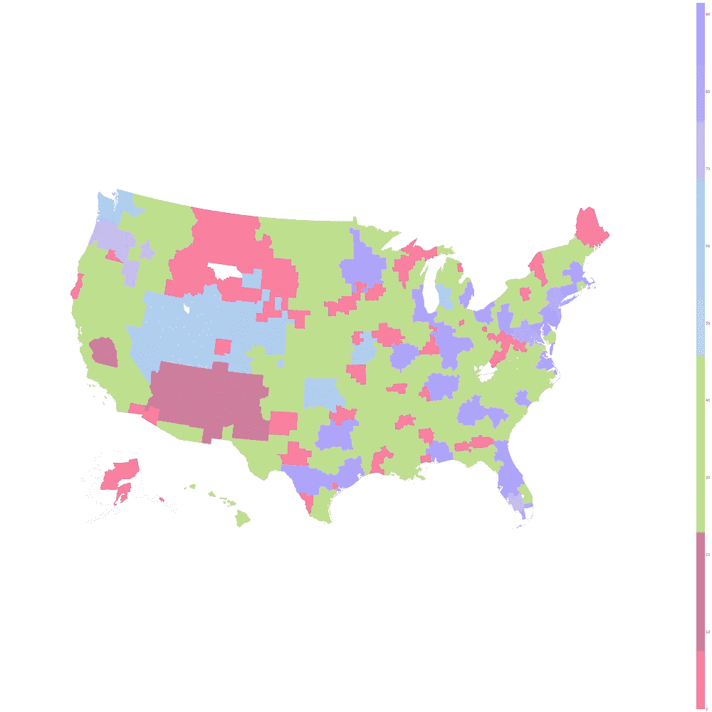
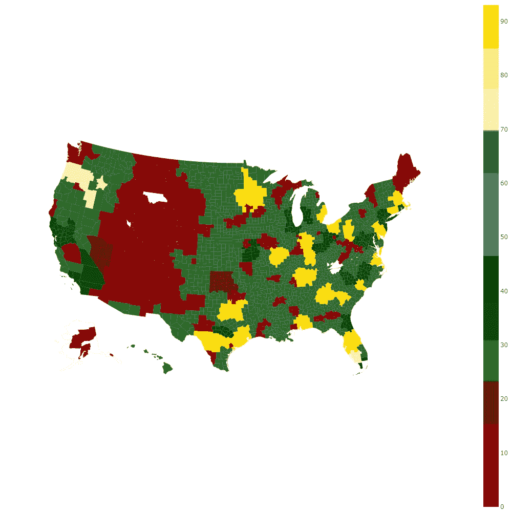

# Plotly Python 中的离散色阶

> 原文：<https://towardsdatascience.com/discrete-colour-scale-in-plotly-python-26f2d6e21c77?source=collection_archive---------33----------------------->

## 一个我决定要解决的恼人问题



右侧一组离散的颜色条(原始内容)

我喜欢使用 python 库进行 Plotly，但是我注意到，当我试图使用 Graph 对象来做一些事情，比如制作 Choropleth 地图时，我很难为我的数据获取离散的颜色范围。

我喜欢根据类别将我的数据分成不同的区域。例如，如果我试图显示三类数据，我将为第一组使用 0-33 的范围，为第二组使用 34-66 的范围，最后为 67-100。在每一个类别中，我都想展示它自己的一套独立的颜色(见上图)。为了做到这一点，我写了下面的函数，我希望它能帮助那些想做同样事情的人！

# 该功能

这个函数所做的就是接受一个颜色元素列表。然后，它会想出如何为各种输入制作离散的色块。读一读，看看下面实际怎么叫。

```
def generateDiscreteColourScale(colour_set):
    **#colour set is a list of lists**
    colour_output = []
    num_colours = len(colour_set)
    divisions = 1./num_colours
    c_index = 0. **# Loop over the colour set**
    for cset in colour_set:
        num_subs = len(cset)
        sub_divisions = divisions/num_subs **# Loop over the sub colours in this set**
        for subcset in cset:
            colour_output.append((c_index,subcset))
            colour_output.append((c_index + sub_divisions-
                .001,subcset))
            c_index = c_index + sub_divisions
    colour_output[-1]=(1,colour_output[-1][1])
    return colour_output
```

上面是一段很短的代码，但是它为我们做了很多工作。

# 使用

为了绘制主标题图像，我实际上有 4 个类别(哈利·波特房屋),我不仅想用纯色显示这 4 个类别，还想根据出现的次数(从亮到暗)对它们进行细分。我已经准备好了所有的数据，但需要得到色阶。在下面我们来定义这个方案。每个列表元素对应一个类别(即哈利波特的房子)，这个列表元素实际上包含了我想要使用的颜色范围的列表(从最亮的颜色到最暗的颜色)。

```
**# Harry Potter Houses**
color_schemes = [
    ['#890000','#890000','#5c0000'],
    ['#2a6b28','#0b4c07','#003206'],
    ['#4f5a90','#374798','#30375a'],
    ['#fff4b1','#ffed86','#ffdb00']
]
```

现在，我可以调用上面的函数来获取适当的格式，并将其传递给 go。Choropleth plotly 对象。

```
colorscale = generateDiscreteColourScale(color_schemes)
```

最终增加了我们的情节。

```
fig.add_trace(go.Choropleth(
    geojson=counties,
    locations=fips,
    z=final['split'].astype(float),
    ***colorscale=colorscale,   <--- THE MONEY***
    marker_line_width=0.0, # line markers between states
    marker_line_color='rgba(0,0,0,0.1)',
    text=final['label'], # hover text
))
```

就这么简单！你可以用它来制作一堆好看的情节。下面是我使用它的一些例子。



使用映射功能的一些示例(原始内容)

当然，这并不局限于地图，在 plotly 中使用 *colourscale* 输入的任何情况下都可以使用。

希望这有所帮助！如果有任何问题，请随时联系我！

# 参考

[](https://www.kaggle.com/kapastor/google-trends-dma) [## 谷歌趋势 DMA

### 使用 Kaggle 笔记本探索和运行机器学习代码|使用来自 Google Trends County-DMA 映射的数据

www.kaggle.com](https://www.kaggle.com/kapastor/google-trends-dma) [](https://plotly.com/python/choropleth-maps/) [## Choropleth 地图

### 如何用 Plotly 在 Python 中制作 choropleth 地图？

plotly.com](https://plotly.com/python/choropleth-maps/)