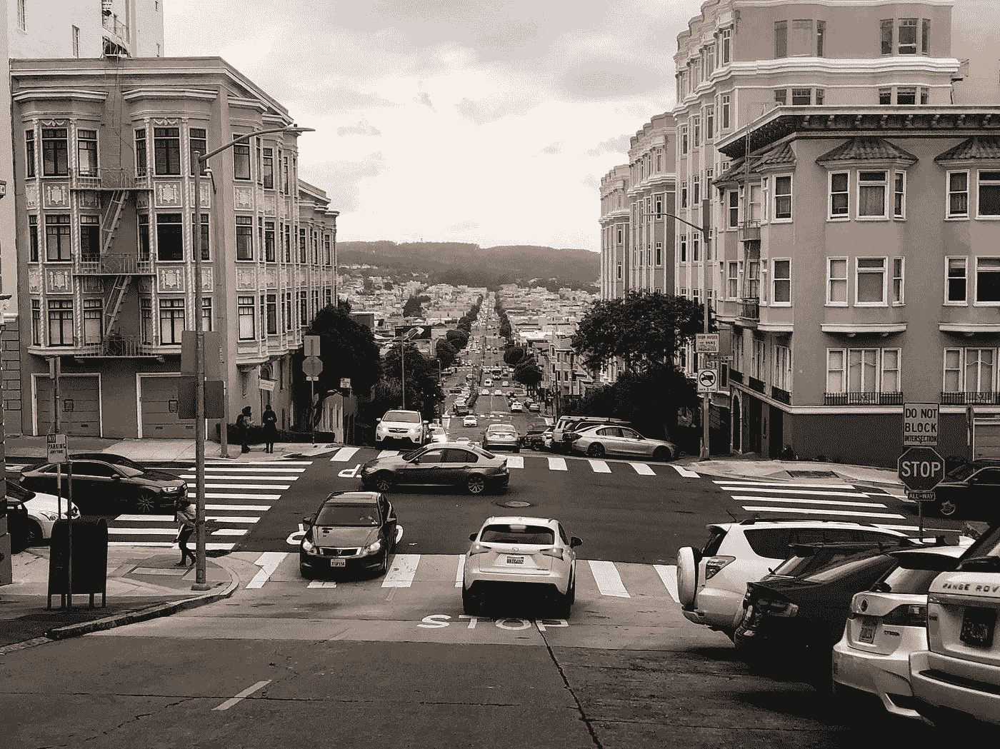
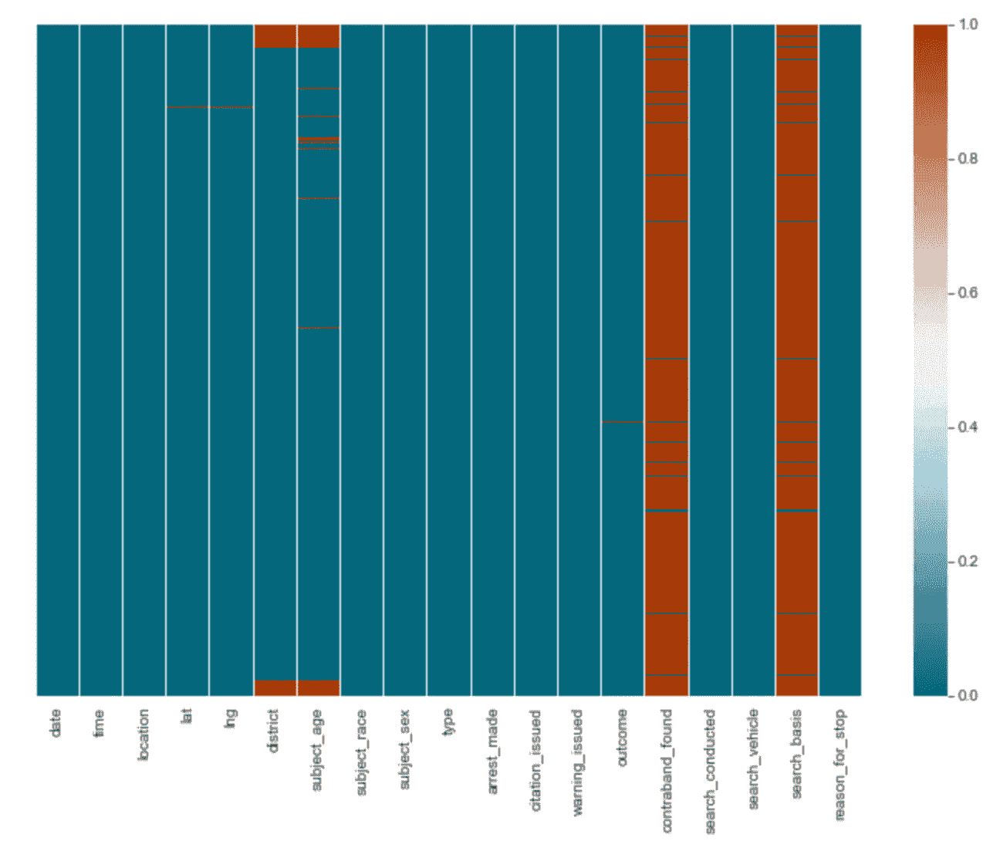
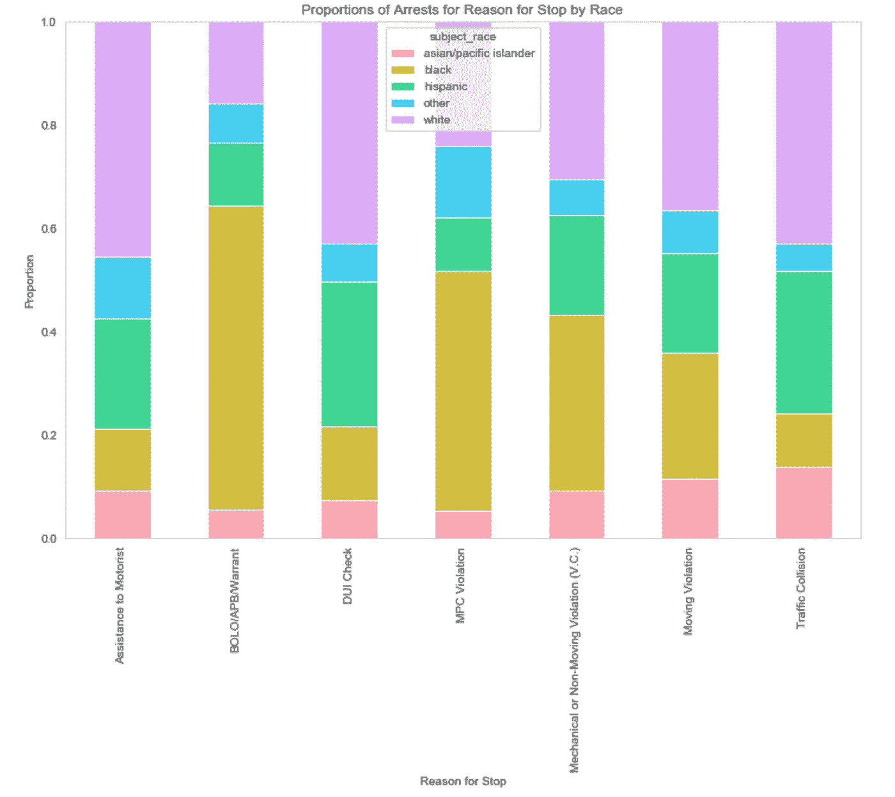
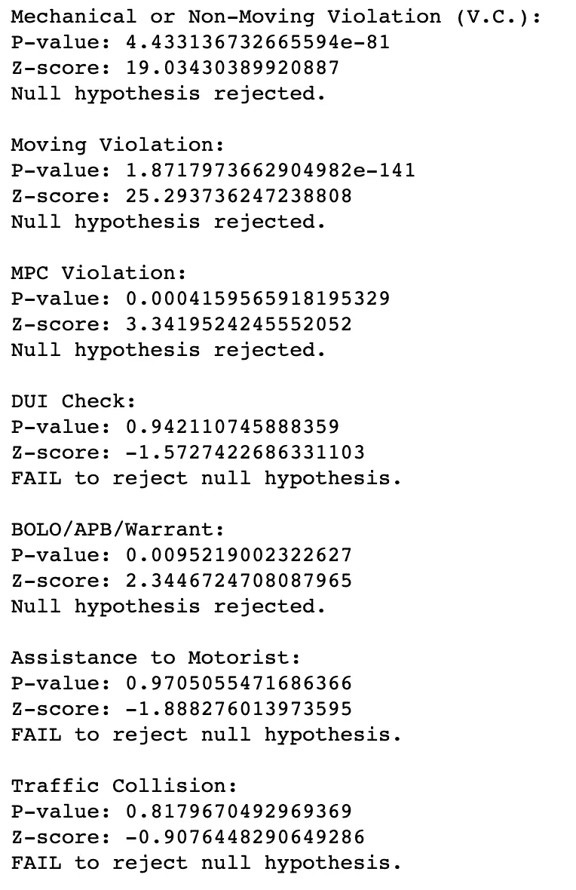
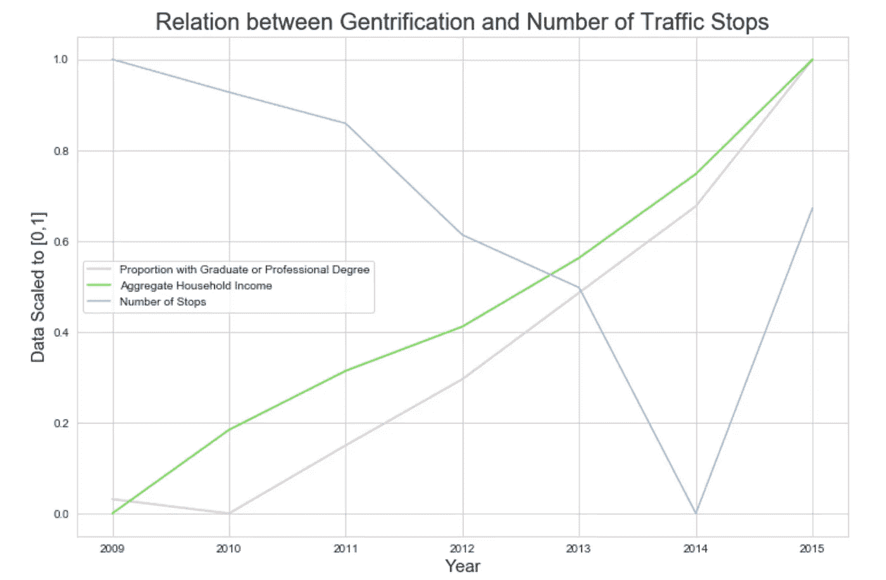
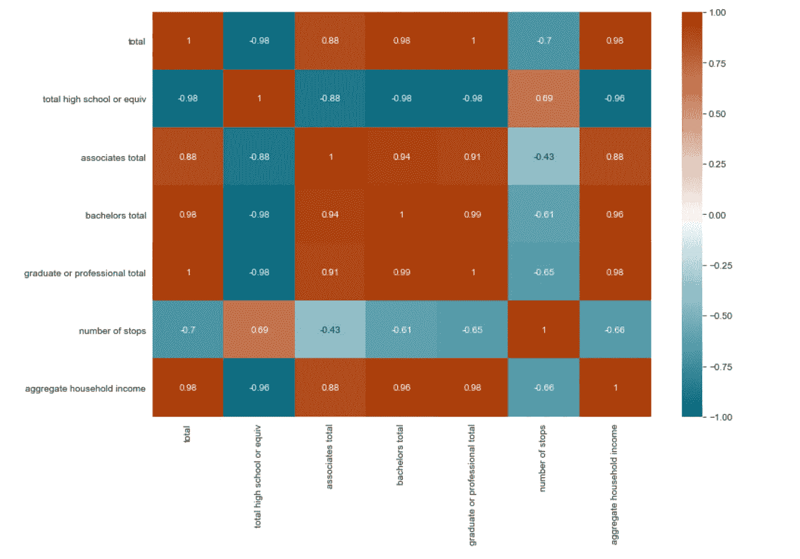

# 旧金山警察局交通站的歧视

> 原文：<https://towardsdatascience.com/discrimination-in-san-francisco-police-department-traffic-stops-2800bf06895d?source=collection_archive---------50----------------------->

## 使用假设检验探索旧金山警察局交通检查站种族歧视的证据

安库什·巴拉德瓦伊

由[伊莎贝拉·史密斯](https://unsplash.com/@__isabella__?utm_source=medium&utm_medium=referral)在 [Unsplash](https://unsplash.com?utm_source=medium&utm_medium=referral) 上拍摄的照片

# 介绍

在过去几个月里，针对乔治·弗洛伊德(George Floyd)和冷血杀手布里奥纳·泰勒(Breonna Taylor)被公开处决的和平抗议已经发展成为一场由一代美国年轻人领导的运动，他们已经看够了警察使用不合理的武力摆放黑人尸体。现在，我并不是要让你相信我们的警察系统中存在系统性的种族主义:[这里有一篇](https://www.usatoday.com/story/news/nation/2020/06/07/black-lives-matters-police-departments-have-long-history-racism/3128167001/)文章可以帮助你开始。相反，我的目标不是关注整个治安，而是通过数据科学，主要是通过假设检验，调查警察部门进行的交通拦截中的种族歧视。虽然已经有研究充分的证据表明警察交通拦截中存在种族偏见，但我想探究旧金山警察局实施的交通拦截中的种族歧视。我决定研究 SFPD，因为三藩市被认为是一个自由的城市，我想了解“自由”对于一个城市的警察部门的种族主义到底意味着什么。因此，当我开始着手这个项目时，我提出的问题如下:

> 在旧金山警察局进行的交通拦截的结果方面，是否有歧视黑人的证据？

# 访问交通站点数据

为了获取交通停车数据，我使用了由斯坦福大学的研究人员和记者团队[斯坦福开放警务项目](https://openpolicing.stanford.edu/)汇编的数据，他们从全国各地的执法部门收集并标准化了车辆和行人停车数据。更多关于他们数据结构的信息可以在[这里](https://github.com/stanford-policylab/opp/blob/master/data_readme.md)找到。

将旧金山交通站点的数据导入 Python 后，我开始为下一步的分析清理和准备数据。我首先使用 [Seaborn](https://seaborn.pydata.org/generated/seaborn.heatmap.html) Python 包通过热图(如下所示)可视化了数据集中的 NA 值。

可视化 NA 值

在该热图中，红色表示安娜值的存在。由于“违禁品 _ 发现”和“搜索 _ 基础”列有太多的 NA 值需要通过插补来解决，所以我简单地从数据集中删除了这些列。为了处理剩余的 NA 值，任何包含安娜值的行也被从数据集中删除。

最后，准备数据的最后一步是确保每一列都有适当的数据类型。对于这个数据集，我只需要将“date”列更改为 datetime 对象。

# 探索性数据分析

现在数据已经准备好了，是时候进入探索性的数据分析了。该过程的第一步是使用 [Pandas value_counts 函数](https://pandas.pydata.org/pandas-docs/stable/reference/api/pandas.Series.value_counts.html)显示数据集分类列中每个值的计数。在这一步中，我注意到在“reason_for_stop”列中有一个问题，因为一些行被标上了新的原因，尽管已经为该原因建立了一个类别。例如，虽然已经有许多因“酒后驾车检查”而发生的停车，但有几个停车将“违章行驶|酒后驾车检查”列为其“停车理由”。后退一步，我返回到数据清理和准备步骤来修复所有出现的错误。

这种情况说明了数据科学过程的一个关键方面；虽然将数据科学过程视为从数据预处理到 EDA 再到数据分析/建模的一系列线性步骤更容易，但事实是，大多数时候，您必须后退一步来处理数据中以前无法预见的问题。

接下来，我在[熊猫的交叉表函数](https://pandas.pydata.org/pandas-docs/stable/reference/api/pandas.crosstab.html)的基础上定义了一个函数，来构建两个因素的比例交叉表。使用这个函数，我生成了一个表，该表比较了由于交通拦截的每个独特原因而被逮捕的人的种族比例。然后将该表可视化为条形图，以便针对每个停车原因，可以比较每个种族群体因交通停车而被捕的比例。

黑人被逮捕的比率似乎已经高于其他人群，特别是当逮捕的理由是“违反 MPC”和“BOLO/APB/逮捕证”时。

# 假设检验

要回答我的问题，我需要一些具体的证据，而不仅仅是条形图。在这种程度上，我将利用假设检验，即当分析师使用样本数据来检验假设，以对样本应该代表的总体做出陈述。在我可以使用的许多具体测试中，我使用了一个[双比例 Z 测试](https://stattrek.com/hypothesis-test/difference-in-proportions.aspx)，它可以用来确定两个样本比例之间的差异是否显著。

进行假设检验时，陈述你的零假设和你的替代假设是至关重要的，零假设是关于你的总体参数的陈述，替代假设直接与零假设相矛盾。例如，我的无效假设表明，因 SFPD 交通拦截而被捕的黑人比例小于或等于因 SFPD 交通拦截而被捕的所有其他种族的人的比例。另一方面，我的另一个假设认为，由于 SFPD 的交通堵塞而被捕的黑人的比例大于所有其他种族的人由于 SFPD 的交通堵塞而被捕的比例。

下一步是决定重要性水平。进行假设检验允许您使用检验统计量计算 p 值，如果 p 值小于显著性水平，则拒绝零假设，反之亦然。对于我的 Z 检验，我将显著性水平设置为 0.01。

现在，是 Z 测试的时候了。使用[stats models proportions _ ztest 函数](https://www.statsmodels.org/dev/generated/statsmodels.stats.proportion.proportions_ztest.html)，我计算了 Z 值和 p 值，比较了因 SFPD 交通拦截而被捕的黑人比例和因 SFPD 交通拦截而被捕的所有其他种族的人的比例。当考虑整个数据集时，通过前面提到的零假设、替代假设和显著性水平，我的 Z 测试的结果使我拒绝了零假设，并得出结论，由于 SFPD 的交通堵塞，黑人比其他种族的人被捕的比率更高。然后，我重复了这个过程，这一次，在进行 Z 测试之前，对每个“停止原因”的数据集进行子集化。这一步的结果如下所示。

每个停止原因的 Z 测试结果

因此，尽管在整个数据集中，黑人的被捕率高于其他种族的人，但这种被捕率的差异仅在考虑因“机械或非移动违规(V.C .)”、“BOLO/APB/Warrant”、“移动违规”和“MPC 违规”而导致的交通堵塞时才一致。

# 中产阶级化和交通堵塞

在摆弄数据集时，我对旧金山县正在进行的中产阶级化和交通站数量之间的关系产生了好奇。因此，我决定将我的项目向前推进一步，看看中产阶级化和交通堵塞之间是否存在关联。

首先，我必须确定我将使用什么指标来定义中产阶级化。受这篇文章的启发，我决定用收入和教育程度来定义中产阶级化。

接下来，我必须弄清楚如何专门为旧金山获取这些数据。幸运的是， [CensusData Python 包](https://jtleider.github.io/censusdata/index.html)提供了对美国社区调查数据的访问。随着[美国人口普查局的官方文件](https://www.census.gov/programs-surveys/acs/guidance/which-data-tool/table-ids-explained.html)，我发现了 2009 年至 2015 年旧金山县居民的家庭工资或薪金总收入和最高教育水平。

为了将这些指标与 SFPD 在 2009-2015 年间每年进行的交通拦截次数进行比较，我必须首先将数据重新调整到 0 到 1 之间，以便更好地直观比较这些指标的变化情况:

假设由于工资或薪金而增加的家庭总收入和拥有研究生或专业学位的居民比例的增加表明中产阶级化的增加，那么 SFPD 每年进行的交通检查次数似乎会随着中产阶级化而减少(除非从 2014 年到 2015 年交通检查大量增加)。为了找到这种说法的具体证据，我找到了最高教育程度、工资或薪水导致的家庭总收入以及一年中停车次数之间的相关性:

教育程度、总收入和交通站点之间的相关性

从上面的热图中，我们可以明确地得出结论，我们的两个中产阶级化指标和每年的交通停车数量之间存在适度的负相关。当然，这个结论应该有所保留，因为中产阶级化比我使用的两个指标要复杂得多。

# 结论

通过这个项目，我在旧金山警察局进行的交通拦截中发现了种族歧视。具体来说，在旧金山，黑人因交通堵塞而被捕的比率高于其他所有种族。

此外，我发现旧金山的中产阶级化与 SFPD 在 2009 年至 2015 年期间进行的交通拦截数量之间存在适度的负相关。这意味着，随着旧金山日益中产阶级化，交通拦截的数量下降。

用于这个项目的代码可以在这里找到。

*作为免责声明，受雇于 SFPD* ***并不能使个人成为种族主义者*** *。SFPD 作为一个组织，表现出种族主义的模式，这可能源于各种来源，如警察培训、部门文化等。但这并不能证明 SFPD 官员是种族主义者。*