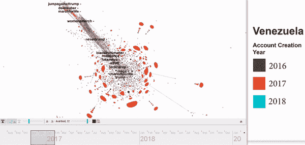
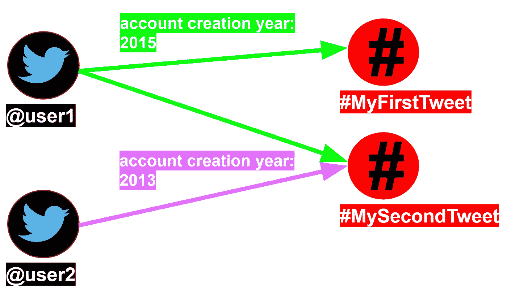
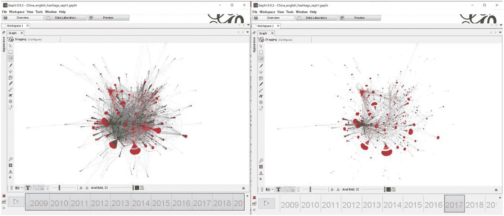

# 假情报:如何通过可视化理解假情报网络

> 原文：<https://towardsdatascience.com/disinfovis-how-to-understand-networks-of-disinformation-through-visualization-b4cb0afa0a71?source=collection_archive---------22----------------------->

## 数据可视化在清晰地表达复杂性方面有着巨大的潜力，但这需要迭代、移情和针对特定数据和领域的定制。

图片作者。

假情报行动的网络可视化具有启发的力量。当有效设计时，它们可以表达那些散布假信息的人的微妙策略。这些密集形式的数据可视化受益于贯穿其开发的明智的设计选择，以及改进未来迭代的评估。

去年，我从伦敦大学城市学院的数据科学硕士学位毕业。这个为期一年的特别强化课程教会了我机器学习、神经计算、计算机视觉和视觉分析的基础知识。在我为期三个月的论文项目中，我选择了网络分析作为我研究的领域。特别是，我专注于网络可视化的设计和评估，随着时间的推移，应用于虚假信息领域。

毕业后，我继续研究时间网络及其在虚假信息研究中的应用。2020 年初，我发表了一篇名为“[观察六个长达十年的假情报行动在六分钟内展开](https://medium.com/swlh/watch-six-decade-long-disinformation-operations-unfold-in-six-minutes-5f69a7e75fb3)”的媒体文章，它有点像病毒一样传播开来。我目前在[蒙田研究所](https://www.institutmontaigne.org/en/experts/alexandra-pavliuc)研究针对法国的虚假信息，并在[威尔逊中心](https://www.wilsoncenter.org/)通过网络分析研究性别化和性化的虚假信息。我所有的研究都有一个共同的线索，那就是使用网络可视化来理解那些想要在网上影响他人的人的策略是如何随着时间的推移而演变的。

今天我想后退一步，告诉你我的时态网络可视化的设计选择是如何在我的理学硕士论文完成过程中发展的。这项工作得到了伦敦大学城市数据科学研究所的慷慨支持，并得到了我在城市的学术顾问，世界领先的可视化研究小组之一 [giCentre](https://www.gicentre.net/) 的 Jason Dykes 教授的指导。我们在 EuroVis 2020 上以*反病毒*的适当标题展示了这篇论文研究的[海报。](https://diglib.eg.org/bitstream/handle/10.2312/eurp20201118/017-019.pdf?sequence=1&isAllowed=y)

如果您对数据可视化设计感兴趣，希望您会对我的方法感兴趣。如果你对虚假信息网络感兴趣，希望你会发现可视化信息丰富，可视化方法有用(在各种其他研究报告中有记录)。如果你正在考虑在理学硕士水平上学习数据科学，你可以用这篇文章作为一篇理学硕士论文的例子。

继续我的论文，题目是…

# 评估信息操作的时间网络可视化表示

这里关键的活动部分是，在这项研究中，我**评估了**三种**时间网络可视化**的两种不同**表示**(静态幻灯片和动态视频)。我使用的数据集是 Twitter 自 2018 年以来一直在识别和发布的中国、俄罗斯和委内瑞拉的**信息操作**。

这篇论文的目标是了解哪种表示类型的假情报实践者认为最有用，以便未来时态网络可视化的设计可以根据他们的需要进行定制。我通过回答两个相关的研究问题实现了这个目标，第一个是数据科学，第二个是社会科学研究问题:

**研究问题 1:** 时态网络可视化的静态和动态表示有什么好处和挑战？

**研究问题 2** :俄罗斯、中国和委内瑞拉国家支持的推特信息运作有哪些独特和共有的方面？

这两个问题是数月思考、编辑、阅读和思考的结果。总的来说，人们好奇的是时间网络可视化是否有助于确定俄罗斯、中国和委内瑞拉等国家在多大程度上拥有其竞选活动的独特在线“指纹”。创建动态和静态可视化的选择随着时间的推移而发展，因为我在思考如何通过时间网络分析的方法最好地贡献在线虚假信息的领域知识。

委内瑞拉信息运作随时间演变的例子。图片作者。

# 这些方法

我的项目包括两个阶段的方法。首先，我在 Twitter 上创建了俄罗斯、中国和委内瑞拉信息运作的时间网络可视化。这是基于我对可视化设计中一些已确立的最佳实践的理解。然后，我通过在结构化采访中向造谣者展示这些网络来评估它们。在采访中，参与者描述了他们如何与网络互动，以及他们在其中看到了什么。

网络可视化本身的数据来自不真实账户(有时被称为机器人、电子人或巨魔)发布的推文，这些账户“[可能是 Twitter 上国家支持的信息操作](https://blog.twitter.com/en_us/topics/company/2018/enabling-further-research-of-information-operations-on-twitter.html)的一部分。自 2018 年以来，Twitter 发布了用户资料和推文的数据集，他们认为这些数据是国家支持的行为者在他们的平台上从事“不真实行为”的更广泛网络的一部分。发布这些数据是为了“研究人员可以调查、学习和建立未来的媒体素养能力”。

Twitter 已经发布了 16 个国家(还在增加)的数据，但在这项研究中，我选择只分析来自中国、委内瑞拉和俄罗斯信息运营部门的英语推文，这些推文都包含大量英语内容。这个决定是为了在三个月的项目时间框架内捕捉英语在线对话中的外国干扰，是一个主观选择，框定了我的整个研究及其结果。[在随后的研究](https://medium.com/swlh/watch-six-decade-long-disinformation-operations-unfold-in-six-minutes-5f69a7e75fb3)中，我扩展到可视化六个国家的所有语言。

为了进一步研究数据，我选择只可视化不真实账户使用的标签。换句话说:我的可视化所需要的只是不真实账户的名称(源)和他们使用的所有标签(目标)。这些源和目标(总是按国家分开)在网络可视化中被连接起来。这些连接线(边缘)是按照虚假账户创建的年份进行颜色编码的，以保留更多的可视化内容。

显示连接到目标(标签)的源(非真实帐户)的简化图形。图片作者。

为了让我的参与者(虚假信息从业者)更容易理解时间网络可视化，我制作了这个“网络可视化介绍”视频(以及相同信息的幻灯片)供我的参与者观看:

网络可视化介绍。作者视频。

在将英语委内瑞拉语、俄语和中文的不真实账户分解为标签关系后，它们被分别上传到 [Gephi](https://gephi.org/) 。Gephi 是一个开源的网络可视化软件，它可以通过时间元素来分解可视化。对于每个国家，由于 Gephi 的内存限制，30 万条推文的随机子集被可视化。

在网络可视化中有许多不同的方式来排列节点(称为布局算法)。我选择使用 ForceAtlas2，因为它吸引密切相关的节点，排斥不相关的节点，并在网络中紧凑地布置“突发”。

在我将一个国家数据集上传到 Gephi 后，我运行了 ForceAtlas2 布局算法，按帐户创建年份进行颜色编码，最后将网络转换为时态网络可视化，以便查看网络不同区域的活动时间。这样做的时候，在软件窗口的底部出现了一个切换栏，允许我挑出在特定时间段发生的非真实用户和标签之间的联系。Gephi 的这种可提供性是这个项目中使用该软件的一个重要原因。下面你可以看到整个中国网络的可视化(左)，以及一年的网络切片(右):

全中文网络可视化(左)，以及 Gephi 软件中显示的 2017 年同一网络可视化中使用的标签(右)。右边的图像是网络的“时间片”,它构成了静态幻灯片中的一张幻灯片。图片作者。

## 创建静态表示

幻灯片首先显示了整个网络，然后是同一网络的 5-8 个时间片段。这是中国数据集的最终幻灯片:

中文信息操作的静态表示。作者幻灯片。

## 创建动态表示

为了让这项研究有两个可比较的表示，我还在 Gephi 中记录了网络的发展，并创建了与幻灯片中的文本完全相同的画外音解释。结果是 YouTube 上的这个中国可视化视频:

中文信息操作的动态表示。作者视频。

## 评估时间网络可视化表示

鉴于对领域专业知识的需求，在这种情况下，根据 Sheelagh Carpendale 关于信息可视化评估的指南进行了一项狭窄而丰富的定性研究:

> “使用完整的数据集、领域特定的任务和领域专家作为参与者来运行评估，将有助于为给定信息可视化的有效性开发更加具体和现实的证据。”

一小部分致力于了解、打击或告知公众网上虚假信息的领域专家是通过滚雪球抽样方法发送的电子邮件邀请招募的。这导致了 5 次会议，参与者进行培训，探索可视化，然后通过结构化访谈提供定性反馈。

通过转录响应和进行主题分析(如 [Fereday 和 Muir-Cochrane，2006](https://journals.sagepub.com/doi/10.1177/160940690600500107) 所述)来分析数据，这些分析总结了参与者对他们在与可视化交互时所面临的好处和挑战的反应，他们对未来可视化的建议，以及他们对网络本身的分析。

通过向领域专家询问他们对可视化的印象和体验，我能够收集到由虚假信息网络知识提供的发现，并围绕可视化的可能最终用户。这似乎很适合数据科学论文，因为任何数据分析过程的最后阶段(与需要分析的利益相关者的沟通)都依赖于数据可视化的有效使用。

# 结果呢

这项研究的结果可以根据他们回答的研究问题进行细分。对于第一个研究问题，我想知道我的参与者所经历的好处和挑战的答案，以便在虚假信息研究的背景下为未来的网络可视化设计选择提供信息。对于第二个研究问题，我希望进入我的参与者的头脑，了解他们在网络中实际看到的*。*

## 研究问题 1:时态网络可视化的静态和动态表示有什么好处和挑战？

这个研究问题是在采访中通过询问参与者哪个表征更容易观察或给他们足够的信息，以及每个表征的哪个部分在试图理解他们正在看的东西时更有帮助来解决的。每个问题的不同回答根据被提及的次数进行统计，并整理成表格。

**研究结果:**我发现参与者更喜欢信息操作的复杂时间网络可视化的动态表示，或视频。这在很大程度上是因为每个参与者都认为视频让他们更好地了解了网络随着时间的演变，并评论说视频使他们更容易理解“不同活动时期之间的巨大差异”。虽然参与者喜欢按照自己的节奏浏览静态幻灯片，但五分之四的参与者更喜欢动态或动态和静态相结合的方式来分析网络或向他人解释网络。

**下一步:**这些发现让我们能够为未来的设计提出建议。我们建议使用在关键时刻和更大的上下文信息之间有停顿的交互式动态表示。我们已经制作了这样一个工具的线框——一个通过可视化展示我们建议的概念设计。

提议的具有静态和动态元素的时间网络可视化线框(在 EuroVis 2020 上展示)。图片作者。

我从这项研究中学到的关于视觉化设计的一个关键要点也是我在学习专业沟通时学到的:根据你的媒介和受众定制你的信息。使用可视化作为媒介的美妙之处在于，它可以是交互式的、信息丰富的，并且具有无限的设计选择。在我为 Mozilla 做的[研究中(我在完成这项研究后*进行了这项研究)，我决定不实施上面的一些更详细的建议，而是采用一种我认为更适合中型文章的更简单的格式，因为我的目标是解释网络并告知公众，而不是给他们可探索或可调查的可视化。在可视化的目的是允许探索和研究的未来迭代中，更复杂的可视化设计可能是合适的。*](https://medium.com/swlh/watch-six-decade-long-disinformation-operations-unfold-in-six-minutes-5f69a7e75fb3)

## 研究问题 2:俄罗斯、中国和委内瑞拉国家支持的推特信息运作有什么独特和共同之处？

这个研究问题是在采访中通过询问参与者网络的哪些方面对他们来说是独特的，或者在多个网络之间是共享的来解决的。根据是否需要理解网络结构、hashtag 内容和时态成分，对独特和共享的方面进行了汇总和分析。下图显示了调查结果。

**研究结果:**通过分析时间网络可视化，参与者注意到信息操作是循环的、动态的，并且随着时间的推移而演变。他们还发现，一些行动似乎比其他行动更有组织性和政治性，俄罗斯的活动在其网络结构中独特地表现出两极分化。俄罗斯和中国都被发现使用#followme 等越来越受欢迎的标签，并在 2016 年和 2019 年恢复了早在 2009 年的旧账户。这些行为表明行动是长期战略的一部分。另一方面，委内瑞拉没有表现出这两种行为，并且可能在使用账户角色上有一个不太完善的策略。

下图概述了与会者提到的信息运作的主要方面。有些是个别国家独有的，有些是两个或所有三个国家共有的。

俄罗斯、委内瑞拉和中国在推特上的信息运作的异同。结果按照提出要求的参与者人数(“p”)和被提及的总次数(“x”)排序。图片作者。

每个方面右侧的红色字母表示识别它们所需的信息属性。它们是:标签的内容(“C”)，交互的结构(“S”)，以及操作的时间(“T”)演变。这三个信息属性是在主题分析中导出方面之后开发的。根据识别每个方面所需的数据类型来识别它们。使用两个或三个信息属性的方面可以认为是更健壮的，比如发现所有的信息作战战术都是随时间演化的。hashtag 内容和时间演变等方面可以使用不同的方法来可视化，比如词频表或条形图。内容和时间发现的稳健性以及网络结构发现可以在进一步的研究中探索。

## 那么，下一步是什么？

在这篇理学硕士论文上的工作经历教会了我通过评估和迭代为设计选择提供信息的价值。它还巩固了为特定领域(如在线虚假信息)定制数据可视化设计的好处。

当我继续在牛津大学攻读社会数据科学的哲学博士学位，研究虚假信息网络时，我将带着我通过这个项目以及通过完成 EuroVis 海报所吸收的设计价值观。通过谨慎而系统地推进这类研究，我们可以对虚假信息、网络可视化以及两者之间的有益关系有更深入的了解。