# 用 Math 和 Pytorch 分解神经网络以理解其内部运作

> 原文：<https://towardsdatascience.com/dismantling-neural-networks-to-understand-the-inner-workings-with-math-and-pytorch-beac8760b595?source=collection_archive---------21----------------------->

## 简化的数学与例子和代码，以揭示黑盒内的光

弗洛里安·克劳尔在 [Unsplash](https://unsplash.com/?utm_source=unsplash&utm_medium=referral&utm_content=creditCopyText) 上拍摄的照片

# 动机

作为一个孩子，你可能会在狂热的好奇心驱使下拆开一个玩具。你可能被它发出的声音的来源吸引了。或者可能是二极管发出的诱人的彩色光召唤你，让你的手去打开塑料。

有时候，你可能会觉得被欺骗了，因为它的内部与外表的光鲜亮丽让你想象的相去甚远。我希望你足够幸运，打开了正确的玩具。那些充满了足够的错综复杂，值得打开它们。也许你发现了一辆未来外观的 DC 汽车。或者可能是一个奇怪的扬声器，背面有一个强磁铁，你在冰箱上试过。我敢肯定，当你发现是什么让你的控制器振动的时候，感觉就很好。

我们也要做同样的事情。我们正在用数学和 Pytorch 拆除一个神经网络。这将是值得的，我们的玩具甚至不会打破。也许你会感到气馁。这可以理解。在神经网络中有如此多不同而复杂的部分。这是压倒性的。这是通往更明智状态的仪式。

所以为了帮助我们自己，我们需要一个参照物，某种北极星来确保我们在正确的方向上。Pytorch 的预建功能将是我们的北极星。他们会告诉我们必须得到的产量。我们有责任找到将我们引向正确输出的逻辑。如果差异听起来像你曾经熟悉的被遗忘的陌生人，不要烦恼！我们会再做一次介绍，这将是非常愉快的。
我希望你会喜欢。

# 线性

神经元的价值取决于其输入、权重和偏差。为了计算一层中所有神经元的这个值，我们计算输入矩阵与权重矩阵的点积，并添加偏置向量。当我们写道:

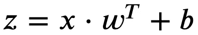

一层中所有神经元的值。

然而，数学方程的简洁是通过对内部工作的抽象来实现的。我们为简洁所付出的代价是让理解和在头脑中想象所涉及的步骤变得更加困难。为了能够编码和调试像神经网络这样复杂的结构，我们既需要深刻的理解，也需要清晰的思维可视化。为此，我们倾向于冗长:

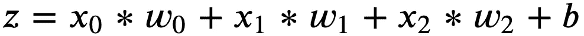

具有三个输入、三个权重和一个偏差的一个神经元的值。

现在，这个等式的基础是一个特定案例所施加的约束:一个神经元、三个输入、三个权重和一个偏差。我们已经从抽象转向了更具体、更容易实现的东西:

为了计算 ***z*** ，我们已经从一层输入前进到下一层神经元。当神经网络一路向前通过其层并获得知识时，它需要知道如何向后调整其先前的层。我们可以通过衍生品实现这种知识的反向传播。简单地说，如果我们对 ***z*** 的每个参数(权重和偏差)进行微分，我们可以得到输入层 ***x*** 的值。

如果你已经忘记了如何求导，请放心:你不会被告知去温习微积分的整个分支。我们将在需要时回忆差异化规则。 ***z*** 对一个参数的偏导数告诉你把那个参数看成一个变量，其他所有参数都看成常数。变量的导数等于它的系数。常数的导数等于零:

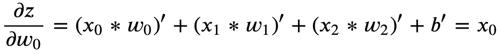

w0 是变量，其他都是常数。w0 的系数是 x0。

同样，你可以相对于****w2*******b***来区分 ***z*** (其中 ***b*** 的不可见系数为 1)。你会发现 ***z*** 的每一个偏导数都等于它所微分的参数的系数。考虑到这一点，我们可以用 **Pytorch 亲笔签名**来评估我们数学的正确性。**

# **非线性**

**我们引入激活函数的非线性。这使得神经网络成为*通用函数逼近器*。有各种类型的激活，每一种实现不同的目的，产生不同的效果。我们将讨论 ReLU、Sigmoid 和 Softmax 的公式和区别。**

## **热卢**

**整流线性单位函数将神经元的值与零进行比较，并输出最大值。我们可以认为 ReLU 将所有非阳性神经元标记为同样不活跃。**

**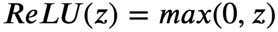**

**所有非负值保持不变，而负值被零取代。**

**为了实现我们自己的 ReLU，我们可以将 z 与 0 进行比较，并输出较大的值。但是 Torch 包中提供的 [*夹钳*](https://pytorch.org/docs/stable/torch.html#torch.clamp) 方法已经可以为我们做到这一点了。在 Numpy 中，等效的函数叫做 [*clip*](https://numpy.org/doc/stable/reference/generated/numpy.clip.html) 。在使用 Pytorch 的 [*relu*](https://pytorch.org/docs/stable/nn.functional.html#relu) 评估其输出之前，以下代码实现了一个基于 *clamp* 的 ReLU。**

**ReLU 的区别很简单:**

**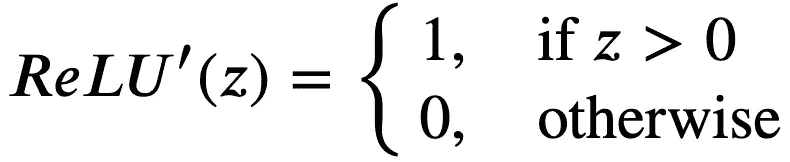**

**“ReLU”为 1 或 0，取决于 **z** 。**

*   **对于所有正的 ***z*** ，ReLU 的输出为 ***z*** 。因此微分就是 ***z*** 的系数，等于 1。**
*   **对于所有非正的 ***z*** ，ReLU 的输出等于零。因此，微分也等于零。**

**让我们把我们的理解翻译成 Python 代码。我们先实现自己的 ReLU'( ***z*** )再和 Pytorch 的 ReLU 自动微分进行对比。**

**为什么我们要给 *backward()* 一个 1 的张量？
*backward()* 默认在单个标量上被调用的情况，并使用默认参数 *torch.tensor(1。)*这是以前我们调用 *z.backward()时的情况。*由于 *torch_relu* 不是单个标量，我们需要明确提供一个与 *torch_relu* 形状相同的张量。**

## **乙状结肠的**

**sigmoid 激活函数产生从ℝ到范围[0，1]的映射 ***z*** 的效果。当执行二进制分类时，我们通常用值 1 标记属于目标类的实例，用值 0 标记所有其他实例。我们将 sigmoid 的输出解释为一个实例属于目标类的概率。**

**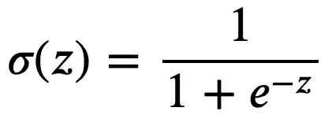**

**sigmoid 激活函数产生从ℝ到范围[0，1]的映射 ***z*** 的效果。**

****小测验:**神经网络的任务是进行二元分类。该网络的输出层由 sigmoid 激活等于 0.1 的单个神经元组成。在下列解释中，哪一个是正确的？**

1.  **该实例属于类 1(目标类)的概率为 0.1。**
2.  **该实例属于类 0 的概率为 0.1。**
3.  **该实例属于类 0 的概率为 0.9。**

****解法:**只有 1 和 3 是正确的。重要的是要理解，具有一些输出 ***p*** 的乙状结肠激活的神经元，对于非目标类隐含地给出了输出 ***1-p*** 。同样需要记住的是 ***p*** 是与目标类关联的概率(通常标记为 1)，而 ***1-p*** 是与非目标类关联的概率(通常标记为 0)。**

****观察:**认为 ***p*** 和 ***(1-p)*** 之和等于 1。这在现阶段似乎太明显而无法指出，但当我们讨论 Softmax 时，记住这一点将会很有用。**

**我们再次用 Python 翻译数学，然后用 sigmoid 的 Pytorch 实现检查我们的结果:**

**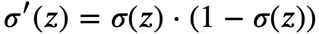**

**乙状结肠分化。**

**乙状结肠的分化是优雅的。然而，它确实需要一条曲折的道路来达到它的优雅。一旦我们回忆起一些微分规则，我们就有了在蜿蜒的道路上漫步所需的一切。**

**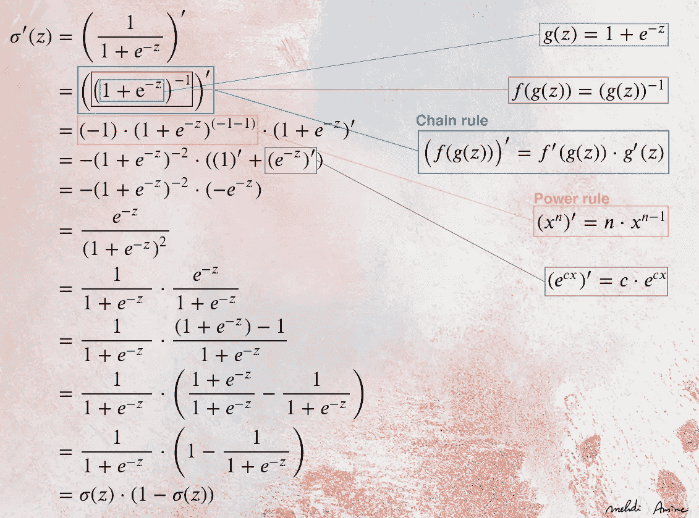**

**乙状结肠的详细分化。**

**了解了如何区分 sigmoid，我们现在可以实现数学，并用 Pytorch 的亲笔签名对其进行评估。**

****注:** *sigmoid_prime()* 依赖于前面实现的同一个 *sigmoid()* 。**

**如今，ReLU 已被广泛用作乙状结肠的替代物。但是 sigmoid 仍然在附近徘徊，隐藏在它的更一般化的形式的名字之下:Softmax。**

## **Softmax**

**我们想到 sigmoid 用于二分类，softmax 用于多类分类。这种联系虽然是正确的，但却误导我们许多人认为 sigmoid 和 softmax 是两种不同的函数。当我们查看 sigmoid 和 softmax 的方程时，这一点得到了强调，它们之间似乎没有明显的联系。**

**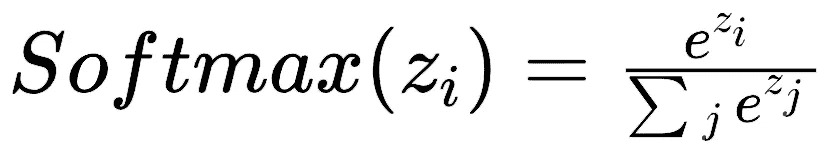**

**softmax 激活的神经元是其值的指数除以共享同一层的所有其他神经元的指数之和。**

**再一次，公式的抽象使它乍一看一点也不直观。举个例子会更具体。我们以两个输出神经元为例，第一个 ***(z0)*** 输出实例属于标记为 0 的类别的概率，第二个 ***(z1)*** 输出实例属于标记为 1 的类别的概率。换句话说，对于 ***z0*** 目标类标记为 0，对于 ***z1*** 目标类标记为 1。为了用 softmax 激活 ***z0*** 和 ***z1*** ，我们计算:**

**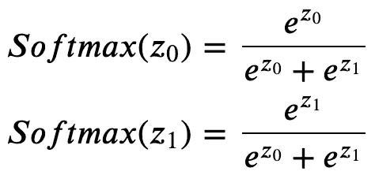**

**Softmax 应用于输出层中的每个神经元。除了将来自ℝ的所有神经元映射到范围[0，1]之外，它还使它们的值相加为 1。**

**现在，我们可以纠正乙状结肠和 softmax 之间似乎缺乏明显的联系。我们将通过简单地重写 sigmoid 来做到这一点:**

**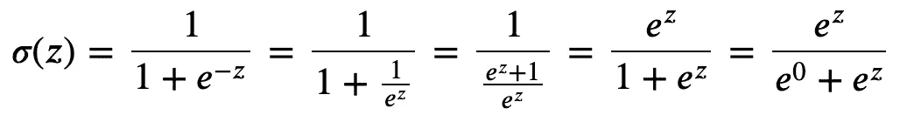**

**sigmoid 的另一种写法，显示它实际上是 softmax，有两个类。**

**第一种形式的乙状结肠比第二种形式的更常见。这是因为后一个版本在计算上更昂贵。然而，它的优势仍然在于帮助我们理解 softmax。**

**在输出层只有两个神经元，并且给定 softmax 使所有输出神经元总和为 1 的事实:我们总是知道*soft max(z0)***将等于【1-Softmax(z1)*** 。因此，对于二进制分类，将*视为等于 0 是有意义的，并且使用 sigmoid 仅计算 ***z1*** 的激活。****

**下面的代码实现了 softmax，并以三个输出神经元为例进行了测试。然后将我们的结果与 Pytorch 的 [*softmax*](https://pytorch.org/docs/stable/nn.functional.html#softmax) 的结果进行比较。**

**我们根据每个神经元区分 softmax 激活。保持具有两个神经元的输出层的相同示例，我们得到四个 softmax 微分:**

**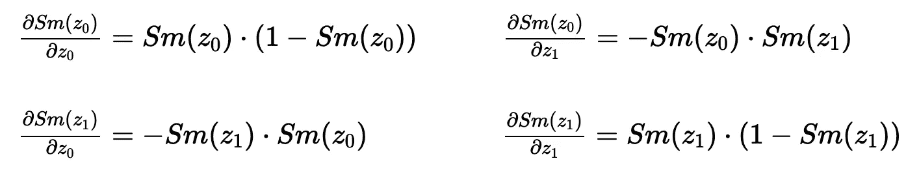**

**softmax 的雅可比矩阵。**

**不考虑输出神经元的数量，softmax 微分只有两个公式。当我们对神经元相对于其自身的 softmax 进行微分(雅可比矩阵中左上和右下的微分)时，应用第一个公式。当我们将一个神经元的 softmax 相对于某个其他神经元进行微分(雅可比矩阵中右上和左下的微分)时，应用第二个公式。**

**为了理解 softmax 的差异化所涉及的步骤，我们需要回忆另一条差异化规则:**

**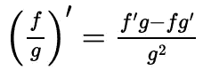**

**除法法则。**

**以下差异包含详细的步骤。虽然它们看起来很密集，看起来令人生畏，但我向你保证，它们比看起来容易得多，我鼓励你在纸上重做它们。**

**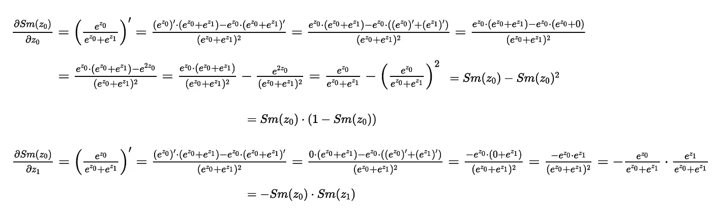**

**softmax 的详细偏微分。**

**softmax 微分的实现要求我们遍历神经元列表，并对每个神经元进行微分。因此涉及两个循环。请记住，这些实现的目的不是为了提高性能，而是为了显式地翻译数学，并达到 Pytorch 的内置方法所达到的相同结果。**

# **交叉熵损失**

**在神经网络所涉及的操作序列中，softmax 之后通常是交叉熵损失。事实上，这两个函数联系如此紧密，以至于 Pytorch 中的方法 [cross_entropy](https://pytorch.org/docs/stable/nn.functional.html#cross-entropy) 将两个函数合二为一。**

**我记得当我看到交叉熵损失的公式时的第一印象。这是接近欣赏象形文字。解读之后，我希望你能和我一样，对简单的想法有时会有最复杂的表现感到敬畏。**

**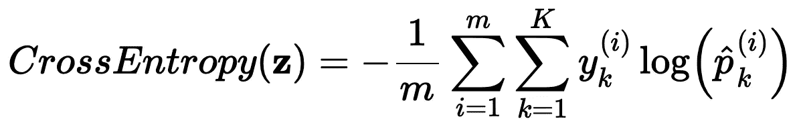**

**交叉熵损失函数。**

**参与计算交叉熵损失的变量有 ***p*** ， ***y*** ， ***m*** ， ***K*** 。都以 ***i*** 和 ***k*** 为计数器，分别从 1 迭代到 ***m*** 和 ***K*** 。**

*   *****Z* :** 是一个数组，其中每一行代表一个实例的输出神经元。 ***m* :** 是实例数。**
*   *****K* :** 是班级人数。**
*   *****p* :** 是实例 ***i*** 属于类 ***k.*** 的神经网络的概率，这与从 softmax 计算的概率相同。**
*   *****y* :** 是实例 ***i*** 的标签。根据 ***y*** 是否属于类 ***k*** 为 1 或 0。**
*   *****log* :** 为自然对数。**

**假设我们正在执行一个多类分类任务，其中可能的类的数量是三个( ***K*** =3)。每个实例只能属于一个类。因此，每个实例被分配给一个带有两个 0 和一个 1 的标签向量。例如***y***=【0，0，1】*表示 ***y*** 的实例属于类 2。同样，***y***=【1，0，0】**表示 ***y*** 的实例属于 0 类。1 的索引是指实例所属的类。我们说标签是*一键编码*。*****

****现在我们来举两个实例( ***m*** =2)。我们计算它们的 ***z*** 值，我们发现: ***Z*** = [[0.1，0.4，0.2]，[0.3，0.9，0.6]]。然后我们计算他们的 softmax 概率，发现: ***激活*** = [[0.29，0.39，0.32]，[0.24，0.44，0.32]]。我们知道第一个实例属于类 2，第二个实例属于类 0，因为: ***y*** = [[0，0，1]，[1，0，0]]。****

****要计算交叉熵:****

1.  ****我们取 softmax 激活的日志: ***log(激活*** ) = [[-1.24，-0.94，-1.14]，[-1.43，-0.83，-1.13]]。****
2.  ****我们乘以-1 得到负对数:-log(激活)= [[1.24，0.94，1.14]，[1.43，0.83，1.13]]。****
3.  ****将 log(activations)乘以 ***y*** 得出:[[0。, 0., 1.14], [1.43, 0., 0.]].****
4.  ****所有类别的总和给出:[[0。+0.+1.14], [1.43+0.+0.]] = [[1.14], [1.43]]****
5.  ****所有实例的总和为:[1.14+1.43] = [2.57]****
6.  ****除以实例数得到:[2.57 / 2] = [1.285]****

******观察:******

*   ****步骤 3 和 4 相当于简单地检索目标类的负日志。****
*   ****第 5 步和第 6 步相当于计算平均值。****
*   ****当神经网络预测实例以 0.32 的概率属于目标类时，损失等于 1.14。****
*   ****当神经网络预测实例以 0.24 的概率属于目标类时，损失等于 1.43。****
*   ****我们可以看到，在这两种情况下，网络未能给正确的类最高的概率。但是与第一个实例相比，网络更确信第二个实例不属于正确的类。因此，它被处以 1.43 英镑的更高损失。****

****在交叉熵的实现中，我们结合了上述步骤和观察结果。像往常一样，在比较两个输出之前，我们还将经历 Pytorch 等效方法。****

******注意:**我们不是存储标签的独热编码，而是简单地存储 1 的索引。比如之前的 ***y*** 变成了【2，0】。注意，在索引 0 处， ***y*** 的值是 2，而在索引 1 处， ***y*** 的值是 0。使用索引 ***y*** 及其值，我们可以直接检索目标类的负日志。这是通过访问第 0 行第 2 列和第 1 行第 0 列的-log(activations)来完成的。这使得我们可以避免第 3 步和第 4 步中浪费的乘法和零加法。这个技巧叫做*整数数组索引*，杰瑞米·霍华德在他的《基础深度学习》第 9 讲 34:57 中解释了这个技巧****

****如果向前穿过神经网络的层可以被看作是获取某种知识的旅程，那么这里就是可以找到知识的地方。使用损失函数的微分可以通知神经网络它在每个实例上有多少误差。把这个误差倒过来看，神经网络可以自我调整。****

****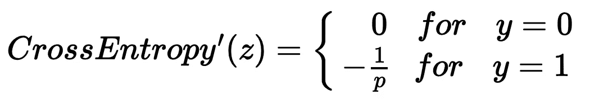****

****交叉熵微分。****

****在回忆了几个微分规则后，我们将经历交叉熵的微分步骤:****

****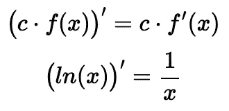****

****回想一下这两条微分法则。还记得 **ln** 和**log**based***e****是一样的。* *基* ***e*** *贯穿全文。*****

****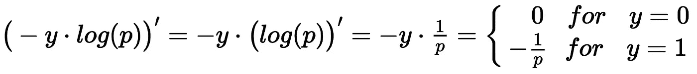****

****交叉熵微分步骤。****

****我们还不能用 Pytorch 的输出来评估下面的实现。原因要追溯到 Pytorch 的 [cross_entropy](https://pytorch.org/docs/stable/nn.functional.html#cross-entropy) 结合 softmax 和 cross-entropy。因此，使用[向后](https://pytorch.org/docs/stable/autograd.html#torch.autograd.backward)也会涉及链规则中 softmax 的微分。我们将在下一节“反向传播”中讨论和实现这一点。现在，这是我们对交叉熵的实现:****

# ****反向传播****

****对于我们讨论的每一个函数，我们都在神经网络的层中前进了一步，并且我们还利用函数的微分进行了等效的后退。由于神经网络在往回走之前一直向前移动，我们需要讨论如何连接我们的功能。****

## ****向前****

****一路向前，具有一个隐藏层的神经网络从将输入馈送到线性函数开始，然后将其输出馈送到非线性函数，然后将其输出馈送到损失函数。以下是具有实例 ***x*** 的示例，其对应的标签 ***y*** ，三个线性神经元 ***z*** ，每个神经元使用其三个权重 ***w*** 和一个偏置***b****计算，后跟一个 softmax 激活层和一个交叉熵损失。*****

## *****向后的*****

*****一路回溯，同一个神经网络从给予损失函数的相同输入开始，并将其馈送给该损失函数的导数。损失函数的导数的输出就是误差，我们称之为获得的知识。为了调整其参数，神经网络必须将该误差再向后一步带到非线性层，并从那里再向后一步到线性层。*****

*****下一步不是简单地将误差反馈给非线性函数的导数。我们需要使用链式法则(我们之前在 sigmoid 的微分中回忆过)，我们还需要注意我们应该给每个导数的输入。*****

*******前馈和反向传播的关键规则:*******

*   *****函数及其导数接受相同的输入。*****
*   *****函数向前发送它们的输出，作为下一个函数的输入。*****
*   *****导数将其输出向后发送，以乘以前一个导数的输出。*****

*****愿你的机器的输出总是与你的数学相一致。*****

# *****结论*****

*****我的印象是，很多来自不同学科背景的人都对机器学习充满好奇和热情。不幸的是，有一种合理的趋势，即在试图远离令人生畏的数学的同时获取知识。我认为这很不幸，因为我相信许多人实际上渴望加深他们的理解；要是他们能找到更多的资源就好了，因为他们来自不同的背景，可能到处都需要一点提醒和一点鼓励。*****

*****这篇文章包含了我写读者友好的数学的尝试。我指的是提醒读者需要遵循的规则的数学。我的意思也是数学和方程，避免跳过这么多步骤，让我们思考一行和下一行之间发生了什么。因为有时候我们真的需要有人牵着我们的手，和我们一起走过陌生概念的领域。我真诚地希望我能牵到你的手。*****

# *****参考*****

*****米（meter 的缩写））胺，[神经网络的内部运作，我的 Colab 笔记本](https://drive.google.com/drive/folders/1EkhYkKE74Kz2rYCvGM1BMTJ5ih7Q-toA?usp=sharing) (2020)。
M. Amine，[神经网络的内部工作原理，我的 Gists](https://gist.github.com/Mehdi-Amine) ，(2020)。
A. Géron，[用 Scikit-Learn、Keras 和 TensorFlow 进行动手机器学习](https://www.oreilly.com/library/view/hands-on-machine-learning/9781492032632/)，(2019)。
S. Gugger，[numpy](https://sgugger.github.io/a-simple-neural-net-in-numpy.html)中的一个简单神经网络，(2018)。
J. Howard， [Fast.ai:从基础开始深度学习第 9 课](https://course.fast.ai/videos/?lesson=9)，(2019)。
[py torch 文档](https://pytorch.org/docs/stable/index.html)。*****