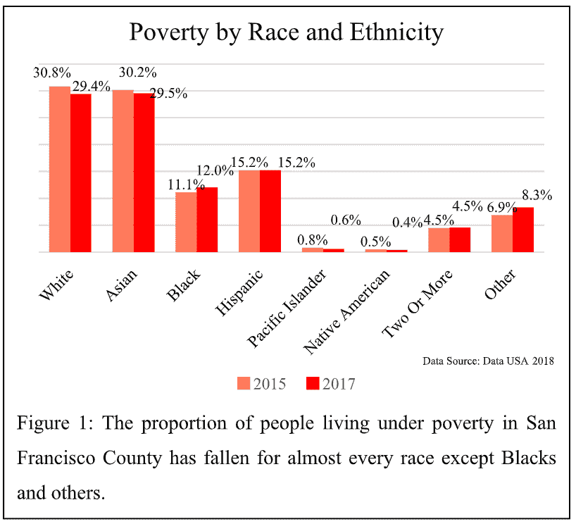

# 旧金山低收入少数民族的迁移

> 原文：<https://towardsdatascience.com/displacement-of-low-income-minorities-in-san-francisco-af161182e347?source=collection_archive---------40----------------------->

# 旧金山的住房危机延续了该市低收入少数族裔面临的贫困陷阱。

旧金山是世界上房租最高的城市之一已经不是什么新闻了。高薪工作将人才吸引到一个城市，而这个城市的发展速度已经超过了可用空间。这种高租金不仅是新移民的压力来源，而且对低收入少数民族也有严重影响。一份新的报告显示，湾区房租的上涨已经将少数族裔家庭推向了该地区的边缘。这一点很重要，因为这些少数民族移居的地区缺少高质量的学校、杂货店和其他资源。与人口相比，美国的少数民族面临着更低的生活质量，因此旧金山住房危机导致的流离失所进一步加剧了不平等。本文将研究结果延伸到 2017 年，并假设随着时间的推移，流离失所和由此产生的不平等只会加深。

# 数据

这项研究使用了美国人口普查局 2015 年和 2017 年旧金山县的[美国社区调查(ACS)](https://factfinder.census.gov/faces/nav/jsf/pages/searchresults.xhtml?refresh=t) 数据。所用的变量是房租中位数、家庭收入、18 岁至 65 岁年龄在贫困线以下的人口百分比(仅非裔美国人、仅亚裔美国人)和总人口。使用的变量有租金中位数、家庭收入、18 岁至 65 岁贫困线以下的人口百分比(仅非裔美国人、亚裔美国人)和总人口。数据从人口普查网站下载后，会被清理并以表格形式上传到 ArcMap。数据表然后被连接到旧金山县域。来自最后一层的数据用于创建计算和地图。计算的统计数据是每个地图多边形中花费在房租上的收入比例和生活在贫困线以下的人口百分比。

# 旧金山县

2018 年，[旧金山县](https://datausa.io/profile/geo/san-francisco-county-ca)人口 883305 人(比 2017 年下降 0.12%)，家庭收入中位数为 112376 美元(比 2017 年增长 1.41%)，房产价值中位数为 120 万美元(增长 8.3%)。

此外，如图 1 所示，旧金山生活在贫困线以下的人口比例自 2015 年以来有所下降。这并不一定意味着人们变得更富有，但它确实暗示了生活在贫困线以下的人们的流离失所。

# 结果

图 2

上一节的统计数据表明，房产价值的增长速度快于收入的增长速度——旧金山县居民越来越多地将收入的更大一部分用于支付房租。图 2 和图 3 支持这一结论。

图 2 显示，2015 年至 2017 年期间，全县 65 岁以下成年人口的总百分比一直在下降，而花在房租上的收入比例一直在上升。这支持了一个普遍的说法，即房租价格的上涨速度比人们的消费倾向要快。

为了了解这是如何影响贫困的少数民族人口的，图 3 关注的是历史上亚裔人口最多的唐人街及其周边地区。然而，这个地区[的亚裔贫困人口已经被转移。这一点在图 3 中很明显，该图显示该地区的房租已经上涨，贫困人口的比例也明显下降。](https://www.sfchronicle.com/bayarea/article/Bay-Area-housing-prices-push-low-income-13596075.php)

图 3

此外，房租上涨的街区的贫困水平也在上升，这可能是未来流离失所的先兆。还有一些街区，即使租金与收入比率群体保持不变，贫困人口的比例也有所下降。这可能意味着，即使房租没有大幅上涨，流离失所现象仍在继续。

# 政策，政策，政策？

旧金山郡的住房政策是寻求解决住房危机的最大挑战。目前的政策限制了可以建造的新住房的数量，这对增加住房供应是一个巨大的障碍。[13 号提案](https://www.fastcompany.com/90242388/the-bad-design-that-created-one-of-americas-worst-housing-crises)也鼓励房主尽可能长时间呆在自己的房子里，以反对新的住房建设。相反，应该制定政策来允许和加速新的发展。