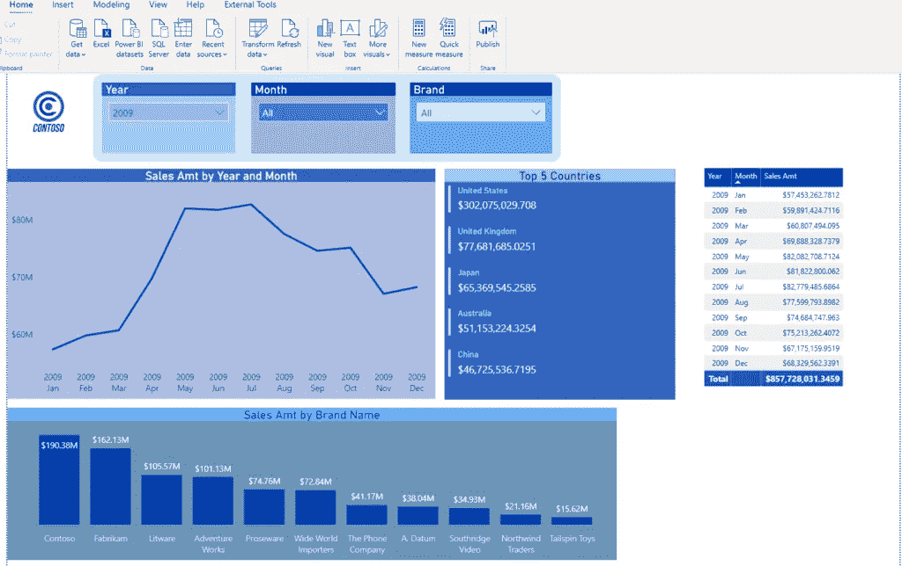
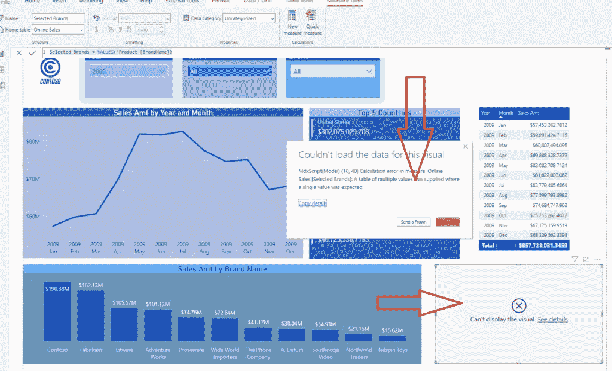
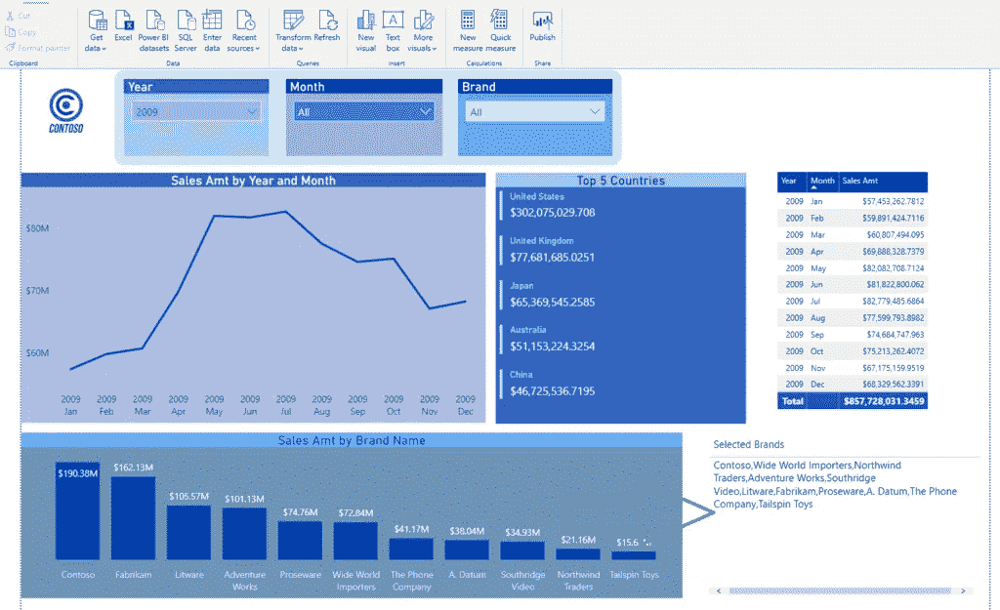
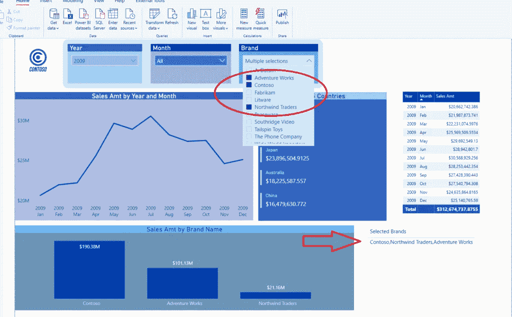
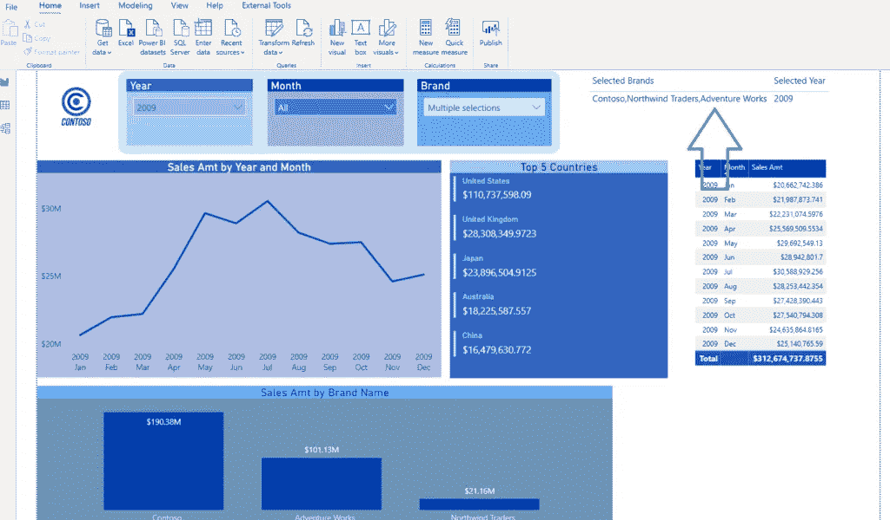
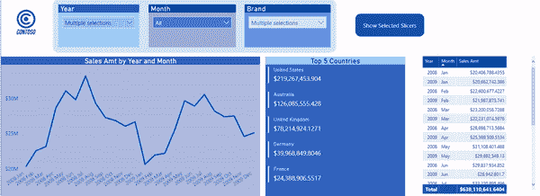

# 在 Power BI 中显示选定的切片器

> 原文：<https://towardsdatascience.com/display-selected-slicers-in-power-bi-a99d81500e76?source=collection_archive---------11----------------------->

## 在报告中显示切片器选择可能比看起来容易。获得更好用户体验的额外提示！


Alex 在 Unsplash 上拍摄的照片

就在最近，在介绍我的会议时:[“宏伟的 7-促进您的 Power BI 开发的简单技巧”](https://www.youtube.com/watch?v=Kqivb73E4o4&t=2216s)在数据之星会议上，我收到的一个问题是:

## 有没有办法在页面上显示作为切片器选择结果的实际活动过滤器？

我已经在[这篇文章](https://data-mozart.com/learning/new-stars-of-data-qa/)中回答了这个问题，但后来我想:也许更多的人在寻找这个问题的解决方案，所以我决定写一个简短的帖子来详细解释你如何才能实现这一点。

像往常一样，我将使用一个示例 Contoso 数据库进行演示:

## 达克斯是你的朋友！



这是起点。您可以注意到报告画布上有三个切片器，假设我想向用户显示在 Brands slicer 中选择了哪些品牌。

第一步是创建一个 DAX 度量，它将捕获切片器中所有选定的值。可以使用两个不同的 DAX 函数来获取值: [*VALUES()*](https://docs.microsoft.com/en-us/dax/values-function-dax) 或 [*DISTINCT()*](https://docs.microsoft.com/en-us/dax/distinct-function-dax) 。 *VALUES()* 函数更复杂，因为您可以同时使用表名和列名作为参数，但是这里让我们集中讨论列名作为参数。

基本上， *VALUES()* 将从我们传递的列中返回所有不同的值，包括空格(如果存在)！另一方面， *DISTINCT()* 将返回所有不同的值，但忽略空白值。您想使用哪一个，主要取决于业务请求(如果您的用户想看到数字是否为空白)。就我个人而言，我更喜欢使用 *VALUES()* ，因为它给了我全貌。

因此，我将创建以下度量:

```
Selected Brands = VALUES('Product'[BrandName])
```

现在，当我将这个度量放入卡片视觉效果中时，让我们看看会发生什么:



哎呀，这给了我一个错误！错误消息说明计算需要单个值。**问题是，*值()*和*截然不同()*返回表！然而，它不是一个“普通”的表，它是由 DAX 引擎动态创建的虚拟表，所以我们应该应用一些额外的计算，以便从中提取单个值。**

## 迭代器函数来拯救！

迭代器函数顾名思义——它们遍历表并逐行应用计算！迭代器函数最后有 X:SUMX，AVERAGEX，COUNTX…在我们的场景中，我们需要迭代我们的不同值，并将它们连接到我们的字符串中，稍后将在报告中显示。为了实现这一点，我们将使用[*concatenax()*](https://docs.microsoft.com/en-us/dax/concatenatex-function-dax)函数。

这个函数接受三个参数:第一个是我们想要迭代的表(在我们的例子中，是使用 *VALUES()* 函数创建的虚拟表)，然后是我们在这个表上逐行应用的表达式，最后是我们想要用来分隔提取值的分隔符。

```
Selected Brands = CONCATENATEX(
                            VALUES('Product'[BrandName]),
                            'Product'[BrandName],
                            ",")
```

在我的例子中，我使用逗号作为分隔符，但你也可以使用其他的，如分号等。现在，当我再次查看我的报告时，我可以看到我得到了想要的结果:



而且，如果我在切片机中只选择了几个品牌，我的卡将进行调整以反映这些变化:



## 结合多种措施

您还可以为其他切片器创建相同的度量，然后将所有结果放入可视化表格中。因此，我将为 Year slicer 创建度量值:

```
Selected Year = CONCATENATEX(
                            VALUES(Dates[Year])
                            ,Dates[Year]
                            ,",")
```

现在，当我将我的度量拖到表字段中时，我在一个地方看到了我选择的两个切片器的值:



## 额外想法！

如果您的报告中有许多切片器，并且您想要显示所有选择，但是您不想浪费报告画布上的空间，您可以创建一个书签，其中包含具有所有选定值的表，然后只在用户请求时显示书签。

大概是这样的:



多酷啊！因此，您不需要担心使用这个表会增加您的报告空间。您可以使用书签和操作来显示/隐藏它。

成为会员，阅读媒体上的每一个故事！

订阅[这里](http://eepurl.com/gOH8iP)获取更多有见地的数据文章！