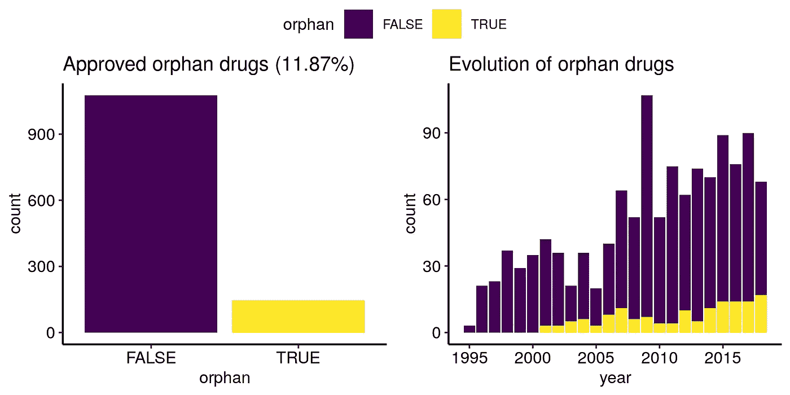
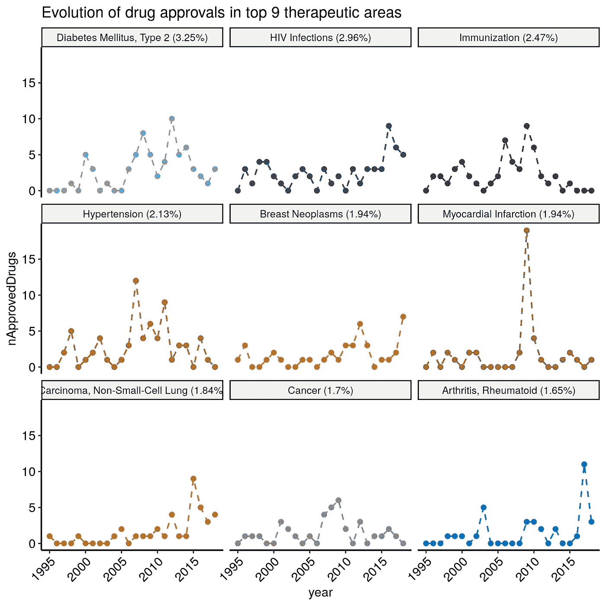
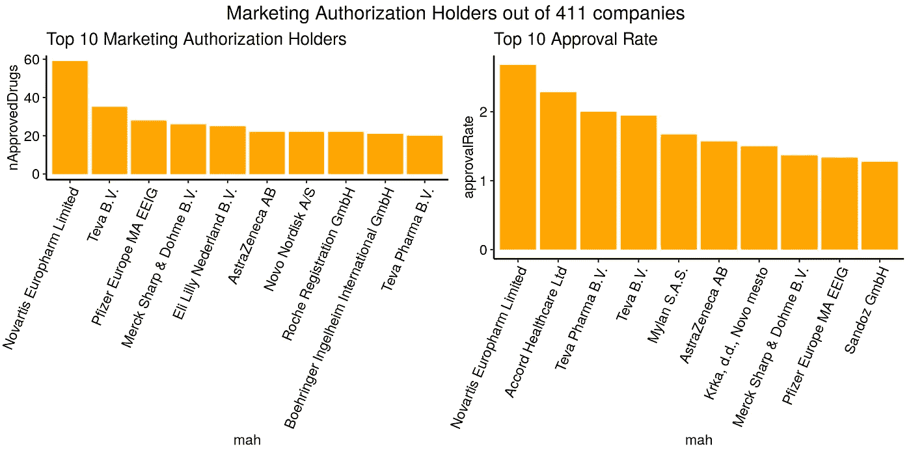
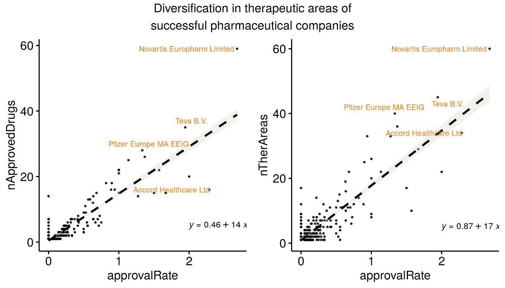
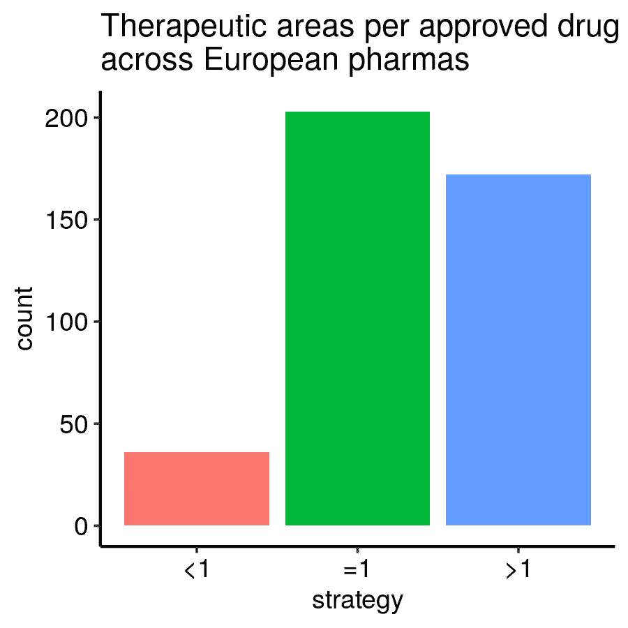

# 剖析欧洲制药发展的 28 年

> 原文：<https://towardsdatascience.com/dissecting-28-years-of-european-pharmaceutical-development-3affd8f87dc0?source=collection_archive---------56----------------------->

## 数据新闻

## 对从欧洲药品管理局(EMA)收集的数据的探究


micha Parzuchowski 在 [Unsplash](https://unsplash.com?utm_source=medium&utm_medium=referral) 上的照片

自从抗生素被发现以来，新药的出现大大改善了我们的生活。药物开发需要高额投资，同时也伴随着高度的不确定性，因为我们需要从逻辑上证明候选新药的安全性和有效性，然后才能在人体内自由使用。因此，制药公司需要通过社会健康需求、国际法律框架和商业动机找到一条成功之路。

T4 欧洲药品管理局(EMA)是指导药物开发并决定是否批准一种新药在欧洲上市的官方监管机构。在他们的网页上，他们存储了每一种批准的药物及其相应的上市许可持有人(MAH)公司的信息。

为了更好地理解成功的欧洲生物技术公司和欧洲药品管理局为继续开发新的有用药物而实施的战略，我使用我之前从欧洲药品管理局关于他们的 1222 种药物的网页上删除的信息进行了探索性分析。

# EMA 对孤儿药开发的有效倡导



*图片由* [*作者*](https://medium.com/@miquelangladagirotto)

根据 EMA，当一种药物“旨在用于治疗罕见疾病”时，该药物将获得“**孤儿名称**”状态。不幸的是，由于少数人患有这些疾病，他们很可能被忽视，因为他们代表了一个小市场。2000 年，欧洲药品管理局制定了一系列激励措施([见法规](https://www.ema.europa.eu/en/human-regulatory/overview/orphan-designation/legal-framework-orphan-designation))，鼓励那些致力于开发孤儿药的公司为那些有被忽视高风险的治疗领域带来经济利益。基本上，它们提供了一种特殊的处理方式，可以加速官僚程序，降低整体成本。事实上，我们立即看到了这一政策的有效性，因为批准的孤儿药数量自那时以来稳步增加。显然，我们看不到有多少等同于孤儿的药物在其定义之前被批准，但趋势似乎很明显。

# 复杂和流行的疾病仍然是制药公司的兴趣所在

在欧洲药品管理局授予上市许可的 414 个不同治疗领域中，近 20%的获批药物仅试图治疗下图中列出的 9 种疾病。



*图片由* [*作者*](https://medium.com/@miquelangladagirotto)

所有这些疾病有什么共同点？它们的生物复杂性；它们是由多种因素引起的，这些因素在人群中可能非常不同。因此，缺乏对它们如何工作的完整理解使得发现和开发适合许多患者的药物变得极其困难。另一方面，制药公司是否根据疾病的复杂性选择只应对**哪种疾病？可能，如上所述，他们还考虑了患有这些疾病的人数，这代表了疾病本身的社会影响和药物的市场规模。例如，2018 年，[3420 万美国公民患有糖尿病](https://www.diabetes.org/resources/statistics/statistics-about-diabetes)，其中至少 [90%的病例对应于二型糖尿病](https://www.cdc.gov/diabetes/pdfs/data/statistics/national-diabetes-statistics-report.pdf)这一事实可以解释为什么大多数批准的药物都适用于治疗糖尿病。特别是对于复杂的疾病，我们希望看到这些不断尝试开发新的更好的药物，以进入一个大市场，并能够增加市场份额。看起来是双赢。**

出于好奇，我进一步调查了 2005 年至 2010 年间心肌梗死药物出现峰值的原因。它是由基于*氯吡格雷*的 28 种不同仿制药的批准引起的。

# 成功公司的药物开发策略

制药公司持有的批准上市授权的数量可以被视为成功的衡量标准，因为它表明了每个公司在药物开发过程中的表现。



*图片由* [*作者*](https://medium.com/@miquelangladagirotto)

著名的诺华公司以每年几乎 3 种的速度批准了 59 种药物，其中没有一种是仿制药。相反，雅阁，第二个批准率最高的制药公司，仅在 7 年内就批准了 16 种药物。但是，它们中的大多数(16 个中的 15 个)是仿制药，这意味着比开发一种全新的药物需要更少的研究和要求。这是两种截然不同的战略的两个例子:诺华完全选择创新，而雅阁选择生产许多仿制药，同时开发较少的新药。

# 多样化或者死亡，真的吗？

风险资本家的一个常见做法是分散投资以分散风险。同样，制药公司必须选择他们想要解决的疾病。



*图片由* [*作者*](https://medium.com/@miquelangladagirotto)

为不同治疗领域开发药物确保了在许多市场占有份额。我们看到，拥有高批准率和大量总批准药物的公司也拥有涉及许多治疗领域的药物，这些药物可能大多与药物开发的业务方面有关。



*图片由* [*作者*](https://medium.com/@miquelangladagirotto)

事实上，大多数制药公司选择开发与治疗领域相同比例的药物或选择具有多种适应症的候选药物。然后，在首次适应症的药物被批准后，他们不需要再次经历整个过程并增加利润。

不足为奇的是，很少有公司专门开发同样适应症的药物，因为这是一种依赖于竞争对手数量和质量的高风险“商业选择”。

然而，治疗领域的多样化可能成为一把双刃剑。一方面，为批准的药物寻找新的适应症，也称为“药物再利用”，最大限度地利用和循环利用从工作台到床边花费的资源，并允许增加许多疾病的可用治疗方案，这有助于应对疾病并发症和副作用。另一方面，如果一种药物不能改变用途，大多数生物技术公司可能不得不重新开发治疗不同疾病的新药，以保持业务。因此，与其利用他们的专业知识，他们可能会“重新利用”他们训练有素的团队，专注于一个新的、不同的目标，并失去在以前的治疗领域获得的部分经验。

多样化可能会减缓药物开发的整体进展，以满足商业需求。然而，现有模式的替代方案是什么？我们能改变它吗？

# 用 R 进行探索性数据分析

对于那些希望复制或进一步分析这些数据的人。

## 0.加载所需的库:

```
**require**(tibble)
**require**(readr)
**require**(stringr)
**require**(ggpubr)
```

## 1.准备和争论数据:

```
*# download data*
urlEMA = 'https://raw.githubusercontent.com/MiqG/EMA-Data-Scratching-with-RSelenium/master/drug_df_EMA.csv'
ema = read_csv(urlEMA)# subset features of interest and change their names
featuresOI = c('Name',
               'Active substance',
               'International non-proprietary name (INN) or common name',
               'Generic',
               'Orphan',
               'Exceptional circumstances',
               'Countries',
               'Marketing-authorisation holder',
               'Therapeutic area (MeSH)',
               'Date of issue of marketing authorisation valid throughout the European Union')newColNames = c('name',
                'substance_act',
                'substance_inn',
                'generic',
                'orphan',
                'exceptional_circ',
                'country',
                'mah',
                'mesh',
                'date')ema = ema[featuresOI]
colnames(ema) = newColNames
ema$date = strptime(ema$date, '%d/%m/%Y')
ema$year = as.numeric(format(ema$date, '%Y'))
ema$generic = !is.na(ema$generic)
ema$orphan = !is.na(ema$orphan)
ema = ema[!is.na(ema$country),] *# unsuccessful applications will have an empty Country*
```

## 2.汇总数据:

```
# study therapeutic areas
## list drugs and their therapeutic area (MeSH)
mesh = lapply(ema$mesh, function(meshTerms) unlist(strsplit(meshTerms, split = '\n')) )
names(mesh) = ema$name
## get their frequency percentages
mesh = table(unlist(mesh))
mesh = mesh / sum(mesh) * 100
mesh = sort(mesh, decreasing = TRUE)
mesh = tibble(therArea = names(mesh),
              perc = mesh)# study approved drugs per therapeutic area per year
years = min(ema$year, na.rm = TRUE):max(ema$year, na.rm = TRUE)
therArea_perc = paste0(mesh$therArea,' (',round(mesh$perc,2),'%)')
meshApproved = expand.grid(therArea_perc = factor(therArea_perc, levels = therArea_perc), 
                           year = years)
meshApproved$therArea = gsub(' \\(.*','',as.character(meshApproved$therArea_perc))
meshApproved$nApprovedDrugs = sapply(1:nrow(meshApproved), function(idxRow){ 
    sum( str_count(ema$mesh[ema$year == meshApproved$year[idxRow]], pattern = as.character(meshApproved$therArea[idxRow])), na.rm = TRUE) 
    })# study pharmaceutical companies
mahCount = sort(table(ema$mah), decreasing = TRUE)
mahCount = tibble(nApprovedDrugs = as.numeric(mahCount), mah = factor(names(mahCount), levels = names(mahCount)))
mahCount$deltaTime = sapply(mahCount$mah, function(mah) max(ema$year) - min(ema$year[ema$mah == mah]) )
mahCount$approvalRate = (mahCount$nApprovedDrugs) / (mahCount$deltaTime)
mahCount$approvalRate[mahCount$deltaTime <= 5] = 0
mahCount$weightedApprovalRate = mahCount$approvalRate * mahCount$nApprovedDrugs
mahCount$nTherAreas = sapply(mahCount$mah, function(mah) length(unique(unlist(strsplit(ema$mesh[ema$mah == mah], split = '\n')))) )
mahCount$module = sqrt((mahCount$approvalRate/sum(mahCount$approvalRate))^2 + (mahCount$nTherAreas/sum(mahCount$nTherAreas))^2)
mahCount$nTherAreaPerDrug = mahCount$nTherAreas / mahCount$nApprovedDrugs
mahCount$strategy = NA
mahCount$strategy[mahCount$nTherAreaPerDrug > 1] = '>1'
mahCount$strategy[mahCount$nTherAreaPerDrug == 1] = '=1'
mahCount$strategy[mahCount$nTherAreaPerDrug < 1] = '<1'
```

## 3.制作图表:

```
# variables
baseSize = 9# orphan drugs
perc = round(sum(ema$orphan)/nrow(ema) * 100,2)
figTitle = paste0('Approved orphan drugs (',perc,'%)')
plt1 = ggplot(ema, aes(x = orphan, fill = orphan)) + 
       geom_bar() +
       scale_fill_viridis_d() +
       ggtitle(figTitle) +
       theme_pubr(legend = 'none', base_size = baseSize)
figTitle = 'Evolution of orphan drugs'
plt2 = ggplot(ema, aes(x = year, fill = orphan)) + 
       geom_bar() +
       scale_fill_viridis_d() +
       ggtitle(figTitle) +
       theme_pubr(legend = 'bottom', base_size = baseSize)
ggarrange(plt1, plt2, common.legend = TRUE)# therapeutic areas
n = 9
figTitle = paste0('Evolution of drug approvals in top ',n,' therapeutic areas')
idxTherAreas = meshApproved$therArea %in%  mesh$therArea[1:n]
ggline(meshApproved[idxTherAreas,], x = 'year', y = 'nApprovedDrugs', color = 'therArea', 
       facet.by = 'therArea_perc', point.size = 0.1,
       title = figTitle, linetype = 'dashed', palette = 'jco') +
       theme_pubr(base_size = baseSize, x.text.angle = 45, legend = 'none')# pharmas
## n mahs and approval rates
n = 10
mahCount = mahCount[order(mahCount$nApprovedDrugs, decreasing = TRUE),]
levels(mahCount$mah) = mahCount$mah
figTitle = paste('Top 10 Marketing Authorization Holders')
plt1 = ggplot(mahCount[1:n,], aes(x = mah, y = nApprovedDrugs)) + 
       geom_bar(stat = 'identity',fill='orange') +
       ggtitle(figTitle) +
       theme_pubr(legend = 'bottom', x.text.angle = 67, base_size = baseSize)dat = mahCount[!is.infinite(mahCount$approvalRate),]
dat = dat[order(dat$approvalRate, decreasing = TRUE),]
dat$mah = factor(dat$mah, levels = dat$mah) 
figTitle = paste('Top 10 Approval Rate')
plt2 = ggplot(dat[1:n,], aes(x = mah, y = approvalRate)) + 
       geom_bar(stat = 'identity',fill='orange') +
       ggtitle(figTitle) +
       theme_pubr(legend = 'bottom', x.text.angle = 67, base_size = baseSize)figTitle = paste('Marketing Authorization Holders out of', nrow(mahCount), 'companies')
annotate_figure(ggarrange(plt1, plt2), top = figTitle)
## diversification
### scatter
topNmah = mahCount$mah[order(mahCount$module, decreasing = TRUE)][1:4]
plt1 = ggscatter(mahCount, x = 'approvalRate', y = 'nApprovedDrugs',
          add = 'reg.line', conf.int = TRUE, add.params = list(linetype = 'dashed', fill = 'lightgray'),
          label = 'mah', label.select = topNmah, font.label = c(8, 'darkorange'), 
          repel = TRUE, label.rectangle = FALSE, size = 0.5, alpha = 0.75,
          theme = theme_pubr(base_size = baseSize)) +
          stat_regline_equation(label.x = 2, label.y = 5, size = 3)plt2 = ggscatter(mahCount, x = 'approvalRate', y = 'nTherAreas',
          add = 'reg.line', conf.int = TRUE, add.params = list(linetype = 'dashed', fill = 'lightgray'),
          label = 'mah', label.select = topNmah, font.label = c(8, 'darkorange'), 
          repel = TRUE, label.rectangle = FALSE, size = 0.5, alpha = 0.75,
          theme = theme_pubr(base_size = baseSize)) +
          stat_regline_equation(label.x = 2, label.y = 5, size = 3) 
figTitle = paste('Diversification in therapeutic areas of\nsuccessful pharmaceutical companies')
annotate_figure(ggarrange(plt1, plt2), top = figTitle)
### bar plot
figTitle = 'Therapeutic areas per approved drug\nacross European pharmas'
ggplot(mahCount, aes(strategy, fill = strategy)) +
  geom_bar() +
  ggtitle(figTitle) +
  theme_pubr(x.text.angle = 0, legend = 'none', base_size = baseSize)
```