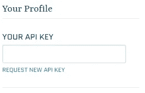
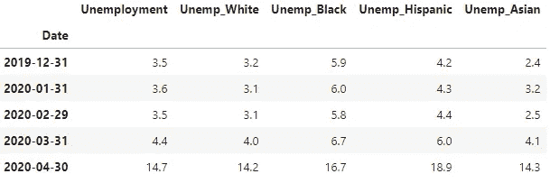
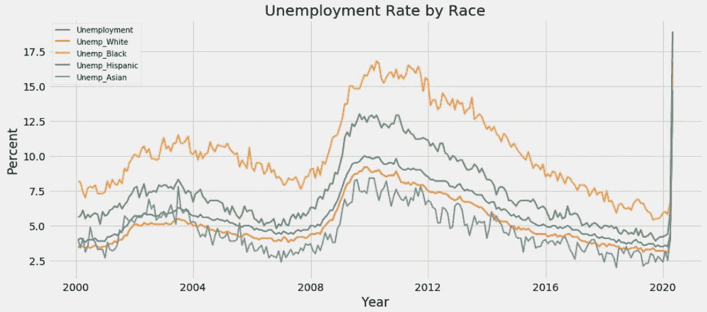
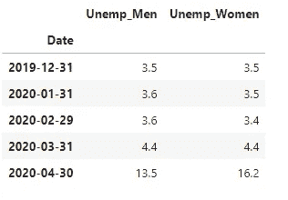
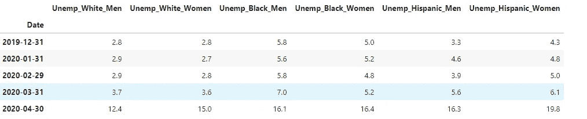
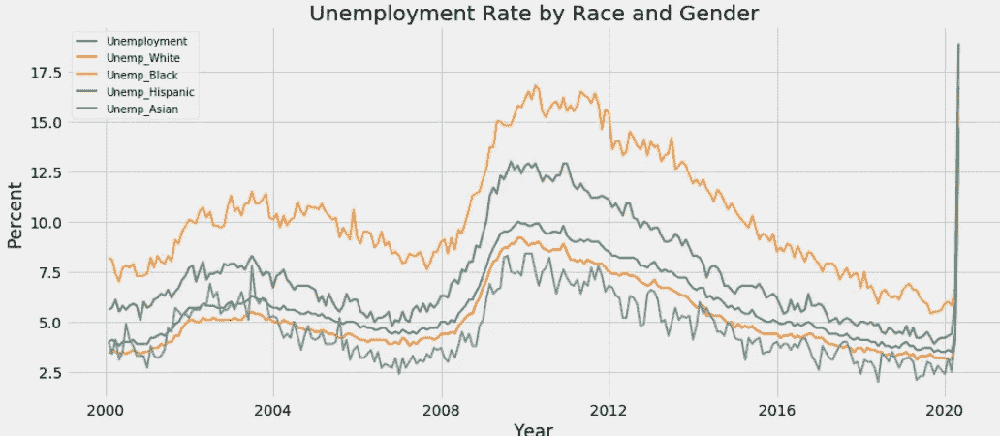
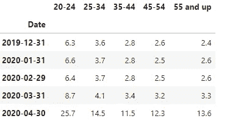
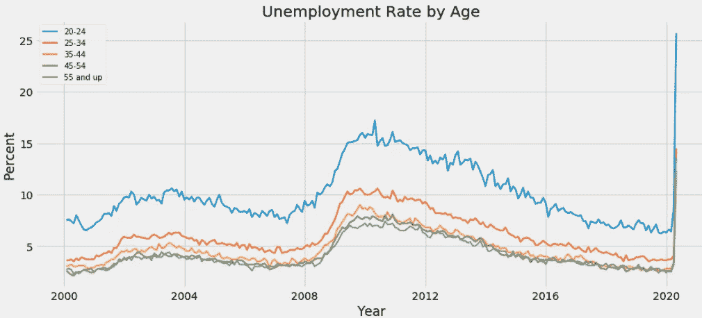
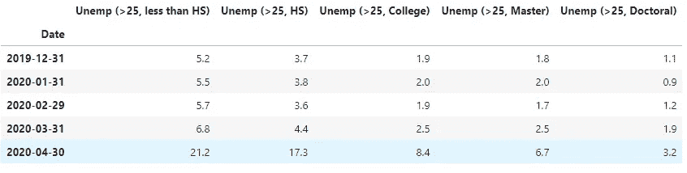
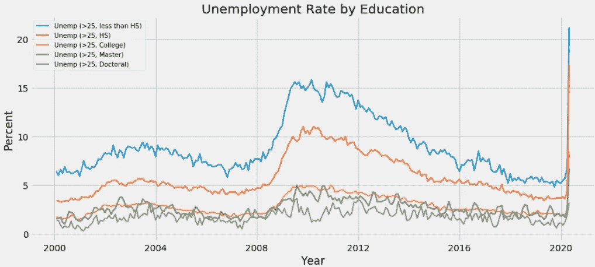

# 用 Python 和 Quandl 剖析失业数据

> 原文：<https://towardsdatascience.com/dissecting-unemployment-data-with-python-and-quandl-4d6d5d0fcdcd?source=collection_archive---------55----------------------->

使用 Quandl 下载美联储经济数据，并按种族、性别、年龄和教育程度绘制失业率图

4 月份的失业率上升到 14.7%，这是自 1948 年以来的最高数字。美国劳工部报告说，所有主要行业的就业人数都大幅下降，休闲和酒店业的失业情况尤为严重。这促使我分析与其他人口特征相关的失业数据，以了解冠状病毒关闭如何影响美国工人。

# 通过 Quandl 访问 FRED

佛瑞德([【https://fred.stlouisfed.org】](https://fred.stlouisfed.org/))由圣路易斯美联储银行的研究部门创建和维护，是一个在线数据库，由来自数十个国家、国际、公共和私人来源的数十万个经济数据时间序列组成。Python 中的 Quandl 包使得从包括 FRED 在内的多个数据源获取金融和经济数据变得很容易。

要使用 Quandl 访问数据，用户需要创建一个免费的 Quandl 帐户并请求一个 API 密钥。可以在帐户设置页面上找到 API 密钥。



一旦有了 API 密钥，就可以设置 API 密钥:

```
quandl.ApiConfig.api_key = “insert_your_api”
```

现在，我们准备好下载弗雷德数据和可视化。

# 按种族分列的失业率

下面的代码片段显示了如何检索多列 FRED 数据。



所有种族的失业率都急剧上升。然而，西班牙裔和黑人比白人和亚洲人受到的打击更大。



# 按性别分列的失业率

女性失业率几乎比男性高 3 个百分点。



# 按种族和性别分列的失业率

西班牙裔女性受到的打击最大，其次是黑人女性和西班牙裔男性。



# 按年龄分列的失业率

年轻年龄组的失业率高于年长年龄组。



# 按教育分列的失业率

失业率和受教育程度高度相关。受过教育的工人(大学以上)相对于教育程度较低的工人失业率较低。



# 摘要

Quandl Python 模块可以轻松下载失业等经济数据并分析趋势。尽管所有人群都感受到了历史最高的失业率，但一些人受到的冲击比其他人更大。受打击较大的人群包括受教育程度较低的人、女性、西班牙裔/黑人和较年轻的人群。