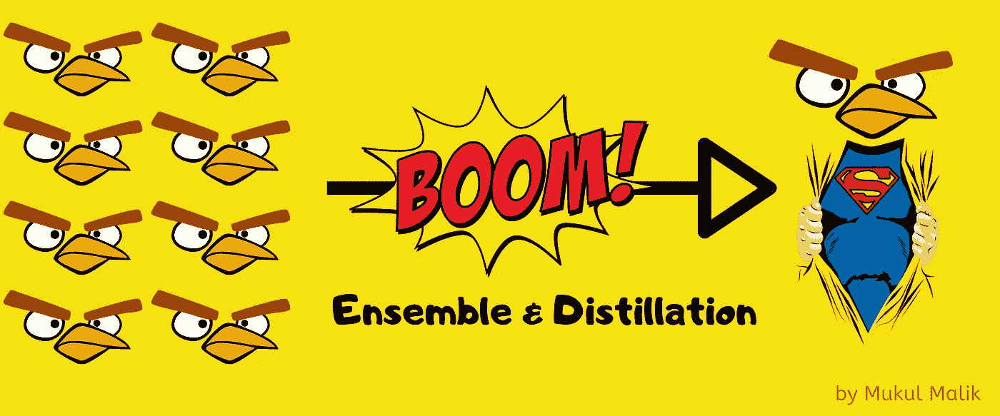
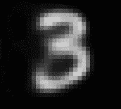
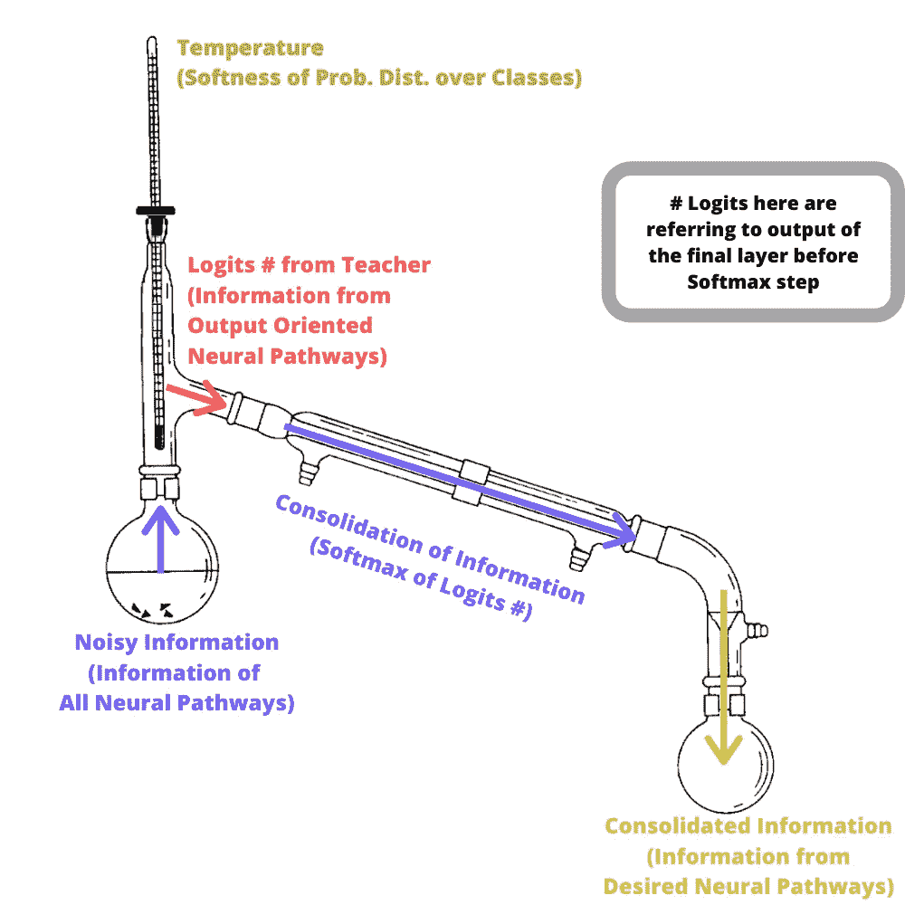
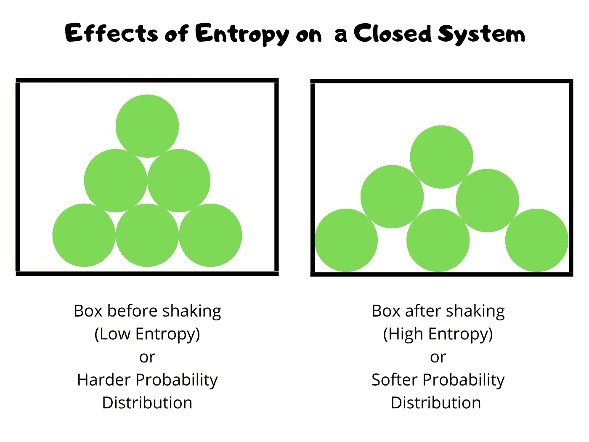
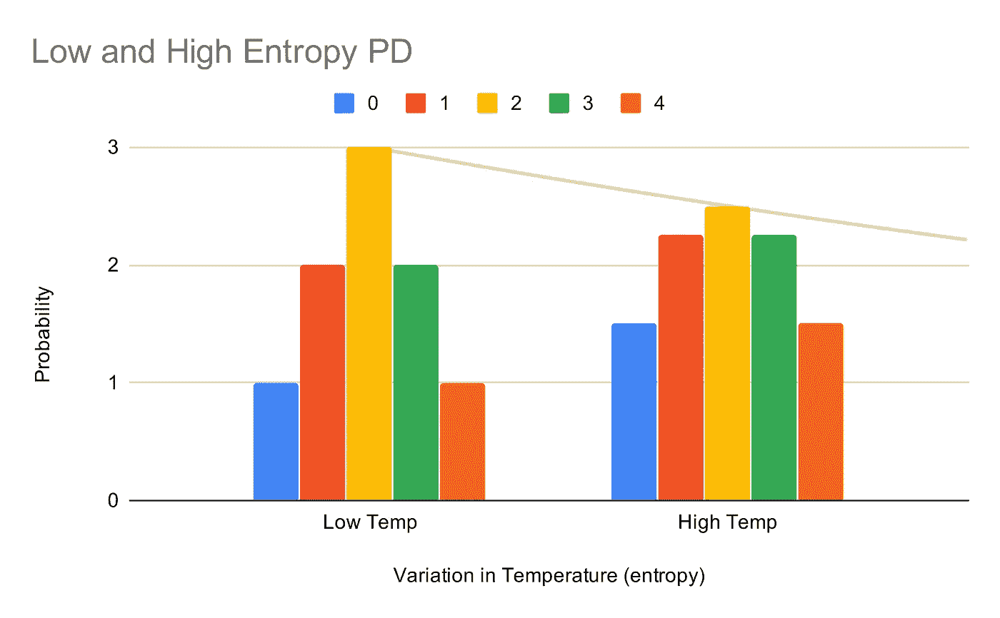
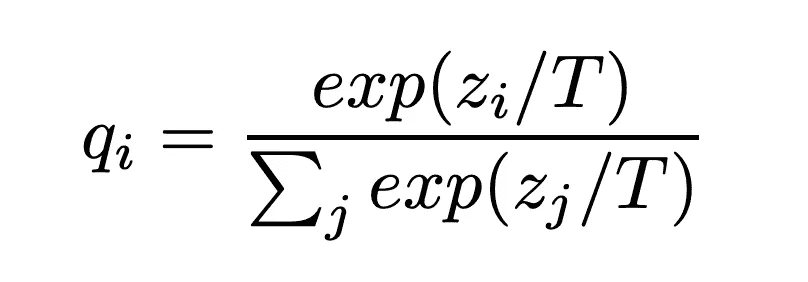
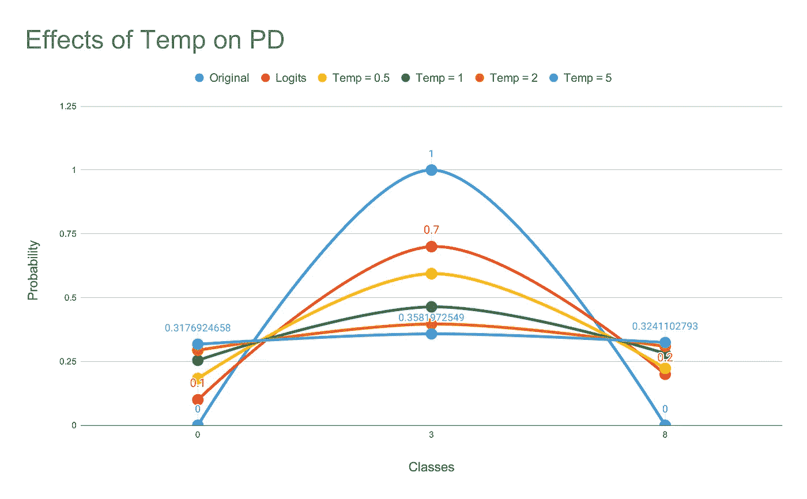
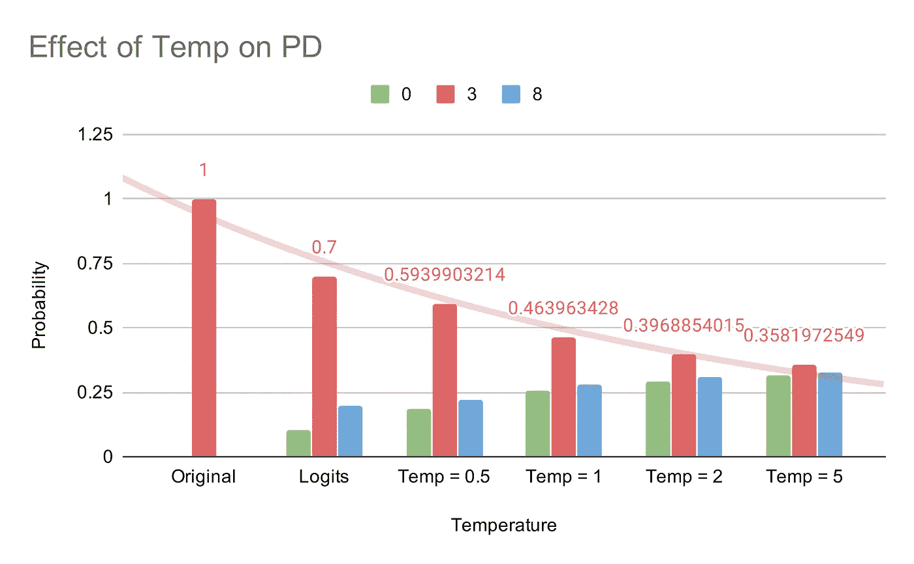

# 神经网络中知识的提炼

> 原文：<https://towardsdatascience.com/distillation-of-knowledge-in-neural-networks-cc02f79698b6?source=collection_archive---------6----------------------->

## 在更小更快的型号上实现最先进的性能



> 知识的提炼(在机器学习中)是一种架构不可知的方法，用于在一个神经网络内概括知识(巩固知识)以训练另一个神经网络。

# 重要

目前，特别是在 NLP 中，正在训练非常大规模的模型。其中很大一部分甚至无法安装在普通人的硬件上。此外，由于收益递减规律，模型规模的巨大增加几乎不能映射到精确度的微小增加。

这些模型几乎不能在商业服务器上运行，更不用说在智能手机上了。

使用蒸馏，人们可以将像 BERT 这样的模型的大小减少 87%,而仍然保持其 96%的性能。

基本上，蒸馏使人能够:

*   获得一流的精度
*   只有很小一部分
*   在很短的响应时间内
*   在微调时间的一小部分内
*   在单个 GPU 上安装合奏
*   可以在 CPU 上运行模型
*   支持联盟学习
*   等等

# 普通神经网络的问题

> 每个学习者的目标是优化其在训练数据上的性能。这并不能完全解释为数据集中知识的概括。

以 MNIST 数据集为例。我们来选一张 3 号的样图。



在训练数据中，数字 3 转化为相应的一个热点向量:

**0 0 1 0 0 0 0 0 0 0 0**

这个向量简单地告诉我们这个图像中的数字是 3，但是

> 没有明确提到任何关于数字 3 的形状。像 3 的形状类似于 8。

因此:

> 从来没有明确要求神经网络学习对训练数据的一般理解。泛化程度就是神经网络的隐含能力。

因此，在正常训练的神经网络中，每个神经元内的信息(检测到的特征)相对于期望的输出并不同等重要。

简而言之，正常训练的神经网络以神经元的形式承载了大量的负载，这些神经元从未学会概括数据，因此导致测试数据的准确性降低。

# 蒸馏

蒸馏使我们能够使用预训练的网络来训练另一个神经网络，而没有原始神经网络的自重。

> 使我们能够压缩网络的规模而不损失太多的准确性。

> 因此，经过提炼的模型比正常训练的模型具有更高的精确度。

> 注意:知识的提炼可以从任何形式的学习者(逻辑回归，SVM，神经网络等)到任何其他形式的学习者。

虽然为了博客的简单，我将只引用神经网络。

# 信息的概括

让我们后退一步，修改神经网络的目标:

> 通过归纳训练数据中的知识，预测网络在训练期间从未见过的样本的输出。

以鉴别神经网络为例，其目标是识别给定输入的相关类别。

> 现在，神经网络返回所有类别的概率分布，甚至是错误的类别。

*这告诉我们很多关于网络在训练数据中概括概念的能力。*

# 一般化的度量

对于 MNIST 上训练有素的神经网络来说，以下观察将是正确的:

*   即使数字 3 的概率明显大于数字 8 和数字 0 的概率
*   8 和 0 的概率是相当的
*   8 和 0 的概率比其他数字更高

因此，神经网络能够识别图像中数字 3 的形状，但是**神经网络还表明 3 的形状与数字 8 和 0 的形状非常相似(都非常弯曲)**。

# 信息概括过程



不，你实际上不需要所有这些设备。这只是有趣和相关的。

让我们从显而易见的开始，以正常的方式训练一个巨大的神经网络(你的硬件可以支持)。我们将把这个网络称为**繁琐网络**。

> 注意:这个笨重的模型很可能是多个正常训练的模型的集合。

参考资料:

*   **软目标**:网络在所有类别中的概率/权重分布
*   **硬目标**:原始训练数据内的一键向量表示

当繁琐模型不是单个模型而是多个模型的集合时，其输出的算术/几何平均值作为软目标。

新模型可以在与原始模型相同的数据集上训练，也可以在称为“转移集”的不同数据集上训练。

> Transfer-Set:通过繁琐的模型传递数据，并使用其输出(概率分布)作为各自的真值。它可以由用于训练原始模型的数据集、新数据集或两者组成。

# 温度和熵

通过调整软目标的温度，可以调整该转移集的大小。

当软目标具有高熵时，它们在每个训练样本上比硬目标给出更多的信息(让我们马上回到这个话题)。

这导致:

*   损失更小，因此校正梯度更小(反向传播)
*   不同训练示例的梯度之间的差异较小

因此:

*   可以使用更大的学习速率来训练模型
*   可以使用较小的数据集来训练模型

# 更多关于温度

我们在物理学中学到的东西在这里适用'**熵**随着**温度'**增加。

让我们打个比方:

想象一个盒子，里面的球一个接一个堆叠在一起。如果我们通过摇动盒子来增加它的熵，球不会从盒子里掉出来，而是会散开一点。

> 得到的分布具有与原始分布相似的形状，但是其峰值的大小发生了变化。



然而，在更高的**温度**下，一定量的热量添加到系统中会导致**熵**比相同量的热量在更低的**温度**下产生更小的变化。

下面是一个概率分布的例子，比较一个系统的低温和高温。



现在，我们用温度公式将知识从一个神经网络转移到另一个神经网络:



*   ᵢ:结果概率
*   ᵢ:一个阶级的逻辑
*   ⱼ:其他逻辑
*   t:温度

> [Logits](https://developers.google.com/machine-learning/glossary/#logits) :分类模型生成的原始(非标准化)预测向量，通常会传递给标准化函数。如果模型正在解决多类分类问题，logits 通常会成为 softmax 函数的输入。

好吧，想象一下下面的场景:

想象一个 MNIST 数据点的数字 3(是的，我喜欢数字 3)，但是让我们只关注 3 个(是的是的)类:

*   **0**
*   **3**
*   **8**

> **数据集值** : 0，1，0
> 
> **逻辑值(神经网络输出)** : 0.1，0.7，0.2
> 
> 温度 0.5: 0.1831659252，0.5939990325
> 
> 温度 1: 0.254628528，0.4639634285
> 
> 温度 2: 0.294019937，0.3968854016
> 
> 温度 5: 0.3176924658，0.358197259，0.35825357



更高的温度导致更柔和的类概率分布。

现在，让我们想象一下随着温度的升高，概率分布的平滑度:



# 训练蒸馏模型

最简单的蒸馏形式是使用由具有高温的笨重模型产生的软目标来训练模型，并将其蒸馏到具有相同温度的另一个模型中。

> 在训练之后，提取的模型的温度被设置为 1。

到目前为止，我们已经确定，提取的网络可以在由软目标组成的转移集上训练。

酪

我们还可以利用所有或部分数据已知的真实值或硬目标。

最有效的方法之一是使用两个目标函数:

*   使用高温笨重模型的软目标的交叉熵
*   交叉熵与硬目标使用相同的繁琐模型，但温度设置为 1

> 注意:软目标的幅度被缩放到 i/T 倍，而硬目标没有这样的缩放。因此，我们将软目标乘以 T，以标准化软目标和硬目标的影响。

# 密码

HuggingFace 实际上提供了脚本来训练你自己的**distil Bert**&**distil Roberta**，它的体积小了 40%，速度快了 60%，同时保留了原始模型 99%的准确性。

要获取存储库，请使用:

```
git clone [https://github.com/huggingface/transformers.gi](https://github.com/huggingface/transformers.git)t
```

然后

```
cd transformers/examples/distillation
```

首先，我们将对数据进行二进制化，也就是说，对数据进行标记化，并在模型词汇表的索引中转换每个标记。

```
python scripts/binarized_data.py \
    --file_path data/dump.txt \
    --tokenizer_type bert \
    --tokenizer_name bert-base-uncased \
    --dump_file data/binarized_text
```

《拥抱脸》沿袭了《T4》和《XLM》的风格，通过一个更加强调生僻字的因素，平滑了屏蔽的可能性。因此，计算数据中每个标记的出现次数:

```
python scripts/token_counts.py \
    --data_file data/binarized_text.bert-base-uncased.pickle \
    --token_counts_dump data/token_counts.bert-base-uncased.pickle \
    --vocab_size 30522
```

一旦对数据进行预处理，蒸馏训练就变得非常简单:

```
python train.py \
    --student_type distilbert \
    --student_config training_configs/distilbert-base-uncased.json \
    --teacher_type bert \
    --teacher_name bert-base-uncased \
    --alpha_ce 5.0 --alpha_mlm 2.0 --alpha_cos 1.0 --alpha_clm 0.0 --mlm \
    --freeze_pos_embs \
    --dump_path serialization_dir/my_first_training \
    --data_file data/binarized_text.bert-base-uncased.pickle \
    --token_counts data/token_counts.bert-base-uncased.pickle \
    --force # overwrites the `dump_path` if it already exists.
```

# 结论

通过提取神经网络，我们获得了一个更小的模型，它与原始模型有很多相似之处，同时更轻、更小、运行速度更快。

因此，提取模型是将大规模神经网络投入生产的一个有趣的选择。