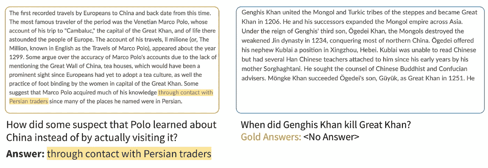
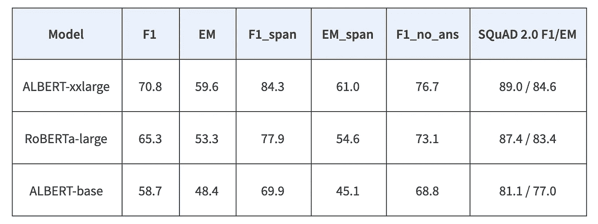
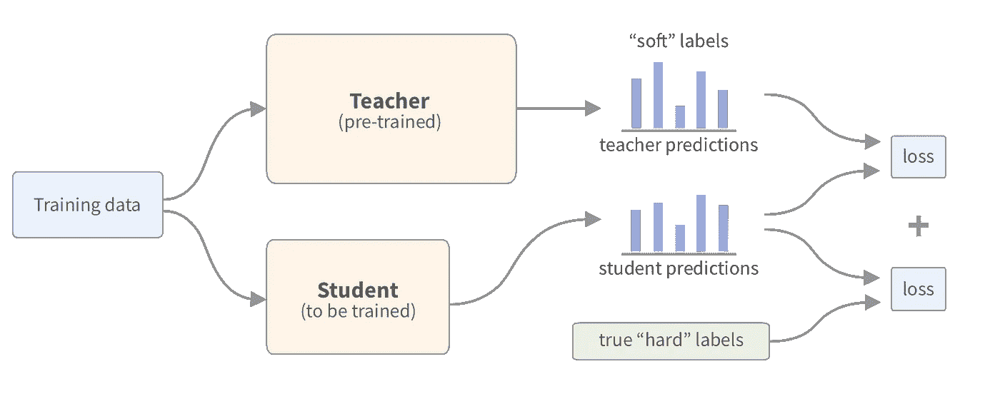
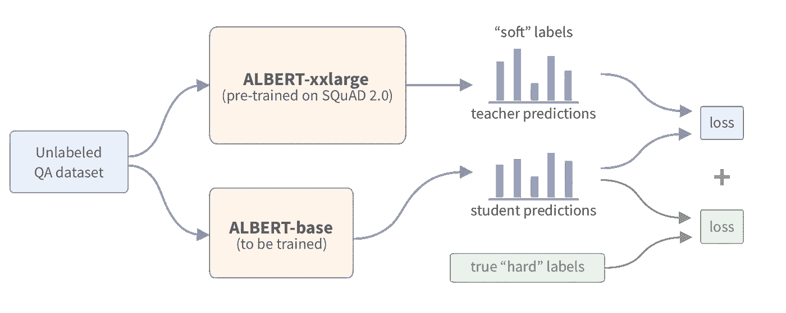
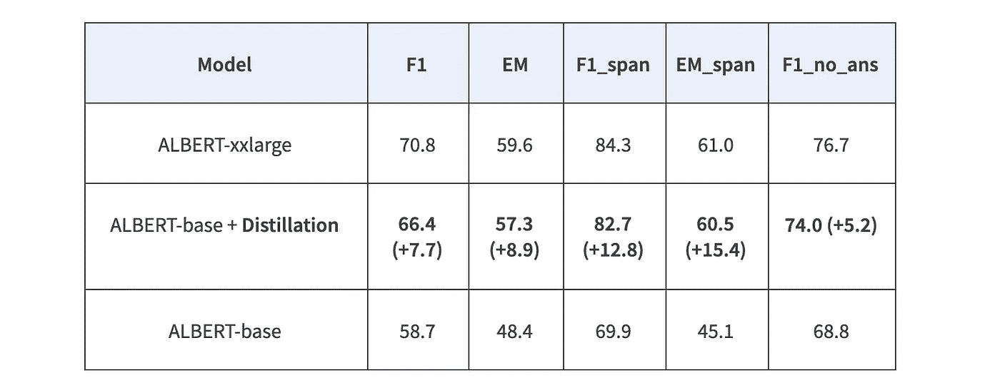
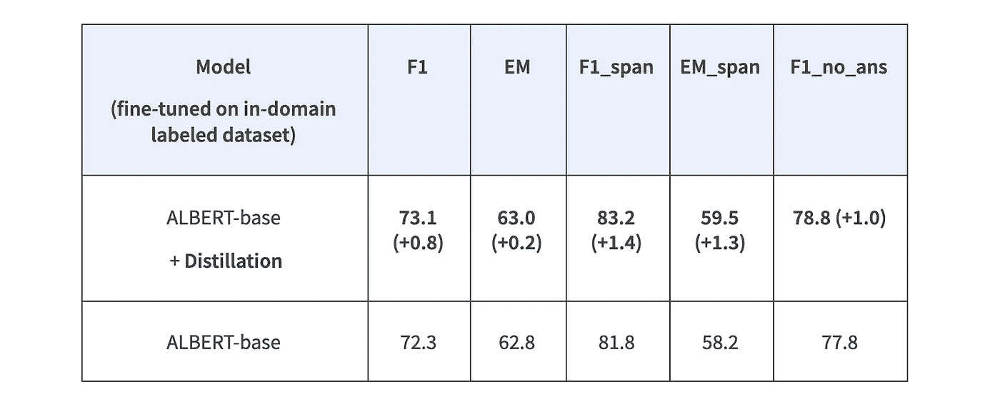
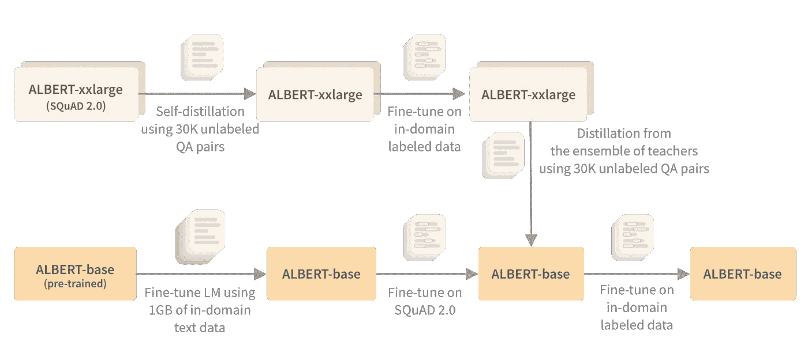
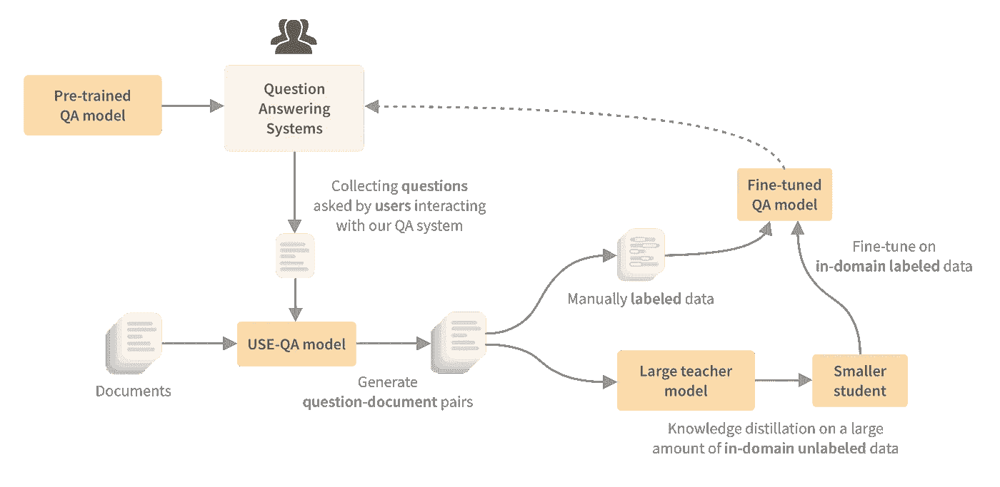

# 使用无标签问答数据集提取 BERT

> 原文：<https://towardsdatascience.com/distilling-bert-using-unlabeled-qa-dataset-4670085cc18?source=collection_archive---------29----------------------->

## 如何利用知识提炼将未标记数据用于问答任务

照片由[阿尔方斯·莫拉莱斯](https://unsplash.com/@alfonsmc10?utm_source=medium&utm_medium=referral)在 [Unsplash](https://unsplash.com?utm_source=medium&utm_medium=referral) 拍摄

数据标注过程相当复杂，尤其是机器阅读理解(问答)等任务。在这篇文章中，我想描述一种技术，我们使用有限的标记数据来使问答模型适应特定的领域——T4 知识蒸馏 T5。事实证明，我们不仅可以使用它来“压缩”模型，还可以利用域内未标记的数据。

# 问答和小队📖

最简单的问答系统形式之一是机器阅读理解(MRC)。这里的任务是在提供的文档中找到一个问题的简短答案。MRC 最流行的基准是**斯坦福问答数据集(SQuAD)** [1]。它包含 100，000 个问答对和 53，775 个无法回答的问题，这些问题来自维基百科的热门文章的 23，215 个段落。每个问题的答案都是来自相应阅读文章的一段文字(一个跨度)。对于无法回答的问题，系统应确定该段落何时不支持任何答案，并放弃回答。

2.0 班中可回答和不可回答问题的示例

还有其他可用的问答数据集，如 Natural Questions 和 MS MARCO，但 SQuAD 2.0 是使用最多的数据集之一，也是我们项目的起点。

# 评估预训练模型👩🏻‍🔬

最近，我们为一个照片&摄像机在线商店开发了一个[问题回答系统，在那里我们训练了一个机器阅读理解模型。在我们的项目中，我们测试了各种预先训练的问答模型(感谢🤗拥抱脸)，并发现在 SQuAD 2.0 上训练的 ALBERT-xxlarge**【2】**在我们的域上显示了有希望的结果:****](https://blog.griddynamics.com/question-answering-system-using-bert/)

********

****使用在 SQuAD 2.0 *(图片由作者提供)*上预先训练的模型的测试数据集的结果****

****但是这个模型太慢了，我们不能在生产中使用它。在这种情况下，常用的方法之一是使用*知识蒸馏*。****

# ****知识升华⚗️****

****当我们想要训练更快或更小的模型时，知识蒸馏[3]通常被用作模型压缩技术。在这个过程中，我们使用我们主要的较大模型(*老师*)的输出概率来训练一个较小的模型(*学生*)，因此一个学生开始“模仿”老师的行为。基于比较产出分布的损失比仅基于硬目标的损失要丰富得多。这个想法是，通过使用这样的软标签，我们可以从教师模型中转移一些“黑暗知识”。此外，从软标签中学习可以防止模型对其预测过于确定，这类似于标签平滑[4]技术。****

********

*****知识蒸馏(图片作者)*****

****知识提炼是一项非常漂亮的技术，效果出奇地好，对变形金刚尤其有用——更大的模型往往显示出更好的结果，但很难将如此大的模型投入生产。****

# ****使用未标记数据的蒸馏🔮****

****在 SQuAD 上提取或训练的模型在我们的数据集上没有显示出竞争结果。小队数据集与我们的领域没有重叠，所以这样的提取效果不好。似乎在 SQuAD 上训练的较大模型在域外数据上工作得更好。为了使提炼过程有效，我们需要使用来自我们领域的数据集。除了我们的小标签数据集，我们还有大约 **30，000 个未标签的(没有突出显示的答案)问题-文档对**，我们考虑如何使用它们。****

****我们蒸馏需要什么？一个老师和一个带标签的数据集。ALBERT-xxlarge 可以当老师模特。对于我们的 30K 示例，我们没有标签，但是我们可以删除使用标签的部分损失吗？当然，在没有接地标签的知识提炼过程中，我们会继承更多老师的错误。但是目前我们没有比 ALBERT-xxlarge 更好的模型，所以即使用更小的模型得到类似的结果对我们也是有用的。因此，我们试图仅使用未标记的 30K 个示例，从 ALBERT-xxlarge 到 ALBERT-base 提取知识。****

********

*****知识蒸馏*透地标签*(图片由作者提供)*****

********

****使用在 SQuAD 2.0 *(图片由作者提供)*上预先训练的模型的测试数据集的结果****

****正如你所看到的，我们用 F1/EM 接近它的老师得到了 ALBERT-base，并且我们没有使用任何标记的数据进行训练。当然，这并不意味着我们不再需要标记的数据，分数仍然远不理想，我们也继承了老师的错误，所以添加标记的数据可能会改善这个训练程序。****

# ****蒸馏作为预培训🏋🏻‍♂️****

****我们还可以考虑将蒸馏作为额外的预训练步骤，以便在使用标记数据时实现更好的样品效率。在下面，您可以看到，在我们的例子中，蒸馏有助于进一步微调带标签的数据。****

********

****使用在 SQuAD 2.0 上预训练并在域内标记数据上微调的模型的测试数据集上的结果(~1000 个标记示例)*(图片由作者提供)*****

# ****自蒸馏👯‍♀️****

****你的老师越好，你就能培养出越好的学生。因此，一个主要的方向可以是改进教师模式。除了使用我们的标记数据集，当我们对学生和教师使用相同的模型架构时，还有另一种令人兴奋的技术— **自我升华**。自我升华让我们训练出一个比老师表现更好的学生模型。这听起来可能很奇怪，但是因为学生从老师没有看到的数据中更新其权重，这可以导致学生(可比大小)在来自该分布的数据中表现稍好。当我们对 ALBERT-xxlarge 应用自蒸馏，然后使用它作为我们的教师之一来进一步蒸馏到一个更小的模型时，我们的实验也再现了这种行为。****

# ****合奏👯‍♀️️️👯‍♂️****

****当然，提炼训练程序允许我们有效地使用教师模型的集合，并将它们提炼为一个更小的模型。结合所有这些方法(见下文)和领域自适应语言预训练，我们能够使用有限数量的标记示例获得良好的结果。****

********

*****我们培训管道的所有步骤* *(图片由作者提供)*****

# ****等等，我们的数据真的没有标签吗？🤔****

****值得一提的是，即使我们没有给任何数据贴上蒸馏的标签，我们仍然有疑问，但情况并非总是如此。与文本分类和 NER 等 NLP 任务相比，问答模型的输入由一个问题和一个文档组成。尽管问题是一个输入，但它可以被视为数据标注过程的一部分(你必须写一个问题，而不只是突出显示一个答案)。这样，真正无标签的 QA 数据集是当我们只有没有问题的文档时。****

****但是，即使我们有问题，我们也没有手动将每个问题准备到一个特定的文档中。我们使用预先训练的 [USE-QA](https://ai.googleblog.com/2019/07/multilingual-universal-sentence-encoder.html) 模型收集了这 30，000 个与一组独立文档的问题相匹配的 QA 对。通过这种方式，我们可以从预先训练的模型开始，并在生产中进一步改进模型。在我们开始收集与我们的系统交互的用户提出的真实问题后，我们可以以同样的方式找到这些问题的候选文档，并使用这个数据集进行知识提炼，而无需标记许多示例。****

********

****使用从已部署系统收集的问题*(图片由作者提供)*****

# ****🛠实验装置****

****我们使用了来自的[示例](https://github.com/huggingface/transformers/tree/master/examples/distillation)🤗拥抱面部变形金刚进行知识提炼，1x NVIDIA 2080TI 用于我们所有的实验。[梯度累积](https://medium.com/huggingface/training-larger-batches-practical-tips-on-1-gpu-multi-gpu-distributed-setups-ec88c3e51255)允许我们使用更大的模型，如 ALBERT-xxlarge 和 RoBERTa-large，以及混合精度(fp16)来更快地训练模型。为了在一个 2080TI 上对 ALBERT-xxlarge 进行自我蒸馏，我们首先预计算了老师的预测(软标签)。****

# ****结论****

****知识提炼是一种方便的技术，它允许我们“压缩”巨大的变压器模型，以便在生产中使用它们。我们还可以以对未标记数据进行预训练的形式使用它，这有助于在对标记样本进行微调时提高样本效率。这对于机器阅读理解等任务尤其有用，在这些任务中，标记数据的过程相当复杂。使用未标记的数据进行提炼并不是一个新颖的想法，它已经在计算机视觉( [SimCLRv2](https://arxiv.org/abs/2006.10029) ，[嘈杂的学生](https://arxiv.org/abs/1911.04252))和 NLP ( [阅读能力强的学生学得更好](https://arxiv.org/abs/1908.08962))中显示出良好的结果。****

****如果您想了解更多关于我们构建问答系统的旅程，请查看我们更详细的帖子，其中我们描述了我们如何收集和标记数据，微调模型，以及应用各种技术，如知识提取和修剪:****

**** [## 我们如何使用 BERT 为网上商店构建问答系统

### 在这篇博文中，我们描述了我们基于 Transformer 模型构建问答系统的经验，比如…

blog.griddynamics.com](https://blog.griddynamics.com/question-answering-system-using-bert/)**** 

****要了解更多关于知识提炼和其他压缩方法的信息，我推荐以下资源:****

*   ****[知识蒸馏:原理、算法、应用](https://neptune.ai/blog/knowledge-distillation) (Neptune.ai)****
*   ****[伯特压缩技术(Rasa)概述](https://blog.rasa.com/compressing-bert-for-faster-prediction-2/)****
*   ****[自然语言处理中模型压缩方法综述](https://www.pragmatic.ml/a-survey-of-methods-for-model-compression-in-nlp)****
*   ****[更小、更快、更便宜、更轻:推出蒸馏伯特，伯特的蒸馏版本](https://medium.com/huggingface/distilbert-8cf3380435b5)****
*   ****[博览群书的学生学得更好:论预训练紧凑模型的重要性](https://arxiv.org/abs/1908.08962)****

****以下资源将帮助您深入机器阅读理解任务:****

*   ****[问答架构(CS224N 斯坦福讲座)](http://web.stanford.edu/class/cs224n/slides/cs224n-2020-lecture10-QA.pdf)****
*   ****[关于机器阅读理解的调查:任务、评估标准和基准数据集](https://arxiv.org/abs/2006.11880)****
*   ****[学习和评估一般语言智能(小组、样本效率、概括)](https://arxiv.org/abs/1901.11373)****
*   ****[在回答问题时提高伯特的注意力](https://arxiv.org/abs/1910.06431)****
*   ****[BERT 如何回答问题？变压器表示的分层分析](https://arxiv.org/abs/1909.04925)****
*   ****[模型从问答数据集中学到了什么？](https://arxiv.org/abs/2004.03490)****
*   ****[开放领域问答数据集中的问答测试训练重叠](https://arxiv.org/abs/2008.02637)****
*   ****[CoQA、SQuAD 2.0 和 QuAC 的定性比较](https://arxiv.org/abs/1809.10735)****

****[1] Pranav Rajpurkar，Robin Jia， [Percy Liang，知道你不知道的:对小队的无法回答的问题](https://arxiv.org/abs/1806.03822) (2018)，ACL 2018****

****[2]·兰，陈明达，塞巴斯蒂安·古德曼，凯文·金佩尔，皮尤什·夏尔马，拉杜·索里库特，[阿尔伯特:一个用于语言表征自我监督学习的 Lite BERT](https://arxiv.org/abs/1909.11942)(2019)****

****[3] Geoffrey Hinton，Oriol Vinyals，Jeff Dean，[在神经网络中提取知识](https://arxiv.org/abs/1503.02531) (2015)，NIPS 2014 深度学习研讨会****

****[4] Rafael Müller，Simon Kornblith，Geoffrey Hinton，[标签平滑在什么情况下有帮助？](https://arxiv.org/abs/1906.02629) (2019)，NeurIPS 2019****