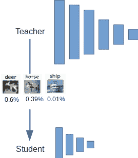
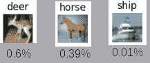
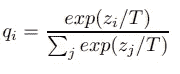
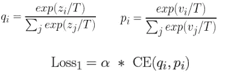
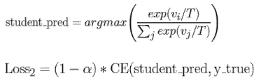
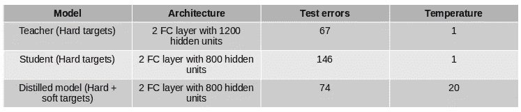
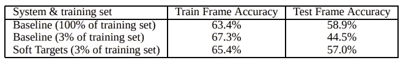

# 提取神经网络中的知识

> 原文：<https://towardsdatascience.com/distilling-knowledge-in-neural-network-d8991faa2cdc?source=collection_archive---------7----------------------->

## 学习用较小的模型学得更好

在传统的机器学习中，为了达到最先进的(SOTA)性能，我们经常训练一系列集成模型来克服单个模型的弱点。然而，实现 SOTA 性能通常伴随着使用具有数百万个参数的大模型的大计算。像 VGG16/19、ResNet50 这样的 SOTA 模型分别具有 1.38 亿和 2，300 万以上的参数。在边缘部署这些模型是不可行的。

智能手机和物联网传感器等边缘设备是资源受限的设备，不可能在不影响设备性能的情况下执行训练或实时推理。因此，研究的重点是将大型模型压缩成小型紧凑的模型，在边缘部署时性能损失最小甚至为零。

以下是一些可用的模型压缩技术，但不限于此

*   剪枝和量化
*   低秩因子分解
*   神经结构搜索(NAS)
*   知识的升华

在这篇文章中，重点将放在[1]提出的知识提炼上，参考文献链接[2]提供了上面列出的模型压缩技术的一个很好的概述。

# 知识的升华

知识提取是使用从**大型模型**或**模型集合**中推断出的提取知识来训练一个紧凑的神经网络。使用提取的知识，我们能够有效地训练小而紧凑的模型，而不会严重损害紧凑模型的性能。

## 大型和小型模型

我们称**大型模特**或**模特组合**为**笨重模特**或**教师**网络，而**小型模特**和紧凑型模特**学生**网络。

一个简单的类比是，一个大脑小而紧凑的学生在准备考试时，试图从老师那里吸收尽可能多的信息。然而老师只是教所有的东西，不知道考试中会出现哪些问题的学生尽力吸收所有的东西。

这就是压缩发生的地方，从老师那里提取知识给学生。

图一。教师模型将知识提炼为学生模型

在提取知识之前，笨重的模型或教师网络应该达到 SOTA 性能，这种模型通常由于其记忆数据的能力而过度拟合。尽管过度拟合，这个笨重的模型也应该能很好地推广到新的数据。繁琐模型的目标是最大化正确类别的平均对数概率。更有可能正确的类将被分配高概率分数，而不正确的类将被分配低概率分数。

下面的例子显示了当对给定的“鹿”图像执行推理时，softmax 图 2 后的结果。为了得到预测，我们取最大类概率分数的 argmax，这将给我们 60%的正确机会。

图二。“马”看起来像“鹿”(Softmax 预测)

然而，给定上面的图 2。(为了便于说明)，我们知道与“船”相比，“马”与“鹿”非常相似。因此，在推理过程中，我们有 60%的正确率和 39%的错误率。由于“鹿”和“马”之间有一些空间相似性，我们不能责怪网络预测“马”。如果网络被提供了诸如**“我认为这个图像有 60%的几率是鹿，39%的几率是马”**的信息，例如【鹿:0.6，马:0.39，船:0.01】，那么网络被提供了更多的信息(高熵)。使用类别概率作为目标类别提供了比仅仅使用原始目标更多的信息。

## 蒸馏

教师向学生提炼预测类概率的知识，作为“S **经常的目标**”。这些数据集也被称为“**转移集”**，其目标是教师提供的类别概率，如图 2 所示。蒸馏过程通过将超参数 **T** (温度)引入 softmax 函数来进行，使得教师模型可以为学生模型产生转移集的合适的软目标集。

> ***软目标*** *善于帮助模型泛化，可以作为防止模型过于自信的正则化子。*

Eq 1。Softmax 随温度变化( **T=1** 只是 softmax，随着 **T** 的增加，概率的等级分布将变得更柔和)。

# 培训教师和学生模型

首先训练繁琐的/教师模型，因为我们需要繁琐的模型很好地概括新数据。在提取过程中，学生目标函数是两个不同目标函数 **Loss1** 和 **Loss2** 的加权平均值。

## **Loss1(软目标的交叉熵损失)**

Loss1 是教师 **q** 和学生 **p** 与温度 **T > 1** 的两个温度 softmax 的交叉熵(CE)损失乘以权重参数**α**。

Eq 2。损失函数 1

## ***Loss2(硬目标交叉熵损失)***

Loss2 是正确标签和学生硬目标在 **T = 1** 时的交叉熵(CE)损失。Loss2 对学生模型做出的硬目标( **student_pred** )的【T2(1-alpha)】关注不多，以匹配教师模型的软目标 **q** 。

Eq 3。损失函数 2

学生模型的目标是蒸馏损失，即**损失 1** 和**损失 2** 之和。

然后，学生模型在**传输装置**上接受训练，以使其蒸馏损失最小化。

# 结果

## MNIST 实验

如下表 1。是来自论文[1]的结果，该论文显示了使用在具有 60，000 个训练案例的 MNIST 数据集上训练的教师、学生和精选模型的性能。所有模型是两层神经网络，分别具有 1200、800 和 800 个神经元，用于教师、学生和提取模型。当使用与学生模型相比的提取模型时，在温度设置为 20 的情况下，教师和提取模型之间的测试误差是可比较的。然而，当只使用学生模型和硬目标时，它的泛化能力很差。

表 1。MNIST 的初步实验[1]

## 语音识别实验

如下表 2。是文[1]的另一个结果。繁琐模型是由 85M 参数组成的语音模型，该模型是在 2000 小时的英语口语数据上用大约 700M 训练样本训练的。表 2 中的第一行。是在 100%的训练示例上训练的基线(繁琐)模型，其产生 58.9%的准确度。第二行仅用 3%的训练样本进行训练，这导致了严重的过拟合，最后，第三行是用同样 3%的训练样本训练的相同语音模型，其具有仅使用 3%的训练数据就达到 57%准确度的软目标。

表 2:软目标允许一个新模型仅从 3%的训练集中进行很好的概括。软目标是通过在全训练集上训练获得的。[1]

# **结论**

知识提炼是一种将计算带到边缘设备的模型压缩技术。目标是有一个小而紧凑的模型来模仿笨重模型的性能。这是通过使用软目标来实现的，软目标充当正则化器，以允许小而紧凑的学生模型进行归纳，并从教师模型中恢复几乎所有的信息。

根据 Statista [3]的数据，到 2025 年，已安装的物联网(IoT)连接设备总数预计将达到**215 亿**。随着边缘设备数量的增加，为边缘设备带来计算能力对于让边缘设备变得更加智能来说是一个不断增长的挑战。知识提炼允许我们在不影响边缘设备性能的情况下执行模型压缩。

# **参考文献**

【1】[辛顿、杰弗里、奥里奥尔·维尼亚尔斯和杰夫·迪恩。"从神经网络中提取知识."arXiv 预印本 arXiv:1503.02531 (2015)。](https://arxiv.org/pdf/1503.02531.pdf)

[2] [空间深度学习的模型压缩技术综述](https://medium.com/gsi-technology/an-overview-of-model-compression-techniques-for-deep-learning-in-space-3fd8d4ce84e5)

[3] [全球联网设备数量](https://www.statista.com/statistics/1101442/iot-number-of-connected-devices-worldwide/)