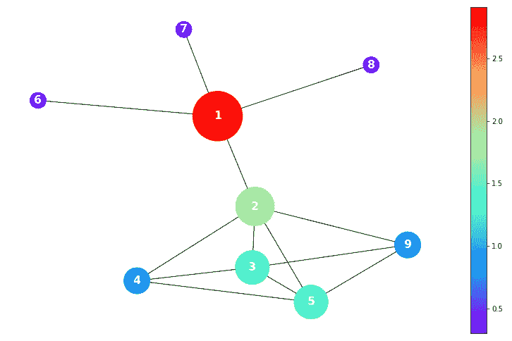
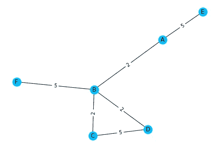
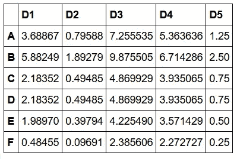
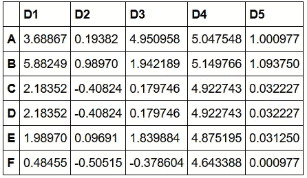
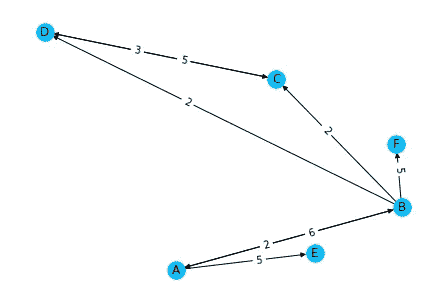
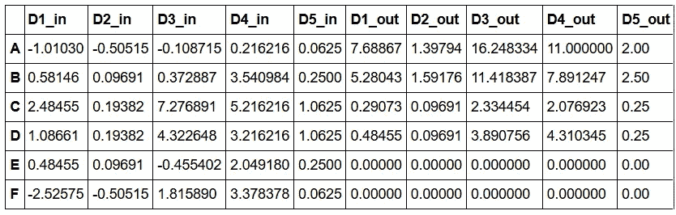

# 社交网络中的独特性中心性:Python 教程

> 原文：<https://towardsdatascience.com/distinctiveness-centrality-56c1e6762328?source=collection_archive---------37----------------------->

## 独特性中心性是一组新的网络度量，它高度重视独特的、非冗余的连接。它们对于社会和复杂网络的分析是有用的。



独特性中心性提供了既定指标的另一种观点，即基于其经纪能力、其连接的数量和权重以及其快速到达所有其他节点的能力来识别中心节点。

正如我们在图中看到的，即使节点#2 比节点#1 具有更高的度，后者也被认为更重要(根据独特性)，因为节点#6、#7 和#8 没有其他连接。另一方面，节点#2 的邻居有更多的连接，因此与#2 的链接是许多链接中的一个。

一些传统的中心性度量不太重视节点与网络外围的连接。另一方面，独特性中心性赋予那些与松散连接的节点更多的重要性。这在我们想要惩罚到网络集线器的连接的情况下是有帮助的。

独特性中心性可能有助于识别犯罪组织中的突出节点，当这些组织是由半独立的细胞组成的团体时，大型网络中心代表一种风险。在其他场景中，可能存在到达某些对等体的唯一节点，并且可以用作传播促进人群健康的实践的种子。或者，独特中心性可以用来测试新的网络分割策略，意在遏制流行病。

当分析单词共现网络以评估品牌重要性时(参见我的另一篇关于 [**语义品牌得分**](/calculating-the-semantic-brand-score-with-python-3f94fb8372a6) )，与独特单词的品牌链接可能更重要，因为它们传达了品牌形象的独特特征。

在有向网络中，如果传入弧源自具有低出度的节点，则区别中心性用于更重视传入弧。事实上，从一个节点向所有其他节点发送弧的连接被认为没有什么价值。让我们以奥罗拉收到布鲁诺的情书为例，布鲁诺正在给附近的所有人发送情书。寄给奥罗拉的信对奥罗拉来说远不如布鲁诺只寄了一封信(给奥罗拉)的情况重要。类似地，如果传出弧到达具有低入度的对等体，则它们的价值更高。这意味着，如果奥罗拉只收到布鲁诺的情书，她会比收到邻居所有人的情书更加关注它。

[**本文**](https://arxiv.org/abs/1912.03391)【1】提供了度量标准、它们的公式和性质的完整描述。

## 用 Python 计算独特性中心性

我最近开发了一个 Python 包[2]，用于简单计算独特性中心性。代码在 GitHub **上也有 [**。**这里有一个简短的教程。](https://github.com/iandreafc/distinctiveness)**

首先，我们需要安装并导入*显著性*包，可以通过 pip 完成。还需要 Networkx 和 Numpy。

```
**#To install the package**
pip install -U distinctiveness
```

我们将额外使用 Pandas(可选)来处理结果。

```
**# Import distinctiveness**
from distinctiveness.dc import distinctiveness

**#Import Networkx and Pandas**
import networkx as nx
import pandas as pd
```

让我们创建一个玩具网络(**无向**和**带弧权重**)，以展示独特性中心性的计算示例。

```
**#Create and draw an Undirected Toy Network**
G= nx.Graph()
G.add_edge("A","E", weight = 5)
G.add_edge("A","B", weight = 2)
G.add_edge("B","F", weight = 5)
G.add_edge("B","C", weight = 2)
G.add_edge("B","D", weight = 2)
G.add_edge("C","D", weight = 5)
pos = nx.spring_layout(G)
labels = nx.get_edge_attributes(G,'weight')
nx.draw(G,pos=pos,with_labels = True,node_color='#00c0ff')
nx.draw_networkx_edge_labels(G,pos,edge_labels=labels)
```



无向玩具网络

独特性中心性有五种变化(替代指标),而`distinctiveness` 函数将计算所有变化。现在，我们设置 alpha = 1。可以增加该系数，以更强烈地惩罚具有高度连接的节点的链路。

```
**#Calculate the 5 metrics of Distinctiveness Centrality**
DC = distinctiveness(G, alpha = 1, normalize = False, measures = ["D1","D2","D3","D4","D5"])
DC = pd.DataFrame(DC).sort_index()
DC
```



当 alpha > 1 时，负值是可能的，因为到高度连接的对等体的链接会对节点的重要性产生负面影响。也可以为每个指标指定不同的α值。

```
DC = distinctiveness(G, normalize = False, alpha = **[1,2,3,4,5]**)
DC = pd.DataFrame(DC).sort_index()
DC
```



度量可以标准化，以便在不同网络之间进行比较。这可以通过设置`normalize=True.`来实现。现在让我们看一个有向图的例子。

```
**#Create a Direceted Toy Network**
G= nx.DiGraph()
G.add_edge("A","E", weight = 5)
G.add_edge("A","B", weight = 6)
G.add_edge("B","A", weight = 2)
G.add_edge("B","F", weight = 5)
G.add_edge("B","C", weight = 2)
G.add_edge("B","D", weight = 2)
G.add_edge("C","D", weight = 3)
G.add_edge("D","C", weight = 5)
pos = nx.spiral_layout(G)
labels = nx.get_edge_attributes(G,'weight')
nx.draw(G,pos=pos,with_labels = True,node_color='#00c0ff')
nx.draw_networkx_edge_labels(G,pos,edge_labels=labels, label_pos=0.4)
```



定向玩具网络

当计算有向图的区别中心性时，每个度量都有一个“_in”和“_out”后缀。这些逻辑和公式都在本文的引言中提出，并在[](https://arxiv.org/abs/1912.03391)**【1】中详述。**

```
DC = distinctiveness(G, normalize = False, alpha = 2)
DC = pd.DataFrame(DC).sort_index()
DC
```

****

**如需了解更多信息，您可以观看此视频或联系我[](https://andreafc.com)****。******

## ********参考文献********

******[1] Fronzetti Colladon，a .，& Naldi，M. (2020 年)。社会网络中的独特性中心性。 *PLoS ONE* ， *15* (5)，e0233276。[https://doi.org/10.1371/journal.pone.0233276](https://doi.org/10.1371/journal.pone.0233276)******

******[[2]显著性 GitHub 库:https://github.com/iandreafc/distinctiveness](https://github.com/iandreafc/distinctiveness)******