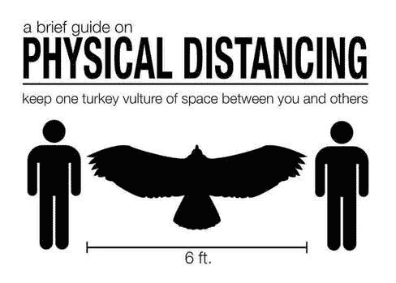
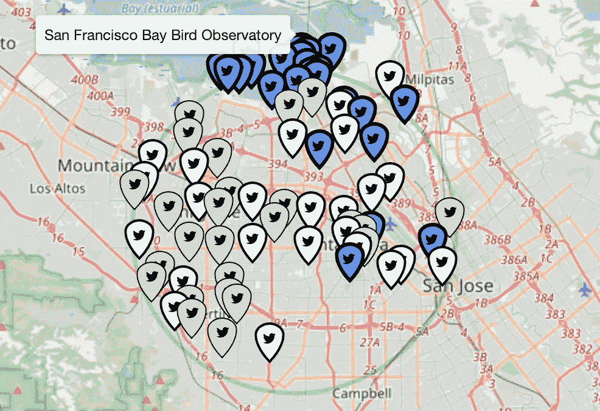
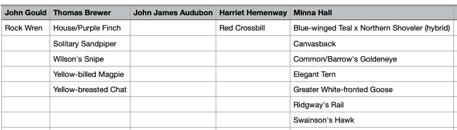
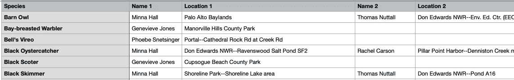
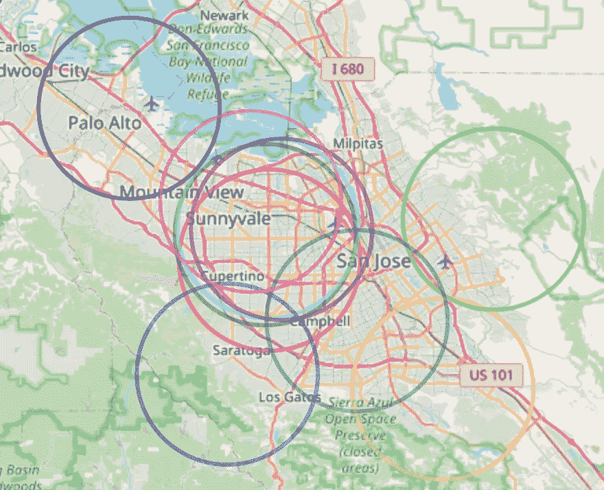

# 分布式观鸟

> 原文：<https://towardsdatascience.com/distributed-birding-2b2565ce9660?source=collection_archive---------48----------------------->

## 分开观鸟，一起观鸟



或者秃鹰的翼展…

圣克拉拉县是硅谷的中心，有一些令人惊叹的观鸟点。随着各种各样的鸟类马拉松赛的到来，我们已经进入了原地避难指令的第 n 周。我的观鸟朋友夏普一家正在考虑如何最好地覆盖我们的领地。我们的户外活动被限制在我们房子的五英里范围内，但是 5MR 观鸟(半径 5 英里)已经是一件事了，所以让我们跟着它跑吧。

*这个项目的 Jupyter 笔记本是 5MR 观鸟或* *计划重要日子和圣诞节鸟类计数的绝佳工具，无论你们是一起观鸟还是分开观鸟*。

我是团队中最差的观鸟者，但我拍了一些[不错的照片](https://johnhurley.smugmug.com/Birding/TwoStar/)，事实证明我的数据科学技能派上了用场，所以他们容忍了我。我决定用这些技能给我们尽可能多的信息，告诉我们鸟儿在哪里，我们应该去哪里。

该项目生成的文件列出了每个人的热点，只有某些团队成员才能看到的独特鸟类，帮助可视化最佳观鸟地点的地图等等。

康奈尔鸟类学实验室运行着世界上最大的与生物多样性相关的公民科学项目。因为它们也支持编程接口，所以我们可以使用像 Python 这样的工具来挖掘和探索这些数据。

当一个团队正在运行一个重要的一天的活动(分布式或非分布式)，目标是在 24 小时内找到尽可能多的鸟类物种。使用该工具生成的文件，您可以看到在哪里集中您的努力以获得最大效果，并且*优化您的大日子体验*。

这方面的代码可以在 [GitHub 库](https://github.com/jhurley13/DistributedBirding)中找到。

[](https://github.com/jhurley13/DistributedBirding.git) [## jhurley 13/分布式绑定

### 使用 eBird 数据规划分布式观鸟活动的工具将 data/external 中的 Contacts.csv 文件替换为您的…

github.com](https://github.com/jhurley13/DistributedBirding.git) 

# 开胃食品

在深入研究技术细节之前，我将从一个小问题开始。该工具生成的文件之一是每个参与者 5MR 的交互式个人地图。这是一个 HTML 文件，显示了一个人 5MR 中的热点。

标记的颜色表示物种的数量:灰色表示底部的三分之一，青色表示中间，蓝色表示最多。点击一个标记显示实际计数和纬度/经度。将鼠标悬停在标记上可显示热点名称。鉴于旧金山湾附近有大量的蓝色标记，*其中一个热点可能是你应该首先去的地方*。



一个 5MR 显示热点

利用[叶子](https://python-visualization.github.io/folium/modules.html)，一个生成地图的包，生成地图的代码只有 85 行 Python 代码；整个项目的代码不到 1000 行。

# 谁应该读这个？

这主要是针对观鸟者的，但也有相当数量的数据科学、地理定位和地图代码，所以这应该会引起数据科学家的兴趣。这个项目利用了一些强大的 Python 库，如 Folium、GeoPandas、Shapely 和 Geog，来产生用于规划的有用数据。数据科学的一个关键部分是理解你的数据，理解你的用户。由于我的观鸟小组要求增加一些功能，这段代码用了几个月的时间才完成。

就了解你的用户而言，许多观鸟者不是技术人员，但他们对使用电子表格很熟悉，所以输入和输出都是电子表格。视觉化同样重要。生成的 HTML 地图可以让您快速做出一些决定。在上面的 5MR 地图示例中，沿旧金山湾密集分布的蓝色标记会立即告诉您，这是开始聚集最多物种的地方。

如果你是一个没有编码经验的观鸟团队，可以寻求 Python 程序员的帮助来运行程序；生成的报告将大大简化你的分布式观鸟规划。

# 先决条件

开始之前，您需要做和/或了解一些事情。

*   您将需要一个 eBird 的 [API 键，以便能够查找最近的观察和热点。](https://ebird.org/api/keygen)
*   这不是一个独立的应用或服务，所以你必须知道如何在 Jupyter 笔记本上运行代码。
*   如果您想定制任何东西，对 Python 的基本熟悉将是有用的。
*   它只需要两个输入文件:一个联系人列表(又名观鸟朋友)和一个可选的参数文件，该文件允许您指定联系人的子集作为特定事件的参与者列表。
*   您应该已经使用 Python 3.7 或更高版本设置了虚拟环境。
*   从 [Github 库](https://github.com/jhurley13/DistributedBirding.git)下载或克隆代码。

# TL；灾难恢复设置

*   用自己的联系人文件替换*数据/外部*中的 *Contacts.csv* 文件。
*   编辑并将您的*ebirdcredcredentials . yml*文件放在您的主目录中
*   运行 Jupyter 笔记本中的所有单元格，*distributed birding . ipynb*。
*   输出在*报告*目录中

# 使用

使用 *my5mr-uniques.csv* 和 *my5mr-limited.csv* 文件，每个团队成员可以看到三个或更少的团队成员有可能找到的鸟类。根据 eBird 数据，这是基于过去 14 天中其他人在这些地点看到的物种。

使用 *my5mr-map_NAME.html* 中的交互式地图，每个人都可以看到他们的 5mr 以及每个热点的标记。这些标记用颜色编码，因此**浅灰色**是物种数量的底部三分之一，**浅青色**是中间的，**矢车菊蓝色**是顶部三分之一。将鼠标悬停在一个标记上可以显示热点的名称，点击它可以显示该位置的物种数量。

为了在合并的 5mr 上获得尽可能好的覆盖，您可以使用*my5mr-unique-hotspots . CSV*文件来查看您独有的热点。这可能意味着你会看到别人看不到的物种。

一个高级特性是，您可以将联系人列表的子集放入参数文件中，以限制特定事件的参与者。例如，如果您的 contacts 文件有 20 个条目，但是只有 5 个人要参加某个特定的活动，请将他们的名字添加到参数文件中。这将正确地计算交叉点，以便您知道谁需要去哪里。

# 输入

唯一需要的输入是观鸟联系人的电子表格。对于每个人，需要地址或纬度/经度来确定他们的 5MR。该工具可以读取 CSV 或 Excel 文件。

用您自己的联系人文件替换*数据/外部*中的 *Contacts.csv* 文件。在*样本输入*目录中可以找到几个例子。

# 输出

该工具的大部分输出位于 reports 目录中。有 HTML 格式的交互式地图，也有 CSV 格式的各种数据的电子表格。

## 个性化文件

*   *my5mr-DATE_NAME.csv* :包含最近 14 天在 5MR for NAME 中的观察结果
*   *my5mr-map_NAME.html* :每个 5mr 圈的互动图，有热点和计数。使用 Chrome、Safari 或其他浏览器查看。

## 公共文件

*   *my5mr-team _ circles . html*:一张 5mr 圈子的互动地图，面向所有参与者。使用 Chrome、Safari 或其他浏览器查看。
*   *my5mr-hotspots.csv* :每个人 5mr 中的热点列表
*   my5mr-limited.csv :只出现在 3 个或更少个体 5mr 中的所有物种的列表
*   my5mr-unique-hotspots.csv :为每个人列出一个你独有的热点列表(即不属于其他人的 5mr)
*   my5mr-uniques.csv :包含每个人只在 5mr 中见过的物种列表



*my5mr-uniques.csv* 示例

从这篇报道中，我们依靠约翰·古尔德为红十字嘴鹪鹩找到岩鹪鹩和哈里特·赫曼威。米娜和托马斯有他们的工作要做，但是约翰·奥杜邦对任何特定的物种都没有责任。



*my5mr-limited.csv* 示例

在这里，明娜·霍尔和雷切尔·卡森最有可能看到黑色的蛎鹬。



示例*my5mr-team _ circles . html*

团队圈子图提供了所有 5MR 圈子的快速概览。

# 区域代码

eBird 使用的区域代码类似于“US-CA-085”(美国加利福尼亚州圣克拉拉县)。这些可以由代码自动处理，至少在美国是这样。

如果您需要手动查找您的地区代码，请按照下列步骤操作:

*   前往[https://ebird.org/explore](https://ebird.org/explore)
*   在“探索地区”的搜索栏中输入您所在的县
*   当页面打开时，查看 URL。您所在的地区在“region/”之后，在“？”之前，例如，对于 US-CA-085，url 将是:

```
[https://ebird.org/region/US-CA-085?yr=all](https://ebird.org/region/US-CA-085?yr=all)
```

该代码将查看所有参与者的所有 5mr，并与美国的县相交。对于每个相交的县，将找到 eBird 区域代码并将其添加到热点、观测值等的列表中。

如果您想要限制县列表，您可以在数据/外部中的参数文件中手动输入区域代码。在*样本输入/参数-区域. csv* 中可以找到一个例子。

# 资源使用

运行这段代码时，需要注意两个服务。第一个是地理定位服务命名。每次查找都会延迟一秒钟，以避免对服务器造成太大冲击。此外，我们在*data/interim/geolocation cache . CSV*中维护了一个本地缓存，以避免重新查询地址。更多信息请参见他们的[使用条款](https://operations.osmfoundation.org/policies/nominatim/)。

另一项服务是 eBird，我们试图限制我们拨打的电话，尽管我们目前没有缓存这些信息。

# 编码细节

您已经做到了这一步，但是还没有看到任何代码。我不想吓跑那些不编码的鸟人，因为我认为这个工具可能是有用的。

该代码读取 CSV 或 Excel 文件，使用 nomist 从一个地址查找地理位置，演示结果的缓存，并进行一些几何操作。我们使用请求库从 eBird 获取数据。

没有真正短小精悍的代码片段可以放入一篇文章中，所以我将重点介绍一些主要的函数以及您可能从中学到的东西。

笔记本的整体结构，包括像 *create_project_paths* 这样的功能，都来源于我的这篇文章:

[](https://medium.com/@jhurley_97842/create-a-template-for-your-jupyter-notebooks-80352d265cd4) [## 为您的 Jupyter 笔记本创建一个模板

### 快速启动您的数据科学调查

medium.com](https://medium.com/@jhurley_97842/create-a-template-for-your-jupyter-notebooks-80352d265cd4) 

我的一些代码是去年的，那时还不支持 API 的 2.0 版本。将来，我会考虑使用下面显示的 ebird-api 包，而不是自己编写通过 api 访问 ebird 的包。

[](https://pypi.org/project/ebird-api/) [## ebird-api

### eBird API 提供了一组包装函数，用于访问 eBird API 2.0 中的端点。pip 安装 ebird-api…

pypi.org](https://pypi.org/project/ebird-api/) 

为所有参与者*创建带有 5MR 圆圈的地图的代码*足够短，可以在这里显示:

假设 df5mr 是具有纬度、经度列的数据帧

下面列出了一些功能:

*   eBird API 调用: *get_hotspots_for_region，get _ recent _ nearby _ observations，get_observations，get_sub_region_list*
*   Excel/CSV: r *ead_parameters，load_contacts*
*   地理位置的查找/缓存:*地址 _ 到 _ 地理位置，查找 _ 地理位置*
*   主要功能:*生成 _5mr_reports*
*   寻找集体圈地图中心点的有趣代码在 *__main__* 的主体中
*   树叶/地图制作:*创建 _ 热点 _ 标记，创建 _ 圈子 _ 地图，我的 _ 热点 _ 地图，个人 _ 热点 _ 地图*
*   下载/解压形状文件:*下载 _ 美国 _ 县 _ 形状文件*

请注意在*individual _ hotspot _ maps*中使用 *pd.qcut* 将热点的物种数量分为低、中、高，以便标记可以适当地着色。

编写*region _ codes _ from _ contacts*中的代码很有趣，因为它查看所有 5mr 及其与美国所有县的交集，以找到重叠部分。从匹配的县中，它调用 eBird 来获取地区列表并返回代码，例如 US-CA-085。

# 安全说明

鉴于我的背景，我必须指出几个与安全相关的问题。首先，注意凭证文件存储在项目目录之外，在您的主目录中。因为这是一个秘密，所以您不希望意外地将其签入存储库。我实际上把我的保存在一个加密的磁盘映像中。如果这是一个更敏感的秘密，我会把它存在 macOS 的钥匙圈里。

其次，如果保护人们的信息或位置很重要，你可以用附近公共场所的地址或地理位置来代替实际的家庭地址。这将意味着 5MR 偏离了一点。

# 结论

我希望这篇文章和代码对鸟类旅行计划和学习数据科学和制图技术都有用。

# 参考

[](https://ebird.org/science/download-ebird-data-products) [## 下载 eBird 数据产品- eBird

### eBird 为登录用户提供多种格式的开放数据访问，从原始数据到经过处理的数据集…

ebird.org](https://ebird.org/science/download-ebird-data-products)  [## 命名

### Nominatim 使用 OpenStreetMap 数据通过名称和地址查找地球上的位置(地理编码)。它还可以做…

nominatim.org](https://nominatim.org)  [## 0.11.0 文件

### 使用用于绘制地图的 Python 和 fleed . js 类制作漂亮的交互式地图。基地…

python-visualization.github.io](https://python-visualization.github.io/folium/modules.html) 

我的一些照片