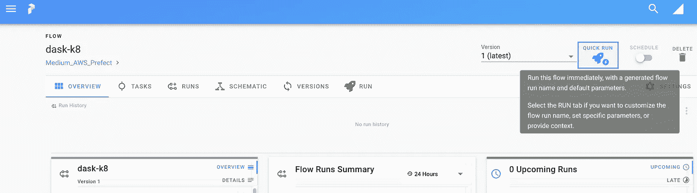

# AWS EKS 和提督使分布式数据管道变得简单

> 原文：<https://towardsdatascience.com/distributed-data-pipelines-made-easy-with-aws-eks-and-prefect-106984923b30?source=collection_archive---------12----------------------->

## 如何在几分钟内建立一个分布式云工作流程编排系统，并专注于提供价值而不是管理集群


卢克·切瑟在 [Unsplash](https://unsplash.com?utm_source=medium&utm_medium=referral) 上的照片

B 为 ETL & ML 数据管道构建分布式系统是困难的。如果您尝试自己实现一个，您可能会体验到，将工作流编排解决方案与 Spark 或 Dask 等分布式多节点计算集群捆绑在一起可能很难正确设置和管理。在本文中，您将了解如何获得一个**高度可用、可伸缩的分布式系统**，这将使您的 ETL & ML 数据管道的编排更加愉快，并将**释放您的时间** **来处理数据**并从中产生价值，而不是花费时间来维护集群。

整个设置在很大程度上是由 AWS 和 Prefect 自动完成的。另外，一开始你几乎不用花什么钱。为什么？因为我们将使用一个带有**无服务器 Kubernetes 集群**的工作流编排系统作为您的*分布式、容错、高度可用、自我修复&自动可伸缩*执行层。

**你需要做的就是:**

*   创建 [AWS 帐户](https://aws.amazon.com/de/premiumsupport/knowledge-center/create-and-activate-aws-account/) & [IAM 用户](https://docs.aws.amazon.com/IAM/latest/UserGuide/id_users_create.html)具有创建 AWS ECR、ECS & EKS 资源的编程权限
*   通过在 Fargate 上使用 AWS EKS 运行几个 shell 命令来建立一个 Kubernetes 集群(*控制面板每小时只需要 0.10 美元！之前是 0.20 美元但是*[*AWS 2020 年初价格减半*](https://aws.amazon.com/about-aws/whats-new/2020/01/amazon-eks-announces-price-reduction/?nc1=h_ls)
*   *注册一个免费的[完美云账户](https://cloud.prefect.io/) ( *免费开发者账户可以让你使用所有功能，但仅限于你自己——如果你想在你的团队中使用它，你需要升级到团队或企业计划**
*   *在提督云用户界面中生成一个认证令牌，将您的提督帐户连接到 AWS 上的无服务器 Kubernetes 集群*
*   *运行分布式数据管道。*

*我们开始吧！*

> ***注意:**本文使用了提督 1 的代码，不推荐使用。检查最新版本的[文档](https://docs.prefect.io/)。*

# *无服务器 Kubernetes 集群作为执行层*

*2019 年 12 月，AWS 推出了一个新的 Fargate 功能，对许多人来说，这被认为是一个改变游戏规则的功能——他们引入了一个在 ECS Fargate 上使用 **AWS EKS 的选项，这是一种说法: **AWS 使 Fargate 服务不仅成为 ECS 的指挥者**，还成为**以及**[**【EKS**](https://aws.amazon.com/de/blogs/aws/amazon-eks-on-aws-fargate-now-generally-available/)的指挥者。到目前为止，AWS Fargate 是一种只在 AWS ECS 上运行容器的无服务器方式。***

> *EKS 和法盖特让在 AWS 上运行基于 Kubernetes 的应用变得简单明了，因为他们不再需要为 pods 提供和管理基础设施。*

*这对你来说意味着什么？你现在可以在 EKS 上拥有一个*无服务器* Kubernetes 集群，它只对正在运行的 pods 收费，而不对它们的底层 EC2 实例收费。除其他优势外，它还意味着:*

*   *不再需要维护工作节点，*
*   *不再有猜测的能力，*
*   *不再有 EC2 自动缩放组来缩放工作节点。*

*你所需要做的就是为你的*部署*编写 *YAML* 文件，并通过 **kubectl** 与 EKS 交互。简而言之:**你现在唯一的任务**就是**编写你的 ETL & ML 代码**来为你的业务增值，AWS 负责运营，即操作、维护和扩展你的 Kubernetes 集群。*

*考虑到我们只为实际的 vCPU 和运行 pod 的内存收费，这为现代数据平台提供了**巨大的基础。***

# *这听起来好得令人难以置信:有哪些不利之处？*

*使用几乎任何无服务器选项的一个可能的缺点是当容器编排系统需要首先**分配和准备计算资源** ( *a.o .将最新版本的映像从 docker 注册表拉至分配的工作节点并构建映像*)时的**冷启动**问题，这可能会在容器(*或您的 K8s pod* )进入运行状态之前增加一些额外的延迟。*

*如果您的数据工作负载要求非常低的延迟水平，您可以选择具有传统数据平面的 AWS EKS 集群，并按照这篇博客文章中的说明在 AWS EKS 上设置一个非无服务器集群，并将其连接到您的完美云环境。*

*但是，**你*能*兼得**！AWS 允许您混合这两者:*

*   *您可以在**默认**名称空间中以无服务器方式运行相同的 AWS EKS 集群(*这是通过生成 Fargate 概要文件*来设置的)*
*   *您可以拥有一个 EC2 实例( *ex。，使用 GPU* 为您的数据科学模型连接到 EKS 上的同一个 Kubernetes 集群，但在**不同的名称空间**内或使用不同的 Kubernetes 标签。当您为与 Fargate 概要文件中定义的名称空间和标签不匹配的 pod 创建部署时，它将被调度到您维护的 EC2-worker 节点，并且该节点是无延迟可用的。*

*如你所见，AWS 很有远见地设计了 Fargate 上的 **EKS，允许你**混合无服务器和非无服务器选项**以节省你的时间、金钱和维护工作。你可以在 AWS 介绍这项服务的视频中找到更多信息。***

# *AWS 设置*

*您需要拥有一个具有管理员访问权限的 AWS 帐户，或者至少拥有 IAM 权限的用户，以便创建 ECR、EKS 和 ECS 资源。然后，您必须为该帐户配置 [AWS CLI](https://www.notion.so/Distributed-data-pipelines-made-easy-with-AWS-and-Prefect-82c31104b9bd4009af527f3392fbb2fb) 并安装 **eksctl** ，如本 [AWS 文档](https://docs.aws.amazon.com/eks/latest/userguide/getting-started-eksctl.html)中所述。*

*AWS 上的 Kubernetes 与 AWS ECR 配合得很好，后者是 Docker 图像的注册表。要使用您的 ECR 帐户对您的终端**进行**身份验证，请运行:*****

*   *如果您使用新的 AWS CLI v2:*

```
*aws ecr get-login-password --region <YOUR_AWS_REGION> | docker login --username AWS --password-stdin <YOUR_ECR_REGISTRY_ID>.dkr.ecr.<YOUR_AWS_REGION>.amazonaws.com*
```

*   *如果您使用旧版本的 AWS CLI:*

```
*$(aws ecr get-login --no-include-email --region <YOUR_AWS_REGION>)*
```

> ***注:** `<YOUR_AWS_REGION>`可能是 ex。*美东-1* ，*欧盟-中部-1，*和[更多](https://docs.aws.amazon.com/AmazonRDS/latest/UserGuide/Concepts.RegionsAndAvailabilityZones.html)。*

*如果您得到**登录成功**消息，您可以为您的数据管道创建您的 ECR 存储库。我们将创建两条数据管道:`dask-k8`和`basic-etl-prefect-flow`——使用相同的名称来遵循本演练，但是一般来说，最简单的方法是将您的 **ECR 存储库**与您的**完美流**命名为*以避免混淆。**

```
*aws ecr create-repository --repository-name dask-k8aws ecr create-repository --repository-name basic-etl-prefect-flow*
```

*然后，您需要做的就是运行以下命令，这将在您的 VPC 中部署 Kubernetes 控制平面和 Fargate 配置文件:*

```
*eksctl create cluster --name fargate-eks --region <YOUR_AWS_REGION> --fargate*
```

*我为集群选择了名称 *fargate-eks* ，但是可以随意更改。
`--fargate`标志确保我们创建一个新的 Fargate 配置文件用于该集群。如果需要，EKS 允许您创建自定义的 Fargate 配置文件。*

*提供所有资源可能需要几分钟时间。完成后，您应该会看到类似如下的输出:*

*然后，如果你检查你的上下文:*

```
*kubectl config current-context*
```

*您应该会得到与下面类似的输出:*

```
*<YOUR_AWS_USER_NAME>@fargate-eks.<YOUR_AWS_REGION>.eksctl.io*
```

*这样，您可以看到您连接到了一个运行在 AWS Fargate 上的无服务器 Kubernetes 集群！为了进一步证明这一点，运行:*

```
*➜  ~ kubectl get nodes
NAME                                                       STATUS   ROLES    AGE   VERSION
fargate-ip-192-168-163-163.eu-central-1.compute.internal   Ready    <none>   15m   v1.17.9-eks-a84824
fargate-ip-192-168-180-51.eu-central-1.compute.internal    Ready    <none>   15m   v1.17.9-eks-a84824*
```

*在输出中，您应该看到至少有一个 Fargate 节点等待您的 pod 部署。*

> ***注意:**这些节点在您的 VPC **内运行**，但是**它们在您的 **EC2** 仪表板内**不可见**。您也不能通过 SSH 访问这些节点，因为它们完全由 Fargate 以无服务器的方式管理和部署。***

*将这个 AWS EKS 集群与提督相结合的好处是，整个 **Kubernetes pod 部署和调度由提督**从您这里抽象出来 **。这意味着你甚至不需要太了解 Kubernetes 就能从中获取价值。在下一节中，我们将把这个集群连接到我们的 Prefect Cloud 帐户，并开始构建分布式 ETL & ML 数据管道。***

# *完美设置*

*让我们先在 https://cloud.prefect.io/注册一个免费的开发者账户。*

**

*完美云:注册页面——作者图片*

*首先，你将受到一个干净的用户界面的欢迎，显示你的**流程、代理、**和**最近流程运行的概述**和**下一个计划的任务**。流程本身可以被组织成几个项目。当您开始构建数据管道时，这个**主仪表板**可以让您快速识别所有数据管道的**当前状态。***

**

*Prefect Cloud UI 的主仪表板—作者图片*

*您可以看到，我现在有一个 **Fargate 代理**准备在 **AWS ECS** 上部署流。现在，我们将只关注**AWS**EKS。*

**

*完美的云用户界面显示了一个健康的 Fargate 代理——图片由作者提供*

## *安装提督*

*让我们继续设置并在您的机器上安装 prefect。以下命令将安装带有 AWS 和 Kubernetes extras 的提督(*而不是* `[kubernetes,aws]` *如果您想安装外部系统*的所有提督扩展，您可以使用 `[all_extras]` *):**

```
*pip install "prefect[kubernetes,aws]"*
```

*现在，为了确保您使用的是 Prefect Cloud，而不是开源版本的 Prefect Core，请将上下文切换到 Cloud:*

```
*prefect backend cloud*
```

## *创建个人访问令牌，将您的流注册到 Prefect Cloud*

*注册免费账户后，你需要创建一个**个人访问令牌**来认证你的本地终端。这将允许直接从您的计算机向 Prefect Cloud 注册您的流(*即您的 ETL & ML 数据管道*)。进入侧边栏:用户→个人访问令牌→ `+ CREATE TOKEN`按钮。*

**

*完美的云 UI:创建令牌来注册流——图片由作者提供*

*选择一些有意义的名字。`MyTokenToRegisterFlows`。*

*然后复制令牌，并在您的终端中运行以下命令:*

```
*prefect auth login -t <MyTokenToRegisterFlows>*
```

*现在，您可以注册您的流程，以便从 Prefect Cloud 进行编排！*

## *创建 API 令牌来授权您的 AWS EKS 代理运行您的流*

*最后一部分是**为您的 Kubernetes 代理创建一个 RunnerToken** 并注册代理。进入侧边栏:团队→ API 令牌→ `+ CREATE TOKEN`按钮。*

**

*完美云用户界面:创建 API 令牌来注册你的 AWS EKS 代理——图片由作者提供*

*或者，您可以从您的终端进行同样的操作:*

```
*prefect auth create-token -n MyEKS_on_Fargate_K8s_Token -r RUNNER*
```

*选择`RUNNER`范围非常重要，否则您的代理将无法代表您执行流程。*

*点击`CREATE`并复制生成的 API 令牌。*

## *使用生成的 API 令牌将 EKS 集群设置为您的完美代理*

*现在我们到了最激动人心的部分:使用下面的命令，您将能够**将您的无服务器 AWS Kubernetes 集群设置为您的完美数据管道的执行层** ( *即代理*):*

*现在，您应该能够在您的 Prefect Cloud 帐户中看到一个新的 Kubernetes 代理:*

**

*完美云用户界面:AWS EKS 集群现已注册并准备好运行流——图片由作者提供*

*我们还可以看到一个对应于提督代理的新 pod:*

```
*➜  ~ kubectl get pods
NAME                             READY   STATUS    RESTARTS   AGE
prefect-agent-68785f47d4-pv9kt   1/1     Running   0          5m59s*
```

## *基本完美流程结构*

*现在一切都设置好了，我们可以开始创建我们的流了。Prefect 文档包括各种有用的教程，将快速向您展示如何修改您的 Python ETL & ML 代码，使其在 Prefect 上运行。简而言之，你只需要用 `**@task**`装饰器**装饰你的 Python 函数，添加任务和流**导入**并创建一个**流**对象:***

> ***注意:**添加`log_stdout=True`确保打印输出会出现在提督云流日志中。*

## *创建项目来组织您的流程*

*现在，我们可以**创建一个项目**来组织我们的流，无论是从 UI 还是通过使用终端:*

```
*➜ prefect create project Medium_AWS_Prefect
Medium_AWS_Prefect created*
```

## *将您的流量注册到完美云*

*如果我们现在运行这个脚本，我们应该会得到一个到 Prefect Cloud UI 的链接，从这里我们可以触发或安排流程:*

```
*➜ python3 basic-prefect-etl-flow.py 
Result check: OK
Flow: [https://cloud.prefect.io/anna/flow/888046e6-f366-466a-b9b5-4113cd437e4d](https://cloud.prefect.io/anna/flow/888046e6-f366-466a-b9b5-4113cd437e4d)*
```

## *从 UI 运行您的流程*

*当我们触发该流时，我们将看到它停留在*预定*状态，并且不运行。*

**

*完美云用户界面:从用户界面触发流运行—作者图片*

*这是因为要在 AWS EKS 集群上运行您的流，**您的流必须包含关于代码存储位置的信息**。*

## *添加存储信息&将流程推送到 ECR*

*关于如何存储你的代码，有几个选择:EKS 可以从 ECR、S3 或 Github 下载。*

*最简单的选择是将您的流程分类，并将图像推送到 ECR。幸运的是，提督团队让事情变得非常简单——我们只需要:*

*   *为我们的流程创建一个 ECR 存储库(*这个步骤可以在您的生产环境中使用 CI/CD 管道自动完成*)*
*   *在代码中添加 Docker 存储。*

*如果您还记得 AWS 设置部分，我们已经创建了两个 ECR 存储库:`dask-k8`和`basic-etl-prefect-flow`。因此，我们只需要将`storage=Docker()`参数添加到我们的流代码中，这样它就可以由我们的无服务器 Kubernetes 代理执行:*

*上面代码的一些**重要注释**:*

*   *在引擎盖下，Prefect 检查您的 Prefect 版本并扩展相应的 [Prefect Docker 映像](https://hub.docker.com/r/prefecthq/prefect)以包含您的流及其依赖项，*
*   *确保设置您的 **ECR 注册 ID** ，这样您的流将被归档并被推送到我们之前创建的 ECR 存储库`dask-k8`*
*   *`image_tag='latest'`用于禁用 ECR 图像的版本控制。将其设置为*最新*或任何其他特定标记将确保每次注册流程时，您都覆盖标记为*最新*的先前 ECR 图像。这对我很有用，因为我已经使用 Git 对我的代码进行版本控制，并且我不需要 ECR 版本控制。此外，它可以在 AWS 上为您节省一些资金，因为 ECR 上的每个新版本的图像，您都需要为这些 ECR 图像的存储支付更多的费用。但是可以跳过这个争论。这样，提督将使用当前日期和时间标记图像，并使用不同的标记存储每个流版本。*

> ***最后注意:**额外的参数`*python_dependencies=["pandas==1.1.0"]*`允许定义需要安装在容器中的 Python 包的列表。如果您需要对您的图像进行更细粒度的控制，您可以提供一个自定义 over 文件的路径，例如:`*dockerfile='/Users/anna/my_flows/aws/Dockerfile'*`*

## *部署新的流版本*

*我们现在可以**将之前的流程运行标记为完成**或失败:*

**

*完美云用户界面:将流程运行标记为已完成或失败——作者图片*

*最后，我们可以通过简单地重新运行修改后的脚本来注册流的新版本，如第二个要点所示:*

## *在 UI 中检查流程进度*

*如果我们访问输出中的链接，我们可以看到版本 2 已经创建，如果我们运行它，我们可以看到流程将转移到状态*提交执行*(黄色)，然后*运行*(蓝色)，最后*所有引用任务成功*(绿色):*

**

*完美云用户界面:示意性任务视图—作者图片*

## *从日志和 CLI 查看进度*

*日志显示更多信息:*

**

*完美云用户界面:流量日志—作者图片*

*我们也可以使用 **kubectl** 检查吊舱:*

*总结一下我们到目前为止所做的工作:*

*   *我们创建了一个完美的云帐户*
*   *我们使用 AWS EKS 部署了一个无服务器的 Kubernetes 集群*
*   *我们创建了一个 ECR 存储库，并将包含我们的流代码和所有 Python 包依赖项的 Docker 映像推送到这个 ECR 存储库中*
*   *然后，我们注册我们的流，从 Prefect Cloud UI 运行它，并使用 kubectl 检查它在 UI 和 CLI 中的状态。*

*如果你走了这么远，恭喜你！👏🏻*

*在下一节中，我们将创建第二个流，它将利用分布式 Dask 集群。*

# *按需分布式 dask 集群可并行处理您的数据管道*

*提督云与 [Dask 分布式](https://distributed.dask.org/en/latest/)很好的工作。为了以分布式方式在 Dask 上运行 Python 代码，通常需要部署一个带有几个工作节点的 Dask 集群，并对其进行维护。提督提供了一个很好的抽象概念`DaskKubernetesEnvironment`,它:*

*   ***加速** **按需 Dask 集群**跨越多个 pod，也可能跨越多个节点(*您可以指定最小和最大工人数量*)*
*   *将您的流提交到这个按需集群*
*   ***清理**资源(*即作业完成后终止集群*)。*

*这里有一个基于[完美文档](https://docs.prefect.io/core/advanced_tutorials/dask-cluster.html)的示例流程，您可以用它来测试您的 Dask 设置。我将这个流保存为`dask-k8.py`，并提供了与流名称和 ECR 存储库名称相同的名称 *dask-k8* :*

*我们现在注册该流，并再次从 UI 中触发它:*

```
*➜  python3 dask-k8.py*
```

**

*完美云用户界面:快速运行流程的选项*

*现在，我们可以观察正在创建的在 Dask 工人之间分配工作的 pod:*

*我们现在可以看到几个与 Dask 相关的**吊舱。UI 显示并行运行的所有任务的当前进度，以及最终运行时间:***

**

*完美的云用户界面:在 AWS EKS 的按需 Dask 集群中成功执行数据管道——图片由作者提供*

*如果我们分析的日志，我们可以看到:*

*   *该流在 12:43 被提交执行*
*   *流水作业开始于 12:47*
*   *流程在 12 点 51 分结束。*

*这意味着，从 Kubernetes 代理获得流，到在我们的无服务器 AWS EKS 集群上配置 Dask 集群，以及提取所有必要的映像，大约需要 3 分钟。之后，该流程需要 4 分钟才能成功运行。*

****

*完美的云 UI:运行在 AWS EKS 分布式 Dask 集群上的数据流。左图:初始日志。右图:最终日志—作者图片*

*如果您的工作负载无法接受与按需创建的 Dask 集群相关的延迟，您可以创建和维护自己的 Dask 集群，并按如下方式修改代码:*

*这样，您将使用 Executor 而不是环境抽象。此外，如果需要的话，您必须使 255.255.255.255 适应您的 Dask 调度程序地址，并相应地更改端口 8786。*

## *清理资源*

*在我们结束之前，确保删除 AWS EKS 集群和 ECR 存储库，以避免任何费用:*

# *结论*

*在本文中，我们使用 Fargate 上的 AWS EKS 在 AWS 上创建了一个无服务器的 Kubernetes 集群。我们以安全的方式将它作为我们的执行层与完美云连接起来。然后，我们通过使用`DockerStorage`抽象，将我们的 Prefect 流分类，并将图像推送到 ECR。最后，我们部署了在单个 pod 中运行的简单数据管道，以及分布式 Dask 流，允许您的 ETL & ML 代码的高级并行。*

*在这个过程中，我们确定了差异，以及在我们需要维护的现有资源上运行数据管道与以无服务器方式运行容器化流的优缺点。*

*希望这个设置能让您更容易开始编排 ETL 和数据科学工作流。无论您是初创企业、大型企业还是为论文编写代码的学生，Fargate 上的 Prefect & AWS EKS 组合都可以让您轻松地将数据项目转移到生产中。*

***感谢您的阅读！***