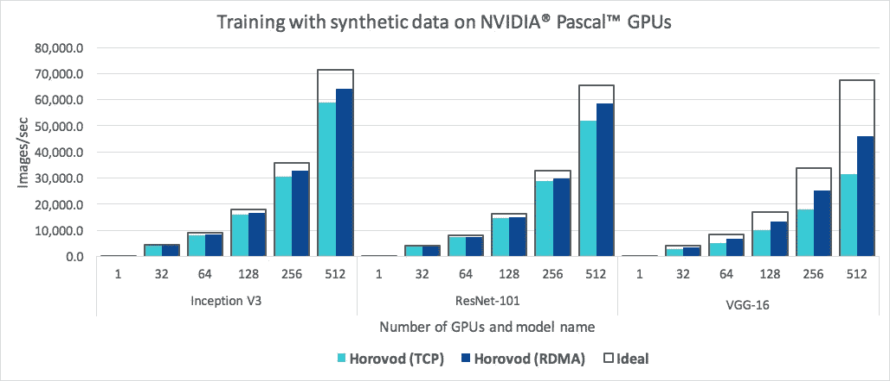
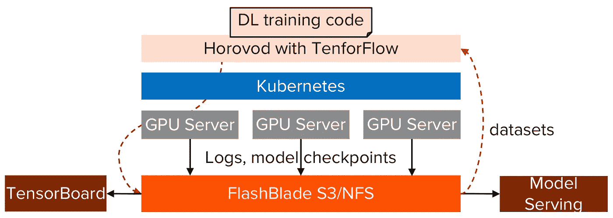
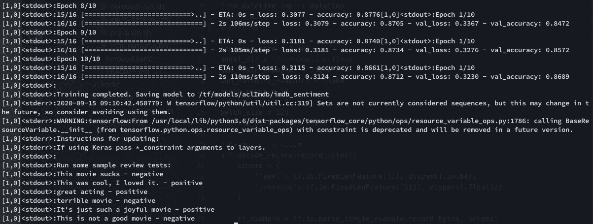
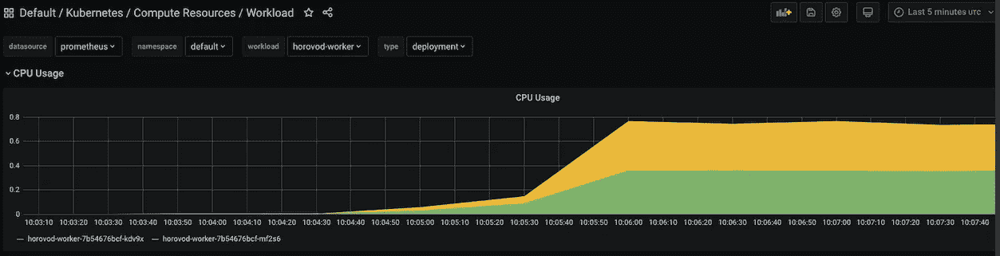

# 在 Kubernetes 上使用 Horovod 进行分布式深度学习训练

> 原文：<https://towardsdatascience.com/distributed-deep-learning-training-with-horovod-on-kubernetes-6b28ac1d6b5d?source=collection_archive---------16----------------------->

你可能已经注意到，即使是像英伟达 DGX 这样强大的机器也不足以足够快地训练深度学习模型。更不用说将数据复制到 DGX 的漫长等待时间了。数据集变得越来越大，GPU 从存储中分离出来，使用 GPU 的工作人员需要协调模型检查点和日志保存。您的系统可能会超出单个服务器，团队希望轻松共享 GPU 硬件和数据。

通过 Kubernetes 上的 Horovod 进入分布式培训。在这篇博客中，我将通过 Kubernetes 上的 Horovod 在多工人分布式环境中训练一个深度学习模型的设置。

# Kubernetes 上有张量流的 Horovod

[Horovod](https://horovod.readthedocs.io/en/stable/summary_include.html#why-horovod) 是一个面向 TensorFlow、Keras、PyTorch 和 Apache MXNet 的分布式深度学习训练框架。由优步开源的 Horovod 已经证明，只需很少的代码更改，它就可以将单个 GPU 训练扩展到并行运行在多个 GPU 上。



Horovod 缩放效率(图片来自 [Horovod 网站](https://horovod.readthedocs.io/en/stable/summary_include.html)

作为一个例子，我将使用 Horovod 和 TensorFlow 和 Keras 训练一个电影评论情感模型。尽管 Keras 本身支持[分布式训练](https://keras.io/guides/distributed_training/)，但我发现它比 Horovod 更复杂，也更不稳定。

很多时候，客户问我如何在这样的环境下分配和管理团队成员的 GPU 时间表。这在多服务器环境中变得更加重要。我听说过像 Excel 中的时间表(很糟糕，但仍然很常见)、Python 脚本、Kubernetes 和商业软件这样的解决方案。我将使用 Kubernetes，因为它支持在集群上运行许多应用程序容器(包括深度学习)的良好界面。

快速共享存储/文件系统对于简化分布式培训至关重要。它是将机器学习工作流程的不同阶段结合在一起的粘合剂，它使团队能够共享 GPU 硬件和数据。我将使用 FlashBlade S3 来托管数据集，使用 FlashBlade NFS 来设置检查点和存储 TensorBoard 日志。

以下是该设置的架构:



针对 Kubernetes 和 FlashBlade 上 TensorFlow 的 Horovod 分布式培训

# 在库伯内特斯部署霍洛佛德

在多工作者 Horovod 设置中，单个主要和多个工作者节点协调以并行训练模型。它使用 [MPI](https://www.mpi-forum.org/) 和 SSH 来交换和更新模型参数。在 Kubernetes 上运行 Horovid 的一种方法是使用 [kubeflow](https://www.kubeflow.org/) 和它的 [mpi-job 库](https://github.com/kubeflow/examples/tree/master/demos/yelp_demo/ks_app/vendor/kubeflow/mpi-job)，我发现仅仅为了这个目的而引入 kubeflow 有点过了。Kubeflow 本身就是一个大项目。现在，让我们保持简单。

我们需要先安装 MTP 和 SSH。Horovod 为此提供了一个[官方 Docker 文件](https://github.com/horovod/horovod/blob/master/Dockerfile.gpu)。我已经[定制了它](https://github.com/uprush/kube-dtrain/blob/master/horovod/docker/Dockerfile.cpu)来适应我的需求。虽然可以将 MPI 和 SSH 设置放入 Docker 映像中，但是我们确实需要为 Horovod pods 配置无密码 SSH 身份验证。这不是一个硬性要求，但是为了使示例更加简洁，我使用 Kubernetes 持久卷(PV)来存储我的 SSH 配置，并在`/root/.ssh`将它挂载到所有容器上。

```
apiVersion: v1
kind: PersistentVolumeClaim
metadata:
  name: horovod-ssh-shared
spec:
  accessModes:
    - **ReadWriteMany**
  resources:
    requests:
      storage: 1Gi
  storageClassName: **pure-file**
```

请注意，PV 是一个具有`ReadWriteMany`访问模式的`pure-file`级(由 NFS 闪存支持)。同样，我还为检查点和张量板日志创建了另一个名为`tf-shared`的 PV。我将这些 PV 安装到所有容器上:

```
volumeMounts:
  - name: horovod-ssh-vol
    mountPath: /root/.ssh
  - name: tf-shared-vol
    mountPath: /tf/models
```

在 Horovod 主容器启动之前，我使用 Kubernetes[Init Container](https://kubernetes.io/docs/concepts/workloads/pods/init-containers/)运行一个`init-ssh.sh`脚本来生成 SSH 无密码认证配置。

```
initContainers:
- name: init-ssh
image: uprush/horovod-cpu:latest
volumeMounts:
  - name: horovod-ssh-vol
    mountPath: /root/.ssh
command: ['/bin/bash', '/root/init-ssh.sh']
```

`init-ssh.sh`的内容是这样的:

```
if [ -f /root/.ssh/authorized_keys ]
then
    echo "SSH already configured."
else
    ssh-keygen -t rsa -b 2048 -N '' -f /root/.ssh/id_rsa
    cp /root/.ssh/id_rsa.pub /root/.ssh/authorized_keys
    chmod 700 /root/.ssh
    chmod 600 /root/.ssh/authorized_keys
fi
```

然后，我声明两个 Kubernetes 部署:一个用于主节点，另一个用于工作节点。当主服务器什么都不做时，工作人员在 pod 中启动一个 SSH 服务器。

```
- name: horovod-cpu
    image: "uprush/horovod-cpu:latest"
    command: [ "sh", "-c", "/usr/sbin/sshd -p 2222; sleep infinity" ]
```

有了这些，`root`主 pod 上的用户无需密码即可通过 SSH 连接到工作人员。Horovod 设置就绪。

## 在 TensorFlow 中访问 S3 数据集

我的数据集作为 TensorFlow 记录文件存储在 S3 的 FlashBlade 中。我希望我的 TensorFlow 脚本直接访问它，而不是下载到本地目录。所以我使用 Kubernetes Secret 在部署中添加了几个环境变量:

```
env:
- name: AWS_ACCESS_KEY_ID
  valueFrom:
    secretKeyRef:
      name: tf-s3
      key: access-key
- name: AWS_SECRET_ACCESS_KEY
  valueFrom:
    secretKeyRef:
      name: tf-s3
      key: secret-key
- name: S3_ENDPOINT
  value: 192.168.170.11
- name: S3_USE_HTTPS
  value: "0"
```

在我的 TensorFlow 脚本的后面，我将使用这些变量进行 S3 认证:

```
endpoint_url = f"[http://{os.environ['S3_ENDPOINT'](/{os.environ['S3_ENDPOINT')]}"
kwargs = {'endpoint_url':endpoint_url}
s3 = s3fs.S3FileSystem(anon=False, client_kwargs=kwargs)# List all training tfrecord files
training_files_list = s3.ls("s3://datasets/aclImdb/train/")
training_files = [f"s3://{f}" for f in training_files_list]# Now let's create tf datasets
training_ds = tf.data.TFRecordDataset(training_files, num_parallel_reads=AUTO)
```

FlashBlade S3 速度非常快，最低部署可以达到 7GB/s 的读取吞吐量，持续约 3 毫秒的延迟。对于许多 DL 培训工作来说，这已经足够好了。

## Kubernetes 上的 GPU 调度

为了让 Kubernetes 基于 GPU 资源请求调度 pod，我们需要安装 [Nvidia k8s 设备插件](https://github.com/NVIDIA/k8s-device-plugin)。需要使用`nvidia-docker2`包而不是常规 docker 作为默认运行时。遵循自述文件，了解如何准备 GPU 节点。设备插件的安装很简单[使用舵](https://github.com/NVIDIA/k8s-device-plugin#deployment-via-helm)。在我的实验室里，我只在装有 Tesla GPUs 的节点上安装插件。所以我给我的 GPU 节点添加了节点标签。

```
kubectl label nodes fb-ubuntu01 nvidia.com/gpu.family=teslahelm install \
    --version=0.6.0 \
    --generate-name \
    --set compatWithCPUManager=true \
    --set nodeSelector."nvidia\.com/gpu\.family"=tesla \
    nvdp/nvidia-device-plugin
```

该插件将作为 DaemonSet 安装在`kube-system`名称空间中。如果一切顺利，GPU 节点现在应该具有 GPU 容量:

```
kubectl describe node fb-ubuntu01

Capacity:
  cpu:                32
  ephemeral-storage:  292889880Ki
  hugepages-1Gi:      0
  hugepages-2Mi:      0
  memory:             264092356Ki
  **nvidia.com/gpu:     1**
  pods:               110
```

然后，我们可以为 Horovod pods 请求 GPU 资源:

```
resources:
  limits:
    nvidia.com/gpu: 2 # requesting 2 GPUs
```

# 准备训练

接下来，我使用一个[预训练脚本](https://github.com/uprush/kube-dtrain/blob/master/horovod/examples/pre-train.sh)来准备训练环境。该脚本使用 Kubernetes CLI 选择 Horovod pods，然后执行以下操作:

*   生成一个`pip-install.sh`脚本，在所有 pod 上安装 Python 依赖项。
*   生成一个`horovod-run.sh`脚本来启动 Horovod 作业。
*   将源代码和生成的脚本从我的工作站复制到 Horovod 主 pod 的共享 PV 中。

运行`pre-train.sh`脚本后，我的主 pod 将在共享 PV 中包含这些文件:

```
root@horovod-primary-84fcd7bdfd-2j8tc:/tf/models/examples# ls
horovod-run.sh  imdb-sentiment.py  pip-install.sh  pre-train.sh  requirements.txt
```

下面是一个生成`horovod-run.sh`的例子:

```
mkdir -p /tf/models/aclImdb/checkpointsAWS_LOG_LEVEL=3 horovodrun -np 3 \
 -H localhost:1,10-244-1-129.default.pod:1,10-244-0-145.default.pod:1 \
 -p 2222 \
 python imdb-sentiment.py
```

该脚本在三个并行单元上运行培训作业，每个单元使用一个 CPU。这里我们不用 GPU，因为模型很小。

因为一切都是自动化的，所以每次我在我的 VSCode 中更改培训代码时(我使用[远程扩展](https://marketplace.visualstudio.com/items?itemName=ms-vscode-remote.remote-ssh)通过 SSH 在服务器上编写代码)，我都会运行以下代码来启动培训作业:

1.  运行`pre-train.sh`脚本重新生成并复制源代码。
2.  进入 Horovod 主吊舱。
3.  运行`pip-install.sh`在所有 pod 上安装依赖项。
4.  运行`horovod-run.sh`开始 Horovod 培训工作。

到目前为止，这个工作流程对我来说很好。

# 具有张量流的 Horovod

在 TensorFlow 中使用 Horovod 所需的培训脚本的修改在[这里](https://horovod.readthedocs.io/en/stable/tensorflow.html)有详细说明。

我的[示例代码](https://github.com/uprush/kube-dtrain/blob/master/horovod/examples/imdb-sentiment.py)是一个端到端可运行的脚本，用来训练一个影评情感模型。它类似于单节点训练，除了:

*   代码在所有的 Horovod pods 上并行运行。
*   每个 pod 只处理训练和验证批次总数的一部分，因此需要切分数据集(使用`tf.data.Dataset.shard()`)并在调用`model.fit`时正确设置`steps_per_epoch`和`validation_steps`。
*   一些任务，例如保存检查点、张量板日志和模型，应该注意只在主 pod ( `hvd.rank() = 0`)上运行，以防止其他工作人员破坏它们。
*   因为 pods 可以在 Kubernetes 集群中的任何服务器上运行(只有在请求 GPU 资源时才运行 GPU 节点),所以我们应该将检查点、TensorBoard 日志和模型保存在持久卷(在我的示例中是 FlashBlade NFS)或对象存储(例如，FlashBlade S3)中。

我将在这里跳过训练代码的细节。请参考我的[示例代码](https://github.com/uprush/kube-dtrain/blob/master/horovod/examples/imdb-sentiment.py)。

下面是一个运行输出:



运行输出示例

如果我查看我的 Kubernetes 监控 UI，我可以看到所有 Horovod pods 的 CPU 使用率都在上升。这表明培训作业正在所有 pod 上并行运行。



Horovod 训练期间的 Pod 资源使用

# 摘要

分布式训练是深度学习的未来。使用 Horovod 和 Kubernetes，我们演示了快速旋转动态分布式深度学习训练环境的步骤。这使得深度学习工程师和研究人员能够轻松共享、调度和充分利用昂贵的 GPU 和数据。

像 FlashBlade 这样的共享存储在这种设置中起着重要的作用。FlashBlade 使资源和数据共享成为可能。它让我不用保存/聚集检查点、张量板日志和模型。有了 Kubernetes 和 FlashBlade 的 Horovod 让我的深度学习生活变得容易多了。

Excel 中不再有时间表！